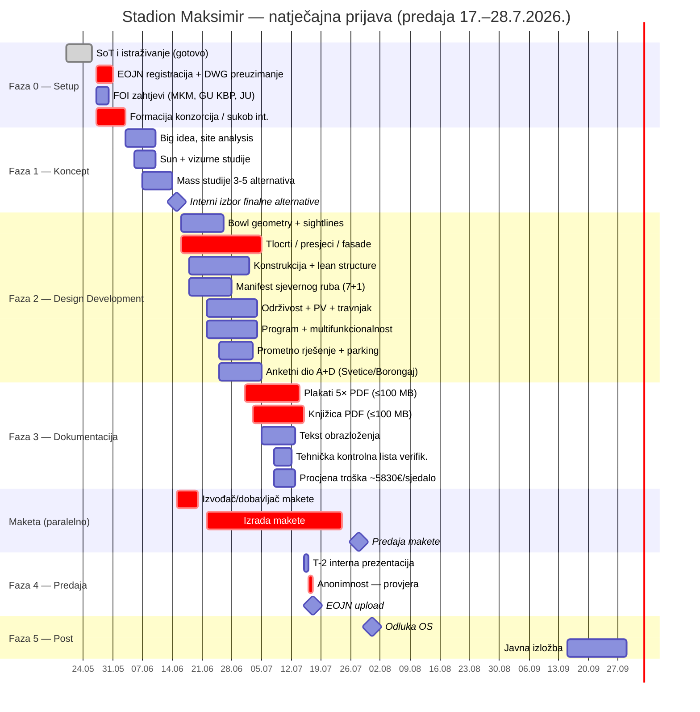
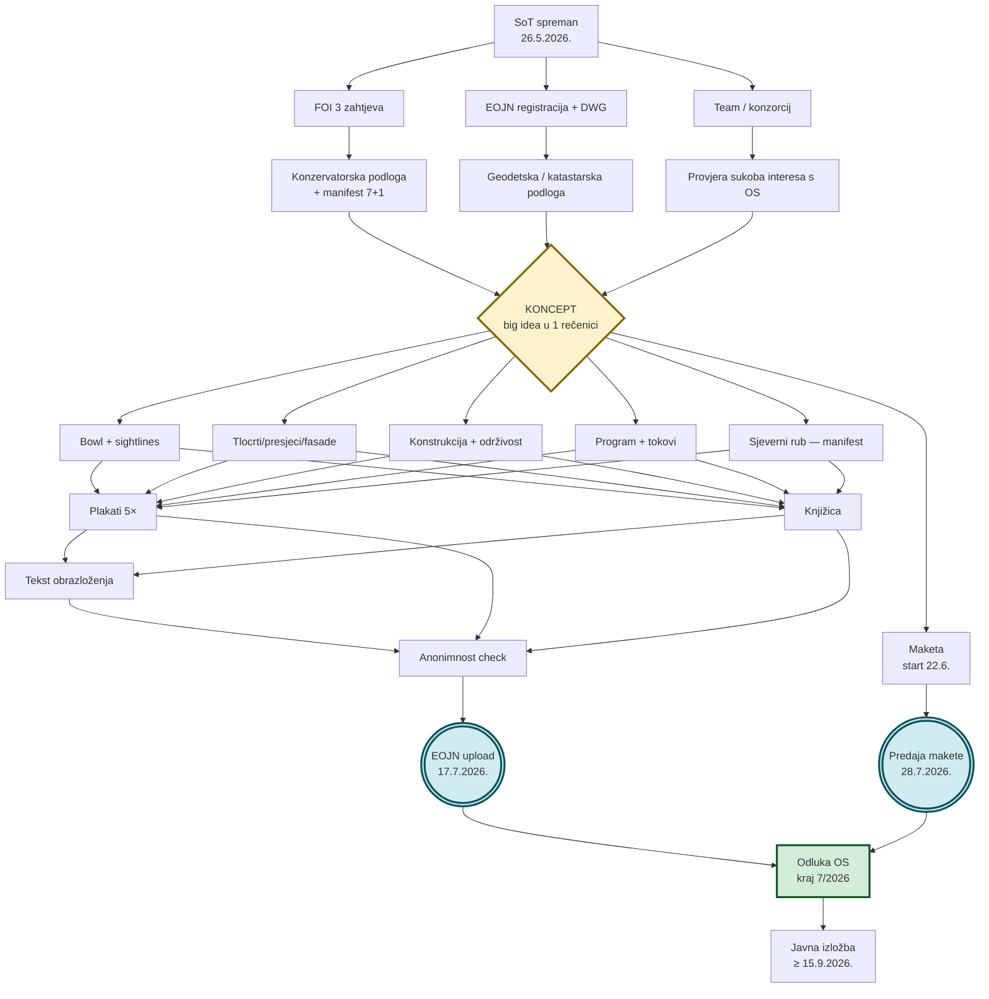
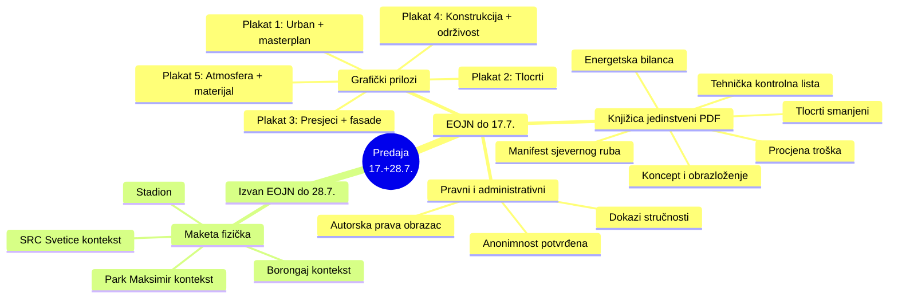
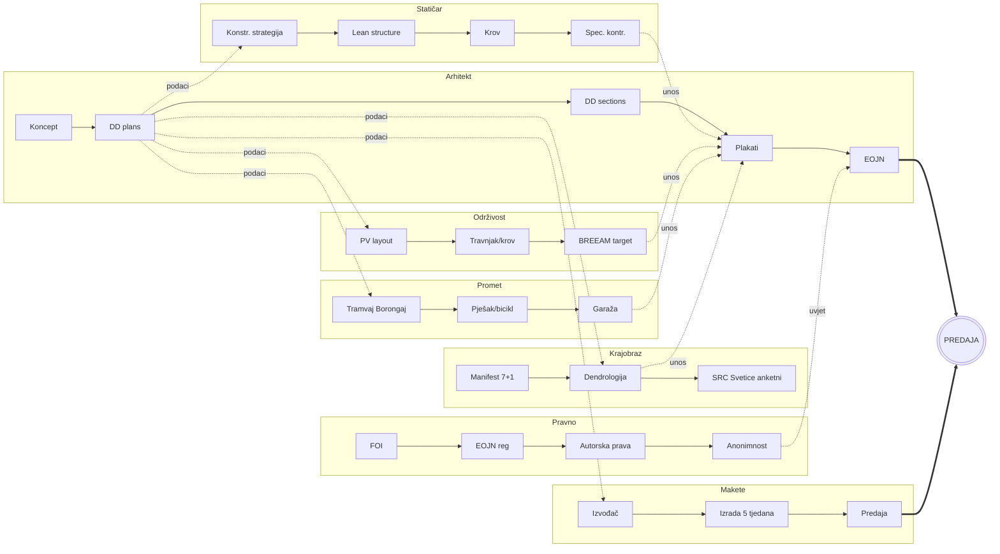

# Roadmap — od SoT-a (26.5.2026.) do predaje (17.–28.7.2026.)

> ## 🔒 ARHIVIRANO — rokovi su prošli (status 2026-08-25)
>
> **Ovaj roadmap je izvršen do kraja svog horizonta. Rokovi predaje su prošli: EOJN 17.7.2026. u 18:00, maketa 28.7.2026. u 18:00.**
> Faze 0–4 nisu više aktivan plan; ostaju kao **arhiva metodologije** (raspored, kritični put, rizici) primjenjiva na sljedeći natječaj sličnog opsega.
> **Aktivna je jedino Faza 5 — praćenje objave rezultata**, ispod ažurirana. Status i checklist praćenja: [`research/06-status-natjecaja.md`](research/06-status-natjecaja.md), sažetak u [`SOT.md` § 11](SOT.md#11-status-nakon-predaje-ažurirano-2026-08-25).

> Strategijski pregled. Operativna checklist-verzija u [`TODO.md`](TODO.md). Sav sadržaj se naslanja na [`SOT.md`](SOT.md) i [`research/`](research/).

## Sažetak vremena

*Tablica prikazuje stanje na dan pisanja roadmapa (2026-05-26); desni stupac je naknadni ishod.*

| | | Ishod (2026-08-25) |
|---|---|---|
| **Danas (u trenutku pisanja)** | **2026-05-26** | — |
| **Rok EOJN (grafika + tekst)** | 2026-07-17 → **52 dana** | ✅ prošlo, zatvoreno u 18:00 |
| **Rok makete (izvan EOJN-a)** | 2026-07-28 → **63 dana** | ✅ prošlo, zatvoreno u 18:00 |
| **Očekivana odluka OS-a** | kraj 7/2026 | 🔄 ocjenjivanje u tijeku, odluka **još nije objavljena** |
| **Javno predstavljanje** | ≥ 2026-09-15 | 📅 čeka se |

Tijesno ali izvedivo — SoT je gotov, sad je sve operativa. **Kritični put su plakati, knjižica, anonimnost i fizička maketa.**

---

## Mermaid 1 — Gantt timeline

---

## Mermaid 2 — Tok zavisnosti

---

## Mermaid 3 — Stablo predaje (što fizički mora postojati)

---

## Mermaid 4 — Kritični put i swimlanes

---

## Faze — kratak opis

### Faza 0 — Operacije i podloge (2026-05-27 → 2026-06-02)
**Cilj:** maknuti sve administrativno i pribavljanje podataka prije nego što počne kreativni rad.

**Ključni isporučiteljnji:**
- EOJN pristup + svi DWG/geodetski prilozi
- 3 FOI zahtjeva poslana (MKM/KO Zagreb, GU KBP, JU Maksimir)
- Konzorcij definiran, ugovori potpisani, sukob interesa s OS provjeren
- Datum kick-off radionice

### Faza 1 — Koncept (2026-06-03 → 2026-06-15)
**Cilj:** jedna velika ideja koja se može izreći u jednoj rečenici, kalibrirana prema tri citatne kotve (mono-volumen / Conditionalism / dublji slojevi). Vidi [`SOT.md` § 10.1](SOT.md#101-tri-citatne-kotve-za-tekst-obrazloženja).

**Ključni isporučiteljnji:**
- Big idea formulirana
- Site analysis (sve 4 zone)
- Sun studije za popodnevni kick-off (16-21h)
- 3-5 mass alternativa
- Interni review i izbor finale

**Milestone M1 (15.6.):** finalna alternativa odabrana → DD može krenuti.

### Faza 2 — Design Development (2026-06-16 → 2026-07-05)
**Cilj:** sve crteže, sustave i konzervatorsku gestu razraditi do nivoa koji se može publicirati na plakatima.

**Paralelno radi 6 tracka** (vidi swimlanes iznad). Najsporiji = bowl geometry + sightline validacija. Manifest sjevernog ruba mora biti formaliziran do kraja Faze 2.

### Faza 3 — Dokumentacija (2026-07-01 → 2026-07-15)
**Cilj:** sve fizički postoji u PDF-ovima ≤100 MB.

**Plakati** počinju paralelno s krajem DD-a (preklop 5 dana). **Maketa** je već u izradi 2 tjedna prije (start 2026-06-22).

### Faza 4 — Predaja (2026-07-15 → 2026-07-17)
**Cilj:** EOJN upload bez panike, T-1 dan, ne zadnji sat.

**T-2 prezentacija:** interna kontrola svih datoteka.
**T-1 anonimnost:** sustavna provjera (filename, metadata, vidljivi tekst, file properties, vizure koje otkrivaju autora).
**T-0 EOJN upload:** s rezervom od 24 sata.

### Faza 5 — Post (2026-07-31 → objava rezultata) — **JEDINA AKTIVNA FAZA**

**Stanje 2026-08-25:** predaja zatvorena, ocjenjivački sud u postupku ocjenjivanja, **rezultati neobjavljeni**. Ni konačan broj pristiglih radova ni imena natjecatelja nisu javni — natječaj je anoniman, pa se autorstva otvaraju tek uz objavu rezultata. Kolovoz je institucionalni zastoj (DAZ i službena stranica bez objava nakon 27.7.); realan prozor za objavu je **rujan 2026.**, uz izložbu vezanu uz **≥ 15.9.2026.**

Aktivni zadaci:

1. **Tjedno praćenje kanala objave** (redoslijedom vjerojatnosti prve objave): službena stranica → vijesti; `d-a-z.hr/hr/natjecaji/rezultati/`; EOJN 76778 (obavijest o ishodu); `zagreb.hr` priopćenja; UHA.
2. **Kad rezultati izađu — preuzeti odmah:** Zapisnik o radu OS-a (obrazloženja po radu), popis svih nagrađenih i otkupljenih radova s autorima i uredima, ukupan broj pristiglih radova.
3. **Izložba (≥ 15.9.)** — otići uživo; jedina prilika da se vide i nenagrađeni radovi. Fotografirati postav, zabilježiti tipologije rješenja sjevernog ruba.
4. **Ako pobjeda** — kreće konzervatorska procedura iz [`SOT.md` § 10.4](SOT.md#104-hitne-akcije-svibanj-lipanj-2026) (posebni uvjeti čl. 43–44 ZZOKD, OPUO/PUO) i ugovaranje idejnog + glavnog + izvedbenog projekta.
5. **Neovisno o ishodu** — napraviti post-mortem protiv kriterija A–D iz Zapisnika; to je najvrjedniji ulaz za sljedeći natječaj.

---

## Kritični rizici i mitigacije

| Rizik | Vjerojatnost | Utjecaj | Mitigacija |
|---|---|---|---|
| Maketa ne stigne na 28.7. | srednja | total fail | Ugovoriti izvođača do **15.6.**, ne kasnije |
| EOJN tehničke greške | niska | kritičan | Probni upload tjedan ranije; backup 2 računa |
| Anonimnost slučajno narušena | srednja | diskvalifikacija | T-1 dan sustavna provjera kroz svaki file |
| FOI zahtjevi ne stignu na vrijeme | visoka | srednji | Ne čekati — koristiti javne izvore (Plan upravljanja SPA, NN izvodi); FOI input se može unijeti naknadno za konzervatorski elaborat |
| Sukob interesa s OS (Plejić, Perović, Chas, Geers, Fabijanić, Roth-Čerina, Bakić) | niska | diskvalifikacija | Provjeriti svaki član tima do **2.6.**; nijedan partner ne smije biti formalno povezan |
| Big idea ne uvjeri tim u Fazi 1 | srednja | gubitak vremena | Interni review M1 (15.6.) je tvrdi prag — ako big idea ne stoji, do tog dana se mijenja |
| Kasna izmjena propisa (HRN EN 1998-1/NA/A2) | niska | srednji | Pratiti javnu raspravu do 20.6.2026.; ako stupi na snagu, primijeniti nove agR |

---

## Tjedni heartbeat

Preporuka: **petkom u 17:00** kratak status meeting (max 30 min) — što je gotovo, što kasni, što treba odlučiti do sljedećeg petka. Otkucavati u [`TODO.md`](TODO.md).

Tjedni ciljevi (T = tjedan):

| T | Tjedan | Cilj |
|---|---|---|
| T-7 | 27.5.–2.6. | Setup zatvoren |
| T-6 | 3.6.–9.6. | Big idea, site analysis |
| T-5 | 10.6.–16.6. | Mass + M1 milestone |
| T-4 | 17.6.–23.6. | Bowl + tlocrti razrađeni; maketa start |
| T-3 | 24.6.–30.6. | Presjeci + fasade + manifest 7+1 |
| T-2 | 1.7.–7.7. | Plakati draft 1; knjižica draft 1 |
| T-1 | 8.7.–14.7. | Plakati draft 2; tehnička provjera; tekst |
| T-0 | 15.7.–17.7. | Anonimnost + EOJN upload |
| T+1 | 18.7.–28.7. | Maketa predana |
| T+2 → | od 29.7. | **Praćenje objave rezultata** (aktivno) |
| T+1 | 18.7.–28.7. | Maketa finalizacija + predaja |
