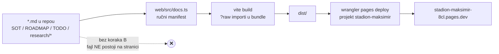

# Provjera statusa natječaja i deploy dokumentacijske stranice

> **Zastarjelo za hosting (25. 9. 2026.):** site više nije na Cloudflare Pagesu nego na Workeru `maksimir`, na
> `https://maksimir.domovina.ai`; deploy je `cd web && npm run deploy`. Vidi
> [`2026-09-25-regresijske-provjere.md`](2026-09-25-regresijske-provjere.md). Dio o `docs.ts` manifestu i dalje vrijedi.

*2026-08-26. Operativno znanje iz sesije u kojoj je repo ažuriran s post-predajnim statusom.*

Ovaj dokument ne ponavlja **što** je otkriveno o natječaju — to je u
[`research/06-status-natjecaja.md`](../research/06-status-natjecaja.md) i
[`research/07-kronologija-objava.md`](../research/07-kronologija-objava.md).
Ovdje je **kako** se do toga dolazi i **kako se repo objavljuje**, jer je oboje bilo
skupo otkriti, a ništa od toga ne piše u kodu.

---

## 1. Kako ponovno provjeriti status natječaja

Provjera se radi **po kanalima poredanim po autoritetu**, ne pretragom „ima li vijesti".
Redoslijed nije proizvoljan — utvrđen je tako da se prvo isključe kanali koji daju
definitivan negativan odgovor.

| # | Kanal | Što daje | Pouzdanost |
|---|---|---|---|
| 1 | `d-a-z.hr/hr/natjecaji/rezultati/` | **Arhiva rezultata DAZ-a.** Ako Maksimira nema ovdje, rezultati nisu objavljeni — točka. Ovdje ide i **Zapisnik OS-a**. | **definitivna** |
| 2 | `stadion-maksimir.zagreb.hr/hr/vijesti-34/34` | Službene vijesti natječaja | visoka |
| 3 | `eojn.hr/tender-eo/76778` + TED | Formalna obavijest o ishodu | visoka, ali kasni |
| 4 | `d-a-z.hr/hr/vijesti/` , `uha.hr` | Objave struke | visoka |
| 5 | `hkig.hr` → Vijesti 2026. | **Inženjerska komora** — ovdje je bio HKIG-ov dopis | visoka, **lako se propusti** |
| 6 | `zagreb.hr` priopćenja | Politička komunikacija | srednja |
| 7 | Mediji (index, jutarnji, tportal, construction.hr) | Kontekst i analiza | varira |

### Zamke koje su koštale vremena

- **`tijek-dogadjanja/68` na službenoj stranici se NE održava.** Na 25.8.2026. jedini
  upisani događaj je i dalje „20.03.2026. Objava natječaja", iako su dva roka u
  međuvremenu prošla, a jedan bio pomaknut. Stranica **nije** indikator stanja.
- **`WebFetch` na `.../vijesti-34/34` bez `/hr/` prefiksa vraća 404.** Ispravan put je
  `https://stadion-maksimir.zagreb.hr/hr/vijesti-34/34`. Kanonski putovi su u
  [`sources/manifest.tsv`](../sources/manifest.tsv) — pogledaj tamo prije nego pogađaš URL.
- **`WebSearch` NIJE pronašao HKIG-ov dopis** ni u jednoj od šest različitih formulacija
  upita. Našao ga je tek `firecrawl search` s upitom *„stadion Maksimir natječaj lipanj
  2026 vijest"*. Pouka: za hrvatske institucionalne izvore (komore, ministarstva)
  koristi firecrawl, ne WebSearch.
- **construction.hr ne prikazuje datum u tijelu članka** — datum (02.08.2026.) je samo
  u markdownu stranice, ne u `metadata.publishedTime`. Grepaj `[0-9]{1,2}\.[0-9]{1,2}\.202[56]`
  po markdownu.
- **Kolovoška tišina je institucionalna, ne signal.** DAZ nije objavio ništa između
  27.7. i 25.8. Ne izvlačiti zaključke iz odsutnosti objava u kolovozu.

### Zašto se broj radova i imena ureda ne mogu doznati

Natječaj je **anoniman i jednostupanjski**. Radovi idu pod šifrom; izjava o autorstvu je
zasebna datoteka u EOJN-u koja se otvara tek nakon rangiranja. **Popis sudionika javno ne
postoji prije objave rezultata** — to nije rupa u pretrazi. `construction.hr` (2.8.2026.)
to izrijekom potvrđuje i za ukupan broj radova. Ako netko pita „tko je predao", odgovor je
strukturni, ne empirijski.

---

## 2. Repo → stranica: pipeline i jedina prava zamka

Stranica je Vite SPA u [`web/`](../web/) koja markdown iz repoa učitava kao `?raw` importe
i deploya na Cloudflare Pages.



### 🔴 Novi markdown se NE pojavljuje sam od sebe

`web/src/docs.ts` je **ručno održavan manifest**. Dodavanje `research/07-*.md` u repo ne
radi ništa dok se ne doda oboje:

```ts
import research07 from "../../research/07-kronologija-objava.md?raw";
// ...
{ slug: "research-07-kronologija", title: "07 — Kronologija objava",
  subtitle: "…", repoPath: "research/07-kronologija-objava.md",
  raw: research07, section: "research" },
```

Izmjena **postojećeg** fajla ulazi u sljedeći build automatski — samo novi fajlovi traže
registraciju. Ovo se lako previdi jer build prolazi bez greške; fajl jednostavno nije u
sidebaru.

### Deploy

```bash
cd web
npm run build                                                  # ~3 s
npx wrangler pages deploy dist --project-name stadion-maksimir --branch main
```

`npm run deploy` radi oboje odjednom. `--branch main` je **obavezan za produkciju** —
bez njega ide preview deployment na zasebnom URL-u koji ne mijenja produkcijski.

| | |
|---|---|
| Produkcija | https://stadion-maksimir-8cl.pages.dev |
| Cloudflare projekt | `stadion-maksimir` (account D.O.M.) |
| Zašto sufiks `-8cl` | `stadion-maksimir` je globalno zauzet u Pages namespaceu; canonical URL **ima** sufiks |
| Custom domain | `stadion-maksimir.domovina.ai` — registriran na Pages strani, **DNS CNAME čeka ručno dodavanje** (wrangler OAuth token nema `dns:write`) |
| GitHub | https://github.com/stepanic/stadion-maksimir-natjecaj-2026 (**javno**, `main`) |

Provjera da je produkcija stvarno osvježena — usporedi hash bundlea, ne samo HTTP 200:

```bash
curl -s https://stadion-maksimir-8cl.pages.dev/ | grep -oE 'assets/index-[A-Za-z0-9_-]+\.js'
```

Build ispisuje isti hash; ako se razlikuju, produkcijski alias nije prebačen na novi deploy.

### Build upozorenja koja se ignoriraju

`mermaid.core` (608 kB), `wardley` (612 kB), `cytoscape` (443 kB) i glavni bundle (1,55 MB)
prelaze Viteov prag od 500 kB. To je **očekivano** — mermaid vuče cijeli graf-stack.
Stranica je interna dokumentacija, ne javni proizvod; code-splitting nije vrijedan truda.
Ne trošiti vrijeme na to upozorenje.

---

## 3. Odluke donesene u ovoj sesiji

- **Repo je objavljen javno na GitHubu** iako sadrži natječajnu strategiju (profil
  ocjenjivačkog suda, citatne kotve, taktičke direktive). Rizik je iznesen, korisnik je
  odabrao javno. Posljedica: ako se ikad prijavljuje na sličan natječaj, ovaj sadržaj je
  indeksiran i pretraživ.
- **Faze 0–4 u `ROADMAP.md` i `TODO.md` su arhivirane, ne obrisane.** Kontrolna lista
  UEFA SIR 2025 i manifest sjevernog ruba vezani su uz propise, ne uz prošli rok — vrijede
  kao predložak za sljedeći natječaj.
- **`research/06` i `research/07` su razdvojeni namjerno:** 06 je *analiza stanja* (mijenja
  se pri svakoj provjeri), 07 je *zapisnik objava* (samo se dopisuje). Ne spajati ih.

---

## 4. Otvoreno

- ~~Rezultati natječaja — neobjavljeni na 25.8.2026.~~ **Objavljeni 24.9.2026.**, vidi
  [`2026-09-25-rezultati-i-svi-radovi.md`](2026-09-25-rezultati-i-svi-radovi.md).
- **Odgovor Grada Zagreba na HKIG-ov dopis** od 17.7.2026. — nema ga javno; presedan
  (Jarunski most) govori da odgovor može doći.
- DNS CNAME za `stadion-maksimir.domovina.ai` — ručni korak u Cloudflare dashboardu.
- Nikad utvrđeno: **je li korisnik uopće predao rad na ovaj natječaj.** Ne pretpostavljati.

---

## Vezani dokumenti

- [`2026-09-25-rezultati-i-svi-radovi.md`](2026-09-25-rezultati-i-svi-radovi.md) — **nastavak:** rezultati objavljeni, EOJN dokumenti bez prijave, pipeline za `#/radovi`

- [`research/06-status-natjecaja.md`](../research/06-status-natjecaja.md) — stanje natječaja, checklist praćenja
- [`research/07-kronologija-objava.md`](../research/07-kronologija-objava.md) — kronologija objava 27.5.→25.8.2026.
- [`SOT.md` § 11](../SOT.md) — sažetak statusa; § 7 sadrži HKIG postupovni rizik
- [`web/README.md`](../web/README.md) — arhitektura stranice i custom domain koraci
