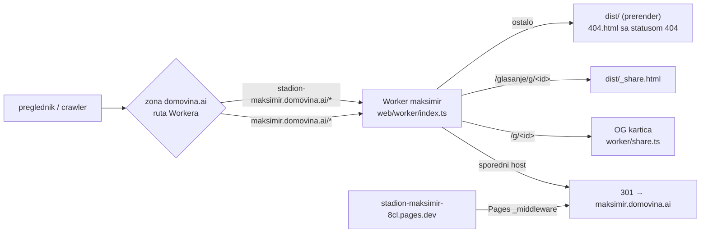

# Regresijske provjere weba i Worker hosting

*2026-09-25. Trajne upute za svaku buduću promjenu u `web/`: kako dokazati da ništa nije pokvareno i da stari
linkovi i dalje rade. Nastalo nakon prelaska s hash ruta na prave rute, prerendera i selidbe s Cloudflare Pagesa
na Worker (plan: [`2026-09-25-seo-rute-plan.md`](2026-09-25-seo-rute-plan.md)).*

## Ukratko

```bash
cd web
npm run dev:worker                      # build + wrangler dev na http://localhost:8787
npm run check -- http://localhost:8787  # u drugom terminalu; izlazni kod 1 = regresija
```

Prije i poslije deploya na produkciju, s usporedbom sa stanjem prije refaktora:

```bash
npm run check -- https://maksimir.domovina.ai \
  --alias https://stadion-maksimir.domovina.ai \
  --baseline https://dd23a1dd.stadion-maksimir-8cl.pages.dev
```

Traje oko 3 minute. Samo čita stranice: ne prijavljuje se, ne glasa i ne dira ničiji `localStorage`.

## Kako je site posložen (od 25. 9. 2026.)



- **Worker `maksimir`** (račun D.O.M.), konfiguracija `web/wrangler.jsonc`, kod `web/worker/`. Sva pravila
  usmjeravanja su na jednom mjestu, u `worker/index.ts` (`run_worker_first: true`).
- **DNS se nije mijenjao.** CNAME zapisi i dalje pokazuju na Pages, ali ruta Workera na zoni presreće promet prije
  origina. Wrangler token nema `dns:write`, a rute traže samo `workers_routes`.
- **Pages projekt `stadion-maksimir`** i dalje postoji. Njegov zadnji produkcijski deploy je cijeli site plus
  `functions/_middleware.ts`, koji preusmjerava samo `*.pages.dev` na kanonski host.
- `https://maksimir.d-o-m.workers.dev` i preview URL-ovi verzija rade za provjeru, ali šalju `X-Robots-Tag: noindex`.
  Certilia prijava na njima ne radi, jer nisu u `ALLOWED_ORIGINS`. Isto je bilo s Pagesovim preview URL-ovima.

### Deploy i povrat

| Što | Naredba |
|---|---|
| Produkcija | `cd web && npm run deploy` (= build + `wrangler deploy`) |
| Preview bez diranja produkcije | `npm run deploy:preview` (= `wrangler versions upload`, daje preview URL verzije) |
| Povrat Workera na prethodnu verziju | `npx wrangler rollback` (ili Workers → maksimir → Deployments u dashboardu) |
| Povrat na Pages u cijelosti | ukloniti `routes` iz `wrangler.jsonc` i `wrangler deploy`, ili obrisati dvije rute u dashboardu. Pages tada opet poslužuje obje domene (middleware preusmjerava samo `*.pages.dev`, pa nema petlje). |

## Što skripta provjerava i zašto

`web/scripts/regression.mjs`. Rute čita iz `<base>/sitemap.xml`, dakle iz istog `allRoutes()` koji koristi
prerender. Nova ruta ili dokument se time automatski provjerava.

| # | Provjera | Što dokazuje |
|---|---|---|
| 1 | HTTP statusi i `Location` (bez preglednika) | `/x/` i `/x.html` → 308 na `/x`, nepoznat put → 404 s `noindex`, `/g/<id>` daje OG karticu i JS preusmjeravanje, `/g/nevaljan` → 302 na `/glasanje`, canonical i `og:image` u HTML-u |
| 2 | `#content` iz prerenderiranog HTML-a == `#content` nakon JavaScripta, za **svaku** rutu | prerender i klijent crtaju isto, pa nema treptaja ni razlike za crawlere |
| 2b | `--baseline`: isti `#content` na starom deployu (hash rute) | **nema regresije u odnosu na stanje prije refaktora**; jedina dopuštena razlika je `href="#/x"` → `href="/x"` |
| 2c | nijedan `<a href="#/…">` na cijeloj stranici | i ljuska iz `index.html` je prebačena, ne samo `#content` |
| 3 | stari linkovi `/#/<ruta>` za svaku rutu, plus sidro i objava | poveznice podijeljene prije 25. 9. 2026. vode na pravu stranicu (`replaceState`, bez novog unosa u povijesti) |
| 4 | klik, natrag, naprijed, izravan ulaz sa sidrom, Mermaid | navigacija ne učitava stranicu ponovno (`window.__sameDoc` preživi), sidro skrola, dijagrami se crtaju |
| 5 | preglednik bez JavaScripta | naslov, `h1` i navigacija su u HTML-u |
| 6 | `--baseline`: screenshotovi 6 stranica na 390 i 1280 px, pixelmatch (prag 0.1) | izgled je isti; parovi `-novo/-staro.png` za pregled ostaju u privremenoj mapi |
| — | greške u konzoli preglednika | nijedna |

**Dopuštene razlike** (skripta ih izuzima, i to s razlogom):

- panel „Glasanje javnosti” na stranici rada (`#gl-rad-panel`) i sadržaj `/glasanje` pune se uživo iz Supabasea;
- Mermaid: prerender ima izvor (`mermaid-source`), preglednik SVG. Uspoređuje se samo broj i mjesto blokova;
- rute koje na baselineu još ne postoje (novi dokument) javljaju se kao „nove od baselinea”.

**Baseline** je deploy `dd23a1dd` (commit `4e1ec0f`, zadnji s hash rutama). Pages čuva svaki deploy na
`<id>.stadion-maksimir-8cl.pages.dev`, a middleware za preusmjeravanje nije u tom starom deployu, pa baseline
ostaje dostupan. Za buduće promjene kao baseline se može uzeti i trenutna produkcija prije deploya.

### Kad je promjena namjerna (izmijenjen tekst dokumenta)

`--baseline` tada javi pad, ali pokaže samo **prvu** razliku po stranici. Da iza nje nema još nečega, usporedi
cijeli `#content` s prethodnom verzijom Workera. Svaka verzija ima svoj URL:
`https://<prvih 8 znakova version id>-maksimir.d-o-m.workers.dev` (`npx wrangler versions list`). Postupak:

1. Nova verzija se usporedi s prethodnom (curl svih ruta iz sitemapa, diff samo dijela od `id="content"` dalje).
   Razlike smiju biti samo izmjene koje su namjerno napravljene.
2. Prethodna verzija je već prošla `--baseline` bez razlika, pa je lanac zatvoren.

Tako je 25. 9. 2026. potvrđeno da je verzija `8f464584` (ispravljeni linkovi `#/glasanje` u dokumentima, napomena
„zastarjelo” u starom dokumentu o deployu, novi dokument) jednaka verziji `fb9e6d58` osim u tim izmjenama.

## Ručna provjera u pravom pregledniku (claude-in-chrome)

Skripta ne vidi što vidi prijavljeni korisnik. Nakon deploya zato slijedi i provjera u korisnikovom Braveu
(profil `ms@ff.hr`, deviceId u globalnom `CLAUDE.md`), samo čitanjem:

1. `https://maksimir.domovina.ai/#/glasanje` → URL postaje `/glasanje`, prijava i listić su i dalje tu
   (isti origin, pa `localStorage` ostaje). Stanje provjeravati JS-om, i to samo oblik:
   `!!localStorage.getItem("maksimir-zk-identity")` i popis ključeva. **Vrijednosti se nikad ne čitaju ni ne ispisuju**,
   a gumbi koji mijenjaju stanje (predaja, povlačenje, objava, uvoz ključa) se ne klikaju.
2. `/g/abcdefabcdef` → `/glasanje/g/abcdefabcdef` s porukom „Objava ne postoji”; zatim pravim klikom
   „← Na glasanje” i logo. Prije toga postaviti `window.__sameDoc = true` i provjeriti da je preživio.
3. `/#/radovi` → filter „Nagrađeni” (5 od 88) → klik na rad → natrag u pregledniku (filter ostaje).
4. `/#/glasanje-kako-radi#<sidro>` → sidro na vrhu ekrana, dijagrami nacrtani.
5. `read_console_messages` s `onlyErrors`. Konzola se prati tek od prvog poziva, pa nakon njega treba ponovno
   učitati stranicu. Upozorenja `chrome-extension://nkbih…` dolaze od ekstenzije za novčanik, ne od sitea.

Ključ `maksimir-zk-share` sadrži kodirane podatke objave. Ne otvarati ga radi traženja id-ja objave: `/g/<id>` se
provjerava izmišljenim id-jem, a stvarnu karticu pokriva provjera 1.

## Listić glasanja: `glasanje-ui.mjs`

`npm run check` samo čita stranice, pa ne klikne ništa na listiću. Za promjene u `glasanjeView.ts` pokreni i
`node scripts/glasanje-ui.mjs <url>`, lokalno ili na produkciji. Svi pozivi prema `api.domovina.ai` su presretnuti,
pa ništa ne ide u bazu. Detalji: [`2026-09-26-glasanje-ux.md`](2026-09-26-glasanje-ux.md).

**Trajanje:** produkcijski `npm run check` traje oko 3 minute. Pokreni ga jednom i uzmi izlazni kod iz istog runa
(`; echo $?`), ne ponovnim pokretanjem. `--baseline dd23a1dd…` je od 26. 9. zastario: dokumenti su se od tada
mijenjali, pa javlja razlike `BASELINE` i time izlazni kod 1. Za rutinski deploy usporedi s produkcijom prije deploya
ili izostavi `--baseline`.

## Zamke otkrivene pri ovoj selidbi

- **`wrangler pages deploy` bez `--branch` na gitovoj grani `main` ide na produkciju.** Wrangler uzima granu iz gita.
  Stara skripta `deploy:preview` tako je 25. 9. 2026. otišla na produkciju. Sad je `deploy:preview` postavljen na
  `wrangler versions upload`; ako se ikad opet deploya Pages, uvijek treba eksplicitno `--branch preview`.
- **Wrangler u novoj mapi ne zna račun** („More than one account available”). `account_id` je u `wrangler.jsonc`;
  za `wrangler pages …` izvan `web/` treba `CLOUDFLARE_ACCOUNT_ID=7dc7167b7e2e00923bfa7cd697df14e4`.
- **`compatibility_date` ne smije biti noviji od lokalnog runtimea** (wrangler 4.96 podržava do 2026-06-05),
  inače `wrangler dev` ne starta.
- **Workers assets preusmjeravaju s 307, Pages s 308.** Worker 307 pretvara u 308, jer je kanonski put trajan.
- **`_redirects` i `_headers` se ne primjenjuju kad odgovara Worker** (`run_worker_first`). Zato je ljuska objave i
  cache (`/assets/*` godinu dana, slike 4 h, HTML uvijek provjera) u `worker/index.ts`, a prerender više ne piše `_redirects`.
- **Logo u `index.html` imao je `href="#/"`.** Refaktor ruta ga je preskočio, jer je izvan `#content` i nije išao
  kroz `link()`. Radio je samo zato što ga prevoditelj starih linkova pretvori u `/`. Provjera 2c sad to hvata.
- **PNG bajtovi dva ista screenshota se razlikuju.** Usporedba ide pixelmatchom, ne `Buffer.equals`.

## Mermaid „Syntax error” prolazi kroz `npm run check` (26. 9. 2026.)

Na `/glasanje-odluke`, `/lanac-adr-kljuc`, `/lanac-verzije` i `/lanac-integracija` dijagram se prikazivao kao
mermaidova bomba „Syntax error”, a `npm run check` je prošao. Za to postoje dva razloga:

- **I poruka o grešci je `<svg>`.** Provjera broji `#content svg` samo na `/glasanje-kako-radi`, pa ni neispravan
  dijagram ni ostale stranice ne pogađa.
- **U `sequenceDiagram` je `;` kraj naredbe.** Poruka `A->>B: sesija; poziv()` puca na dijelu iza `;`
  („Expecting … SOLID_ARROW, got NEWLINE”). U tekstu poruke treba pisati zarez ili `#59;`. Popravljeno u `8710f44`.

Brza provjera svih dijagrama bez preglednika: mermaid iz `web/node_modules` i `jsdom` (jer flowcharti trebaju
DOMPurify, a bez `window` parse pada s „DOMPurify.addHook is not a function”, što je lažna greška):

```js
// node check-mermaid.mjs $(grep -rl '```mermaid' docs research *.md)   — jsdom instaliraj u privremenu mapu
import fs from "fs"; import { JSDOM } from "jsdom";
const w = new JSDOM("").window; globalThis.window = w; globalThis.document = w.document;
const { default: mermaid } = await import("<repo>/web/node_modules/mermaid/dist/mermaid.core.mjs");
for (const f of process.argv.slice(2))
  for (const [i, b] of [...fs.readFileSync(f, "utf8").matchAll(/```mermaid\n([\s\S]*?)```/g)].entries())
    await mermaid.parse(b[1]).catch((e) => console.log(f, i, e.message.split("\n")[0]));
```

Na stanju prije popravka ovo je uhvatilo sve četiri greške, a nakon njega su svi dijagrami u repou prošli.
Otvoreno: dodati ovaj korak u `regression.mjs` (ili u build), i u pregledniku tražiti tekst „Syntax error” na svim
rutama, a ne samo brojati SVG-ove.

## Vezani dokumenti

- [`2026-09-25-seo-rute-plan.md`](2026-09-25-seo-rute-plan.md): plan i odluke (hash → prave rute, zašto bez Astra)
- [`2026-09-25-web-nice-to-have.md`](2026-09-25-web-nice-to-have.md): odgođeno (2,27 MB JS po stranici, `docs.ts` glob, slike, Astro)
- [`2026-09-25-glasanje-javnosti.md`](2026-09-25-glasanje-javnosti.md): glasanje, `ALLOWED_ORIGINS`, E2E
