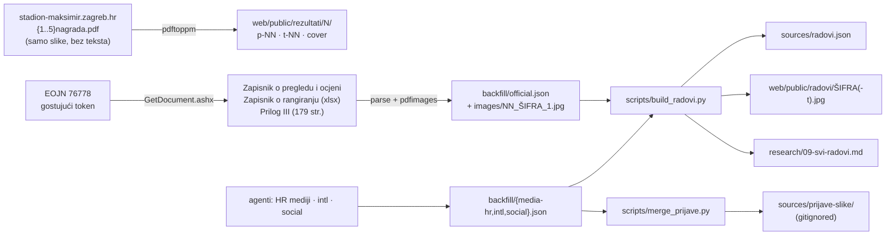

# Rezultati i svih 88 radova: kako su skupljeni i objavljeni

*2026-09-25. Operativno znanje iz sesije u kojoj su na stranicu dodani rezultati (`#/rezultati`) i svih 88 radova (`#/radovi`).*

Ovdje nisu činjenice o natječaju, one su u
[`research/08`](../research/08-rezultati-natjecaja.md) i [`research/09`](../research/09-svi-radovi.md).
Ovdje je opisano **kako se do podataka dolazi**, **kako se stranica ponovno gradi** i što je
koštalo vremena. Nastavak je [`2026-08-26-provjera-statusa-i-deploy.md`](2026-08-26-provjera-statusa-i-deploy.md).

---

## 1. Tijek podataka



Ponovni build, kad `backfill/` postoji (u ovoj sesiji je bio u scratchpadu, **ne u repou**):

```bash
python3 scripts/build_radovi.py <backfill_dir>      # radovi.json, slike, research/09
cd web && npm run deploy                             # build + Pages, --branch main
```

`official.json` je jedini nužni ulaz. Bez `media-hr/eojn/ranking.json` polje `round_out` ostaje
prazno, a bez `media-hr` / `intl` / `social` JSON-ova nema linkova na objave autora.
**Backfill mapa nije sačuvana**, pa za ponovni build treba ponovno preuzeti EOJN dokumente
(§ 2). `sources/radovi.json` je commitan i dovoljan je za samu stranicu.

---

## 2. EOJN: dokumenti bez prijave

Ovo je najvažnija spoznaja sesije. Prva verzija `research/08 §8` tvrdila je da nenagrađeni
radovi „službeno nisu objavljeni”, jer EOJN-ovi linkovi vode na `/prijava`. To nije točno.

1. `GET https://eojn.hr/tender-eo/76778` dodijeli gostujući token u skrivenom polju `#uiUserToken`.
2. `GET /api/searchgrid/VAwardDecisions/get?filter=["TenderId","=",76778]&skip=0&take=50` sa zaglavljem `UserToken: <token>` vraća DmsId svih 34 dokumenta odluke.
3. `GET /GetDocument.ashx?id=<DmsId>&userToken=<token>` vraća datoteku. **Dugi oblik s `entityId=…&documentGroupId=…` preusmjerava na prijavu**, a kratki ne.

Token istječe, pa ga treba čitati iznova. Zapisnik sadrži **OIB-e i kućne adrese fizičkih
osoba**. Ne commitati ga, a u `radovi.json` idu samo imena, uloge i zemlje.

Prilog III: rad s rednim brojem N je na stranicama 2N+1 (slika) i 2N+2 (opisna ocjena HR + EN).
Slika je jedan ugrađeni JPEG veličine ~1600×1012, koji se izvlači s `pdfimages -all` bez gubitka kvalitete.

---

## 3. Odluka o autorskim pravima

| Materijal | Gdje | Zašto |
|---|---|---|
| Paneli 5 nagrađenih (službeni PDF-ovi) | javno, `web/public/rezultati/` | objavio ih je naručitelj radi informiranja javnosti |
| Jedna slika po radu iz Priloga III | javno, `web/public/radovi/` | obvezna javna objava „grafičkih priloga” (Pravilnik NN 154/2025, čl. 81.) |
| Slike koje su autori sami objavili (IG, LinkedIn) | **samo lokalno**, `sources/prijave-slike/` | pravo iskorištavanja svih radova (čl. 86.) imaju naručitelj i provoditelj, ne mi; na webu su samo linkovi |

---

## 4. Zamke koje su koštale vremena

- **PDF-ovi nagrađenih radova nemaju tekstualni sloj.** `pdftotext` vraća 0 riječi, pa sve treba čitati vizualno.
- **Zapisnik razdvaja imena na zarezima.** „IDOM Consulting, Engineering, Architecture” postane tri uloge, pa se „Architecture” krivo upari s „JAG Architecture”. `fix_roles()` generičke riječi vraća u prethodno ime. Uparivanje djelomičnim imenom dopušteno je samo za imena od **barem dvije riječi i 8+ znakova**. Partneri (npr. Arup) se ne uparuju jer rade s više timova.
- **Timovi se sami zovu drugačije nego u zapisniku** („Zaha Hadid Architects” / „ZHA Architects Limited”, „Otto Barić” / „DOMO-PLAN d.o.o.”). Ručni `ALIASES` u `build_radovi.py`, po šifri.
- **Uloge u zapisniku znaju biti `null`.** Normaliziraju se u `""`, jer bi inače `esc(null)` srušio stranicu rada.
- **Instagram i LinkedIn slike:** alat preglednika zamjenjuje potpisane parametre CDN URL-a s `[BLOCKED: Cookie/query string data]`, pa curl dobije 403. Od ~170 URL-ova skinuto je 30. `instagram.com/p/<kod>/media/?size=l` daje samo prvu sliku carousela.
- **Agenti si proturječe.** Agent za medije je tvrdio da su autori poznati „samo za 5 nagrađenih”, iako zapisnik navodi sve. Vjeruj službenom dokumentu, ne sažetku agenta.
- **Firecrawl krediti:** tri agenta paralelno su potrošila 740/1000 za period 8.9.–8.10.2026. i udarila u 429. **Ostalo je 260.**
- **Samo jedan agent smije koristiti preglednik** (Brave, `ms@ff.hr`). Za vrijeme njegova rada vizualna provjera čeka. `playwright-cli` nije instaliran globalno.
- `tidy()` pretvara nazive pisane velikim slovima u normalna slova, ali jednorječne kratice (XDGA, ZHA) mora ostaviti kakve jesu.

---

## 5. Otvoreno

- **Izložba svih radova s maketama**: najavljena „za otprilike mjesec dana” (kraj listopada 2026.). Datum i mjesto nisu objavljeni. Tamo će se vidjeti više panela po radu.
- **DAZ / HKA stranica s „Ostalim radovima”** (kao kod Vrbana) još ne postoji. HKA vijest 6202 je jedno vrijeme vraćala 404.
- **Nove objave autora** očekuju se kroz 1–3 tjedna. Ponovi backfill i `build_radovi.py`. Pazi na firecrawl kredite.
- **Paneli nenagrađenih radova** u punoj rezoluciji nisu službeno objavljeni. Imamo samo jednu sliku po radu.
- Studio 127_1 (Kamerun) i Tash Architects (Indija) objavili su projekte „za Maksimir”, ali **nisu među 88**.
- Peticija i inicijativa za opoziv (25.9.): broj potpisa i ishod.
- Mobilni prikaz `#/radovi` i `#/rezultati` nije provjeren u pregledniku, postoje samo CSS pravila za uske zaslone.

## Vezani dokumenti

- [`research/08-rezultati-natjecaja.md`](../research/08-rezultati-natjecaja.md) — činjenice, izjave, reakcije, §8 dostupnost radova
- [`research/09-svi-radovi.md`](../research/09-svi-radovi.md) — generirana tablica svih 88
- [`2026-08-26-provjera-statusa-i-deploy.md`](2026-08-26-provjera-statusa-i-deploy.md) — kanali provjere, docs.ts zamka, deploy
