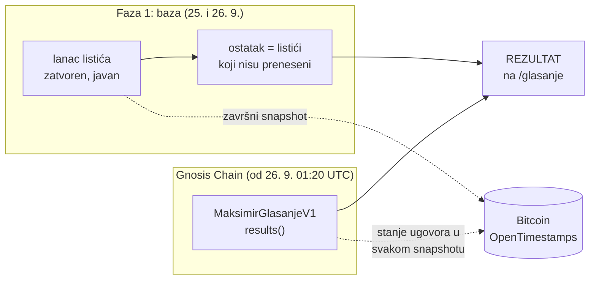
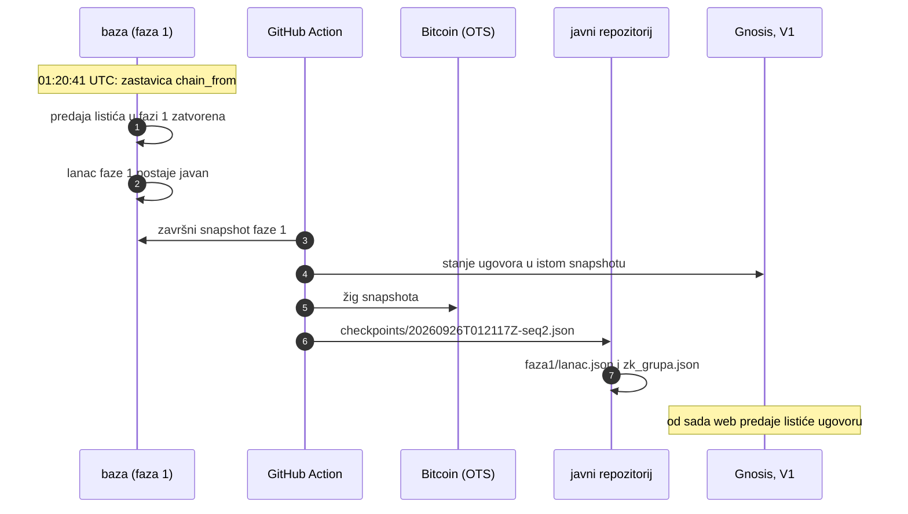

# Dan D: glasanje javnosti prelazi na Gnosis Chain

*26. 9. 2026. Što se promijenilo, što to znači za glasača i kako bilo tko sam provjeri rezultat.*

## Ukratko

- **26. 9. 2026. u 03:20:41** (01:20:41 UTC) glasanje javnosti za novi Stadion Maksimir preselilo se
  s naše baze na javni blockchain **Gnosis Chain**.
- Listići se od tada predaju pametnom ugovoru **`MaksimirGlasanjeV1`** na adresi
  [`0x812960FA1120121DEd82A8806aECE93dcf49E869`](https://gnosisscan.io/address/0x812960FA1120121DEd82A8806aECE93dcf49E869).
  Ugovor zbraja bodove sam, a zbroj može pročitati svatko, bez nas.
- Prva faza (glasanje u bazi, 25. i 26. 9.) je **zatvorena, ali ne obrisana**. Njezin cijeli zapis je
  javan i žigosan u Bitcoinu, a listići iz nje **i dalje se broje**.
- **Rezultat = glasovi na lancu + glasovi iz faze 1 koji nisu preneseni.** Nijedna osoba se ne broji
  dvaput.
- Pravila se nisu promijenila: 100 bodova po osobi, prijava eOsobnom ili Certilia mobile.ID-jem,
  listić se smije mijenjati do 31. 12. 2027. u 23:59.

Glasanje: [maksimir.domovina.ai/glasanje](https://maksimir.domovina.ai/glasanje).

## Zašto

U fazi 1 glasovi su bili u bazi koju vodi domovina.ai. Svaka promjena ulazila je u lanac hasheva, a
vrh lanca svakih nekoliko sati u Bitcoin (OpenTimestamps), pa naknadno prepisivanje ne bi prošlo
neopaženo. Ipak, glasač je morao vjerovati da operater baze ispravno bilježi **njegov** listić.

Na lancu to više ne treba:

| | Faza 1 (baza) | Od dana D (Gnosis) |
|---|---|---|
| Tko upisuje listić | naš poslužitelj | ugovor, nakon što provjeri ZK dokaz iz glasačeva preglednika |
| Tko može promijeniti tuđi listić | tehnički operater baze (vidljivo u lancu hasheva) | nitko; mijenja samo onaj tko drži ključ |
| Tko zbraja | baza | ugovor (`results()`), javno |
| Gdje je dokaz | lanac hasheva + Bitcoin žig | događaji ugovora na Gnosisu + Bitcoin žig snapshotova |
| Što glasač treba | eOsobnu | eOsobnu i svoj ključ (24 riječi, čuva ga passkey na uređaju) |

Glasač ne treba novčanik ni kriptovalutu: transakciju šalje i plaća naš relayer, koji listić ne može
promijeniti, jer ga je potpisao glasačev ključ.

## Što to znači za tebe

| Ako si… | Što se dogodilo | Što trebaš napraviti |
|---|---|---|
| glasao u fazi 1 | tvoj listić se i dalje broji | ništa. Ako ga želiš mijenjati, na [/glasanje](https://maksimir.domovina.ai/glasanje) ga preneseš na lanac: listić iz faze 1 postane nacrt, napraviš ključ i predaš |
| još nisi glasao | glasaš odmah na lancu | prijava eOsobnom, ključ (24 riječi + passkey), listić, predaj |
| glasao i već prenio na lanac | broji se samo listić na lancu | ništa |

Ključ je tvoj: bez njega nitko, ni mi, ne može promijeniti tvoj listić. Zato stranica traži da 24
riječi kopiraš ili ispišeš. Detalji: [tko drži koji ključ](blockchain/06-kontrola-glasaca.md).

## Kako izgleda prijelaz



Što se točno dogodilo u trenutku prijelaza:



## Provjeri sam

Za provjeru ne treba vjerovati ni nama ni ovoj stranici. Treba Python 3 (bez dodatnih paketa) i
pristup internetu (javni RPC Gnosisa):

```sh
git clone https://github.com/stepanic/stadion-maksimir-natjecaj-2026
cd stadion-maksimir-natjecaj-2026
python3 scripts/maksimir_verify.py glasanje/faza1/lanac.json glasanje/checkpoints/*.json \
  --zk glasanje/faza1/zk_grupa.json --chain chain/deployments/gnosis/v1.json
```

Skripta:

1. ponovno izračuna svaki hash u lancu faze 1 i provjeri da je svaki satni snapshot (onaj koji je u
   Bitcoinu) prefiks tog lanca, s istim brojem glasača i bodovima;
2. provjeri zapisnik ZK grupe faze 1;
3. provjeri da je na adresi ugovora točno kôd iz repozitorija (hash koda iz manifesta);
4. pročita sve listiće s lanca (događaji `BallotCast`), zbroji ih sama i usporedi s `results()`
   ugovora i sa stanjem lanca u svakom snapshotu;
5. ispiše ukupan rezultat: ostatak faze 1 + lanac.

Na dan D ispis završava s **SVE PROVJERE PROŠLE**. Bitcoin žig pojedinog snapshota (datoteka
`.json.ots` uz njega) provjerava se na [opentimestamps.org](https://opentimestamps.org) ili naredbom
`ots verify`. Više o formatu: [provjerljivi zapis](../glasanje/README.md).

## Zapis prijelaza

| Što | Vrijednost |
|---|---|
| Trenutak prijelaza (`chain_from`) | 2026-09-26 01:20:41.770077 UTC |
| Ugovor | `MaksimirGlasanjeV1` [`0x812960FA1120121DEd82A8806aECE93dcf49E869`](https://gnosisscan.io/address/0x812960FA1120121DEd82A8806aECE93dcf49E869), Gnosis (chainId 100), blok deploya 48440122, izvor potvrđen na Sourcifyju (exact match) |
| Vlasnik ugovora | Safe 2 od 3 [`0xfb1b7a0e5d43e2B92d1956C70018e2eE53B2c576`](https://app.safe.global/home?safe=gno:0xfb1b7a0e5d43e2B92d1956C70018e2eE53B2c576); vlasnik može zamijeniti registrara, jednom odrediti nasljednika (V2) i podesiti koliko dugo vrijedi stari korijen grupe, ali nema funkciju koja dira listiće, zbroj ili rok |
| Registrar (potvrđuje pravo glasa) | [`0x0F81daa9A724eAe838BE22dd446fcdB7Fbfa5374`](https://gnosisscan.io/address/0x0F81daa9A724eAe838BE22dd446fcdB7Fbfa5374) |
| Kraj glasanja u ugovoru (`closesAt`) | 31. 12. 2027. u 23:59:59 po zagrebačkom vremenu, nepromjenjiv |
| Završni snapshot faze 1 | [`20260926T012117Z-seq2.json`](../glasanje/checkpoints/20260926T012117Z-seq2.json) (`maksimir-snapshot/3`, `phase1_final: true`), [run Actiona](https://github.com/stepanic/stadion-maksimir-natjecaj-2026/actions/runs/36208126330), commit `dfab6ff` |
| Vrh lanca faze 1 | `seq 2`, hash `b3b94377339bba2bd04c3fb978bda52b3150b65dec1646fe44a561105b49de16` |
| Vrh ZK grupe faze 1 | `seq 1`, hash `433a3c8abad42ffe03d406f91c378881a8bb63ec0aa33ba43347ff16ffada48e` |
| Stanje lanca u snapshotu | blok 48440478 (`0x0ae8fdf5a6d9b13f6597822ff76e311b1b3557ff84c1ec26fc1ca379919ccbe3`), 1 registracija, 1 glasač |
| Izvoz faze 1 u repozitorij | [`glasanje/faza1/`](../glasanje/faza1/lanac.json), commit `92982e9` |
| Stanje na dan D | faza 1: 0 aktivnih listića (probni listić povučen 25. 9.), lanac: 1 glasač |

Glasanje je u trenutku prijelaza tek počinjalo, pa je prijelaz napravljen prije šire objave. Tako
nitko nije morao prenositi listić: u fazi 1 nije bilo nijednog aktivnog listića.

## Iskrene granice

Prije prijelaza kôd su pregledala dva neovisna pregleda (drugi model od onoga koji je pisao kôd).
Nijedan nije našao način da netko glasa umjesto drugoga, glasa dvaput, promijeni tuđi listić ili
pokvari zbroj. Našli su stvari **oko** toga koje još nisu popravljene. Prijelaz je napravljen uz
izričito prihvaćanje tih rizika:

- **Privatnost prema nama.** Registracija i prvi listić šalju se jedno za drugim, pa bi operater
  koji spoji zapise registrara i relayera mogao povezati listić s osobom. Javnost vidi samo
  pseudonimne podatke (commitment, nullifier), ne i osobu.
  Obećavamo da zapise ne spajamo, ali to je obećanje, a ne kriptografsko jamstvo. Plan je razdvojiti
  ta dva koraka u vremenu.
- **Anonimne objave se ne provjeravaju pri upisu.** Tko želi, može upisati lažnu „anonimnu objavu”.
  Stranica objave je prepoznaje kao lažnu (provjera ide u pregledniku, s lanca), ali brojač objava i
  pregled poveznice na društvenim mrežama to ne znaju. Na zbroj glasova to ne utječe.
- **ZK datoteke** (oko 2 MB, preuzimaju se pri izradi dokaza) dolaze s poslužitelja projekta
  Semaphore, bez naše provjere hasha. Plan je poslužiti ih s ove domene, uz provjeru.
- **Satni žig u Bitcoinu nije baš svaki sat:** GitHub zakazane runove ponekad preskače.

Svi nalazi s objašnjenjem: [prvi pregled](review/2026-09-26-neovisni-review-glasanje.md) i
[drugi pregled](review/2026-09-26-neovisni-review-wiring.md).

## Ako nešto pođe krivo

- **Relayer ne radi:** stranica nudi „preuzmi paket” pa listić može poslati bilo tko, s bilo kojim
  novčanikom. Listić je već potpisan i ne može se promijeniti.
- **Greška u ugovoru:** ugovor se ne može mijenjati (nema proxyja). Popravak je novi ugovor V2, a
  glasač sam, svojim ključem, seli listić. V1 se broji i dalje. [Verzioniranje](blockchain/07-verzioniranje.md).
- **Lanac mora stati:** faza 1 se može ponovno otvoriti jednom zastavicom. Listići na lancu ostaju i
  broje se, a osoba koja je već na lancu ne može opet glasati u fazi 1.

## Dalje

- [Plan spajanja s fazom 1](blockchain/08-integracija-s-fazom-1.md): tehnički plan, runbook dana D i sve provjere
- [Kako tehnički radi glasanje](glasanje-kako-radi.md): faza 1 korak po korak
- [Glasanje na lancu: pregled i odluke](blockchain/README.md)
