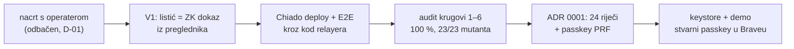

# Glasanje na Gnosis Chainu — sesija 25.–26. 9. 2026.

Sažetak sesije koja je dovela do `MaksimirGlasanjeV1`, audita i ključa glasača. Plan, odluke i
audit su u [docs/blockchain/](blockchain/README.md). Ovdje su samo stvari koje bi sljedeći prolaz
morao ponovno otkriti: zamke, mjerenja i otvorene stavke.

## Kako je rad tekao

Grana `feat/glasanje-onchain`, rađena u worktreeu `../stadion-maksimir-onchain`, jer je druga
sesija istodobno selila `web/` na Astro i Workers. Grana ne dira `web/`.

## Mjerenja koja su odredila odluke

| Što | Vrijednost | Odluka |
|---|---|---|
| Bazna naknada Gnosis / Chiado | 7–11 wei | vlastiti relayer; trošak glasanja je zanemariv |
| `cast` (prvi listić) | ~480 000 gasa | ZK provjera na lancu je prihvatljiva |
| Chiado faucet | 0,001 xDAI tjedno | dovoljno za desetke tisuća transakcija |
| Potrošeno na Chiadu (3 deploya + 3 E2E) | < 0,0000001 xDAI | testnet nije ograničenje |
| Pokrivenost ugovora prije audita | 76 % grana | 22 rubna testa → 100 % |
| Mutanti | 23, svi ubijeni | testovi „imaju zube” |
| Fuzz | 10 × 80 = 800 koraka | stanje = model nakon svakog |
| Testova ukupno | 91 | ugovor i klijent na 100 % |

## Zamke

1. **Mac nema swap** (`vm.swapusage total = 0`), a virtualna mašina drži 4,6 GB. Sesija se srušila
   usred Chiado deploya kad je RAM ponestao. Teške procese (hardhat node, coverage, mutacije) treba
   pokretati jedan po jedan.
2. **Javni Chiado RPC** povremeno odbije procjenu gasa za deploy („gas required exceeds 999999”),
   iako deploy troši 2,1 M. Rješenje je `DEPLOY_GAS=3000000` u `deploy-v1.ts`.
3. **`hardhat run` ne može učitati ESM modul relayera** (`relayer/package.json` ima
   `"type": "module"`). E2E skripte zato idu kroz `npx tsx`.
4. **solidity-coverage s hardhat-viem** traži `SOLIDITY_COVERAGE=true` (ugrađeno u `npm run coverage`).
5. **Hardhat ne briše stare build-info datoteke.** `check-frozen` je zato lažno prolazio (A-02), a
   sad čita build-info preko `<Ugovor>.dbg.json`.
6. **Slither pokreće `hardhat clean --global`** i briše predmemoriju kompajlera.
7. **Semaphore `LeanIMT.remove` ostavlja nulu**, a faza 1 (`membersAt`) člana izbacuje iz niza. V1
   nema uklanjanja, a `fetchGroup` gradi stablo iz događaja kao lanac (D-02).
8. **WebAuthn traži da je prozor u fokusu.** Automatizirani, nefokusirani prozor dobiva „page does
   not have focus”. Korake s passkeyjem mora kliknuti čovjek.
9. **Klik preko `ref`-a (claude-in-chrome) zna promašiti**, a promjena mjerila snimke pomakne
   koordinate. Nakon klika uvijek treba provjeriti učinak (`window.__demo`).
10. **Ispis i dijalozi** blokiraju upravljanje preglednikom, pa se `window.print()` ne pokreće
    automatski.
11. **BIP-39 kontrolni zbroj ima 8 bita.** Test koji mijenja redoslijed riječi lažno pada otprilike
    jednom u 256 pokretanja (T-01), pa se koristi deterministički primjer.
12. **viem `getLogs` s `events` + `args`** tipovi ne dopuštaju, ali filter radi (C-02). Zadržan je
    uz obrambeni filter i test s tuđom grupom.
13. **Semaphore v4 predaja admina grupe je dvostupanjska** (`updateGroupAdmin` + `acceptGroupAdmin`).
    Zbog toga mutant M23 nije bio ubijen dok test nije pokušao i `acceptGroupAdmin`.

## Zašto mutacijski test traje dugo (CI, 26. 9.)

Na GitHubovu runneru `npm run mutation` traje **12,5 min**, lokalno oko 4 min. Zato se na CI-ju pokreće **samo ručno** (workflow `chain-mutation`, Actions → Run workflow; opcionalno samo neki mutanti), a ne na svaki push u PR.

| Što | Trajanje |
|---|---|
| mutanata | 23 |
| po mutantu na CI-ju | 25–38 s (M22: 7 s, jer odmah pada 32 testa) |
| po mutantu lokalno | 8–12 s |

Razlog: svaki mutant ponovno kompajlira ugovor i pokreće **cijeli** testni skup (91 test,
uključujući stateful fuzz i klijentske testove), a stotine pravih Groth16 dokaza (snarkjs, ~0,1–0,3 s
svaki) na runneru s 2 vCPU-a traju oko 3 puta dulje nego na M-seriji. Mutant je „ubijen” već kad
padne prvi test, ali skup se ipak odvrti do kraja da bi se prebrojili padovi.

Ubrzanja (otvoreno, nije napravljeno):
1. `mocha --bail` u mutacijama: stani na prvom padu (gubi se broj padova, a on je samo informativan).
2. Za mutante pokretati samo `test/v1/**` (klijentski testovi ne ovise o ugovoru).
3. CI matrica: 23 mutanta u 4 paralelna joba (`node scripts/mutation-test.mjs M01 … M06`).
4. Fuzz u mutacijama već je smanjen (`FUZZ_SEEDS=2 FUZZ_OPS=25`).

Procjena uz 1–3: ispod 2 min na CI-ju.

## Stanje

| Dio | Stanje |
|---|---|
| V1 na Chiadu | `0xe7903145c8F2401fC16D78d9788D34beE0c3e029`, verificiran, E2E prošao |
| V1 na Gnosisu | **nije deployan** |
| Relayer (Worker) | kôd i testovi gotovi; **nije deployan** (nema KV-a ni tajne) |
| Registrar (`domovina-api`) | **nije napravljen** |
| Web | **nije spojen** (čeka Astro migraciju) |
| Ključ glasača | `keystore.ts` + demo; stvarni passkey test prošao (Brave, iCloud Keychain) |

Testni ključevi za Chiado su u `chain/.env.chiado` (gitignorirano, samo testnet): deployer, koji je
i sponzor relayera, `0x408d…d30C`, te registrar `0x3bbe…2137`.

## Otvoreno

- [ ] **Plan spajanja s fazom 1 (offchain)** kao jedan uređen dokument (`docs/blockchain/08-…`).
      Dijelovi već postoje: [04-web-i-baza.md](blockchain/04-web-i-baza.md) (registrar, web tok,
      baza, zatvaranje faze 1) i [01 „Prijelaz s faze 1”](blockchain/01-arhitektura.md#prijelaz-s-faze-1).
      Nedostaju redoslijed, zastavice, rezultati iz dva izvora, `/g/<id>` objave, checkpoint Action
      nakon prelaska, `maksimir_verify.py --chain` i plan povratka.
- [ ] **Ubrzati mutacijski test** (vidi gore).

- [ ] **Merge u `main`**: bez konflikata s `origin/main` na dan 26. 9. (provjereno `git merge-tree`).
- [ ] **Gnosis deploy**: novi Safe 2/3 kao vlasnik, ključ registrara, commitan izvor, git tag
      `glasanje-v1-gnosis` ([03-deploy-runbook.md](blockchain/03-deploy-runbook.md)).
- [ ] **Kompajler**: ostati na solc 0.8.28 ili prije mainneta prijeći na 0.8.37 (novi Chiado deploy).
- [ ] **Registrar** u `domovina-api` i tablica `maksimir_keystore` ([04](blockchain/04-web-i-baza.md)).
- [ ] **Web** nakon Astro migracije: tok iz demo stranice, relayer, rezultati s lanca, `docs.ts` manifest.
- [ ] **Passkey na drugim platformama**: iPhone (Safari), Android (Chrome + Google), Windows Hello.
- [ ] **CI na GitHubu** još nije vidio granu; prvi push će pokazati prolaze li `coverage`,
      `coverage:client`, `typecheck:client` i `mutation` na Ubuntu runneru.
- [ ] **Brisanje testnih passkeyja** „Maksimir TEST …” iz Lozinki (Matija).
- [ ] **`pay.domovina.ai`**: EIP-7702 + passkey kao pokus na Chiadu
      ([istraživanje](blockchain/istrazivanja/2026-09-26-eip7702-passkey-gnosis.md)).

## Vezani dokumenti

- [docs/blockchain/README.md](blockchain/README.md): plan, odluke, stanje
- [docs/blockchain/audit/](blockchain/audit/README.md): audit, nalazi, krugovi
- [docs/blockchain/adr/0001-kljuc-glasaca-passkey-i-24-rijeci.md](blockchain/adr/0001-kljuc-glasaca-passkey-i-24-rijeci.md)
- [docs/glasanje-kako-radi.md](glasanje-kako-radi.md): faza 1 (offchain)
