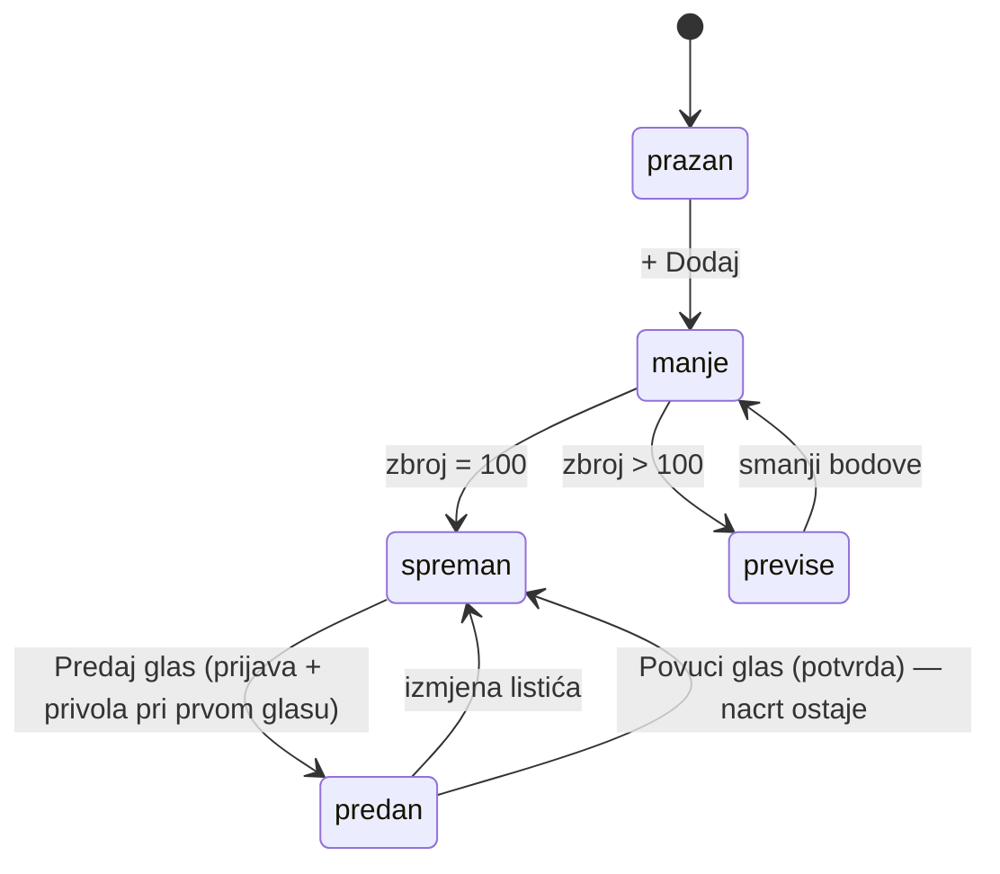

# Glasanje: redizajn listića za ljude koji ne razumiju tehnologiju

*2026-09-26. Commit `dd15f1f`, Worker verzija `27af653a`. Kod je u `web/src/glasanjeView.ts` i u odjeljku
„Glasanje javnosti” u `web/src/style.css`. Provjera listića: `web/scripts/glasanje-ui.mjs`.*

## Zašto

Funkcionalno je sve radilo, ali:

- **„Povuci glas” je bio jedan klik bez potvrde**, uz gumb „Predaj”. Klik je poslao prazan listić i **obrisao nacrt
  u pregledniku**. Tko je bodove raspodijelio po 34 rada, izgubio je sve. Na produkciji se to upravo dogodilo:
  26. 9. 2026. rezultati pokazuju 0 glasača, a satni snapshot od 25. 9. u 19:43 imao je 1.
- Radovi su se dodavali samo tražilicom po nazivu, a laik ne zna nazive ureda.
- Stranica nije govorila što je sljedeći korak.

## Što je sad na stranici

| Dio | Ponašanje |
|---|---|
| Tri koraka na vrhu | Odaberi radove → Podijeli 100 bodova → Predaj eOsobnom; trenutni korak je istaknut, gotovi su zeleni |
| Galerija | Svih 88 radova sa slikom, „+ Dodaj” / „✓ Na listiću”; filtri: Svi, Nagrađeni, Najpopularniji kod javnosti, Na mom listiću; prvo se prikazuju 24 rada |
| Moj listić | Traka „N / 100” u kojoj svaki rad ima svoj dio; kod svakog rada klizač i broj; „Dodijeli ostatak”, „Podijeli jednako”, „Isprazni listić”; na desktopu ostaje na ekranu dok se stranica pomiče |
| Savjet ispod brojača | Uvijek sljedeći korak običnim riječima; upozorava i kad neki rad ima 0 bodova, jer takav rad ne ulazi u glas |
| Povlačenje | Skriveno u sklopivom dijelu s potvrdom; dijalog s istaknutim „Ne, zadrži glas”; Esc i klik izvan dijaloga odustaju; **nacrt ostaje** |
| Poništavanje | Uklanjanje rada, pražnjenje listića i „Podijeli jednako” daju obavijest s gumbom „Vrati” (7 s) |
| Mobitel | Traka „90/100 · 3 rada · Moj listić ↓” na dnu; koraci su sažeti u jedan red |
| Tehnički dio | „Kako znaš da nitko nije dirao glasove” je sklopljen (`
`) |

Stanja su `phase()` u kodu: `empty`, `under`, `over`, `ready`, `done`. Iz njih se računaju koraci i savjet.

## Odluke

- **Poništavanje umjesto potvrde za male radnje.** Dijalog pri svakom ✕ bi ljudi naučili klikati bez čitanja.
  Potvrda je samo za radnju koja mijenja rezultate (povlačenje).
- **Povlačenje čuva nacrt.** Poziv i dalje šalje `castBallot({})`, jer backend i lanac hasheva ostaju isti.
  Nacrt na uređaju ostaje, pa je vraćanje glasa jedan klik. Poruka u dijalogu kaže da za promjenu bodova ne treba
  povlačiti glas; to je najvjerojatniji razlog pogrešnog klika.
- **Novi rad dobiva preostale bodove, pa često 0.** Ponašanje `addToDraft()` nije mijenjano, jer ga koristi i
  panel na stranici rada. Umjesto toga savjet izrijekom kaže da se rad s 0 bodova ne broji.
- **Klizač do 100, bez ograničenja na preostalo.** Prelazak preko 100 traka i brojač pokažu crveno.

## Zamke

1. **Puni `draw()` usred povlačenja klizača prekida povlačenje.** Na `input` se sve ažurira na mjestu
   (`updateBallotInPlace`), a puni render ide tek na `change`.
2. **Fokus nakon re-rendera.** Svaki fokusirani element ima `data-k`, i `draw()` ga po tome vraća. Stari ključ po
   `.gl-row` + `data-act` nije pokrivao klizač, tražilicu u galeriji ni gumbe kartica.
3. **Obavijest je iznova „uletjela” pri svakom renderu.** Animacija je sad samo na prvom prikazu (`seen`).
4. **Na mobitelu je obavijest bila preuska.** `left: 50%` + `translateX(-50%)` ograničava širinu na pola ekrana.
   Sad je `left: 0; right: 0; margin: auto; width: fit-content`.
5. **Presretanje API-ja u Playwrightu.** Regex `/supabase/` hvata i Viteove module (`node_modules/@supabase/…`), pa
   se stranica ne učita. Presreće se samo `^https://api.domovina.ai/`.
6. **Lažna sesija** za test: `localStorage["maksimir-auth"]` s `expires_at` u budućnosti. supabase-js je tada ne
   osvježava, pa ne ide nijedan poziv na produkcijski auth.

## Provjera

`node web/scripts/glasanje-ui.mjs <url>` (lokalni Vite ili produkcija). Svi pozivi prema `api.domovina.ai` su
presretnuti, pa skripta ne dira produkciju. Ima 13 provjera: uklanjanje i Vrati, pražnjenje i Vrati, Esc ne povlači
glas, povlačenje šalje jedan prazan listić i čuva nacrt, ponovna predaja šalje sačuvani listić, dodavanje iz galerije
s upozorenjem za 0 bodova i tipkanje bodova. Snimke (390 i 1280 px) ostaju u privremenoj mapi. 26. 9. je prošla
lokalno i na produkciji, kao i `npm run check` prije i poslije deploya.

## Otvoreno

- **Korisnikov glas je povučen.** Stari kod je obrisao i nacrt, pa ga treba ponovno složiti i predati.
- **Ručna provjera u Braveu** (claude-in-chrome, samo čitanjem) za ovaj deploy nije napravljena.
- Stanja s prijavom, dijalogom privole i dijeljenjem provjerena su samo s presretnutim API-jem, ne s pravom eOsobnom.
- Galerija ima 88 slika na jednoj stranici kad se klikne „Prikaži sve”. Uz `loading="lazy"` je u redu. Ako bude
  sporo na mobitelu, sljedeći korak je virtualizacija.

## Vezani dokumenti

- [2026-09-25-glasanje-javnosti.md](2026-09-25-glasanje-javnosti.md): pravila glasanja, backend, zamke faze 1
- [2026-09-25-regresijske-provjere.md](2026-09-25-regresijske-provjere.md): `npm run check` i postupak deploya
