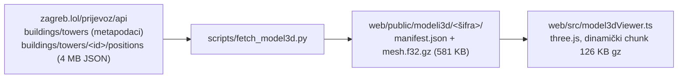

# 3D model s zagreb.lol i medijski arhiv

*2026-09-28. Ono što sljedeći prolaz ne bi vidio iz koda: odakle dolazi model, kako se osvježava medijski
arhiv i gdje su zapele pretrage.*

## 3D model pobjedničkog rada

- **Autor modela:** Strahimir Stribor (zagreb.lol, GitHub `Poglavar`). Napravljen je s Claudeom i Blenderom iz
  deset panela (A0, 150 dpi). Mjerilo je kalibrirano na teren 105 × 68 m. Opis postupka je u
  `manifest.json` → `geometry_basis`.
- **Licence nema.** Kod preglednika (`tower-builder.js` i ostalo) nije ni u jednom javnom repou. MIT repo
  `station3d` ne sadrži ni graditelja ni model. Model je u repo ušao 28. 9. na izričitu odluku vlasnika repoa,
  uz atribuciju i vanjske linkove, a od autora je zatražena licenca (npr. CC BY 4.0). **Otvoreno:** kad
  odgovori, upisati licencu u `manifest.json` i opis ispod modela, ili model maknuti.
- **Format izvora.** Zapis je `kind: "mesh"`, a `positions` je mapa `skupina → [x,y,z, …]`, 9 brojeva po trokutu.
  Koordinate su lokalne, u metrima, y prema gore. Materijali su u `mesh_materials[skupina]`.
- **Prijenos.** Worker poslužuje `.gz` kao `application/gzip`, bez `Content-Encoding`. Preglednik ga
  raspakira sam (`DecompressionStream`), a ako je poslužitelj već raspakirao, prepoznaje to po magičnim
  bajtovima.
- **Novi model** za drugi rad: dodati redak u `MODELI` u `web/src/modeli3d.ts` i pokrenuti
  `python3 scripts/fetch_model3d.py <šifra> <zagreb.lol id>`.

## Medijski arhiv (`sources/mediji.tsv` → `research/11`)

- Nova iteracija je TSV s istim stupcima (`datum izvor naslov url tip stav sazetak provjereno`) i naredba
  `python3 scripts/build_mediji.py nova.tsv`. Skripta miče duplikate po URL-u (bez parametara za praćenje,
  ali s `?v=` itd.). Sirove iteracije čuvaju se u `private/arhiv-iteracije/<datum>/`, koji je gitignored.
- **Zamke, popravljene:**
  - Skidanje cijelog query stringa stopilo je sve YouTube videe u jedan zapis.
  - `csv` s `escapechar` je pri svakom pokretanju dodavao još jednu `\` ispred navodnika.
  - Skripta je sad idempotentna: drugo pokretanje daje identičnu datoteku.
- **Kako se pretraživalo.** WebSearch ima **200 poziva po sesiji** i četiri paralelna agenta su ga potrošila.
  Pouzdaniji put su mjesečni sitemapi portala (jutarnji, 24sata, net.hr, dnevnik), njihove interne
  tražilice (index, večernji), tagovi (tportal) i prolaz po ID-u članka (večernji, sportnet).
  - Slobodna Dalmacija, Nacional, gnkdinamo.hr i Hina blokiraju curl (Cloudflare) i rade samo u pregledniku.
  - X je čitljiv samo u prijavljenom pregledniku, jer mirrori vraćaju 451 ili traže JS.
- **Što otvara blokirane stranice** (provjereno 29. 9.):

  | Izvor | Put koji radi |
  |---|---|
  | Reddit (i post i komentari) | `<url posta>/.rss`, preglednički User-Agent, jedan zahtjev u 3 s. `.json`, `old.reddit` i `r.jina.ai` vraćaju 403 ili 429. |
  | Cloudflare dio (Slobodna, Nacional, Hina, dezeen, stadiumbusiness, skyscrapercity) | `https://r.jina.ai/<url>` |
  | Cloudflare challenge i preko jine (forum.hr, coliseum-online, slobodenpecat, bustler) | Firecrawl `scrape`, 1 kredit po stranici. Mjesečni limit je 1.000 kredita i 29. 9. je potrošen. |
  | X, Instagram | samo prijavljeni preglednik |

- **Provjera sumnje na uklanjanje:** Večernji preusmjerava `…/x-<ID>` na pravi slug (301), i to i za
  uklonjene članke. Tako se dokazuje da je članak postojao baš na Večernjem, iako sada daje 404.
- **Uklonjeni članci.** Večernji je uklonio četiri članka (24. do 27. 9.) i nijedan nema snimku u Waybacku.
  Ubuduće važne objave spremiti odmah, npr. `web.archive.org/save/<url>`.
- **Rupe u pokrivenosti:** Crna Gora, veliki talijanski i španjolski dnevnici, Večernji prije 23. 9. i
  sitemap zagreb.info (ne ide dalje od 10/2025).

## Vezani dokumenti

- [`../research/10-javnost-ankete-i-slicni-projekti.md`](../research/10-javnost-ankete-i-slicni-projekti.md): ankete, peticije, slični projekti
- [`../research/11-medijski-arhiv.md`](../research/11-medijski-arhiv.md): generirani arhiv
- [`2026-09-25-regresijske-provjere.md`](2026-09-25-regresijske-provjere.md): happy-dom i `| tail` zamke
