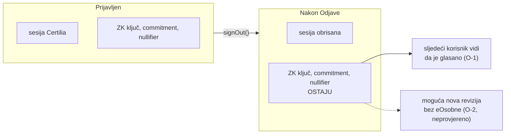

# Glasanje: obilazak kao javni posjetitelj (29. 9. 2026.)

Stranica `maksimir.domovina.ai/glasanje` obiđena je u pravom pregledniku (Brave), nakon ručne
odjave vlasnika. Obilazak je bio samo gledanje: bez prijave, bez listića, bez objave. Prijava je
otvorena i odmah otkazana. Pregledana su samo **imena** ključeva u `localStorage`u, ne vrijednosti.

Nalazi koji traže popravak ili odluku su ispod. Nijedan ne dira integritet zbroja na lancu.

## Nalazi

| # | Nalaz | Ozbiljnost | Gdje |
|---|---|---|---|
| O-1 | **Odjava ne briše ZK ključ.** Nakon odjave u pregledniku ostaju `maksimir-zk-identity`, `maksimir-keystore-v1:*`, `maksimir-chain-credential`, `maksimir-chain-commitment`, `maksimir-chain-nullifier:*`, `maksimir-chain-last-tx:*`, `maksimir-zk-share` i `maksimir-backup-*`. Stranica odjavljenom korisniku i dalje prikazuje „✓ Glas na lancu · revizija 3” i poveznicu na transakciju. | srednja na dijeljenom računalu, inače niska | `web/src/glasanje.ts:290` (`signOut()` zove samo `sb.auth.signOut()`), `web/src/glasanjeView.ts:1105` |
| O-2 | Iz O-1 i ugovora (`cast` traži samo valjan ZK dokaz, relayer je javan) slijedi da bi tko sjedne za isti preglednik mogao predati novu reviziju listića bez eOsobne. **Nije isprobano.** | srednja (dijeljeno računalo) | treba test na Chiadu ili lokalno, **ne na produkciji** |
| O-3 | **S jednim glasačem rezultati uživo otkrivaju cijeli njegov listić** (9 radova, postotci). Dokumentacija to priznaje („Anonimni skup je mali”), ali uz rezultate nema upozorenja. | niska–srednja (privatnost) | stranica rezultata |
| O-4 | Kartica rada prikazuje „15 % javnosti”, a iza toga je jedan glasač. | niska (komunikacija) | kartice radova |
| O-5 | Redoslijed radova je statičan (nagrađeni prvi). maksimirski-stadion.org koristi nasumičan red po sesiji (mulberry32, Fisher–Yates, gumb „promiješaj”). | niska (kvaliteta mjerenja) | `/glasanje` |
| O-6 | „Kako znaš da nitko nije dirao glasove” opisuje fazu 1 (lanac hasheva, Bitcoin žig). Ugovor na Gnosisu i explorer, danas glavna provjera, nisu na prvom mjestu. | niska (dokumentacija) | dno `/glasanje` |

## Prijedlog popravka

1. **O-1/O-2:** uz „Odjava” ponuditi „Odjava i ukloni ključ s ovog uređaja”, s upozorenjem da ključ
   mora biti spremljen (24 riječi / passkey) jer se inače listić više ne može mijenjati. Na prijavi
   pitati „je li ovo tvoje osobno računalo?”. Test: nakon odjave i brisanja ključa `cast` iz tog
   preglednika mora biti nemoguć bez obnove ključa.
2. **O-3/O-4:** dok je glasača manje od praga (npr. 20), uz rezultate napisati da mali broj glasača
   otkriva listiće i uz postotak uvijek prikazati broj glasača.
3. **O-5:** nasumičan redoslijed sa sjemenom u `sessionStorage`u i gumbom „promiješaj”.
4. **O-6:** odjeljak započeti ugovorom `0x8129…E869` i explorerom, a fazu 1 navesti kao drugo.

## Što je provjereno i drži

- Prijava traži Certilia MFA na mobitelu vlasnika. Obilazak bez njega nije mogao doći do predaje.
- Transakcija `0x2db6…d1be` (`cast`, blok 48.479.152, pošiljatelj relayer `0x7789…6549`) javno je
  vidljiva, a ugovor `0x8129…E869` ima verificiran izvorni kôd na exploreru.
- Odabir radova i raspodjela bodova rade bez prijave, a identitet se traži tek pri predaji.

## Vezani dokumenti

- [glasanje-kako-radi.md](glasanje-kako-radi.md): „Što sustav ne rješava”
- [review/2026-09-26-neovisni-review-wiring.md](review/2026-09-26-neovisni-review-wiring.md): F-06, F-07, F-20 (ključevi u `localStorage`u)
- [2026-09-26-glasanje-ux.md](2026-09-26-glasanje-ux.md)
