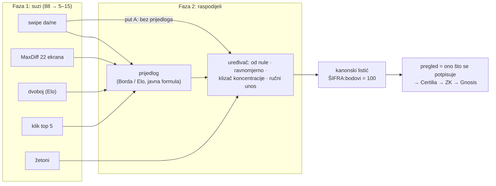

# Glasanje: UX obrasci za izbor među 88 radova (istraživanje)

Istraživanje: 30. 9. 2026. Kontekst: 88 arhitektonskih radova (slika, šifra, tim, zemlja). Trenutni listić: kumulativno glasanje, "raspodijeli 100 bodova".

**Oznake izvora:** [O] znači da je istraživač otvorio i pročitao cijeli tekst ili relevantni dio (PDF ili stranicu). [S] znači da je vidio samo sažetak ili isječak iz tražilice, pa brojke treba provjeriti u originalu prije citiranja u javnom tekstu.

---

Istraživanje je napravio sub-agent (Claude) web pretragom. Prototipi koji iz njega proizlaze su u
[`prototipi/glasanje-ux/`](../prototipi/glasanje-ux/README.md). Poglavlje
[„Što je ugrađeno u prototipe”](#što-je-ugrađeno-u-prototipe) na kraju povezuje preporuke s kodom.

## Sažetak

1. **Listić "100 bodova po 88 radova" nije loš.** Loše je to što se od birača traži da ga ispuni izravno nad 88 slika. Jedino terensko istraživanje baš ovog UI-a (Wellings i sur., 2023) pokazuje da ljudi kumulativno glasanje doživljavaju izražajnijim od rangiranja, ali im je draža jednostavnost. Rješenje je u dva koraka: prvo suziti izbor (filter), zatim rasporediti bodove na kratkoj listi.
2. **Parne usporedbe** (All Our Ideas) daju dobar *skupni* poredak. *Pojedinačni* listić od 88 stavki njima se ne može složiti, jer bi potpuno sortiranje tražilo oko 570 usporedbi po osobi. Rade samo na kratkoj listi (8 do 12 radova, 25 do 45 duela).
3. **MaxDiff** (najbolji/najgori u skupu od 4 do 5) najučinkovitije koristi pažnju birača: za 88 radova treba 18 do 22 ekrana (rijetki dizajn) ili oko 66 ekrana (klasični, individualne procjene).
4. **Swipe da/ne** je najbrži filter (88 poteza, nekoliko minuta), ali ima dokazan pad prihvaćanja kroz niz (−27 % u Pronk i Denissen, 2020). Obavezni su randomizacija redoslijeda i mogućnost revizije.
5. **Najveće prijetnje valjanosti:** redoslijed prikaza, prikaz rezultata uživo (herding, +25 %), poznata imena timova i kvaliteta renderinga. Protiv prva tri pomažu randomizacija po korisniku, skriveni rezultati do zatvaranja i slijepi mod (samo šifra). Kvaliteta renderinga ostaje strukturni problem.
6. **Pretvaranje u 100 bodova** (softmax nad Bradley–Terry skorovima ili Borda nad top-k) metodološki je pošteno samo pod ovim uvjetima: preslikavanje je javno i fiksirano unaprijed, jednako za sve, a korisnik vidi prijedlog i mora ga aktivno potvrditi ili urediti. Efekt zadane vrijednosti (default) i automation bias su jaki, pa se prijedlog mora ponašati kao prijedlog, a ne kao odluka.

---

## 1. Parne usporedbe (All Our Ideas, Bradley–Terry, Elo)

**Wiki survey (Salganik i Levy, 2015)** [O]. Ispitanik vidi dvije ideje i bira jednu, ili bira "ne mogu odlučiti". Može dodati i vlastitu ideju. Skor svake ideje je procijenjena vjerojatnost da pobijedi nasumično odabranu ideju kod nasumičnog ispitanika (0 do 100). Procjenjuje se Bayesovim hijerarhijskim probit modelom.
- **PlaNYC:** 1.436 ispitanika, 31.893 glasa, 464 predložene ideje (244 aktivirane), 25 početnih → 269 aktivnih ideja. Od 10 najboljih ideja, 8 su predložili sami ispitanici.
- **OECD:** 1.668 ispitanika, 28.852 glasa, 60 → 285 ideja. Od top 10, 7 su predložili korisnici.
- **Raspodjela doprinosa ima "debelu glavu i dugi rep":** da je svakom ispitaniku zadržano samo prvih 10 glasova, izgubilo bi se oko 75 % podataka. Gamificirano beskonačno duelanje, dakle, daje puno podataka od malog broja entuzijasta.
- **Parovi su birani nasumično.** Adaptivni odabir autori spominju tek kao budući rad.
- Izvor: Salganik, M. J. i Levy, K. E. C. (2015). *Wiki Surveys: Open and Quantifiable Social Data Collection.* PLOS ONE 10(5): e0123483. https://journals.plos.org/plosone/article?id=10.1371/journal.pone.0123483

**OpinionX Pair Rank** [O, dokumentacija]. Skor je samo stopa pobjeda (win rate = pobjede / broj duela). Preporuka je da se svaki mogući par pojavi barem 3 puta u cijeloj anketi, tj. ukupno glasova = 3·n(n−1)/2. Za pojedinca je oko 10 glasova polazište, a više od 40 je "puno". https://knowledge.opinionx.co/en/articles/5866366-pair-rank-scoring-examples-and-other-faqs

**Place Pulse (MIT)** [S]. Najbliži analog "Hot or Not za prostor": dvije fotografije ulice uz pitanje "koje mjesto izgleda sigurnije ili ljepše". Place Pulse 2.0 ima 1,17 milijuna usporedbi od 81.630 sudionika za 110.988 slika, a skorovi se računaju algoritmom TrueSkill (Bayesov Elo).
- Salesses, Schechtner i Hidalgo (2013), PLOS ONE. https://www.media.mit.edu/publications/place-pulse-measuring-the-collaborative-image-of-the-city/
- Dubey i sur. (2016), *Deep Learning the City*. https://arxiv.org/abs/1608.01769

**Modeli i složenost:**
- **Bradley–Terry–Luce / Rank Centrality** (Negahban, Oh i Shah, 2017, *Operations Research* 65(1)) [S]. Spektralni procjenitelj je jednako dobar kao procjena najveće vjerodostojnosti (MLE) pod BTL modelom. https://arxiv.org/abs/1209.1688
- **Aktivno rangiranje** (Jamieson i Nowak, 2011) [S]. Uz pretpostavku niskodimenzionalne strukture dovoljno je O(d log n) adaptivnih usporedbi. Bez te pretpostavke vrijedi O(n log n). https://homes.cs.washington.edu/~jamieson/resources/activeRanking_extended.pdf

**Brojke za 88 radova** (moj izračun):
- Broj mogućih parova: 88·87/2 = **3.828**.
- Pravilo OpinionX-a (svaki par barem 3×): oko **11.500 glasova ukupno**. Uz 20 glasova po osobi to je oko 575 sudionika. Aktivni odabir parova (BT ili TrueSkill) bitno smanjuje potrebni broj glasova za pouzdan vrh ljestvice.
- Potpuni osobni poredak: oko n·log₂n ≈ **570 duela** po osobi, što nije izvedivo.
- Osobni poredak kratke liste od 10 radova: 25 do 34 duela (sortiranje) ili 45 (svatko sa svakim).

**Zaključak:** parne usporedbe su izvrsne za *skupni* poredak i za angažman, jer su zabavne i brze. Za *pojedinačni* listić od 88 stavki rade samo nakon filtriranja.

**Pol.is** (Small i sur., 2021, *Recerca* 26(2)) [S] mapira mišljenja (slažem se / ne slažem se s izjavama) i grupira sudionike. Nije alat za izbor jedne opcije među 88. Relevantan je samo za prateću raspravu ("što nam je važno na stadionu"). https://gwern.net/doc/sociology/2021-small.pdf

---

## 2. Swipe da/ne (Tinder-stil)

**Primjeri iz civilne tehnologije:**
- **CitySwipe** (Downtown Santa Monica, oko 2016.) [S]: 38 pitanja sa slikom, "da/ne" ili "što vam je draže", za 20-godišnji plan centra grada. Nisam našao objavljenu evaluaciju kvalitete podataka. https://www.springwise.com/citizens-give-feedback-city-development-via-tinder-style-app/
- **Amsterdam Smart City** spominje sličnu aplikaciju ("Swipe your ideal city"), ali stranica mi nije bila dostupna, pa detalje nisam provjerio.

**Zamke s dokazima:**
- **Pronk i Denissen (2020)**, *A Rejection Mind-Set: Choice Overload in Online Dating*, Social Psychological and Personality Science [S]. Kroz niz profila vjerojatnost prihvaćanja pada u prosjeku **27 %** od prve do zadnje opcije. Najveći pad događa se već u **prvih desetak** profila. https://journals.sagepub.com/doi/10.1177/1948550619866189
  - Za 88 radova to znači: radovi prikazani kasnije sustavno dobivaju manje "da". Nužno je randomizirati redoslijed po korisniku i dati drugi prolaz ("pregledaj odbijene").
- **Mantonakis i sur. (2009)**, *Order in Choice*, Psychological Science [S]. Kod kratkih nizova vina prvo ima veliku prednost (primacy). Stručnjaci kod dužih nizova pokazuju prednost zadnjeg (recency). https://doi.org/10.1111/j.1467-9280.2009.02453.x
- **Halo efekt slike** (Nisbett i Wilson, 1977, JPSP 35(4)) [S]. Globalni dojam mijenja procjenu pojedinačnih svojstava čak i kad su podaci dovoljni za neovisnu procjenu. Kod swipea je jedina informacija upravo slika, pa kvaliteta renderinga dominira. https://deepblue.lib.umich.edu/items/da93fb79-74ef-4ff0-a1fe-da088de2dc42

**Prednosti:** najmanje trenja, radi na mobitelu, prirodno daje *approval* glas (skup odobrenih radova) i kratku listu za daljnje korake.

---

## 3. Best–Worst Scaling / MaxDiff

**Temeljna literatura:** Louviere, Flynn i Marley (2015). *Best-Worst Scaling: Theory, Methods and Applications.* Cambridge University Press [S, podaci o knjizi]. https://www.cambridge.org/core/books/bestworst-scaling/

**Pravila dizajna:**
- **Sawtooth** [S]: 4 do 5 stavki po ekranu; svaka stavka 3 do 5 puta po ispitaniku za individualne (HB) procjene; broj ekrana = 3·K/k. https://sawtoothsoftware.com/help/lighthouse-studio/manual/maxdiff-designing-study.html
- **Mnogo stavki:** Wirth i Wolfrath (2012) predlažu *Sparse* dizajn (svaka stavka otprilike jednom po osobi) i *Express* dizajn (podskup stavki, svaka oko 3×). *Sparse* bolje reproducira poznate korisnosti [S]. https://www.sciencedirect.com/science/article/abs/pii/S1755534517301355 (*Best-Worst Scaling with many items*, Journal of Choice Modelling; stranica mi je vratila 403, pa sam vidio samo sažetak iz tražilice)
- Većina komercijalnih studija koristi 15 do 40 stavki [S, industrijski izvor]. **88 je iznad uobičajenog**, pa treba rijetki dizajn ili prethodni filter.

**Brojke za 88 radova:**

| Dizajn | Stavki po ekranu | Ekrana | Napomena |
|---|---|---|---|
| Sparse (svaki rad 1×) | 4 | 22 | skupne procjene; individualne su grube |
| Sparse | 5 | 18 | |
| Standardni (svaki rad 3×) | 4 | 66 | individualne procjene; predugo za javnost |
| Express (40 radova × 3) | 4 | 30 | svaka osoba vidi samo podskup |

**Zašto je učinkovit:** svaki ekran s 4 stavke daje 5 od 6 mogućih parnih odnosa (najbolji je iznad triju, najgori ispod triju). To je bitno više informacija po kliku od jednog duela. Za razliku od ljestvica ocjenjivanja, MaxDiff nema razlike u korištenju skale među ljudima ("svima dam 4").

---

## 4. Kvadratno glasanje, žetoni, participativno proračuniranje

**Kvadratno glasanje (QV).** Lalley i Weyl (2018), *Quadratic Voting: How Mechanism Design Can Radicalize Democracy*, AEA Papers and Proceedings 108: 33–37 [S]. Trošak v glasova je v² kredita. Samo kvadratni trošak daje linearan granični trošak glasa i time optimalnu dobrobit uz pretpostavke modela. https://www.aeaweb.org/articles?id=10.1257/pandp.20181002

**Colorado, 2019.** Klub zastupnika Demokrata u Donjem domu (House Democratic caucus) prioritizirao je **107 zakona** sa **100 žetona po zastupniku** (izvori: Marginal Revolution [O] i sažetak iz tražilice [S]). Najjači je bio SB 85 (Equal Pay) sa 60 glasova, a rezultat je dao jasnu hijerarhiju.
- https://www.radicalxchange.org/wiki/colorado-qv/ [O]
- https://marginalrevolution.com/marginalrevolution/2019/04/quadratic-voting-in-the-field.html [O]
- Wired: Rogers (2019), *Colorado Tried a New Way to Vote: Make People Pay—Quadratically* [S]

**Važna pouka o transparentnosti.** Sudac Denver District Courta presudio je 6. 1. 2024. da *anonimna* uporaba QV-a među zastupnicima krši Colorado Open Meetings Law, jer javnost nije mogla znati kako su izabrani predstavnici glasali [O]. Ovo se odnosi na izabrane dužnosnike, ne na tajnost glasa građana, ali pokazuje da mehanizam agregacije mora biti javan i provjerljiv. https://coloradofoic.org/lawmakers-use-of-anonymous-quadratic-voting-system-violates-colorados-open-meetings-law-judge-rules/

**Quadratic funding i Gitcoin.** Buterin, Hitzig i Weyl (2019), *A Flexible Design for Funding Public Goods*, Management Science 65(11) [S]. Gitcoin od 2019. financira open-source projekte po tom principu. Relevantno je samo kao analogija. https://arxiv.org/abs/1809.06421

**Knapsack voting i Stanford PB:**
- **Goel, Krishnaswamy, Sakshuwong i Aitamurto (2019)**, *Knapsack Voting for Participatory Budgeting*, ACM Transactions on Economics and Computation [O, PDF]. Knapsack glasanje je strategy-proof pod ℓ1 modelom korisnosti. Ključni empirijski nalazi su tri: (1) vrijeme glasanja slično je K-approvalu; (2) **usporedbe "vrijednost za novac" u parovima traju znatno kraće**; (3) knapsack se bolje slaže s parnim preferencijama od K-approvala. Korišteno u Cambridgeu, NYC-u, Bostonu, Chicagu i Valleju. https://arxiv.org/abs/2009.06856
- **Gelauff i Goel (2024)**, *Rank, Pack, or Approve: Voting Methods in Participatory Budgeting* [O, HTML], podaci iz više od 150 stvarnih PB izbora.
  - Složenost listića (K, broj projekata M, dužina opisa) predviđa medijan vremena, ali **nije povezana sa stopom odustajanja**.
  - Knapsack vodi do dužeg vremena. Organizatori preferiraju K-approval zbog percipirane jednostavnosti.
  - Iz K-rangiranja se može valjano aproksimirati knapsack glas.
  - https://arxiv.org/abs/2401.12423
- **Wellings, Banaie Heravan, Sharma, Gelauff, Hänggli Fricker i Pournaras (2023)**, *Fair and Inclusive Participatory Budgeting: Voter Experience with Cumulative and Quadratic Voting Interfaces* [O, PDF]. **Izravno o našem listiću.**
  - Uzorak: 27 studenata Sveučilišta u Fribourgu (od 90 pozvanih).
  - "Koliko dobro metoda izražava vaše preferencije" (1 do 10): kumulativno 7,63, rangiranje 6,06. Razlika nije statistički značajna (p = 0,15), iako autori tvrde suprotno.
  - Kumulativno glasanje preferira 75 %, rangiranje 19 %.
  - Ipak, na skali "složeno i točno ↔ jednostavno i manje točno" sudionici naginju jednostavnosti: 0,687 (p < 0,0001).
  - UI: **68 % bira gornju traku i bočnu traku** (preostali bodovi uživo i pregled raspodjele). Varijantu bez dodatne grafike nije izabrao nitko.
  - Mali uzorak, ali konkretan dizajnerski signal. https://arxiv.org/abs/2308.04345
- **Benadè, Nath, Procaccia i Shah (2017)**, *Preference elicitation for participatory budgeting* [S, samo citirano u drugim radovima]. Zaključuju da knapsack može biti preopterećujuć.

**Dot voting / žetoni** je naš postojeći listić u fizičkom obliku. Wellings i sur. ga zovu cumulative voting.

---

## 5. Metode agregacije (ukratko)

| Metoda | Što UI mora prikupiti | Napomena |
|---|---|---|
| **Approval** | skup "da" (npr. iz swipea) | robustan, jednostavan; ne mjeri intenzitet |
| **Borda / top-k bodovi** | poredak top-k | StadiumDB "Stadium of the Year" koristi 5-4-3-2-1 za 5 stadiona [S], javni stadionski analog: https://en.wikipedia.org/wiki/Stadium_of_the_Year |
| **Condorcet / Kemeny** | parni ili puni poretci | iz parnih usporedbi prirodno; mogući ciklusi |
| **Majority judgment** | ocjena svakoj stavci na verbalnoj skali | Balinski i Laraki (2007, PNAS), *A theory of measuring, electing, and ranking*. Pobjeđuje najviši medijan ocjena. Orsay, 22. 4. 2007., 6 stupnjeva (Très bien … À rejeter), oko 1.752 birača (74 % izlaznosti u 3 biračka mjesta) [S]. https://sites.google.com/site/ridalaraki/majority-judgment-jugement-majoritaire |
| **Kumulativno (100 bodova)** | vektor bodova | naš kanonski listić; strateški se isplati koncentrirati bodove |
| **QV** | vektor glasova, trošak v² | ublažava koncentraciju: najviše 10 glasova za jedan rad uz 100 kredita |

---

## 6. Kognitivne pristranosti i preporuke

| Pristranost | Dokaz | Preporuka za UI |
|---|---|---|
| **Pristranost položaja / redoslijeda** | Koppell i Steen (2004), J. of Politics: na predizborima u NYC-u 1998. kandidat je u 71 od 79 utrka dobio više kad je bio prvi; u 7 utrka prednost je bila veća od razlike do pobjede [S]. https://www.journals.uchicago.edu/doi/abs/10.1046/j.1468-2508.2004.00151.x Krosnick (1991): vizualni popisi daju primacy efekt, jači kod dugih popisa i većeg opterećenja (satisficing) [S]. https://onlinelibrary.wiley.com/doi/abs/10.1002/acp.2350050305 | Randomizirati redoslijed **po korisniku** (seed se zapisuje radi audita). U parovima randomizirati lijevo/desno. Mreža bez "prvog mjesta" nije moguća, pa je randomizacija jedina obrana. |
| **Preopterećenost izborom** | Iyengar i Lepper (2000), JPSP 79: kupnja džema 30 % kod 6 okusa, 3 % kod 24 [S; isječci navode i "40 %", provjeriti u originalu]. https://psycnet.apa.org/record/2000-16701-012 Meta-analiza Scheibehenne, Greifeneder i Todd (2010), JCR 37(3): 50 eksperimenata, N = 5.036, **prosječni efekt ≈ 0** [S]. https://scheibehenne.com/ScheibehenneGreifenederTodd2010.pdf | Efekt nije univerzalan, ali 88 stavki je daleko iznad 24. Suziti izbor u fazama. Nikad ne tražiti 88 odluka odjednom na jednom ekranu. |
| **Umor od odlučivanja** | Danziger, Levav i Avnaim-Pesso (2011), PNAS: povoljne odluke o uvjetnom otpustu padaju s oko 65 % prema 0 kroz sesiju [S]. **Osporeno**: Weinshall-Margel i Shapard (2011) i simulacije (JDM 2021) pokazuju da je efekt precijenjen. https://www.pnas.org/doi/10.1073/pnas.1018033108 | Koristiti oprezno kao argument. Ipak ograničiti broj koraka (manje od 25 ekrana), dati napredak i "spremi i nastavi". |
| **Bandwagon / herding** | Salganik, Dodds i Watts (2006), Science: 14.341 sudionik; socijalni utjecaj povećava nejednakost **i nepredvidivost** uspjeha [S]. https://www.science.org/doi/10.1126/science.1121066 Muchnik, Aral i Taylor (2013), Science: jedan umjetni pozitivni glas podiže konačnu ocjenu za **25 %** [S]. https://www.science.org/doi/10.1126/science.1240466 | **Sakriti rezultate do zatvaranja glasanja** (ili barem do predaje vlastitog listića). Bez brojača "najpopularnije". |
| **Sidrenje** | Tversky i Kahneman (1974), Science: kolo sreće (10 vs 65) pomaknulo je procjene s 25 % na 45 % [S]. https://www.science.org/doi/10.1126/science.185.4157.1124 | Ne prikazivati odluku žirija ni "nagrađene" oznake prije glasanja. Prijedlog listića (vidi 8) je i sam sidro. |
| **Halo efekt imena i zemlje** | Nisbett i Wilson (1977) [S]. Arhitektonski natječaji po UIA pravilima su **anonimni** upravo zbog objektivnosti [S]. https://www.uia-architectes.org/wp-content/uploads/2022/02/2_UIA_competition_guide_2020.pdf | **Slijepi mod**: samo šifra i slika; tim i zemlja se otkrivaju tek nakon predaje. Isto načelo koje žiri već mora poštovati. |
| **Estetika renderinga** | Nisam našao recenzirani rad koji mjeri učinak fotorealističnog prikaza na laičku procjenu arhitekture (tražio sam; dobio samo marketinške tekstove). ArchDaily (2015) navodi kritiku da javna glasanja svode arhitekturu na "pojednostavljene rendere" [O]. https://www.archdaily.com/770716/are-public-votes-in-architecture-a-bad-thing | Ujednačiti format: isti omjer, rezolucija, izrez. Dati više slika po radu u detaljnom prikazu (tlocrt, presjek), a ne samo "hero render". Otvoreno reći da je glas o *prikazu*. |
| **Default / automation bias** | Johnson i Goldstein (2003), Science: zadana opcija otprilike udvostručuje pristanak na darivanje organa [S]. https://www.science.org/doi/10.1126/science.1091721 Parasuraman i Manzey (2010), Human Factors 52(3): automation bias se javlja kod laika i stručnjaka i ne uklanja se uputama ni treningom [S]. https://journals.sagepub.com/doi/10.1177/0018720810376055 | Vidi točku 8. |

---

## 7. Primjeri civilnog UX-a za arhitekturu i urbanizam

- **Block by Block (UN-Habitat, Mojang, Microsoft, od 2012.)** [S]. Radionice u kojima zajednica gradi javni prostor u Minecraftu. Više od 30.000 sudionika i projekti u više od 55 zemalja. Ovo je sukreiranje, a ne izbor među gotovim radovima, pa su podaci o sudjelovanju samoprijavljeni. https://www.blockbyblock.org/about/ i https://unhabitat.org/manual-using-minecraft-for-community-participation
- **Flinders Street Station, Melbourne (2013.)** [S]. Javni "People's Choice" s oko 19.000 sudionika pobijedio je studentski rad, a žiri je izabrao HASSELL i Herzog & de Meuron. Javnost je burno reagirala. Pouka: unaprijed jasno reći kakvu težinu ima javni glas.
- **Kazalište Den Bosch** [O, ArchDaily]. UNStudio je izabran uz 57 % javnih glasova.
- **Guggenheim Helsinki (2014./15.)** [O, ArchDaily]. Svih 1.715 radova prikazano je javno online. To je analog "mnogo radova za javni pregled", ali bez javnog glasanja.
- **Decide Madrid (Consul, 2015.) i Decidim Barcelona (2016.)** [S]. Prijedlozi, podrške i participativni proračun (Barcelona do 75 mil. €, Madrid 27.309 prijedloga 2015.–2019.). Nemaju specifičan obrazac za izbor arhitektonskog rada.
- **Stanford PB platforma** [O]: više od 150 procesa; K-approval, rangiranje, knapsack, usporedbe, kumulativno i QV. Otvoreni kod: https://github.com/StanfordCDT/pb
- **"Hot or Not" za prostor:** Place Pulse (vidi 1).

Nisam našao recenziranu studiju koja mjeri *kvalitetu* ishoda javnog glasanja o arhitektonskim natječajima (npr. slaganje s dugoročnim zadovoljstvom). Dostupni dokazi su anegdotalni (sukob javnosti i žirija).

---

## 8. Pretvaranje u kanonski listić "100 bodova"

**Preslikavanja** (sve se računa po korisniku, iz njegovih vlastitih odgovora):
1. **Softmax nad BT/MaxDiff skorovima:** bodovi_i = 100·exp(s_i/T)/Σexp(s_j/T), pa zaokruživanje metodom najvećeg ostatka tako da zbroj bude točno 100. Parametar **T određuje koncentraciju** i posve je proizvoljan: mali T daje gotovo sve bodove jednom radu, veliki T ravnomjernu raspodjelu. Rep treba odrezati (npr. top 5 do 10), inače svih 88 radova dobiva po 0 do 1 bod.
2. **Borda nad top-k:** k = 5 daje 5, 4, 3, 2, 1, što skalirano na 100 iznosi 33, 27, 20, 13, 7. Transparentno i lako objašnjivo, ali ignorira intenzitet.
3. **Approval → ravnomjerno:** 100/|odobreni|. Najmanje "izmišljanja", najmanje izražajno.
4. **Iz MaxDiff-a:** HB korisnosti ili jednostavni rezultat (najbolji − najgori), zatim 1. ili 2.

**Je li to pošteno?**
- **Da, uz ove uvjete:**
  - funkcija preslikavanja je javna, fiksirana prije otvaranja glasanja i identična za sve;
  - kanonski listić je ono što korisnik **potvrdi**;
  - korisnik može sve urediti ili krenuti od nule.
- **Problemi:**
  - Parni i MaxDiff podaci su pretežno *ordinalni*. Intenzitet (33 prema 7 bodova) uvodi preslikavanje, ne korisnik.
  - BTL i Luce pretpostavljaju neovisnost o irelevantnim alternativama (IIA).
  - Strateški birač u kumulativnom sustavu sve stavlja na jedan rad. Prijedlog koji "širi" bodove sustavno mijenja strateški profil glasova u odnosu na ručno glasanje. Dva načina glasanja u istom izboru zato nisu nužno ekvivalentna. Treba bilježiti način glasanja (bez identiteta) i objaviti usporedbu raspodjela.

**Rizik da "UI odlučuje":** default efekt (Johnson i Goldstein) i automation bias (Parasuraman i Manzey) znače da će većina prihvatiti prijedlog bez promjene. Ublažavanje:
- Prijedlog prikazati kao *nacrt* s objašnjenjem ("ovo je izračunato iz vaših 20 odabira ovako…").
- Tražiti **eksplicitnu radnju**: barem potvrdu svake stavke ili povlačenje jednog klizača. Nikad automatsku predaju.
- Ponuditi gumb "raspodijeli sam od nule" jednako istaknut kao "prihvati".
- Pokazati koje radove korisnik nije vidio ili je preskočio.
- Uključiti kontrolu intenziteta ("koncentriraj ↔ raširi" = T) koja korisniku vraća odluku koju bi inače donio parametar.
- Bilježiti (anonimno) je li prijedlog uređen. Stopa neuređenih listića je javno mjerilo koliko je UI "glasao".

---

## Tablica usporedbe obrazaca (88 radova)

| Obrazac | Interakcija po osobi | Što mjeri | Prednosti | Rizici | Izvor |
|---|---|---|---|---|---|
| **Kumulativno 100 bodova (sadašnje)** | pregled 88 + 5–30 raspodjela | intenzitet (kardinalno) | izražajno; 75 % ga preferira pred rangiranjem | preopterećenje, primacy, strateška koncentracija | Wellings i sur. 2023 |
| **Approval / swipe** | 88 poteza (oko 3–6 min, procjena) | odobravanje (binarno) | brzo, mobilno, prirodni filter | pad prihvaćanja kroz niz (−27 %), halo slike | Pronk i Denissen 2020; CitySwipe |
| **Parne usporedbe (osobno, kratka lista)** | 25–45 duela za top 10 | ordinalni poredak | zabavno, jednostavna odluka | ne skalira na 88; lijevo/desno | Salganik i Levy 2015 |
| **Wiki survey (skupno)** | 10–30 duela (dugi rep) | skupni BT/probit poredak | 30.000+ glasova u PlaNYC/OECD; mogu i novi prijedlozi | nije osobni listić; entuzijasti dominiraju | Salganik i Levy 2015 |
| **MaxDiff sparse** | 18–22 ekrana (4–5 radova) | relativna korisnost | najviše informacija po kliku; bez razlika u korištenju skale | 88 je iznad uobičajenog; skupne > individualne procjene | Sawtooth; Wirth i Wolfrath |
| **MaxDiff standardni** | oko 66 ekrana | individualna korisnost | pouzdane individualne procjene | predugo za javnost | Sawtooth |
| **Majority judgment** | 88 ocjena ili ocjene samo za kratku listu | apsolutna ocjena (verbalna) | nema "bacanja glasa"; otporno na klonove | puno ocjena; srednji stupanj dominira | Balinski i Laraki 2007 |
| **QV (100 kredita)** | kao kumulativno | intenzitet, s padajućim prinosom | smanjuje "sve na jedan" | teže objasniti; Colorado: sporovi o transparentnosti | Lalley i Weyl 2018; Colorado 2019 |
| **Knapsack** | kao kumulativno | izbor pod ograničenjem | strategy-proof (ℓ1) | nema smisla bez troškova po radu | Goel i sur. 2019 |

---

## Preporuka: 5 varijanti za prototip

Zajedničko svim varijantama:
- **slijepi mod** (samo šifra i slika; tim i zemlja nakon predaje);
- **randomizirani redoslijed po korisniku** s audit seedom;
- **rezultati skriveni do zatvaranja**;
- ujednačen format slika;
- detaljni prikaz s više slika;
- "spremi i nastavi";
- kanonski izlaz uvijek je listić od 100 bodova koji korisnik potvrđuje.

**A. "Suzi pa raspodijeli" (swipe → 100 bodova).** *Glavni kandidat.*
1. Swipe kroz 88 radova (da / ne / možda), pa drugi prolaz kroz "možda".
2. Na odobrenim radovima (obično 5 do 15) raspodjela 100 bodova s gornjom i bočnom trakom preostalih bodova (68 % preferencija u Wellings i sur.).
3. Početno stanje je ravnomjerno ili nula, po izboru korisnika.

*Zašto:* zadržava postojeći listić, rješava preopterećenje i uvodi najmanje algoritamske interpretacije.

**B. "Turnir" (swipe → duel → prijedlog).**
1. Nakon filtriranja, 20 do 40 duela na kratkoj listi. Aktivni odabir parova, randomizirana strana.
2. Bradley–Terry daje poredak, softmax uz korisnikovu kontrolu "koncentriraj ↔ raširi" daje prijedlog bodova.
3. Obavezno uređivanje ili potvrda.

*Zašto:* najigrivije i psihološki najlakše (jedna odluka po ekranu). Rizik je u preslikavanju, a ublažen je kontrolom T i transparentnim objašnjenjem.

**C. "MaxDiff 20" (sparse best-worst → prijedlog).**
1. 22 ekrana po 4 rada: najbolji i najgori. Svaki rad se vidi točno jednom, pa se i svih 88 pregleda.
2. Rezultat (najbolji − najgori) plus lokalne parne relacije daju top poredak, zatim Borda top-5 ili softmax prijedlog. Korisnik potvrđuje.

*Zašto:* jedino rješenje u kojem svaki birač vidi svih 88 u ograničenom broju koraka. Kao nusproizvod daje i vrlo dobar skupni poredak svih radova.

**D. "Ocijeni kao žiri" (majority judgment na kratkoj listi).**
1. Filter (kao u A).
2. Verbalna ocjena 5 do 6 stupnjeva za svaki rad s kratke liste.
3. Preslikavanje ocjena u bodove (npr. samo "izvrsno" i "vrlo dobro" dobivaju bodove, proporcionalno) uz potvrdu.

*Zašto:* ocjenjivanje je bliže načinu na koji žiri radi, pa javnost dobiva "žirijski" okvir. Istodobno omogućuje neovisnu MJ agregaciju kao dodatnu, provjerljivu metriku.

**E. "Istraživački wiki survey" (neobvezujuće, paralelno).**
All Our Ideas stil za sve posjetitelje bez identifikacije: beskonačni dueli, skupni BT poredak objavljen tek po zatvaranju. Nije listić.

*Zašto:* skuplja veliki broj usporedbi (PlaNYC/OECD: oko 30.000) i daje neovisnu kontrolnu ljestvicu. Ako se jako razlikuje od službenog rezultata s listićima, to je signal za analizu (npr. redoslijeda ili herdinga).

**Predloženi A/B test:** A (kontrola) naspram B naspram C, uz nasumičnu dodjelu varijante po korisniku. Mjeriti:
- stopu dovršetka;
- vrijeme;
- udio uređenih prijedloga (B i C);
- koncentraciju bodova (Gini ili HHI);
- slaganje osobnog top-3 između varijanti;
- korelaciju bodova s položajem u prikazu (test randomizacije).

Mjerila i funkcije preslikavanja objaviti unaprijed.

---

## Ograničenja ovog istraživanja
- Više izvora vidio sam samo kroz sažetke tražilice [S]. Prije javnog citiranja treba provjeriti točne brojke: Iyengar i Lepper (30 % naspram 40 % u raznim sažecima), Koppell i Steen, Orsay, Colorado (broj zastupnika nisam našao).
- Nisam našao recenzirane evaluacije swipe sučelja u civilnoj participaciji, ni studiju o učinku stila renderinga na laičku procjenu arhitekture.
- Amsterdamski izvor o swipe aplikaciji nije bio dostupan (odbijena veza). ScienceDirect je vratio 403 za Wirth i Wolfrath.

---

## Što je ugrađeno u prototipe

Stanje 30. 9. 2026. (`prototipi/glasanje-ux/`, offline, bez ikakvog slanja):

| Preporuka iz istraživanja | Gdje u prototipu |
|---|---|
| A. „Suzi pa raspodijeli” | `swipe.html`: nakon swipea gumb „Preskoči dvoboje, raspodijelit ću sam” |
| B. „Turnir” (swipe → duel → prijedlog) | `swipe.html` (binarno umetanje među favoritima), `dvoboj.html` (Elo, adaptivni parovi nad svih 88) |
| C. „MaxDiff 20” (sparse) | `maxdiff.html`: 22 ekrana po 4 + finale od 6 ekrana među pobjednicima |
| D. „Ocijeni kao žiri” (majority judgment) | **nije napravljeno** |
| E. Istraživački wiki survey | **nije napravljeno** (dvoboj je osobna verzija istog obrasca) |
| Kvadratno glasanje, žetoni | `zetoni.html` (prekidač 10 žetona ↔ 100 kredita, n² trošak) |
| Randomizacija po korisniku; lijevo/desno | `core.js` `seed()` po stranici i sesiji; dvoboj nasumično okreće stranu |
| Slijepi mod | zadano uključen; imena timova otkriva tek listić |
| Rezultati i rang žirija skriveni | prototipi ih nigdje ne prikazuju |
| Prijedlog je nacrt (default, automation bias) | `ballotEditor`: „Od nule” i „Ravnomjerno” uz prijedlog, klizač „raširi ↔ koncentriraj” (eksponent nad Borda težinama), bilježi `edited` |
| Stalno vidljiv ostatak bodova (Wellings i sur. 2023) | „Preostalo još N bodova” ispod listića |

## Otvoreno

1. **Test s ljudima.** Svakoj osobi 2–3 varijante nasumičnim redom. Upitnik (jasnoća, „odgovara
   mišljenju”, ugodnost), trajanje, broj odluka i `edited` se spremaju lokalno i izvoze kao JSON
   (`index.html#odgovori`).
2. **Odluka o produkciji.** Istraživanje preporučuje A/B/C s nasumičnom dodjelom i unaprijed
   objavljenim mjerilima: stopa dovršetka, vrijeme, udio uređenih prijedloga, koncentracija bodova
   (Gini/HHI), slaganje top-3 među varijantama, korelacija s položajem.
3. **Sigurnosna pravila za više sučelja** (vidi README prototipa): zajednički ekran „ono što vidiš
   potpisuješ”, varijanta se ne zapisuje na lanac, objavljuje se udio varijanti.
4. **Swipe:** drugi prolaz kroz odbijene (protiv pada prihvaćanja kroz niz) još nije napravljen.
5. Brojke označene [S] provjeriti u originalu prije bilo kakvog javnog citiranja.

## Vezani dokumenti

- [prototipi/glasanje-ux/README.md](../prototipi/glasanje-ux/README.md)
- [2026-09-26-glasanje-ux.md](2026-09-26-glasanje-ux.md)
- [2026-09-29-glasanje-obilazak-kao-posjetitelj.md](2026-09-29-glasanje-obilazak-kao-posjetitelj.md): nalaz O-5 (nasumičan redoslijed)
