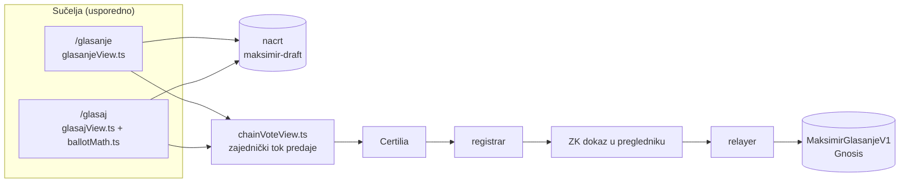

# Glasanje: više sučelja nad istim listićem (/glasaj)

Stanje: 2. 10. 2026. Na produkciji od 2. 10. 2026. (Worker verzija `3c3e3932`), s poveznicom s klasičnog `/glasanje`.

## Sažetak

`/glasaj` je drugo sučelje za glasanje, usporedno s klasičnim `/glasanje`. Glasač izabere
favorite redom, dobije prijedlog bodova koji može mijenjati, vidi pregled listića i predaje ga.
Ispod su isti backend, isti ugovor na Gnosisu i isti tok predaje. Klasično sučelje radi kao prije;
jedina vidljiva izmjena na njemu je red „Novo: Jednostavnije glasanje u 3 koraka →” iznad koraka.

| | `/glasanje` (klasično) | `/glasaj` (novo) |
|---|---|---|
| Kako se slaže listić | dodaj radove iz galerije, klizači i polja za bodove | favoriti redom (ili jedan po jedan: sviđa / ne sviđa), prijedlog bodova, gumbi − i + |
| Koliko odluka odjednom | sve na jednom ekranu (88 radova, listić, rezultati, dijeljenje) | jedna po ekranu, tri koraka |
| Redoslijed radova | abecedni / filtri | nasumičan po sesiji (nalaz O-5) |
| Rezultati uživo | na istoj stranici | ne prikazuju se dok se bira (poveznica na klasično) |
| Dijeljenje, potvrde, provjera | da | poveznica na klasično |
| Nacrt listića | `localStorage maksimir-draft` | isti ključ: prijelaz u oba smjera bez gubitka |
| Predaja | `chainVoteView.startFlow("cast", items)` | isto |

## Arhitektura

`chainVoteView.ts` je od početka odvojen od stranice sučeljem `Host` (crtanje, prijava, moj
listić, nacrt, poruke). Novo sučelje implementira svoj `Host` i poziva iste funkcije
(`initChain`, `startFlow`, `flowHtml`, `bindChain`, `receiptHtml`, `needsTransfer`,
`serverItems`). Ugovor, registrar, relayer i baza ne znaju koje je sučelje korišteno.

Četiri pravila iz [README-a prototipa](../prototipi/glasanje-ux/README.md) i kako su ispunjena:

1. **Ono što vidiš je ono što potpisuješ.** Ekran „Provjeri svoj listić” prikazuje točno objekt
   koji ide u `startFlow`. Test to provjerava usporedbom stanja pregleda i stanja toka.
2. **Varijanta se ne zapisuje na lanac.** Sučelje ne dodaje ništa u listić. Nema telemetrije.
3. **Sučelje mijenja rezultat, i to se mora reći.** Prijedlog je javna formula (Borda nad
   favoritima, raspodjela najvećim ostatkom, `web/src/ballotMath.ts`) i uvijek je samo nacrt.
4. **Izravan unos se ne skriva.** Svaki redak ima polje za bodove, a ekran načina vodi i na
   klasični listić.

## Tok za glasača

1. **Početak.** Ako se glas već broji: popis bodova, „Promijeni bodove”, „Izaberi ispočetka”,
   potvrda s lanca i povlačenje (isti blok kao na klasičnom). Ako glas iz faze 1 nije prenesen:
   „Prenesi glas na lanac”. Ako postoji nedovršen nacrt: „Nastavi gdje si stao/la”.
2. **Način.** „Izaberi svoje favorite” (do 10, redom) ili „Pogledaj radove jedan po jedan”
   (sviđa / ne sviđa, ↩ vraća zadnju odluku, „Dosta, idem dalje” nakon 10 radova).
3. **Bodovi.** Prijedlog po redoslijedu (npr. 5 favorita: 33 / 27 / 20 / 13 / 7), brzi izbori
   „Svima jednako” i „Sve prvom”, gumbi ±5 i polje za točan broj. Zbroj je stalno vidljiv;
   „Svedi na 100” razmjerno popravlja zbroj.
4. **Pregled.** Popis radova s bodovima, „Što slijedi” u tri reda, tehnički zapis listića
   (kanonski oblik `ŠIFRA:bodovi`). „Predaj glas” otvara zajednički tok.

U fazi 1 (bez lanca) predaja ide kroz klasični listić; nacrt je već ondje.

## Što je promijenjeno u postojećem kodu

| Datoteka | Izmjena |
|---|---|
| `web/src/glasanjeView.ts` | jedan red s poveznicom na `/glasaj` iznad koraka (`.gl-alt`) |
| `web/src/chainVoteView.ts` | testni hook `__chainVote` izlaže i `items` toka (javni podaci; ponašanje isto) |
| `web/src/app.ts` | ruta `glasaj`, stavka u navigaciji, puna širina |
| `web/src/meta.ts` | naslov, opis i OG za `/glasaj`; ruta ulazi u prerender i sitemap |
| `web/scripts/regression.mjs` | `/glasaj` se puni uživo, pa se ne uspoređuje s prerenderom (kao `/glasanje`) |
| `web/src/style.css` | nove klase `.gj-*`; postojeće nisu dirane |

Logika `glasanjeView.ts` (osim te poveznice), `glasanje.ts`, `chainVote.ts`, `chain/`, relayer i worker nisu mijenjani.

## Testovi

| Naredba | Što provjerava |
|---|---|
| `npm run test:glasanje` | `ballotMath.ts`: raspodjela, preseti za 1–88 favorita, validacija (ista pravila kao ugovor i baza), kanonski oblik, nasumičan redoslijed |
| `npm run test:paritet` | isti scenariji nad **oba** sučelja uz lažni backend: neprijavljen, bez ključa, prijenos iz faze 1, glas na lancu + povlačenje. U oba slučaja u tok mora ući isti listić i tok mora stati na istom koraku. Plus pet scenarija samo za `/glasaj` |
| `node scripts/glasanje-ui.mjs` | postojeći test klasičnog listića (nepromijenjen, prolazi) |
| `npm run check` | regresija cijelog sitea (138 ruta) |

`test:paritet` treba Vite (`npx vite --port 5173`). Lažni backend (`scripts/lib/glasanje-mock.mjs`)
presreće Supabase, GitHub i Gnosis RPC (`ballotOf`, `results`, `voters` kodirani kao ugovor), pa
ništa ne ide na produkciju. Paritetni scenariji prvo su napisani i pušteni samo nad klasičnim
sučeljem (commit `d2c7eb6`), a tek onda je dodano novo.

Provjera osjetljivosti testa: dvije namjerne greške u `glasajView.ts` (u tok ide prijedlog umjesto
listića s pregleda; prijenos šalje nacrt umjesto glasa iz faze 1) test je uhvatio, pa su vraćene.

Stanje 2. 10. 2026.: typecheck čist, `test:glasanje` 10/10, `test:relayer` 8/8, `glasanje-ui`
prolazi, `test:paritet` 72/72, `check` prolazi nad lokalnim workerom.

## Otvoreno

1. **Deploy (napravljeno 2. 10. 2026.).** `npm run check` nad produkcijom prije (137 ruta) i poslije
   (139 ruta) prošao. Read-only obilazak u Braveu: poveznica na `/glasanje` vidljiva, klik vodi na
   `/glasaj`, glas na lancu (revizija 4) prikazan jednako u oba sučelja, nacrt nije diran, konzola bez grešaka.
2. **Kako ljudi dolaze na `/glasaj`.** Poveznica s `/glasanje` i stavka u navigaciji. Nasumična dodjela
   sučelja (A/B/C iz [istraživanja](2026-09-30-glasanje-ux-istrazivanje.md)) nije uvedena: bez mjerenja
   ne bi ništa pokazala, a mjerenje traži odluku što se i gdje bilježi (pravilo 2: ništa na lancu,
   samo zbirno offchain) i unaprijed objavljena mjerila.
3. **Ostale varijante iz prototipa** (dvoboj, MaxDiff, žetoni) mogu se dodati na isti način:
   novi ekran izbora koji puni `st.picks` ili `st.items`, ostalo je zajedničko.
4. **Swipe:** drugi prolaz kroz odbijene radove (protiv pada prihvaćanja kroz niz) nije napravljen.
5. **Slijepi mod** (imena timova skrivena dok se bira) iz prototipa nije prenesen, radi
   jednostavnosti. Ako se uvede, treba biti isti u svim sučeljima.

## Vezani dokumenti

- [Istraživanje UX obrazaca](2026-09-30-glasanje-ux-istrazivanje.md)
- [Prototipi i pravila za više sučelja](../prototipi/glasanje-ux/README.md)
- [Glasanje na lancu: integracija s fazom 1](blockchain/08-integracija-s-fazom-1.md)
