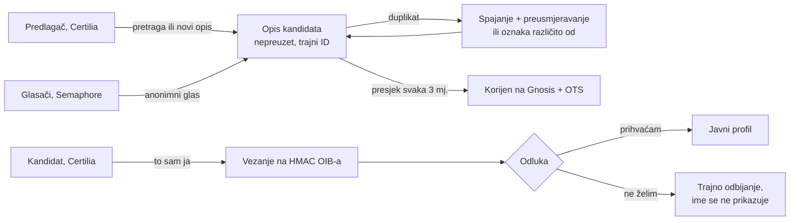

# „Složi svoj sabor”: skica sustava i usporedba sa sličnim sustavima

Ideja od 2. i 3. 10. 2026. Ništa još nije implementirano; ovo je skica i istraživanje.
Ideja je odvojeni projekt koji bi preuzeo infrastrukturu glasanja za stadion
(Certilia, lanac hasheva + OTS, Semaphore, Gnosis).

## Ideja

Svaki građanin s Certilia prijavom predlaže popis ljudi koje smatra idealnima za
Sabor. Predloženi se **ne moraju unaprijed prijaviti**. Drugi mogu glasati za istu,
jedinstveno određenu osobu. Nakon presjeka (npr. svaka 3 mjeseca) predloženi se
prijavi Certilijom i kaže „prihvaćam, bit ću vaš predstavnik” ili „ne želim”. Cilj je
da društvo filtrira najbolje ljude, umjesto da bira samo između onih koji se sami nameću.

## Glavni problem: jedinstvenost osobe koja se nije prijavila

Jedini pouzdan jedinstveni ključ je OIB, ali ga predlagači ne znaju, a **hash OIB-a
ne štiti** (oko 10¹⁰ mogućnosti, pogodi se brute forceom). Zato su potrebna dva sloja:

- **Sloj A, opis kandidata (nepreuzet zapis).** Sadrži ime, grad, zanimanje, godinu
  rođenja i javnu poveznicu (Wikidata, sabor.hr, sudski registar, članak). Nastaje
  odmah. Drugi predlagači biraju postojeći zapis kroz pretragu i prijedloge, a
  duplikate spaja moderacija ili zajednica.
- **Sloj B, vezanje.** Kandidat se prijavi Certilijom i potvrdi „to sam ja”. Zapis se
  veže uz `HMAC(tajni_papar, OIB)`, a OIB se ne sprema. Svi duplikati koje kandidat
  preuzme spajaju se, a glasač koji je glasao za više duplikata broji se jednom
  (nullifier). Preuzimanje se može osporiti u određenom roku.

## Usporedba sa sličnim sustavima (istraživanje 3. 10. 2026.)

Nijedan pregledani sustav ne rješava jedinstvenost kriptografski pri predlaganju.
Svi koriste isti recept: sidro na postojeći javni identifikator gdje postoji,
spajanje koje ljudi pregledavaju, i konačno vezanje tek kad se osoba sama javi.

| Sustav | Što rješava | Što preuzimamo |
|---|---|---|
| [Scopus Author ID](https://casrai.org/guides/how-to-create-a-scopus-author-id) | profil autora nastaje automatski; duplikati česti; autor traži spajanje, Elsevier ga ručno pregleda (tjednima) | nepreuzet zapis + spajanje pri preuzimanju |
| [Wikidata Help:Merge](https://www.wikidata.org/wiki/Help:Merge) | spojeni zapis postaje trajno preusmjeravanje; P1889 „različito od” sprječava spajanje različitih osoba istog imena | trajni ID, preusmjeravanje, oznaka „različito od” |
| [Drips](https://docs.drips.network/claim-your-repository/) | novac ide nepreuzetom GitHub repou; vlasnik ga preuzima preko `FUNDING.json`, provjerava ugovor | sidro na postojeći jedinstveni identifikator (za privatne osobe u RH ga nema) |
| [Brave Rewards](https://community.brave.app/t/are-unclaimed-contributions-to-unverified-creators-returned/401736) | napojnica neprovjerenom autoru čeka 90 dana, zatim se vraća | glasovi za neodazvanog kandidata se oslobađaju nakon N mjeseci |
| [UK honours](https://commonslibrary.parliament.uk/research-briefings/cbp-10718/) | bilo tko predlaže bilo koga; prije objave se pita prihvaća li; oko 25 po krugu odbije i nikad nisu objavljeni | privatne osobe se ne objavljuju dok ne prihvate (rješava GDPR) |
| [Brand New Congress](https://en.wikipedia.org/wiki/Brand_New_Congress) (SAD, 2016) | tisuće prijedloga preko web obrasca; [Ocasio-Cortez je predložio brat](https://www.huffpost.com/entry/justice-democrats-alexandria-ocasio-cortez_n_5cc345f1e4b0fd8e35bc2226); duplikati i provjera ručno | dokaz da politički model radi; jedinstvenost su rješavali ljudi |
| [Švicarske općine](https://www.swissinfo.ch/eng/compulsory-service_tapped-for-public-office-but-unwilling-to-serve/42414478) | izabran i tko se nije kandidirao (Bauen 2008.); u 7 kantona obveza prihvaćanja (*Amtszwang*); jedinstvenost daje registar stanovnika | identitet za vezanje daje državni registar, kod nas Certilia |
| [Aljaska 2010., Murkowski](https://law.justia.com/cases/alaska/supreme-court/2010/s-14112-1.html) | upisana imena s greškama; sud: vrijedi namjera birača ako je prepoznatljiva | prijedlozi kod upisa + spajanje varijanti imena |

**Zaključak:** jedinstvenost se ne rješava pri predlaganju, nego pri preuzimanju. Do
tada je „najbolji pokušaj”. Naša prednost je Certilia: imamo državno potvrđen
identitet za zadnji korak.

Bez gotovog uzora, dakle naš doprinos:
- anonimno spajanje glasova pri spajanju duplikata (Semaphore nullifier);
- glasovi za privatnu osobu koja još nije pristala, a ne smiju biti javni.

## Rizici

- **GDPR, predloženi:** objava imena privatne osobe s brojem glasova bez pristanka.
  Zato se javne osobe (s javnom poveznicom) prikazuju odmah, a privatne tek nakon
  prihvaćanja (uzor UK honours). Imena nikad ne idu na lanac, samo ID-ovi i korijeni,
  da se mogu obrisati.
- **GDPR, glasači:** političko mišljenje je posebna kategorija (čl. 9). Glas ne smije
  biti vezan uz OIB, nego ide preko Semaphorea.
- **Kupovina glasova i prisila:** ozbiljnije nego kod stadiona. „Vrijedi zadnja
  verzija” nije dovoljno; pravo rješenje je MACI (promjena ključa). To je jedini
  stvarno nov kriptografski dio.
- **Pogrešan Pero preuzme tuđu popularnost:** rok za osporavanje, provjera datuma
  rođenja protiv javnih izvora, javni zapis preuzimanja u lancu hasheva.
- **Pravna veza s izborima:** platforma je građanski signal. Kandidatura ide preko
  liste grupe birača i službenih potpisa; broj potpisa i smiju li biti elektronički
  treba pravno provjeriti.

## Predloženi redoslijed

1. MVP: samo javne osobe s javnom poveznicom, glasanje odobravanjem, preuzimanje i odbijanje.
2. Privatne osobe uz skriveni prikaz do prihvaćanja, spajanje duplikata, kvartalni presjeci na Gnosisu.
3. Izborne jedinice (Certilia vjerojatno ne daje prebivalište, pa u početku samodeklaracija).
4. MACI, prije nego rezultat počne nešto stvarno značiti.

Prije koda: pravno mišljenje o GDPR-u (prikaz predloženih i obrada političkog mišljenja).

## Otvoreno

- Gdje projekt živi (novi repo ili poddomena) i ime.
- Daje li Certilia prebivalište ili samo identitet.
- Broj potpisa za listu grupe birača i jesu li elektronički potpisi valjani.
- Pravila moderacije spajanja duplikata prije nego kandidat preuzme profil.

## Vezani dokumenti

- [`../research/10-javnost-ankete-i-slicni-projekti.md`](../research/10-javnost-ankete-i-slicni-projekti.md): slični projekti za stadion
