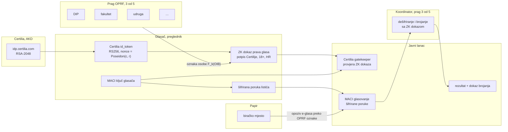
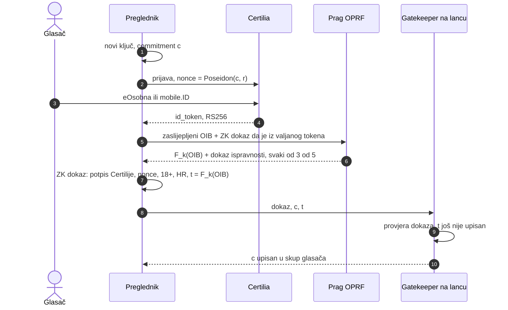
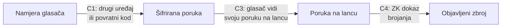
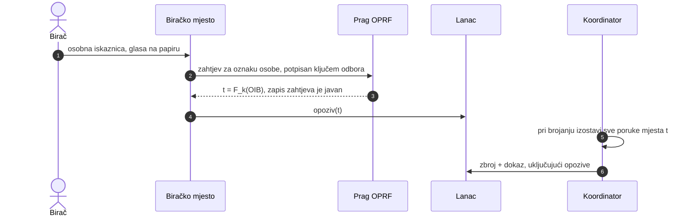
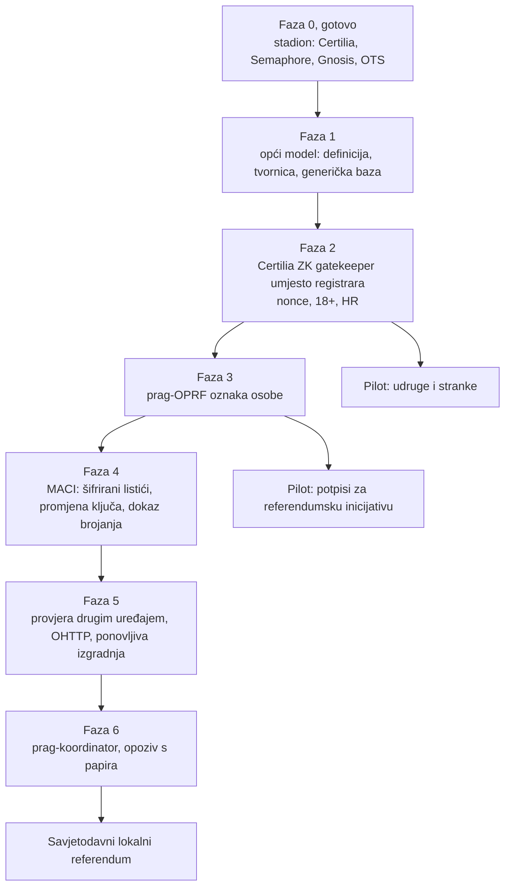

# Opći model glasovanja: od stadiona do eReferenduma

**Datum:** 8. 10. 2026.\
**Stanje:** analiza i ciljna arhitektura. Ništa od ovoga još nije implementirano.

Ovaj dokument odgovara na pitanje može li sustav glasanja za stadion Maksimir (Certilia, Postgres,
lanac hasheva, OpenTimestamps, Semaphore, Gnosis Chain) postati temelj za bilo koje glasovanje: od
udruge i stranke do državnog eReferenduma.

**Zaključak:** može. Arhitektura je ispravna, a svaki poznati problem ima kriptografsko ili
protokolarno rješenje koje već radi negdje u svijetu. Ukupno je 31 problem u četiri skupine.
Ključna promjena je jedna:
**naš registrar treba zamijeniti ZK dokazom Certilijinog potpisa.** Tada lanac sam provjerava da
iza svakog glasača stoji prava Certilia prijava, i operater više ne može upisati nijednog glasača.
Ostatak je nadogradnja tajnosti (šifrirani listići, MACI) i spoj s glasanjem na papir.

Provjereno 8. 10. 2026. iz javnog
[discovery dokumenta](https://idp.certilia.com/oauth2/oidcdiscovery/.well-known/openid-configuration)
i [JWKS-a](https://idp.certilia.com/oauth2/jwks): Certilia potpisuje `id_token` algoritmom
**RS256 (RSA-2048)** i nudi claimove `birthdate`, `documentType`, `documentIssuingCountry`,
`documentExpirationDate` i `address`. To je isti oblik potpisa koji već dokazuju
[Anon Aadhaar](https://github.com/anon-aadhaar/anon-aadhaar) (indijska državna osobna, RSA-2048)
i [zkLogin](https://docs.sui.io/concepts/cryptography/zklogin) (OIDC JWT, RS256).

## Sadržaj

1. [Sažetak: svi problemi na jednom mjestu](#1-sažetak-svi-problemi-na-jednom-mjestu)
2. [Što već imamo](#2-što-već-imamo)
3. [Opći model: pet osi glasovanja](#3-opći-model-pet-osi-glasovanja)
4. [Ciljna arhitektura](#4-ciljna-arhitektura)
5. [A. Identitet i pravo glasa](#a-identitet-i-pravo-glasa)
6. [B. Tajnost, prisila i kupovina glasova](#b-tajnost-prisila-i-kupovina-glasova)
7. [C. Integritet i provjerljivost](#c-integritet-i-provjerljivost)
8. [D. Papir, zakon i povjerenje](#d-papir-zakon-i-povjerenje)
9. [Što rješava matematika, a što organizacija](#9-što-rješava-matematika-a-što-organizacija)
10. [Plan po fazama](#10-plan-po-fazama)
11. [Otvorena pitanja za provjeru](#11-otvorena-pitanja-za-provjeru)
12. [Izvori](#12-izvori)

## 1. Sažetak: svi problemi na jednom mjestu

Oznake u stupcu „Danas” odnose se na `MaksimirGlasanjeV1` na Gnosisu.

| # | Problem | Danas | Rješenje |
|---|---|---|---|
| **A1** | Operater (registrar) može upisati izmišljene glasače | otvoreno | ZK dokaz Certilijinog RS256 potpisa u pregledniku; ugovor provjerava Certiliju, ne nas |
| **A2** | Operater zna koji je glasač upisao koji commitment | otvoreno | isto: commitment nastaje u pregledniku, ugovor vidi samo dokaz |
| **A3** | Jedinstvenost osobe bez OIB-a na lancu (OIB se pogađa brute forceom) | rješava HMAC na serveru | prag-OPRF: oznaka osobe `F_k(OIB)`, ključ podijeljen na 3 od 5 neovisnih institucija |
| **A4** | Punoljetnost | ne provjerava se | `birthdate` u dokazu, usporedba s datumom glasovanja; otkriva se samo „18+” |
| **A5** | Državljanstvo (OIB i Certiliju imaju i stranci) | ne provjerava se | `documentType` / `documentIssuingCountry` u dokazu; inače vjerodajnica registra birača |
| **A6** | Prebivalište za lokalne referendume | ne provjerava se | potpisana vjerodajnica iz registra birača (DIP), dokazana istim ZK obrascem |
| **A7** | Izgubljen ključ, novi uređaj | ponovni upis s 24 riječi | nova Certilia prijava daje istu oznaku osobe; stari ključ se opoziva (MACI promjena ključa) |
| **A8** | Certilia ne radi ili joj je ključ kompromitiran | — | višednevno glasanje, papir kao zamjena, javni brojač upisa uz gornju granicu iz registra birača, samoprovjera „je li moj OIB upisan” |
| **A9** | Naš proxy vidi `id_token` s osobnim podacima | da | `nonce = Poseidon(commitment, r)` veže token uz glasačev ključ, a sol `r` skriva commitment; zaseban OIDC klijent; proxy vodi država ili je auditiran |
| **B1** | Listić je na lancu u čitljivom obliku, a glasač zna svoj nullifier, pa ima potvrdu za kupca | **da, V1** | šifrirani listići (MACI ili prag-ElGamal); na lancu nema sadržaja po glasaču |
| **B2** | Međurezultati utječu na glasače | uživo javni | zbroj se dešifrira tek nakon zatvaranja, s dokazom točnosti |
| **B3** | Prisila kod kuće (netko stoji iza glasača) | mijenjanje glasa | ponovno glasanje koje se ne vidi izvana + papir poništava e-glas (estonski model) |
| **B4** | Prodaja ključa kupcu | kupac i glasač dijele ključ | MACI tajna promjena ključa: kupac ne može znati vrijedi li ključ koji ima |
| **B5** | Kriptografski dokaz sadržaja glasa (javno dijeljenje) | postoji | u referendumskom načinu samo „glasao sam”; sadržaj ostaje izjava, kao fotografija listića |
| **B6** | IP adresa i vrijeme predaje otkrivaju glasača | relayer vidi IP | Oblivious HTTP (relay i gateway kod različitih operatera), skupna predaja |
| **B7** | Mali anonimni skup | upozorenje na stranici | minimalna veličina grupe prije otvaranja; s MACI-jem tajnost ne ovisi o veličini skupa |
| **B8** | Tko je glasao (odaziv po osobi) | operater zna | oznaka osobe na lancu je OPRF vrijednost, nepovezana s OIB-om bez praga institucija |
| **C1** | Zaraženo računalo mijenja glas (cast-as-intended) | — | provjera drugim uređajem (estonski model) ili povratni kodovi na papiru (švicarski model) |
| **C2** | Zlonamjeran web kôd koji poslužuje operater | — | otvoren kôd, ponovljiva izgradnja, objavljen hash, neovisni klijenti |
| **C3** | Relayer ne preda listić (recorded-as-cast) | svatko može predati | više relayera, glasač provjerava svoj listić na lancu, predaja vlastitim novčanikom |
| **C4** | Točnost zbroja (counted-as-recorded) | zbroj u ugovoru | ZK dokaz ispravnog brojanja (MACI) ili dokaz dešifriranja; provjerava bilo tko |
| **C5** | Greške u ugovoru | audit, mutacije, fuzz | uz to formalna verifikacija, bug bounty, javni test napada, paralelni pilot |
| **C6** | Trusted setup ZK kruga | PSE ceremonija | nacionalna ceremonija (dovoljan 1 pošten od N) ili sustav bez posebne ceremonije (PLONK/UltraHonk) |
| **C7** | Rizici lanca (cenzura, reorganizacija, dostupnost) | Gnosis + OTS | više sidara (Gnosis, Bitcoin OTS, Ethereum), puna kopija podataka, rok s rezervom |
| **C8** | Kvantna računala | — | ZK dokazi su savršeno skrivajući; šifrirani listići se brišu nakon brojanja ili koriste postkvantnu shemu |
| **D1** | Papir poništava e-glas | — | izborni odbor preko praga OPRF-a izračuna oznaku osobe i opozove njezin e-glas |
| **D2** | GDPR (političko mišljenje, čl. 9) | ništa osobno na lancu | isto + DPIA, pravna osnova u zakonu, brisanje izvan lanca |
| **D3** | Zakon i certifikacija | neslužbeno | pilot → izmjena zakona → certifikacija prema CM/Rec(2017)5 i švicarskom VEleS-u |
| **D4** | Povjerenje i razumljivost javnosti | dokumentacija, skripte | neovisni provjeravatelji (stranke, fakulteti, novinari) pokreću provjeru sami |
| **D5** | Sustav je vezan uz stadion (`88`, `100`) | da | definicija glasovanja s pet osi, generički ugovor i shema baze |
| **D6** | Dostupnost (starije osobe, bez Certilije) | — | papir ostaje ravnopravan kanal |

## 2. Što već imamo

| Dio | Gdje | Što daje općem modelu |
|---|---|---|
| Certilia/eOsobna prijava | [`glasanje-kako-radi`, korak 1–2](glasanje-kako-radi.md#korak-1-prijava-eosobnom) | državno potvrđen identitet |
| HMAC OIB-a, šifriran OIB | edge funkcija `certilia` u `domovina-api` | jedna osoba = jedan glasač bez OIB-a u bazi |
| Semaphore ključ u pregledniku | [`06-kontrola-glasaca`](blockchain/06-kontrola-glasaca.md) | odvajanje identiteta od glasa |
| Ugovor bez nadogradnje i pauze, vlasnik Safe 2/3 | [`MaksimirGlasanjeV1.sol`](../chain/contracts/v1/MaksimirGlasanjeV1.sol) | ni vlasnik ne dira listiće |
| Relayer bez ovlasti | [`02-relayer-i-gas`](blockchain/02-relayer-i-gas.md) | glasač ne treba novčanik |
| Lanac hasheva + OTS u Bitcoinu | [`glasanje/README.md`](../glasanje/README.md) | provjerljiv zapis izvan lanca |
| Migracija V1 → V2 nullifierom | [`07-verzioniranje`](blockchain/07-verzioniranje.md) | nadogradnja bez gubitka glasova |
| Audit, mutacijski i fuzz testovi, neovisni review | [`review/`](review/README.md) | proces koji certifikacija traži |

## 3. Opći model: pet osi glasovanja

Svako glasovanje opisuje se istom definicijom. Stadion je samo jedna točka u tom prostoru.

| Os | Mogućnosti | Stadion | Državni referendum |
|---|---|---|---|
| **Biračko tijelo** | svi s Certilijom / 18+ državljani / prebivalište u jedinici / popis članova (stranka, udruga) | svi s Certilijom | 18+ državljani RH |
| **Vrsta listića** | DA/NE, jedan od N, odobravanje, raspodjela bodova, rangiranje, većinska prosudba | 100 bodova na 88 radova | DA/NE po pitanju, više pitanja |
| **Vrijeme** | početak, kraj, smije li se mijenjati, presjeci | do 31. 12. 2027., mijenja se | npr. 7 dana e-glasanja + dan papira |
| **Tajnost** | javno s imenom / pseudonim / anonimno prema javnosti / tajno i prema operateru | anonimno prema javnosti | tajno prema svima, bez potvrde za kupca |
| **Brojanje** | zbroj, kvorum, većina, prag, raspodjela mandata | zbroj bodova | većina izašlih (i kvorum ako ga zakon traži) |

Definicija je javni dokument čiji hash ide u ugovor pri stvaranju glasovanja, pa se pravila ne
mogu tiho promijeniti:

```json
{
  "id": "rh-referendum-2028-01",
  "naslov": "Državni referendum o …",
  "biracko_tijelo": { "izvor": "certilia", "dob_min": 18, "drzavljanstvo": "HR" },
  "listic": { "vrsta": "da_ne", "pitanja": 1 },
  "vrijeme": { "od": "2028-03-01T07:00+01:00", "do": "2028-03-07T19:00+01:00", "mijenjanje": true },
  "tajnost": { "razina": "tajno_prema_operateru", "dokaz_sadrzaja": false },
  "brojanje": { "pravilo": "vecina_izaslih", "kvorum": null },
  "papir": { "ponistava_e_glas": true, "dan": "2028-03-08" },
  "kljucevi": { "oprf_prag": "3/5", "koordinator_prag": "3/5" }
}
```

Generički ugovor nastaje iz tvornice (*factory*): jedan poziv po glasovanju, s hashem definicije,
vrstom listića kao zasebnim modulom za provjeru i vlastitim scopeom za nullifier. Baza dobiva
tablice bez prefiksa `maksimir_` i stupac `election_id` u svakoj. To rješava **D5**.

## 4. Ciljna arhitektura



Tri promjene u odnosu na V1:

1. **Upis bez registrara.** Ugovor provjerava ZK dokaz da glasač ima valjan Certilijin token.
2. **Šifrirani listići.** Na lancu su samo šifrirane poruke; zbroj objavljuje koordinator s dokazom.
3. **Opoziv s biračkog mjesta.** Papir poništava e-glas bez otkrivanja sadržaja.

---

## A. Identitet i pravo glasa

### A1. Operater može upisati izmišljene glasače

**Problem.** Certilia jest pravi registar: bez prijave nema glasača. Ali lanac danas ne vidi
Certilijin potpis. `register()` u V1 provjerava samo EIP-712 potpis **našeg** registrara:

```solidity
address signer = ECDSA.recover(digest, signature);
if (signer != registrar) revert NotRegistrar(signer);
```

Tko ima ključ registrara, može potpisati 10.000 commitmenta bez ijedne prijave. Takve glasove nije
moguće naknadno preskočiti, jer su zbog anonimnosti neodvojivi od pravih.

**Rješenje: ZK dokaz Certilijinog potpisa.** Glasač u pregledniku dokazuje:

> „Imam JWT koji je potpisala Certilia ključem `n` (RSA-2048), `aud` je naša aplikacija, token je
> svjež, `nonce` je `Poseidon(commitment, r)` s mojom tajnom soli `r`, a iz `sub` (OIB) slijedi
> oznaka osobe `t`.”

Javni ulazi dokaza: Certilijin javni ključ, `aud`, trenutak, commitment, oznaka `t`, bitovi
„18+” i „HR”. Tajni ulazi: cijeli token i potpis. Ugovor (*gatekeeper*) provjerava dokaz i upisuje
commitment samo ako `t` još nije upisan.



**Zašto to radi.** RSA potpis ne može krivotvoriti nitko osim Certilije. Bez prave prijave nema
tokena, bez tokena nema dokaza, a bez dokaza nema upisa. To je točno tvrdnja „svaki listić mora imati
Certilia login”, ali je sad provjerava ugovor, a ne operater.

**Izvedivost.** Isti krug postoji: Anon Aadhaar dokazuje RSA-2048 + SHA-256 nad državnim QR-om u
pregledniku, zkLogin dokazuje RS256 JWT s ugniježđenim `nonce`om, a za Noir postoji biblioteka
`noir-jwt`. Vrijeme izrade dokaza u pregledniku je reda veličine desetak sekundi; treba izmjeriti na
našem tokenu. MACI već ima gatekeepere za Anon Aadhaar i Semaphore, pa je Certilia gatekeeper isti
oblik.

**Što ostaje.** Promjena Certilijinog ključa (rotacija JWKS-a) mora doći na lanac. Upisuje je
vlasnik (Safe) uz vremensku odgodu, a svaku promjenu svatko može usporediti s javnim JWKS-om.

### A2. Operater zna vezu glasač → commitment

**Problem.** U V1 upis ide kroz prijavljenu sesiju, pa operater zna koji je OIB upisao koji
commitment.

**Rješenje.** Isto kao A1. Commitment nastaje u pregledniku, a dokaz ide na lanac preko relayera ili
vlastitog novčanika. Operater ne sudjeluje u upisu, pa vezu nema odakle znati.

### A3. Jedinstvenost bez OIB-a na lancu

**Problem.** Oznaka osobe mora biti ista pri svakoj prijavi (inače se može upisati dvaput), ali se
iz nje ne smije moći doći do OIB-a. `H(OIB)` ne štiti, jer OIB ima oko 10¹⁰ vrijednosti i pogađa se
brute forceom za nekoliko minuta.

**Rješenje: prag-OPRF.** Oznaka je `t = F_k(OIB)`, gdje je `F` pseudoslučajna funkcija s tajnim
ključem `k`. Ključ je podijeljen (Shamir) na pet institucija, a za izračun trebaju bilo koje tri.
Preglednik šalje **zaslijepljen** OIB uz ZK dokaz da je to OIB iz valjanog tokena. Institucije ne
vide OIB, a svaka vraća dokaz da je ispravno računala (DLEQ). Isti obrazac koristi zkLogin
(*salt service*) i Privacy Pass.

**Zašto to radi.** Bez ključa `k` nitko ne može izračunati `t` iz OIB-a. Jedinstvenost je
matematička (ista osoba uvijek dobije isti `t`), a privatnost traži da se ne udruže tri od pet
institucija.

**Što ostaje.** Kad bi se tri institucije udružile, mogle bi povezati `t` s osobom, i to bi
otkrilo **tko je glasao, ali ne kako**. Sadržaj glasa štiti B1.

### A4. Punoljetnost

**Problem.** Pravo glasa ima svaka punoljetna osoba.

**Rješenje.** `birthdate` je u potpisanom tokenu. Krug provjerava `birthdate + 18 godina ≤ datum
glasovanja` i otkriva samo bit „18+”, ne datum. Datum glasovanja je javni ulaz iz definicije.

### A5. Državljanstvo

**Problem.** OIB i Certiliju imaju i stranci, a za državni referendum glasaju državljani.

**Rješenje.** Certilia nudi `documentType` i `documentIssuingCountry`. Ako se iz njih razlikuje
osobna iskaznica državljanina od dozvole boravka, krug to provjerava kao A4. Ako ne, državljanstvo
dolazi iz vjerodajnice registra birača (A6).

### A6. Prebivalište za lokalne referendume

**Problem.** Lokalni referendum traži prebivalište u jedinici. Certilia nudi `address`, ali treba
provjeriti dolazi li iz službene evidencije.

**Rješenje.** DIP ili MUP izdaje potpisanu vjerodajnicu „upisan u popis birača jedinice X” (npr.
kroz EUDI novčanik). Glasač je dokazuje istim ZK obrascem kao Certilijin token. Ista vjerodajnica
pokriva i posebne slučajeve iz Zakona o registru birača.

### A7. Izgubljen ključ, novi uređaj

**Problem.** Ključ je u pregledniku. Novi ključ ne smije dati drugi glas.

**Rješenje.** Nova Certilia prijava daje isti `t`. Gatekeeper tada ne upisuje drugog glasača, nego
šalje MACI poruku promjene ključa za postojeće mjesto. Vrijedi samo zadnji ključ, pa stari listić i
novi ne mogu oba biti brojani.

### A8. Certilia ne radi ili je kompromitirana

**Problem.** Certilia je jedan izvor istine. To nije novo: isti AKD izdaje osobne iskaznice s kojima
se glasa na biračkom mjestu. Razlika je u razmjeru: krivotvorena iskaznica daje jedan glas pred
odborom s promatračima, a ukraden potpisni ključ dao bi tisuće tihih glasova.

**Rješenje.**
- **Dostupnost:** e-glasanje traje nekoliko dana, a papir ostaje.
- **Gornja granica:** broj upisanih po definiciji ne smije prijeći broj birača iz registra, i to se
  vidi uživo na lancu.
- **Samoprovjera:** svaki građanin se prijavi i vidi je li njegov `t` upisan. Ako jest, a on nije
  glasao, to je dokaz krađe identiteta, i papir ga poništava (D1).
- **Anomalije:** javni brojač upisa po satu otkriva nagle skokove.

### A9. Proxy vidi token

**Problem.** Certilia za razmjenu koda traži client secret, pa token prolazi kroz naš proxy. Uz to,
JavaScript prijave poslužuje operater, pa bi pri prijavi mogao podmetnuti svoj commitment.

**Rješenje.**
- `nonce = Poseidon(commitment, r)` veže token uz glasačev ključ, pa ga proxy ne može iskoristiti
  za drugi commitment. Tajna sol `r` je privatni ulaz dokaza, pa Certilia i proxy iz `nonce` ne
  saznaju commitment (inače bi znali vezu OIB → commitment, nalaz F-01).
- Zaseban OIDC klijent samo za glasanje, pa token s drugih prijava na domovina.ai ne vrijedi.
- Ponovljiva izgradnja s objavljenim hashem (C2), a glasač iz neovisnog klijenta odmah vidi svoj
  commitment na lancu.
- Osobne podatke iz tokena proxy i dalje vidi. Za državnu razinu proxy vodi DIP, a kôd mu je
  otvoren i auditiran; ako Certilia dopusti javnog PKCE klijenta, proxy nije potreban.

---

## B. Tajnost, prisila i kupovina glasova

### B1. Listić je na lancu u čitljivom obliku

**Problem.** V1 objavljuje `BallotCast(nullifier, revision, points, …)`. Glasač može izračunati
svoj nullifier iz ključa i pokazati kupcu: „ovo je moj listić, zadnja revizija”. To je potvrda za
kupca jača od fotografije, jer je matematička.

**Rješenje: MACI.** Glasač šalje šifriranu poruku javnim ključem koordinatora. Na lancu se ne vidi
ni sadržaj ni čije je mjesto promijenjeno. Koordinator nakon zatvaranja obrađuje poruke i objavljuje
zbroj sa ZK dokazom da je obrada točna.

**Prag-koordinator.** U osnovnom MACI-ju koordinator vidi glasove. Zbroj ne može lažirati (dokaz),
ali bi mogao vidjeti tko je kako glasao. Ključ koordinatora zato se dijeli na 3 od 5 institucija
(distribuirano generiranje ključa), kao kod *guardiana* u ElectionGuardu. Za jednostavne listiće
(DA/NE, jedan od N) homomorfni prag-ElGamal je zreo; za MACI s prag-koordinatorom treba pratiti
istraživanje PSE-a.

### B2. Međurezultati

**Problem.** Rezultat uživo utječe na one koji još nisu glasali.

**Rješenje.** Posljedica B1: dok se ne dešifrira, nitko ne zna zbroj. Vidi se samo broj upisanih i
broj poruka.

### B3. Prisila kod kuće

**Problem.** Na biračkom mjestu kabina štiti od toga da netko gleda. Kod kuće kabine nema.

**Rješenje: ponovno glasanje koje se ne vidi izvana.** Glasač kasnije glasa ponovno, a broji se
zadnji glas. U MACI-ju je ponovno glasanje šifrirana poruka, pa onaj koji je prisiljavao ne može
znati je li glasač kasnije promijenio glas. Na dan papirnatog glasanja papir poništava e-glas (D1).
Estonija tako radi od 2005. Na parlamentarnim izborima 2023. preko interneta je glasalo 313.514 od
613.801 birača (51 %). Njih 10.787 glasalo je ponovno preko interneta, a 1.332 e-glasa poništeno je
papirom ([statistika izbornog povjerenstva](https://www.valimised.ee/en/archive/statistics-about-internet-voting-estonia)).
Mehanizam se dakle stvarno koristi.

**Zašto je to dovoljno.** Napadač bi morao nadzirati glasača cijelo vrijeme do zatvaranja, uključujući
dan papira. To je skuplje od kupovine glasa na papiru.

### B4. Prodaja ključa

**Problem.** Glasač preda ključ kupcu, a kupac glasa umjesto njega.

**Rješenje: MACI promjena ključa.** Glasač prije prodaje tajno promijeni ključ porukom potpisanom
starim ključem. Kupac dobije ključ koji izgleda valjan, ali više ništa ne vrijedi, i to ne može
provjeriti. Kupnja ključa tako postaje bezvrijedna.

### B5. Javno dijeljenje glasa

**Problem.** Na papiru glasač može uslikati listić i objaviti ga, i to nitko ne brani. Sliku ipak
nitko ne može provjeriti: listić je mogao biti poništen ili zamijenjen. Kriptografski dokaz sadržaja
bio bi provjerljiva potvrda za kupca.

**Rješenje.** U referendumskom načinu (`dokaz_sadrzaja: false`) sustav nudi samo dokaz „glasao sam”.
Glasač i dalje smije reći ili uslikati kako je glasao, ali to ostaje izjava, kao fotografija listića.
Za ankete i udruge (`dokaz_sadrzaja: true`) javno dijeljenje ostaje kao danas.

### B6. IP adresa i vrijeme predaje

**Problem.** Relayer vidi IP adresu i točno vrijeme, što uz druge podatke može otkriti glasača.

**Rješenje.** Oblivious HTTP: posrednik vidi IP, ali ne sadržaj; gateway vidi sadržaj, ali ne IP.
Vode ih različiti operateri (Cloudflare Privacy Gateway radi točno to). Relayer predaje poruke
skupno, ne odmah, pa vrijeme na lancu ne odgovara vremenu klika.

### B7. Mali anonimni skup

**Problem.** Semaphore dokaz skriva glasača među članovima grupe. S 10 članova to je slaba zaštita.

**Rješenje.** Definicija glasovanja traži minimalnu veličinu grupe prije otvaranja. S MACI-jem
tajnost listića ne ovisi o veličini skupa, jer je listić šifriran.

### B8. Tko je glasao

**Problem.** Na papiru odbor vidi tko je glasao, ali to nije javno.

**Rješenje.** Na lancu je samo `t = F_k(OIB)`, a bez praga institucija nije povezan s osobom (A3).
Broj glasača je javan, a popis osoba nije.

---

## C. Integritet i provjerljivost

Standard e-glasanja traži tri provjere. Glas je zabilježen kako je glasač htio (*cast as intended*),
zabilježen je kako je predan (*recorded as cast*) i izbrojen kako je zabilježen (*counted as
recorded*).



### C1. Zaraženo računalo

**Problem.** Zlonamjeran softver na računalu glasača može predati drukčiji glas nego što piše na
ekranu.

**Rješenje, dvije provjerene sheme.**
- **Estonski model.** Nakon glasanja ekran pokaže QR kod. Glasač ga skenira drugim uređajem
  (mobitel), koji s lanca dohvati šifriranu poruku i pokaže za što je glasano. Zaraza bi morala biti
  na oba uređaja istodobno.
- **Švicarski model (Swiss Post).** Glasač poštom dobije karticu s povratnim kodom za svaku opciju.
  Nakon glasanja sustav pokaže kod, a glasač ga usporedi s karticom. Zaraženo računalo ne zna
  kodove.

Uz to: ako provjera ne prođe, glasač glasa ponovno ili na papiru (B3).

### C2. Zlonamjeran web kôd

**Problem.** Aplikaciju poslužuje operater, pa bi mogao poslužiti izmijenjenu verziju.

**Rješenje.** Otvoren kôd, ponovljiva izgradnja (isti izvor daje isti hash), hash izdanja objavljen
na lancu i u definiciji glasovanja, i neovisni klijenti koje mogu izdati stranke ili fakulteti.
Provjera drugim uređajem (C1) otkriva i lošu aplikaciju.

### C3. Relayer ne preda listić

**Problem.** Relayer bi mogao tiho odbaciti poruke.

**Rješenje.** Već danas relayer nema ovlasti i paket može predati bilo tko. Uz to: više relayera,
preglednik nakon predaje provjerava da je poruka na lancu, a ako nije, šalje je drugom relayeru ili
preko vlastitog novčanika.

### C4. Točnost zbroja

**Problem.** Ako su listići šifrirani, zbroj više ne računa ugovor javno.

**Rješenje.** Koordinator objavljuje zbroj sa ZK dokazom da je to točno zbroj zadnjih valjanih
poruka svih upisanih. Bilo tko provjerava dokaz na lancu ili lokalno, kao danas
`scripts/maksimir_verify.py`. Koordinator može samo odbiti objaviti zbroj, a to rješava prag
(bilo koje 3 od 5 institucija mogu dovršiti brojanje).

### C5. Greške u ugovoru

**Problem.** Greška u ugovoru bez nadogradnje ne može se popraviti.

**Rješenje.** Uz postojeći audit, mutacijske i fuzz testove: formalna verifikacija pravila brojanja,
javni bug bounty, javni test napada (kakav radi Švicarska), pilot na testnoj mreži i pilot s
paralelnim papirnatim brojanjem. Migracija nullifierom (`07-verzioniranje`) već omogućuje prelazak
na ispravljenu verziju bez gubitka glasova.

### C6. Trusted setup

**Problem.** Groth16 traži ceremoniju po krugu. Ako su svi sudionici ceremonije nepošteni, mogli bi
krivotvoriti dokaze.

**Rješenje.** Ceremonija je sigurna ako je **barem jedan** sudionik pošten. Nacionalna ceremonija s
tisućama sudionika (stranke, fakulteti, građani) to čini praktično sigurnim. Alternativa su sustavi
s univerzalnim parametrima (PLONK, UltraHonk u Noiru), gdje se postojeća javna ceremonija koristi za
sve krugove, ili STARK bez ikakve ceremonije.

### C7. Rizici lanca

**Problem.** Validatori bi mogli cenzurirati transakcije, lanac se može reorganizirati ili postati
nedostupan.

**Rješenje.** Rok s rezervom (cenzura bi morala trajati danima), sidrenje korijena u više lanaca
(Gnosis, Ethereum, Bitcoin preko OTS-a), puna kopija svih poruka u javnom repozitoriju i kod
neovisnih promatrača. Lanac je javna ploča obavijesti, ne jedini zapis.

### C8. Kvantna računala

**Problem.** Kvantno računalo jednog dana razbija RSA, ECDSA i ElGamal. Šifrirani listić spremljen
danas mogao bi se dešifrirati za 20 godina (*harvest now, decrypt later*).

**Rješenje.** ZK dokazi (Groth16, Semaphore) su savršeno skrivajući: iz njih se ni kvantnim računalom
ne može saznati tajna. Za šifrirane listiće: na lancu ostaju samo obveze (*commitmenti*), a šifrati
se brišu nakon brojanja; ili postkvantna shema šifriranja (npr. ML-KEM) kad sazrije za ovu namjenu.
Integritet brojanja ne ovisi o tome, jer je dokaz provjeren u trenutku objave.

---

## D. Papir, zakon i povjerenje

### D1. Papir poništava e-glas

**Problem.** Estonski princip: tko glasa na papiru, poništava svoj e-glas. Biračko mjesto mora to
moći bez da sazna sadržaj e-glasa.

**Rješenje.**



Zahtjevi odbora prema OPRF-u javno se bilježe (broj po biračkom mjestu), pa zloupotreba ostavlja
trag.

### D2. GDPR

**Problem.** Političko mišljenje je posebna kategorija podataka (čl. 9 GDPR-a), a s lanca se ništa
ne može obrisati.

**Rješenje.** Na lanac ne ide nijedan osobni podatak: samo dokazi, commitmenti, OPRF oznake i
šifrirane poruke. Pravna osnova je zakon koji uređuje glasovanje, a prije pilota se radi procjena
učinka (DPIA). Imena za javno dijeljenje (u anketnom načinu) ostaju u bazi i mogu se obrisati.

### D3. Zakon i certifikacija

**Problem.** Hrvatska nema zakonski okvir za e-glasovanje.

**Rješenje, redom:**
1. pilot na neobvezujućim glasovanjima (već radi);
2. pilot u strankama i udrugama s pravim posljedicama za njih;
3. prikupljanje potpisa za referendumsku inicijativu (potpis nije tajan, pa je to najjednostavniji
   državni slučaj);
4. izmjena zakona i certifikacija prema preporuci Vijeća Europe
   [CM/Rec(2017)5](https://rm.coe.int/0900001680726f6f) i uzoru švicarske uredbe VEleS (javni kôd,
   javni test napada, neovisni pregled).

### D4. Povjerenje javnosti

**Problem.** Sustav koji razumiju samo kriptografi nije legitiman.

**Rješenje.** Provjeru ne treba razumjeti svatko, nego mora postojati dovoljno neovisnih
provjeravatelja. Svaka stranka, fakultet ili redakcija pokreće provjeru sama, kao što danas svatko
može pokrenuti `maksimir_verify.py`. Promatrači na biračkom mjestu dobivaju digitalni pandan: alat
koji provjerava dokaz brojanja. Javni sažetak svake prekretnice (kao
[Dan D](2026-09-26-dan-d.md)) objašnjava što se promijenilo jednostavnim jezikom.

### D5. Sustav je vezan uz stadion

Rješeno poglavljem [3](#3-opći-model-pet-osi-glasovanja): definicija s pet osi, tvornica ugovora,
modul po vrsti listića, generička shema baze.

### D6. Dostupnost

**Problem.** Dio građana nema Certiliju ni pametni telefon.

**Rješenje.** Papir ostaje ravnopravan kanal, a ne iznimka. E-glasanje je dodatna mogućnost, kao u
Estoniji i Švicarskoj.

---

## 9. Što rješava matematika, a što organizacija

Matematika potpuno rješava integritet: tko nema Certilijin potpis, ne može glasati; nitko ne glasa
dvaput; nitko ne mijenja ni briše glas; zbroj je točan i provjerljiv. Za to ne treba vjerovati
nikome osim Certiliji, jednako kao na biračkom mjestu.

Za tajnost i prisilu matematika daje alate, ali svaki se oslanja na pretpostavku koja je
organizacijska. Važno je da se te pretpostavke kažu javno:

| Svojstvo | Matematički alat | Pretpostavka |
|---|---|---|
| Tajnost listića | MACI, prag-ElGamal | ne udruže se 3 od 5 institucija koordinatora |
| Tko je glasao | prag-OPRF | ne udruže se 3 od 5 institucija OPRF-a |
| Otpornost na prisilu | tajno ponovno glasanje, promjena ključa | prisila ne traje do zatvaranja i dana papira |
| Glas kako je htio | provjera drugim uređajem, povratni kodovi | nisu zaražena oba uređaja |
| Identitet | RSA potpis Certilije | AKD ne izdaje lažne identitete (isto kao za osobne iskaznice) |

Isti tip pretpostavki postoji i kod papira: odbor sastavljen od više stranaka, kabina, iskaznica
koju izdaje MUP. Razlika je u tome što su ovdje pretpostavke izrečene i svaka ima javni trag.

## 10. Plan po fazama



| Faza | Rješava | Ovisi o |
|---|---|---|
| 1 | D5 | — |
| 2 | A1, A2, A4, A5, A9 | otvorena pitanja 1–3 |
| 3 | A3, A7, A8, B8 | izbor institucija za prag |
| 4 | B1, B2, B3, B4, B7, C4 | MACI gatekeeper iz faze 2 |
| 5 | B5, B6, C1, C2, C3 | — |
| 6 | D1, prag za B1 | pravni okvir za pilot s biračkim mjestom |
| stalno | C5, C6, C7, C8, D2, D3, D4, D6 | — |

## 11. Otvorena pitanja za provjeru

1. **Je li `birthdate` stvarno u našem `id_tokenu`?** Discovery ga navodi, a edge funkcija ga
   sprema (`p_dob`). Provjeriti udio popunjenih u `identity_verifications` (samo brojanje, bez
   čitanja vrijednosti).
2. **Vraća li Certilia `nonce` u `id_tokenu`?** To je standardni OIDC, ali treba potvrditi na
   produkcijskom toku. Bez njega A9 traži drugi način vezanja tokena uz commitment.
3. **Vrijednosti `documentType` i `documentIssuingCountry`** za osobnu iskaznicu državljanina,
   dozvolu boravka i mobile.ID.
4. **Točan oblik JWT-a** (redoslijed claimova, duljina), radi veličine kruga i vremena dokaza.
5. **Koje institucije drže dijelove ključa** za OPRF i koordinatora.
6. **Pravni put za pilot** prikupljanja potpisa za referendumsku inicijativu.

## 12. Izvori

- Certilia OIDC: [discovery](https://idp.certilia.com/oauth2/oidcdiscovery/.well-known/openid-configuration), [JWKS](https://idp.certilia.com/oauth2/jwks)
- [Anon Aadhaar](https://github.com/anon-aadhaar/anon-aadhaar): ZK dokaz RSA potpisa državne osobne
- [zkLogin](https://docs.sui.io/concepts/cryptography/zklogin): ZK dokaz OIDC JWT-a, `nonce` i salt servis
- [MACI](https://maci.pse.dev): šifrirani listići, promjena ključa, dokaz brojanja, gatekeeperi
- [Semaphore](https://docs.semaphore.pse.dev): naš današnji sloj anonimnosti
- [ElectionGuard](https://www.electionguard.vote): prag-ElGamal i *guardiani*
- [RFC 9497, OPRF](https://www.rfc-editor.org/rfc/rfc9497) i [RFC 9458, Oblivious HTTP](https://www.rfc-editor.org/rfc/rfc9458)
- Estonija: [i-voting](https://www.valimised.ee/en/internet-voting-estonia), [provjera glasa drugim uređajem](https://www.valimised.ee/en/internet-voting/guidelines/checking-i-vote), [statistika](https://www.valimised.ee/en/archive/statistics-about-internet-voting-estonia)
- Švicarska: [Swiss Post e-voting](https://evoting.ch/en), uredba VEleS
- Vijeće Europe: [CM/Rec(2017)5 o standardima e-glasanja](https://rm.coe.int/0900001680726f6f)

## Vezani dokumenti

- [Stadion V2: plan](blockchain/09-v2-plan.md): prva instanca općeg modela
- [Kako tehnički radi glasanje](glasanje-kako-radi.md)
- [Glasač ima kontrolu nad svojim glasom](blockchain/06-kontrola-glasaca.md)
- [Verzioniranje i migracija](blockchain/07-verzioniranje.md)
- [Složi svoj sabor](2026-10-03-slozi-svoj-sabor.md): prvi sljedeći korisnik općeg modela
- [Neovisni review glasanja](review/README.md)
