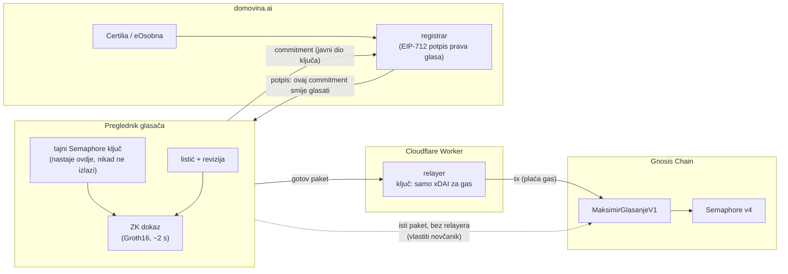
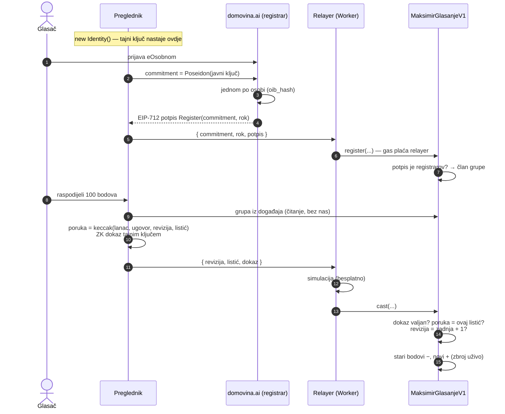

# 6. Glasač ima kontrolu nad svojim glasom

Ovaj dokument pokazuje tko što može u glasanju na Gnosis Chainu
([`MaksimirGlasanjeV1`](../../chain/contracts/v1/MaksimirGlasanjeV1.sol)), a tko ne može.
Svaka tvrdnja ima test ili transakciju na lancu koja je dokazuje.

**Ukratko:**

- Tajni ključ nastaje u glasačevu pregledniku i nikad ga ne napušta.
- Listić je ZK dokaz izrađen tim ključem, također u pregledniku.
- Relayer na Cloudflare Workeru dobiva gotov, zapečaćen paket i samo plaća gas. Ne može ga
  promijeniti, podmetnuti stari ni poslati tuđi. Paket može poslati i bilo tko drugi, pa relayer
  nije ni nužan.
- Ugovor se ne može nadograditi niti pauzirati, pa ni vlasnik ne može dirati listiće.

## Tko drži koji ključ

| Ključ | Gdje nastaje | Gdje živi | Što njime može |
|---|---|---|---|
| **Glasačev Semaphore ključ** | u pregledniku (`new Identity()`) | `localStorage` + datoteka koju glasač preuzme | izraditi listić, izmijeniti ga, povući, objaviti „glasao sam”, preseliti listić u novu verziju |
| **Registrar** | poslužitelj domovina.ai | tajna edge funkcije | potpisati da je commitment potvrđena osoba (jednom po osobi) |
| **Relayer (sponzor)** | Cloudflare Worker | Worker secret | platiti gas. **Nema nikakvu ulogu u ugovoru** |
| **Vlasnik** | Safe 2/3 | tri potpisnika | zamijeniti registrara, jednom najaviti V2, podesiti trajanje starih korijena |

## Što se događa, korak po korak

Kriptografija se odvija ovdje:

| Operacija | Gdje | Tko vidi ulaz |
|---|---|---|
| izrada tajnog ključa | preglednik | nitko |
| commitment (Poseidon) | preglednik | registrar i svi (javno na lancu) |
| poruka listića (keccak) | preglednik; ugovor je ponovno izračuna | svi (listić je javan pod nullifierom) |
| ZK dokaz (Groth16, BN254) | **preglednik** | nitko ne vidi tajni ključ ni koji je član grupe |
| provjera dokaza | ugovor (Semaphore verifier) | svi |
| registrarov potpis (ECDSA, EIP-712) | poslužitelj | registrar zna commitment i osobu |
| potpis transakcije (gas) | relayer | samo omotnica; sadržaj je zapečaćen dokazom |

## Što tko može, a što ne može

### Relayer (Cloudflare Worker)

| Može | Ne može | Dokaz |
|---|---|---|
| odbiti ili odgoditi slanje | promijeniti bodove u paketu | test „relayer ne može promijeniti bodove…”; Chiado korak 3: `400 WrongMessage` |
| vidjeti IP i vrijeme zahtjeva | podmetnuti stariji listić (reviziju) | isti test; Chiado korak 5: `409 BadRevision` |
| | poslati listić bez glasačeva ključa | ugovor traži valjan dokaz člana grupe |
| | poslati objavu dvaput | Chiado korak 6: `409 …SameNullifierTwice` |
| | registrirati nekoga bez registrarova potpisa | test „vrijedi samo registrarov potpis…” |

**Cenzura se zaobilazi**: paket je običan JSON. Glasač ga može poslati iz vlastitog novčanika
(test „bilo tko smije poslati glasačev paket”), preko drugog relayera ili ga dati bilo kome da ga
pošalje. Web će nuditi i gumb „preuzmi paket”.

### Registrar (domovina.ai)

| Može | Ne može |
|---|---|
| odbiti izdati pravo glasa | glasati umjesto glasača (nema njegov tajni ključ) |
| izdati pravo glasa izmišljenoj osobi (vidljivo kao rast `registered`) | vidjeti kako je tko glasao (listić je pod nullifierom, a ZK dokaz ne otkriva commitment) |
| znati koji commitment pripada kojoj osobi | promijeniti ili obrisati ičiji listić |

Izmišljeni glasači ostaju granica sustava, kao i u fazi 1: pravo glasa potvrđuje Certilia, ali
preko našeg poslužitelja. Broj registracija i glasača javan je na lancu u svakom bloku.

### Vlasnik (Safe 2/3)

| Može | Ne može |
|---|---|
| zamijeniti registrara (npr. ukraden ključ) | mijenjati listiće, zbroj ili rok zatvaranja (`closesAt` je `immutable`) |
| **jednom** najaviti V2 i predati joj upis novih članova | preseliti ičiji listić u V2 (to traži glasačev dokaz) |
| podesiti koliko dugo vrijedi stari korijen grupe | pauzirati ili nadograditi ugovor (nema proxyja ni pauze) |

### Glasač

- predaje, mijenja i povlači listić do 31. 12. 2027. 23:59, bilo koliko puta;
- sam odlučuje hoće li listić preseliti u V2 (`migrate` traži njegov dokaz);
- može objaviti „glasao sam” jednom, anonimno;
- može provjeriti svoj listić i zbroj izravno na lancu, bez nas.

## Iskrene granice

„100 % kontrole” vrijedi uz sljedeće uvjete, i ovdje ih ne skrivamo:

1. **Kôd u pregledniku.** Ključ je siguran samo ako JavaScript koji ga izrađuje nije zlonamjeran.
   Taj kôd dolazi s naše stranice. Zaštita: javni izvor, `chain/client/` bez ovisnosti o
   poslužitelju, Subresource Integrity i, kao plan, reproducibilan build objavljen i na IPFS-u, da
   se stranica može otvoriti i bez nas.
2. **Izgubljen ključ znači zamrznut listić.** Zadnji predani listić i dalje se broji, ali se više ne
   može mijenjati. Oporavak ključa preko nas namjerno ne postoji: tko može vratiti ključ, može i
   glasati umjesto glasača. Registrar izdaje pravo glasa jednom po osobi, pa novi ključ ne znači
   drugi glas. Ključ se zato preuzima kao datoteka čim nastane (kao u fazi 1).
3. **Listići su javni pod pseudonimom (nullifier) čim su predani.** Zbroj je javan i provjerljiv
   uživo, ali tko zna da je netko glasao u 15:36 može potražiti listić predan u to vrijeme. U fazi 1
   lanac je zato bio skriven do zatvaranja. Ublažavanje: relayer ne bilježi IP, a paket se može
   poslati kasnije ili iz drugog konteksta. Potpuna zaštita traži šifrirane listiće (MACI, vidi
   [05](05-sljedece-faze.md)).
4. **Nema zaštite od prisile.** Glasač može drugome dokazati kako je glasao. To je cijena javne
   provjerljivosti; MACI bi to riješio (05).
5. **Relayer vidi IP i vrijeme.** Za potpunu mrežnu anonimnost paket treba slati preko Tora ili
   iz vlastitog novčanika.

## Kako to svatko može provjeriti

- **Izvor ugovora** je verificiran uz adresu:
  [Chiado](https://gnosis-chiado.blockscout.com/address/0x88BdeE1E404aF25ea29dfAD5Ec67062A36493989#code).
  Za Gnosis će adresa biti ovdje nakon deploya.
- **Nema proxyja**: kôd na adresi je sam ugovor. `runtimeCodeKeccak256` je u
  [`chain/deployments/`](../../chain/deployments/).
- **Moj listić**: `ballotOf(nullifier)`. Nullifier daje `ballotNullifier()` iz `chain/client/ballot.ts`.
- **Zbroj**: `results()` ili ponovno zbrajanje svih `BallotCast` događaja.
- **Testovi**: `cd chain && npx hardhat test` (10 testova), a pravi tok na Chiadu daje
  `npx tsx scripts/e2e-chiado.ts`.

### Chiado, 25.–26. 9. 2026., sve kroz stvarni kod relayera

| Korak | Rezultat | Transakcija |
|---|---|---|
| registracija (registrarov potpis, relayer šalje) | uspjeh, 152 845 gasa | [0xff48…b05f](https://gnosis-chiado.blockscout.com/tx/0xff48a7d0dd3306bcc53d0cf2cf85ca77411b071c8e6a0a32494833df2b95b05f) |
| listić 50/30/20 (grupa pročitana s lanca, dokaz u procesu glasača) | uspjeh, 481 440 gasa | [0x1436…568c](https://gnosis-chiado.blockscout.com/tx/0x1436fb305be436e0623ba4c975a5cc5d86e44fb5ffaaf4b24e0bc1332e49568c) |
| relayer mijenja bodove u istom paketu | odbijeno u simulaciji: `WrongMessage` | — |
| izmjena, revizija 2 (100 jednom radu) | uspjeh, 334 188 gasa; zbroj na lancu se ispravio | [0x4434…996f](https://gnosis-chiado.blockscout.com/tx/0x44347ec2a0774a520cd71e35d2eef4a2f4ae95d776f038bd1a96ba9d50e9996f) |
| relayer ponovno šalje reviziju 1 | odbijeno: `BadRevision` | — |
| „glasao sam” | uspjeh, 290 751 gas | [0x7c1b…6e14](https://gnosis-chiado.blockscout.com/tx/0x7c1b350698a0f367508bffe93d2c9d5816c996b5478be3c3870b37b5e4546e14) |
| „glasao sam” ponovno | odbijeno: `SameNullifierTwice` | — |
