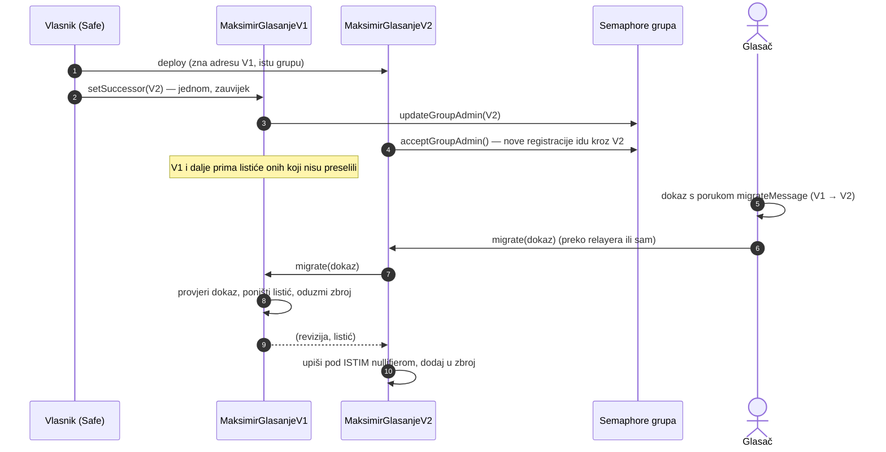

# 7. Verzioniranje ugovora: V1, V2, V3…

**Odluka:** svaka verzija ugovora je **zaseban, trajan i nepromjenjiv ugovor**. Nema proxyja ni
nadogradnje „na mjestu”. Nova mogućnost znači novi ugovor (`MaksimirGlasanjeV2`) uz V1, a glasač
sam odlučuje hoće li svoj listić preseliti.

## Zašto bez proxyja (UUPS / Transparent)

Proxy dopušta vlasniku da zamijeni kôd iza iste adrese. To je praktično, ali znači da vlasnik
jednom transakcijom može promijeniti pravila, pa i listiće. To je u izravnom sukobu s
[06](06-kontrola-glasaca.md): glasač ne bi imao kontrolu, nego obećanje. Bez proxyja ono što je
verificirano uz adresu vrijedi zauvijek.

| | Proxy (nadogradiv) | Verzije (V1, V2…) |
|---|---|---|
| Može li vlasnik promijeniti pravila postojećih listića | da | **ne** |
| Adresa | ista | nova po verziji |
| Popravak greške | zamjena koda | nova verzija + dobrovoljna selidba |
| Što glasač mora vjerovati | vlasniku, trajno | samo kodu koji je vidio |
| Složenost | mala | srednja (selidba, zbroj preko verzija) |

## Što ostaje isto kroz sve verzije

To je ugovor između verzija i **ne mijenja se nikad**:

| Nepromjenjivo | Vrijednost | Zašto |
|---|---|---|
| Semaphore grupa | ista grupa (`groupId` iz V1); admin prelazi na novu verziju | isti ključ glasača vrijedi svugdje |
| `BALLOT_SCOPE` | `"maksimir-2026-listic"` | isti nullifier u svim verzijama, pa jedna osoba ima jedan listić ukupno |
| `SHARE_MESSAGE`, `SHARE_SCOPE` | `"glasao-sam"`, `"maksimir-2026"` (iz faze 1) | stare objave ostaju valjane |
| popis radova | 88 šifri, `entriesHash` | isti indeks bajta = isti rad |
| format listića | 88 bajtova ili prazno | klijent ne mora znati verziju da bi ga složio |

Ono što se **mijenja** po verziji namjerno je vezano uz verziju:

- EIP-712 domena registracije: `version: "1"`, `"2"`… uz adresu ugovora, pa se potpis ne može
  ponoviti na drugoj verziji.
- Poruka listića sadrži `chainId` i adresu ugovora, pa se dokaz za V1 ne može poslati u V2.

## Kako V2 preuzima od V1 (unatrag kompatibilno)



- **Ukupni rezultat = zbroj V1 + V2 + …** Svaki nullifier vrijedi u točno jednoj verziji: ili nije
  preselio (V1), ili je `migrated` u V1 i živi u V2. Klijent i stranica rezultata zbrajaju sve
  verzije iz `deployments/`.
- **Nitko ne mora seliti.** Tko ne preseli, i dalje glasa u V1 do roka. V2 smije imati novu
  mogućnost, ali ne smije mijenjati značenje starih listića.
- **Stari dokazi i potvrde vrijede zauvijek**: V1 i njegovi događaji ostaju na lancu.
- Prijelaz je testiran s `contracts/test/MockSuccessorV2.sol`: samo vlasnik, jednom; `migrate`
  bez glasačeva dokaza pada; nakon selidbe V1 odbija listić tog glasača; tuđi listić ostaje.

## Nepromjenjiv izvor u GitHubu

```
chain/
  contracts/
    v1/MaksimirGlasanjeV1.sol        ← zamrznuto čim postoji deployments/*/v1.json
    v2/MaksimirGlasanjeV2.sol        ← nova verzija = nova mapa; v1/ se nikad ne dira
  deployments/
    chiado/v1.json                   ← manifest: adresa, tx, blok, argumenti, git commit,
    gnosis/v1.json                     solc metadata hash, keccak256 svake izvorne datoteke
  scripts/check-frozen.mjs           ← ponovno kompajlira i uspoređuje s manifestom
.github/workflows/chain.yml          ← CI pada ako se zamrznuti izvor promijeni
```

Četiri neovisna sidra istog izvora:

1. **Manifest** (`deployments/<mreža>/vN.json`) sadrži `metadataKeccak256` i keccak256 **svake**
   izvorne datoteke, uključujući OpenZeppelin i Semaphore iz `node_modules`, te postavke kompajlera.
2. **`check-frozen` u CI-ju.** Promjena jednog znaka u `contracts/v1/` ili druga verzija ovisnosti
   ruši build. Ovisnosti ugovora zato su zaključane točnom verzijom (`5.6.1`, `4.14.3`, bez `^`).
3. **Metadata hash u bytecodeu.** solc ugrađuje hash metadata (koji sadrži hash svih izvora) u
   sam bytecode na lancu, pa izvor i bytecode ne mogu razići.
4. **Verificiran izvor uz adresu** na Blockscoutu (i Gnosisscanu), te **git tag**
   `glasanje-v1-gnosis` na commitu iz manifesta.

Pravila:

- Deploy skripta na Gnosis odbija deploy ako `contracts/` nije commitan (`gitDirty`).
  Na Chiadu je dopušteno, uz oznaku u manifestu.
- Deploy skripta odbija drugi deploy iste verzije na istu mrežu (manifest već postoji).
- Greška u V1 nakon deploya popravlja se **isključivo** kroz V2.

## Kako napraviti V2 (kontrolna lista)

- [ ] `contracts/v2/MaksimirGlasanjeV2.sol`; `v1/` se ne dira
- [ ] konstruktor prima adresu V1 i koristi `v1.semaphore()`, `v1.groupId()`
- [ ] `acceptGroupAdmin()` i `migrate(dokaz)` koji zove `V1.migrate` i upisuje pod istim nullifierom
- [ ] isti `BALLOT_SCOPE`, `SHARE_*`, `entriesHash`, format listića
- [ ] EIP-712 `version: "2"`; poruka listića s adresom V2
- [ ] `cast` u V2 odbija nullifier koji još ima živ listić u V1 (`V1.ballotOf(n)`: revizija > 0 i
      nije `migrated`). Inače bi ista osoba glasala u dvije verzije.
- [ ] testovi selidbe i ukupnog zbroja V1 + V2
- [ ] Chiado → Gnosis → `setSuccessor(V2)` sa Safea
- [ ] klijent: `deployments/` → popis verzija; zbroj i „moj listić” preko svih verzija

Predzadnja stavka je razlog zašto V1 ima `ballotOf` i `migrated`: V2 mora moći provjeriti V1.
