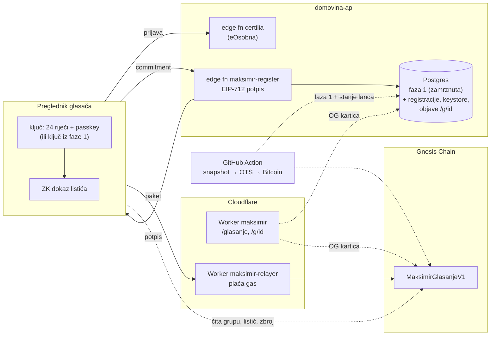
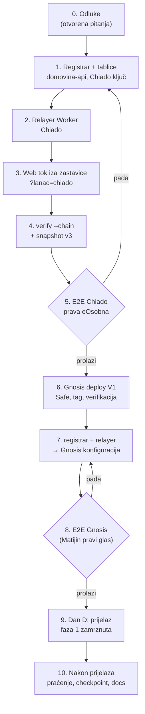
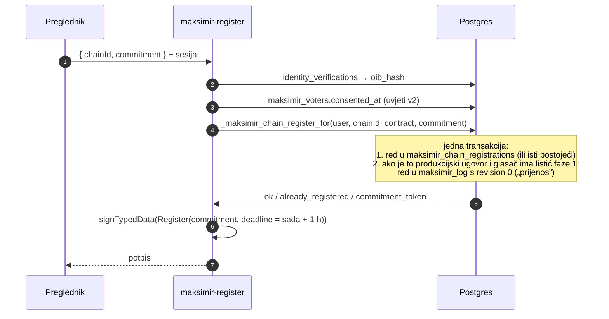
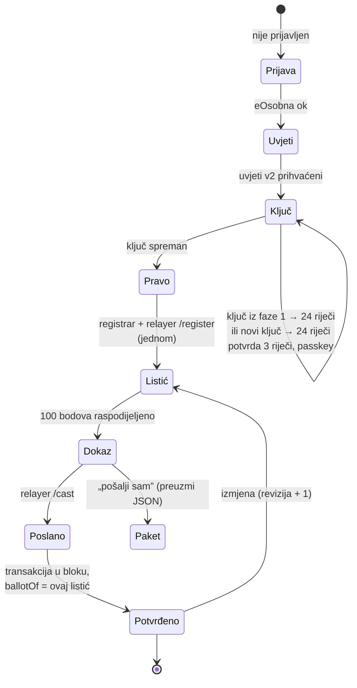
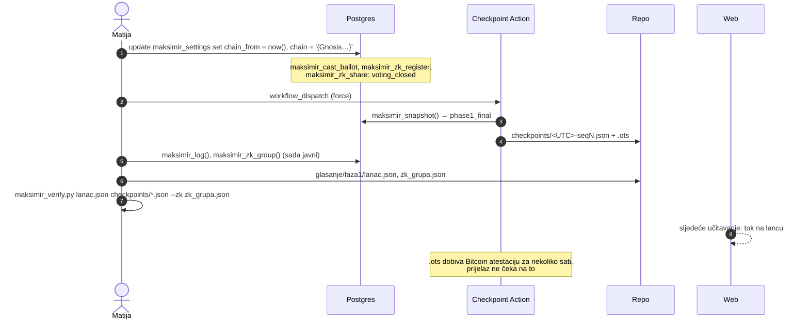
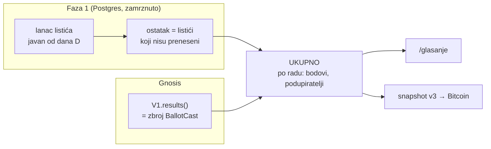
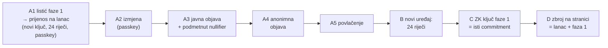

# 8. Integracija s fazom 1: plan spajanja

**Status (26. 9. 2026.): dan D je napravljen.** Faza 1 je zatvorena u **01:20:41 UTC** (03:20 po
zagrebačkom vremenu), a glasanje se nastavlja na Gnosis Chainu (`MaksimirGlasanjeV1`
`0x812960FA1120121DEd82A8806aECE93dcf49E869`). Sve iz ovog plana je na produkciji i u `main`
(PR #2, `domovina-api` PR #4). Tijek i hashevi: [Put do produkcije, korak 7](#put-do-produkcije).
Povijest implementacije: [Stanje implementacije](#stanje-implementacije). Sažetak za javnost:
[Dan D: prijelaz na Gnosis](../2026-09-26-dan-d.md).

Ovaj dokument spaja [`MaksimirGlasanjeV1`](01-arhitektura.md) s glasanjem koje radi na produkciji
od 25. 9. 2026. ([faza 1](../glasanje-kako-radi.md)). Dijelovi su već opisani u
[04](04-web-i-baza.md) i u [01 „Prijelaz s faze 1”](01-arhitektura.md#prijelaz-s-faze-1). Ovdje su
složeni u jedan redoslijed, a dodani su zastavica, izvor rezultata, objave `/g/<id>`, checkpoint
Action, `maksimir_verify.py --chain`, povratak i E2E.

**Ukratko:**

- Sve se najprije spaja i testira **na Chiadu**, s pravom eOsobnom na produkcijskoj domeni i iza
  zastavice. Tek zatim ide deploy na Gnosis, jer se ugovor nakon deploya ne može popraviti (samo V2).
- Faza 1 se **ne briše i ne prepisuje**. Na dan prijelaza (D) prestaje primati listiće, zadnji
  snapshot ide u Bitcoin, a lanac faze 1 postaje javan kao i svaki zatvoren lanac.
- **Jedna osoba ima jedan glas preko obje faze.** Registrar pri upisu na lanac u lanac faze 1
  zapisuje povlačenje starog listića („prijenos”), pa se isti glas ne može brojati dvaput, a to
  svatko može provjeriti iz javnog lanca.
- Postojeći ZK ključ iz faze 1 postaje ključ za lanac: **isti commitment**, bez nove tajne.
- Rezultat je **lanac + ostatak faze 1** (listići koji nisu preneseni). Oba dijela su provjerljiva
  bez nas: lanac iz događaja ugovora, a ostatak iz javnog lanca faze 1 i OTS snapshotova.
- Na produkciji danas nema nijednog aktivnog listića (Matijin je povučen pri testu novog UI-ja).
  Prijelaz je zato jeftin ako se napravi prije šire promocije glasanja.

## Polazno stanje (26. 9. 2026.)

| Dio | Stanje | Izvor |
|---|---|---|
| Faza 1, lanac listića | vrh `seq 2`, **0 aktivnih glasača** | javni RPC `maksimir_snapshot()` |
| Faza 1, ZK grupa | 1 član (Matijin ključ), `seq 1` | `maksimir_zk_head()` |
| Faza 1, zadnji checkpoint u repou | `seq 1` (25. 9. 17:43 UTC); `seq 2` čeka sljedeći run | `glasanje/checkpoints/index.json` |
| Checkpoint cron | radi, ali neredovito (zakazani runovi 17:56 i 21:33 UTC, ne svaki sat) | `gh run list -w maksimir-checkpoint` |
| V1 na Chiadu | `0xe790…e029`, verificiran, E2E kroz kod relayera | [`deployments/chiado/v1.json`](../../chain/deployments/chiado/v1.json) |
| V1 na Gnosisu | nije deployan | — |
| Relayer | kôd i testovi, nije deployan (26. 9. premješten u Worker `maksimir`) | [`web/worker/relayer/`](../../web/worker/relayer/) |
| Registrar, `maksimir_keystore` | ne postoje | [04](04-web-i-baza.md) |
| Web | Vite + Worker `maksimir`; Astro je odbačen | [odluka](../2026-09-25-web-nice-to-have.md) |

## Ciljna slika



Poslužitelj i dalje zna samo ono što je znao u fazi 1: tko je potvrđen i koji je commitment
upisao. Listić i zbroj više nisu u bazi, nego na lancu.

## Načela

1. **Jedan glas po osobi preko obje faze.** Nijedan korak ne smije omogućiti da se ista osoba broji
   i u fazi 1 i na lancu.
2. **Ništa iz faze 1 se ne briše.** Lanac hasheva, ZK zapisnik, snapshotovi i objave ostaju
   provjerljivi zauvijek.
3. **Chiado prije Gnosisa**, za svaki dio. Gnosis se deploya tek kad je cijeli tok prošao na
   Chiadu s pravom eOsobnom.
4. **Povratak je moguć u svakom koraku.** Do dana D povratak je samo gašenje zastavice. Nakon dana
   D listići na lancu se ne mogu obrisati, pa je povratak ograničen (vidi [Povratak](#povratak)).
5. **Test ne dira korisnikove tajne.** Matijin ZK ključ iz faze 1 je i njegov pravi ključ.

## Redoslijed

Zadani redoslijed bio je Gnosis → registrar → relayer → web. Predlažem da se registrar, relayer i
web prvo spoje s **Chiadom**, a Gnosis deploy dođe tek nakon E2E s pravom eOsobnom. Razlog je
nepromjenjivost ugovora: ako integracija otkrije da ugovoru nešto nedostaje (npr. događaj ili
getter koji web treba), na Chiadu je to novi deploy, a na Gnosisu V2. Gnosis deploy je zatim
mehanički korak po [03](03-deploy-runbook.md), a registrar, relayer i web samo mijenjaju
konfiguraciju.



| # | Korak | Repo | Test | Povratak |
|---|---|---|---|---|
| 1 | registrar + `maksimir_chain_registrations` + `maksimir_keystore` | `domovina-api` | SQL testovi (kao `supabase/tests/20260925_*`), Deno test edge funkcije | migracija je aditivna; funkcija se ne poziva dok web ne zna za nju |
| 2 | relayer na Chiadu | ovaj (`web/worker/relayer`) | postojeći testovi + `/status` na Chiadu | `wrangler delete` |
| 3 | web tok | ovaj (`web/`) | unit (happy-dom), `glasanje-ui.mjs` s presretnutim API-jem, `npm run check` | zastavica isključena = faza 1 nepromijenjena |
| 4 | `maksimir_verify.py --chain`, snapshot v3 | ovaj (`scripts/`) | fiksture s Chiada, test u suprotnom smjeru | stara provjera radi kao i dosad |
| 5 | E2E Chiado s eOsobnom | — | [kontrolna lista](#e2e-s-pravom-eosobnom) | — |
| 6 | Gnosis deploy | ovaj (`chain/`) | `check-frozen`, verifikacija, manifest | ništa se ne mijenja dok se konfiguracija ne prebaci |
| 7 | konfiguracija za Gnosis | oba | `/status`, registracija testnog ključa | vratiti konfiguraciju na Chiado |
| 8 | E2E Gnosis | — | Matijin pravi glas na lancu | vidi [Povratak](#povratak) |
| 9 | dan D | `domovina-api` (SQL), web | [runbook](#dan-d-prijelaz) | [Povratak](#povratak) |

## 1. Registrar i tablice (`domovina-api`)

Nova migracija `2026092xxxxxxx_maksimir_chain.sql`, primijenjena ručno (kao i dosad, ne
`db-migrate.sh`). Sve je u shemi `domovina_ai`.

```sql
-- Pravo glasa na lancu: jedna osoba = jedan commitment po ugovoru.
create table domovina_ai.maksimir_chain_registrations (
  chain_id   bigint  not null,
  contract   text    not null check (contract ~ '^0x[0-9a-f]{40}$'),
  oib_hash   text    not null,
  commitment text    not null check (commitment ~ '^[0-9]{1,78}$'),
  created_at timestamptz not null default now(),
  primary key (chain_id, contract, oib_hash),
  unique (chain_id, contract, commitment)
);

-- Šifrirani omot ključa (ADR 0001). Nema korisnika, OIB-a ni commitmenta.
create table domovina_ai.maksimir_keystore (
  credential_id_hash text primary key check (credential_id_hash ~ '^[0-9a-f]{64}$'),
  blob       jsonb not null,
  created_at timestamptz not null default now()
);
```

- **RLS** zatvara obje tablice za `anon` i `authenticated`. Pristup ide samo kroz funkcije.
- **Keystore RPC-evi:** `maksimir_keystore_put(hash, blob)` i `maksimir_keystore_get(hash)`, oba
  za `anon`. `put` samo **dodaje**: prvi upis pobjeđuje, a ponovni upis istog bloba vraća uspjeh.
  Kad bi se omot mogao prepisati, svatko tko zna `credentialId` mogao bi glasaču pokvariti omot
  (ne bi ga ukrao, ali bi ga zaključao). Nova zaštita istog ključa znači novi passkey, dakle novi
  `credentialId`. Ograničenje veličine bloba (npr. 2 kB) sprječava zlouporabu tablice.
- **`maksimir_settings`** dobiva dva stupca (vidi [zastavicu](#zastavica-i-prebacivanje)):
  `chain_from timestamptz` i `chain jsonb` (`{chainId, contract, relayer}` za web).

### Edge funkcija `maksimir-register`

```
POST /functions/v1/maksimir-register     Authorization: Bearer <sesija nakon eOsobne>
{ "chainId": 100, "commitment": "…" }
→ 200 { "chainId", "contract", "commitment", "deadline", "signature" }
→ 409 { "error": "already_registered", "commitment": "<postojeći>" }
→ 4xx { "error": "not_verified" | "terms_not_accepted" | "unknown_chain" | "invalid_commitment" | "commitment_taken" }
```



- **Ključ registrara** po mreži: `MAKSIMIR_REGISTRAR_KEY_CHIADO` i `MAKSIMIR_REGISTRAR_KEY_GNOSIS`
  kao tajne edge funkcije. Adresa ugovora dolazi iz `maksimir_settings.chain`, pa funkcija ne
  potpisuje za proizvoljan ugovor.
- **Isti commitment, isti odgovor.** Ponovni zahtjev s istim commitmentom daje novi potpis (novi
  rok), jer prvi možda nije stigao do lanca. Drugačiji commitment iste osobe daje
  `already_registered`. Zato izgubljen ključ ne donosi drugi glas.
- **Prijenos listića faze 1** događa se pri registraciji, ne pri predaji na lancu, jer registrar ne
  vidi listić na lancu (nullifier ne zna). Web zato registraciju i prvu predaju radi kao jedan
  korak, s listićem faze 1 kao nacrtom (vidi [prijenos](#ponovna-predaja-postojećih-listića)).
- `viem` radi u Denou (`npm:viem`), a `registerTypedData` se kopira iz
  [`chain/client/ballot.ts`](../../chain/client/ballot.ts). Test u ovom repou provjerava da
  potpis iz edge funkcije prolazi `register` na lokalnom Hardhatu.

## 2. Relayer

**Izvedeno drukčije od prvog prijedloga** (odluka 10): relayer je ruta `/relayer/<chainId>/…` u
Workeru `maksimir`, pa se web i relayer deployaju zajedno. Detalji su u
[02](02-relayer-i-gas.md#relayer-je-ruta-u-workeru-maksimir-26-9-2026):

- više mreža u jednom Workeru: `RELAYER_CHAINS` + tajna `SPONSOR_PRIVATE_KEY_<chainId>`; mreža bez
  tajne vraća 503;
- isti izvor kao web, pa nema CORS-a;
- najmanja napojnica 0,01 gwei ([I-05](audit/nalazi.md));
- sponzor na Gnosisu: novi EOA s 1 xDAI. Uz izmjerenih ~0,5 M gasa po listiću i gornju granicu
  relayera od 5 gwei (`MAX_FEE_GWEI`), 1 xDAI pokriva najmanje 400 listića i u najgorem slučaju. Uz
  stvarnu naknadu od ~10 wei trošak je zanemariv ([02](02-relayer-i-gas.md)).

## 3. Web tok

Web ostaje Vite + Worker. Kriptografija dolazi iz [`chain/client/`](../../chain/client/) bez
kopiranja: `web/vite.config.ts` dobiva `server.fs.allow: [".."]`, a `web/package.json` dodaje
`viem` i `@scure/bip39` (iste verzije kao `chain/`). Sve se učitava dinamički, kao današnji
`zk.ts`, pa naslovnica ne raste.

Novi moduli, bez diranja postojećih dok zastavica nije uključena:

| Modul | Sadržaj |
|---|---|
| `web/src/chainConfig.ts` | mreža, adresa, `groupId`, blok deploya, URL relayera iz `maksimir_settings.chain` + `chain/deployments/<mreža>/v1.json` |
| `web/src/chainVote.ts` | ključ (keystore, uvoz iz faze 1), registracija, dokaz, relayer, `ballotOf`, rezultati s lanca |
| `web/src/chainVoteView.ts` | koraci i stanja za laike, po uzoru na [demo](../../chain/client/demo/) |

Postojeći `glasanjeView.ts` dobiva samo grananje „faza 1 / lanac” i poziv novog pogleda. Galerija i
listić od 100 bodova (commit `dd15f1f`) ostaju isti. Mijenja se samo gumb „Predaj” i ono što
slijedi.



Svaki korak ima stanje **čeka / sada / gotovo / greška**, aktivan gumb samo za trenutni korak i
jednu rečenicu običnim jezikom („Tvoj preglednik sada računa dokaz. Traje oko 2 sekunde.”). Greške
relayera prevode se kao i RPC greške u `glasanje.ts` (`BadRevision` → „Listić je u međuvremenu
promijenjen s drugog uređaja. Učitavam novo stanje.”).

## Zastavica i prebacivanje

Jedna zastavica u bazi, bez novog deploya weba:

| `maksimir_settings` | Značenje |
|---|---|
| `chain_from is null` | faza 1 kao danas; tok na lancu vide samo testeri s `?lanac=chiado` |
| `chain_from > now()` | najava: web prikazuje datum prijelaza, faza 1 i dalje prima listiće |
| `chain_from <= now()` | faza 1 zatvorena za listiće i ZK upis; web koristi lanac iz `chain` |

- `maksimir_results()` vraća i `chain_from`, `chain` i `phase1_residual`, pa web jednim pozivom zna
  u kojoj je fazi.
- `_maksimir_is_open()` za predaju listića dobiva uvjet `now() < coalesce(chain_from, 'infinity')`.
  `closes_at` ostaje kraj cijelog glasanja (31. 12. 2027.) i jednak je `closesAt` ugovora.
- `maksimir_log()` postaje javan od `chain_from` (lanac faze 1 je zatvoren), a ne tek od `closes_at`.
- `?lanac=chiado` (zapamćeno u `sessionStorage`) postoji samo za testere. Uz njega stranica jasno
  piše „TESTNA MREŽA, glas se ne broji”. Chiado nikad nije produkcijski izvor.

## Dan D: prijelaz



### Zamke pri izvođenju (26. 9. 2026.)

Vrijede i za povratak (razina 4) i za svaki budući prijelaz, npr. na V2.

- **Zastavica ide s assertima u istoj transakciji.** `update` + `do $$ … raise exception … $$` + `commit`
  kroz `psql -v ON_ERROR_STOP=1`: svaka neočekivana vrijednost poništi cijelu transakciju. Tako su se dva
  pokušaja s krivim assertom poništila bez ikakve promjene u bazi.
- **`_maksimir_cast_ballot_for` prvo provjerava identitet** (`not_verified`), tek onda `voting_closed`.
  Za provjeru zatvaranja treba stvarni `user_id` iz `public.identity_verifications`; poziv ništa ne piše
  jer `voting_closed` pada prije upisa.
- **`maksimir_log()` vraća jedan `jsonb` niz**, ne redove: broji se `jsonb_array_length(...)`.
- **`maksimir_zk_register` kao `anon`** vraća `permission denied` (grant samo `authenticated`); izvana se
  zatvaranje provjerava preko `maksimir_zk_share` (`anon`, vraća `voting_closed`).
- **`maksimir_verify.py … glasanje/checkpoints/*.json`** hvata i `index.json`; od `92982e9` skripta ga
  preskače. Starija kopija skripte na njemu puca s `TypeError`.
- **Web ne treba deploy** za prijelaz: `maksimir_chain_config().active` i `chain_from` web čita pri
  učitavanju. Stranice s dokumentacijom trebaju deploy (markdown je u bundleu).

### Zatvaranje `maksimir_cast_ballot`

Zatvara se preko `chain_from`, ne brisanjem funkcije. Staro sučelje (stari JS u predmemoriji
preglednika) tako dobiva jasnu grešku `voting_closed`, a web je prevodi u „Glasanje se preselilo na
lanac. Osvježi stranicu.” Isto vrijedi za `maksimir_zk_register` i `maksimir_zk_share`: nove
anonimne objave idu na lanac.

`maksimir_set_public` ostaje otvoren: glasač i dalje smije uključiti ili isključiti javni prikaz
(vidi [objave](#objave-gid)).

### Završni OTS snapshot

Ručni `workflow_dispatch` s `force` odmah nakon `chain_from`. Snapshot nosi `phase1_final: true`
(dio schema v3). To je stanje faze 1 koje se više ne mijenja, osim zapisa „prijenos” (sljedeći
odjeljak), koji su i sami u lancu hasheva.

### Ponovna predaja postojećih listića

Listić iz faze 1 ne može se prenijeti automatski, jer ga nije potpisao glasačev ključ (01). Tok:

1. Glasač se prijavi. `maksimir_my_ballot()` vraća njegov listić faze 1 (`items`), a web vidi da je
   faza 1 zatvorena.
2. Web kaže: „Tvoj glas iz faze 1 i dalje se broji. Prenesi ga na lanac da ga možeš mijenjati.”
   Listić faze 1 učita se kao nacrt.
3. Ključ (sljedeći odjeljak), pa registracija. Registrar u istoj transakciji u lanac faze 1 upiše
   red `revision 0` („prijenos”). Od tog trenutka listić faze 1 više se ne broji.
4. Odmah zatim dokaz i predaja na lancu, s nacrtom iz koraka 2.

Rizik: ako korak 4 ne uspije (relayer nedostupan, glasač zatvori stranicu), glas neko vrijeme ne
postoji ni u fazi 1 ni na lancu. Ublažavanje: nacrt ostaje u `localStorage`, stranica pri sljedećem
posjetu nudi „Dovrši prijenos”, a „preuzmi paket” omogućuje slanje bez relayera. Alternativa je
[otvoreno pitanje 3](#otvorena-pitanja-za-matiju).

Za zbroj to znači: **ostatak faze 1** = listići faze 1 čiji zadnji red u lancu nije `revision 0`.
To je već pravilo lanca (povlačenje je `revision 0`), pa `maksimir_verify.py` ostatak računa bez
izmjene. Zapisi „prijenos” razlikuju se od običnog povlačenja samo po tome što nastaju nakon
`chain_from`.

### Ponovna upotreba ZK ključa iz faze 1

Ključ iz faze 1 (`maksimir-zk-identity` u `localStorage`, datoteka `maksimir-zk-kljuc.txt`) je
32 bajta, isto kao tajna u [ADR 0001](adr/0001-kljuc-glasaca-passkey-i-24-rijeci.md). Provjereno je
da base64 → 24 riječi → natrag daje isti commitment (`fromPhase1Export`).

| Situacija | Što web radi |
|---|---|
| lokalni ključ postoji i njegov commitment = `zk_commitment` iz `maksimir_my_ballot()` | „Tvoj ZK ključ iz faze 1 postaje ključ za lanac.” → prikaz 24 riječi, potvrda 3 riječi, passkey. Isti commitment ide registraru |
| `zk_commitment` postoji, lokalnog ključa nema | ponudi uvoz datoteke ili novi ključ; upozori da novi ključ znači da stara anonimna objava ostaje vezana uz stari ključ |
| glasač nije imao ZK ključ (većina) | novi ključ → 24 riječi → passkey |

Posljedice istog commitmenta:

- Commitment je već javan u ZK zapisniku faze 1, pa njegov upis na lanac ne otkriva ništa novo.
- Nullifier anonimne objave (`SHARE_SCOPE`) isti je u fazi 1 i na lancu. Objava na lancu tog istog
  ključa pokazat će da je to ista osoba kao u objavi faze 1, što je istina i ne otkriva identitet.
- Nullifier listića (`BALLOT_SCOPE`) je drugačiji, pa se anonimna objava ne može povezati s listićem.
- Na lancu nema zamjene ključa (V1 nema uklanjanja člana), za razliku od faze 1. Izgubljen ključ =
  zamrznut listić (06).

## Izvor rezultata



| Razdoblje | Izvor | Provjera |
|---|---|---|
| do dana D | baza (`maksimir_results`), kao danas | lanac hasheva + OTS |
| od dana D | **lanac** (`results()` svih verzija iz `chain/deployments/`) **+ ostatak faze 1** | lanac: događaji ugovora; ostatak: javni lanac faze 1 + OTS |
| nakon 31. 12. 2027. | isto, konačno | `maksimir_verify.py --chain` |

- Web čita lanac izravno iz preglednika (javni RPC Gnosisa, s rezervnim popisom), a ostatak iz
  `maksimir_results()`. Prikazuje ukupno, a u „Kako se broji” oba dijela odvojeno.
- Ostatak se nakon dana D može samo smanjivati (prijenosi). Ne može rasti, jer faza 1 ne prima
  listiće.
- Broj glasača = `voters` na lancu + broj listića u ostatku. Dvostrukog brojanja nema, jer prijenos
  ukida listić faze 1 prije nego što ista osoba dobije pravo glasa na lancu.

## Objave `/g/<id>`

| Objava | Gdje živi | Nakon dana D |
|---|---|---|
| javna s imenom, listić faze 1 | baza | ostaje. Kad glasač prenese listić, kartica prikazuje listić s lanca (redak ispod) |
| anonimna ZK, faza 1 | baza (dokaz + `zk_seq`) | ostaje valjana; provjerava se kao i dosad nad grupom faze 1 |
| **javna s imenom, listić na lancu** | baza: ime i dokaz vlasništva nullifiera; lanac: listić | nova |
| **anonimna, na lancu** | lanac: `V1.share`, događaj `AnonymousShare`; baza: samo kratka poveznica na transakciju | nova |

**Ime nikad ne ide na lanac.** Za javnu objavu listića s lanca baza mora znati njegov nullifier, a
glasač ne smije moći tuđi listić prikazati pod svojim imenom. Zato uz nullifier šalje i ZK dokaz
vlasništva:

```
scope   = BALLOT_SCOPE                         → isti nullifier kao listić
message = keccak256("maksimir-javno" | share_id)   → vrijedi samo za ovu objavu
```

Baza sprema nullifier i dokaz (`maksimir_set_public` dobiva opcijske parametre). Posjetitelj u
pregledniku provjerava SNARK, scope, poruku i da je korijen bio korijen grupe na lancu, a zatim
čita `ballotOf(nullifier)`. Takav dokaz ne može poslužiti kao listić (`cast` traži drugu poruku)
ni kao objava (`share` traži drugi scope). Nullifier tada postaje javno povezan s imenom, ali
samo po izboru glasača, kao i danas s listićem faze 1.

**Anonimna objava na lancu:** preglednik izradi `proveShare`, relayer pošalje `/share`, a baza
dobije samo `(id, chain_id, tx_hash)` preko anonimnog klijenta, kao i danas. Stranica objave
provjeru radi s lanca (događaj `AnonymousShare` u toj transakciji). Pravilo faze 1 „ZK je
onemogućen dok je glas javan” ostaje.

**OG kartica** (`web/worker/share.ts`) za objavu s lanca čita listić preko Gnosis RPC-a
(`ballotOf`), s istom predmemorijom od 60 s. Ako RPC ne odgovori, ostaje opća kartica.

## Satni checkpoint Action nakon prijelaza

Action ostaje i dobiva snapshot **v3**. Stari snapshotovi (v1, v2) se ne diraju.

| Polje v3 | Sadržaj |
|---|---|
| sve iz v2 | vrh lanca faze 1, vrh ZK zapisnika, rezultati ostatka faze 1 |
| `phase1_final` | `true` od dana D |
| `chain` | `{ chainId, contract, block, blockHash, voters, registered, results }` pročitano u istom bloku |

- **Zašto i lanac u Bitcoin:** Gnosis je sam javan i nepromjenjiv, pa to nije nužno za integritet.
  Ali jedan snapshot tako veže oba izvora u istom trenutku, pa `maksimir_verify.py --chain` može
  provjeriti ukupan zbroj u svakom satu, a repozitorij ostaje aktivan (GitHub gasi cron nakon
  60 dana mirovanja).
- **Kad piše:** kad se promijeni vrh faze 1 ili `voters`/blok s novim `BallotCast`, a inače jednom
  u 24 sata.
- **Kraj:** nakon `closesAt` (31. 12. 2027.) posljednji snapshot `final: true`, zatim se Action
  zaustavlja.
- **Neredovit cron** (zakazani runovi ne dolaze svaki sat) rješava se prije dana D: rezervni
  okidač iz Cloudflare Cron Triggera koji poziva `workflow_dispatch`. Za dan D ionako ide ručni run.

## `maksimir_verify.py --chain`

Proširenje postojeće skripte, i dalje **samo standardna biblioteka** Pythona.

```sh
python3 scripts/maksimir_verify.py glasanje/faza1/lanac.json glasanje/checkpoints/*.json \
  --zk glasanje/faza1/zk_grupa.json \
  --chain chain/deployments/gnosis/v1.json --rpc https://rpc.gnosischain.com
```

1. Iz manifesta čita adresu, blok deploya i `chainId`. Provjeri `eth_chainId` i da je keccak256
   koda na adresi jednak `runtimeCodeKeccak256` iz manifesta (nema proxyja, kôd je onaj iz repoa).
2. `eth_getLogs` za `BallotCast` i `Migrated` od bloka deploya, u odsječcima. Ponovno zbraja:
   zadnji listić po nullifieru, bez preseljenih.
3. `eth_call results()` na istom bloku i usporedi s ponovnim zbrajanjem.
4. Za svaki snapshot v3: zbroj iz događaja do `chain.block` mora biti jednak `chain.results`, a
   `blockHash` jednak onome s lanca.
5. Ukupno = ostatak faze 1 (iz lanca faze 1) + lanac. Ispis po radu.

SNARK dokaze skripta ne provjerava: to je ugovor učinio pri svakom `cast`, a Python nema pairing.
Standardna biblioteka nema keccak256 (`hashlib.sha3_256` je drugačiji padding), pa skripta nosi
vlastitu implementaciju u čistom Pythonu (~40 linija) s testom prema poznatim vektorima. Iz nje
računa selektore, `topic0` i hash koda. Testovi: fiksture s Chiada (stvarne transakcije iz
E2E) i provjera u suprotnom smjeru (izmijenjen `results` ili izbačen događaj → exit 1).

## Povratak

| Razina | Kada | Što | Posljedica |
|---|---|---|---|
| 0 | prije dana D | `chain_from = null` | ništa; faza 1 radi kao danas |
| 1 | relayer ne radi ili je sponzor prazan | ugasi rutu relayera ili dopuni xDAI; web nudi „preuzmi paket” | listići se mogu slati sami; nitko ne gubi glas |
| 2 | registrarov ključ procurio | Safe: `setRegistrar(novi)`; nova tajna u edge funkciji | lažne registracije do tog trenutka vidljive su kao rast `registered` |
| 3 | greška u V1 | V2 prema [07](07-verzioniranje.md), dobrovoljna selidba | V1 ostaje i broji se |
| 4 | cijeli put na lancu mora stati | `chain_from = null` → faza 1 ponovno prima listiće, **ali** `maksimir_cast_ballot` odbija osobe s redom u `maksimir_chain_registrations` | listići na lancu ostaju i broje se; bez tog pravila ista osoba bi glasala dvaput |

Razina 4 zato traži da provjera registracije u `_maksimir_cast_ballot_for` postoji od prvog dana,
iako se koristi samo pri povratku.

## Privatnost

| | Faza 1 | Na lancu |
|---|---|---|
| Listić tijekom glasanja | skriven; javni samo zbroj i vrh lanca | **javan pod nullifierom čim je predan** |
| Vrijeme predaje | skriveno do zatvaranja | javno (blok) |
| Operater zna čiji je listić | da (`voter_id → oib_hash`) | **ne**: zna samo commitment, a nullifier iz njega ne može izračunati |
| Tko je autor anonimne objave | operater posredno | nitko |
| Ime | samo uz javnu objavu | nikad na lancu |

Posljedice za dan D:

- **Uvjeti v2.** Tekst privole mijenja se („listić je javan pod pseudonimom čim ga predaš”), a
  `consented_at` za lanac traži novu privolu (`terms_version = 2`).
- **Lanac faze 1 postaje javan na dan D.** To je obećanje faze 1 (javan po zatvaranju). Zapis
  „prijenos” u vremenu blizu registracije i prve predaje na lancu može povezati pseudonim faze 1 s
  nullifierom na lancu. Oba su pseudonimi. Ublažavanje: `maksimir_log()` vraća `ts_ms` zaokružen
  na sat za zapise nakon dana D (hash i dalje koristi točan `ts_ms`, pa ga provjera treba; zato je
  ovo [otvoreno pitanje 6](#otvorena-pitanja-za-matiju)).
- **Serije u relayeru** (paketi se šalju jednom na sat) smanjuju povezivanje po vremenu. Otvoreno
  pitanje iz [README](README.md#otvorena-pitanja-za-matiju).

## E2E s pravom eOsobnom

Na Chiadu, na **produkcijskoj domeni** `maksimir.domovina.ai` s `?lanac=chiado`. Preview URL-ovi ne
dolaze u obzir: Certilia proxy ih ne pušta (`ALLOWED_ORIGINS`), a passkey s `rpId = domovina.ai`
radi samo na `*.domovina.ai`.

Prije testa:

- [ ] backup `localStorage` u Braveu (`maksimir-zk-identity`, `maksimir-keystore-v1`, `maksimir-draft`, `maksimir-auth`) u datoteku izvan repoa;
- [ ] **testni ključ, ne Matijin pravi**: isti ključ na Chiadu i Gnosisu daje isti nullifier, pa bi
      testni listić na Chiadu bio javno povezan s pravim listićem na Gnosisu. Ponovna upotreba ključa
      iz faze 1 testira se lokalno (lokalni Supabase + Hardhat) s testnim ključem faze 1;
- [ ] relayer Chiado `/status` pokazuje saldo sponzora.

Koraci (passkey korake klikne Matija, jer WebAuthn traži fokus prozora):

| # | Korak | Očekivano |
|---|---|---|
| 1 | prijava eOsobnom | sesija; `maksimir_my_ballot()` ok |
| 2 | uvjeti v2 | `consented_at` |
| 3 | novi ključ → 24 riječi → potvrda 3 riječi → passkey | otisak ključa isti na stranici i u imenu passkeyja |
| 4 | registracija | red u `maksimir_chain_registrations` (Chiado), `Registered` na lancu; **nema** zapisa „prijenos” (Chiado nije produkcijski) |
| 5 | drugi zahtjev s drugim commitmentom | `already_registered` |
| 6 | listić 50/30/20 → predaja | `BallotCast`, `results()` se slaže sa stranicom |
| 7 | izmjena s drugog preglednika (24 riječi) | revizija 2; prvi preglednik nakon osvježenja vidi reviziju 2 |
| 8 | „preuzmi paket” + slanje iz skripte bez relayera | uspjeh |
| 9 | javna objava s imenom | kartica s listićem s lanca; OG kartica; zatim isključi |
| 10 | anonimna objava | `AnonymousShare`; provjera na stranici objave |
| 11 | `maksimir_verify.py --chain` (manifest Chiado) | SVE PROVJERE PROŠLE |

Nakon testa: javne objave isključene, `localStorage` vraćen iz backupa i provjeren (otisak
Matijina ZK ključa isti kao prije), testni passkeyji „Maksimir …” obrisani (Matija).

Na Gnosisu (korak 8 redoslijeda) isti tok ide jednom, s Matijinim **pravim** ključem iz faze 1 i
njegovim pravim glasom. Tako se provjerava i ponovna upotreba ključa na produkciji.

## Plan implementacije (nakon odobrenja)

Svaki korak je jedan ili više commitova na grani, s testovima prije commita.

| # | Korak | Testovi | Checkpoint |
|---|---|---|---|
| I1 | migracija `maksimir_chain` (tablice, `chain_from`, keystore RPC-evi, pravilo registracije u `cast_ballot`, zapis „prijenos”) | SQL test u `domovina-api/supabase/tests/`: jedinstvenost, prijenos, zastavica, povratak razine 4, keystore samo dodaje | commit u `domovina-api` (bez primjene na prod) |
| I2 | edge funkcija `maksimir-register` | Deno test; potpis prolazi `register` na lokalnom Hardhatu (test u `chain/test/`) | commit |
| I3 | relayer: okruženja Chiado/Gnosis, `ALLOWED_ORIGINS` | postojeći testovi; `/status` na Chiadu | commit + deploy Chiado |
| I4 | `web/src/chainConfig.ts`, `chainVote.ts` | unit testovi toka s lažnim relayerom i Hardhatom | commit |
| I5 | `chainVoteView.ts` + grananje u `glasanjeView.ts` | `glasanje-ui.mjs` proširen (presretnuti API i RPC), `npm run check` | commit |
| I6 | objave s lanca (`set_public` s nullifierom, `share.ts`, `shareView.ts`) | SQL test + unit provjere dokaza vlasništva (i podmetnutog tuđeg nullifiera) | commit |
| I7 | snapshot v3 + `maksimir_verify.py --chain` | fiksture s Chiada, test u suprotnom smjeru | commit |
| I8 | `docs.ts`, `glasanje-kako-radi.md`, uvjeti v2 | `npm run check` | commit |
| I9 | E2E Chiado → Gnosis deploy → E2E Gnosis → dan D | kontrolne liste gore | tag `glasanje-v1-gnosis`, PR u `main` uz Matijin ok |

Svaka izmjena u `chain/` prolazi `npx hardhat test`, `npm run coverage`, `npm run coverage:client`,
`npm run typecheck:client` i `npm run check-frozen` (100 % ostaje). Teški procesi idu jedan po
jedan (Mac nema swap).

## Odluke (Matija, 26. 9. 2026.)

| # | Pitanje | Odluka |
|---|---|---|
| 1 | Gnosis deploy nakon E2E na Chiadu | da |
| 2 | Dan D što prije, bez promocije do tada | da |
| 3 | Prijenos listića faze 1 pri registraciji | da, rizik „ni ovdje ni ondje” prihvaćen (ublažen nalazom I-07) |
| 4 | Ostatak faze 1 broji se do kraja | da; kompatibilnost unatrag nije potrebna (na produkciji nema listića) |
| 5 | Anonimna objava na lancu: kratka poveznica u bazi | da |
| 6 | `ts_ms` se ne zaokružuje | da |
| 7 | Relayer šalje odmah, bez serija | da |
| 8 | Safe 2/3, solc 0.8.28 | da; na Chiadu isprobano s 3 lokalna EOA-a ([03](03-deploy-runbook.md#vlasnik-safe-23)) |
| 9 | Tuđi rad na `glasanjeView.ts` | nema ga |
| 10 | Relayer kao podruta istog Workera | da (jedan, atomičan deploy) |
| 11 | Brisanje starog worktreea `../stadion-maksimir-onchain` | obrisan (`.env.chiado` prije toga kopiran i uspoređen) |

## Stanje implementacije

| # | Korak | Gdje | Provjera | Commit |
|---|---|---|---|---|
| I1 | migracija `20260926120000_maksimir_chain.sql` | `domovina-api` | `supabase/tests/20260926_maksimir_chain.sql` (15 provjera); stari testovi faze 1 prolaze | `f6ad74d`, `106f205` |
| I2 | edge funkcija `maksimir-register` | `domovina-api` | 7 Deno testova + fiksni vektor potpisa (isti test u `chain/test/client`) | `6b6ad33` |
| — | klijent: dokaz vlasništva, čitanje s lanca, korijeni grupe | `chain/client/` | 99 testova, `chain/client` i ugovor 100 %, `check-frozen` | `178a2c2` |
| I3 | relayer u Workeru | `web/worker/relayer/` | 8 testova; `scripts/e2e-chiado.ts` na pravom Chiadu | `ef4c5d8` |
| I4–I6 | web: tok, rezultati, objave, OG kartica | `web/src/chainVote*.ts` | `scripts/glasanje-chain-e2e.mjs`: **33/33** (pravi Chiado); `npm run check`; `glasanje-ui.mjs` | `7f83aaf` |
| I7 | snapshot v3 + `maksimir_verify.py --chain` | `scripts/` | 9 testova bez mreže + živi Chiado; checkpoint → verify od kraja do kraja | `382d046` |
| 8 | vlasnik V1 na Chiadu = Safe 2/3 | `chain/scripts/safe-chiado.ts` | 1 potpis odbijen, stari vlasnik odbijen, 2 potpisa rade | `eafde60` |

Nalazi iz integracije (I-01 … I-08) su u [dnevniku nalaza](audit/nalazi.md).

### Što E2E provjerava (33 provjere, pravi ugovor na Chiadu)



### Lokalni stack

| Dio | Naredba | Port |
|---|---|---|
| baza | `domovina-api$ supabase start`; migracija ručno: `psql … -1 -f supabase/migrations/20260926120000_maksimir_chain.sql` | 55321/55322 |
| registrar | `domovina-api$ SUPABASE_URL=… SUPABASE_ANON_KEY=… SUPABASE_SERVICE_ROLE_KEY=… MAKSIMIR_REGISTRAR_KEY_10200=<iz chain/.env.chiado> deno run --allow-net --allow-env --allow-read supabase/functions/maksimir-register/index.ts` | 8000 |
| relayer + web build | `web$ npm run build && npx wrangler dev --port 8787` (tajna u `web/.dev.vars`: `SPONSOR_PRIVATE_KEY_10200`) | 8787 |
| web (razvoj) | `web$ npx vite --port 5173 --mode e2e` (`web/.env.e2e.local`: lokalni Supabase + `VITE_MAKSIMIR_REGISTER_URL`) | 5173 |
| E2E | `web$ SUPABASE_SERVICE_ROLE_KEY=… node scripts/glasanje-chain-e2e.mjs [--headed]` | — |

`.env.e2e.local`, a ne `.env.local`: Vite `.env.local` učitava i u produkcijskom buildu ([I-06](audit/nalazi.md)).
Na produkcijskoj domeni tok se isprobava s `?lanac=chiado` (samo kad u bazi postoji redak `chiado`).

## Put do produkcije

Redoslijed, svaki korak uz Matijin ok. Web je siguran i prije koraka 1 ([I-04](audit/nalazi.md)).
Matija, 26. 9.: **najprije Gnosis (korak 5), zatim offchain dio** (registrar, web); migracija baze može odmah.

1. ✅ **Baza** (26. 9. 2026., 23:59 UTC): `20260926120000_maksimir_chain.sql` primijenjena ručno, u jednoj
   transakciji s upisom u `schema_migrations` (tuđe `20260903*` nisu dirane). Backup:
   `domovina-api/backups/pre-maksimir-chain-20260925-235856-{schema,maksimir-data}.sql`. Provjera:
   faza 1 netaknuta (0 listića, lanac seq 2, ZK seq 1, otvorena), `maksimir_chain_config` prazan,
   `maksimir_log` i dalje zatvoren, `npm run check` na produkciji prošao. Redak `chiado` još nije
   dodan (dolazi s deployem weba). Zamka: `scripts/lib/db-env.sh` `detect_db_container` pojede stdin
   (ssh bez `-n`), pa se uz `--stdin` zadaje `COOLIFY_DB_CONTAINER`.
2. ✅ **Registrar** (26. 9. 2026.): `maksimir-register` deployana (`scripts/deploy-functions.sh --only=maksimir-register -y`),
   tajne `MAKSIMIR_REGISTRAR_KEY_100` i `_10200` (`coolify-env-set.sh … --recreate-service=supabase-edge-functions`);
   bez sesije vraća 401 `not_signed_in`, `certilia` nepromijenjena. Retci `gnosis` (counts) i `chiado` (test) u `maksimir_chains`.
3. ✅ **Web + relayer** (26. 9. 2026., Worker verzija `10ee0cf4`): `RELAYER_CHAINS` s obje mreže, tajne
   `SPONSOR_PRIVATE_KEY_100` i `_10200`; sponzor Gnosisa dobio 0,25 xDAI od deployera
   ([tx](https://gnosisscan.io/tx/0x50d52c4edb08163920dac014ae533a347abc85b11a3d3e14474f05a2a614f2e0)).
   `npm run check` na produkciji prošao; bez `?lanac=` web je i dalje faza 1.
4. **E2E s pravom eOsobnom na Chiadu** (Brave, Matija klikne passkey) po [kontrolnoj listi](#e2e-s-pravom-eosobnom).
5. ✅ **Gnosis** (26. 9. 2026.): Safe 2/3 `0xfb1b…c576`, V1 `0x812960FA1120121DEd82A8806aECE93dcf49E869`
   (Sourcify exact_match, tag `glasanje-v1-gnosis`, [03](03-deploy-runbook.md#gnosis-26-9-2026-napravljeno)).
   Preostaje za ovaj korak: redak `gnosis` s `counts = true` u `maksimir_chains`; `RELAYER_CHAINS` + `SPONSOR_PRIVATE_KEY_100`;
   tajna `MAKSIMIR_REGISTRAR_KEY_100` u edge funkciji.
6. ✅ **E2E na Gnosisu** (26. 9. 2026., Matija, produkcija, `?lanac=gnosis`, prava eOsobna, passkey):
   prvi pokušaj otkrio je [I-09](audit/nalazi.md) (ključ od nula) → zaštite + novi V1; drugi pokušaj s
   pravim ključem iz faze 1 (24 riječi, commitment `157304732939…`) prošao:
   [tx](https://gnosisscan.io/tx/0x372ab375281bf384a05dd01790680811830b8b98a359aa3b7aa3c09e31df906a),
   `ballotOf` = listić (100 bodova, 5 radova), 1 registracija, 1 glasač.
7. ✅ **Dan D** (26. 9. 2026., Matijin ok; izveo Claude Opus 5.5):
   - **Prije:** `npm run check` na produkciji prošao; backup
     `domovina-api/backups/pre-dan-d-20260926-011924-{schema,maksimir-data}.sql`. Stanje: lanac faze 1
     `seq 2` (listić 25. 9. 13:36 UTC i povlačenje 22:15 UTC, **bez** zapisa „prijenos”), 0 aktivnih
     listića, ZK grupa 1 član, na Gnosisu 1 registracija i 1 glasač.
   - **Zastavica:** `update maksimir_settings set active_chain_id = 100, active_contract = '0x8129…e869',
     chain_from = now()` u jednoj transakciji s assertima prije `commit` (dva pokušaja su se sama
     poništila zbog krivih pretpostavki u assertima, ne u bazi). **`chain_from = 2026-09-26 01:20:41.770077+00`.**
     Provjereno u transakciji i zatim izvana kao `anon`: `maksimir_results()` `phase1_open = false`,
     `chain_open = true`; `maksimir_chain_config().active` = Gnosis V1 (groupId 249, blok deploya 48440122);
     `_maksimir_cast_ballot_for` (verificiran korisnik), `maksimir_zk_register`, `maksimir_zk_share` →
     `voting_closed`; `maksimir_log()` javan (2 retka).
   - **Završni OTS snapshot:** run [36208126330](https://github.com/stepanic/stadion-maksimir-natjecaj-2026/actions/runs/36208126330),
     commit `dfab6ff`, `glasanje/checkpoints/20260926T012117Z-seq2.json`: `maksimir-snapshot/3`,
     `phase1_final: true`, vrh faze 1 `b3b94377…9de16`, ZK vrh `433a3c8a…a48e`, `chain` = Gnosis blok
     48440478 (`0x0ae8fdf5…cbe3`), 1 registracija, 1 glasač.
   - **Izvoz:** [`glasanje/faza1/lanac.json`](../../glasanje/faza1/lanac.json) i
     [`zk_grupa.json`](../../glasanje/faza1/zk_grupa.json) (`92982e9`). `maksimir_verify.py … --chain
     chain/deployments/gnosis/v1.json` → **SVE PROVJERE PROŠLE** (6 snapshotova, ZK grupa, zbroj iz
     događaja = `results()`, `blockHash` snapshota = lanac; ukupno 1 glasač). Usput popravljeno: skripta je
     pucala na `checkpoints/index.json` koji hvata glob iz dokumentacije; sada ga preskače (test + mutacija).
   - **Web nakon prijelaza** (bez novog deploya): `npm run check` na produkciji prošao; u Braveu, bez
     `?lanac=`, `/glasanje` prikazuje tok na lancu („Glas na lancu · revizija 1”, anonimna objava na lancu),
     1 glasača, bez trake „testna mreža”; `/radovi/NONDB5MRF` prikazuje rezultat s lanca (24 %,
     1 podupiratelj). Nijedna greška u konzoli; ništa nije kliknuto ni predano.
   - **Povratak** (ako zatreba): razina 4 iz [Povratak](#povratak), `update maksimir_settings set chain_from = null`.

## Otvoreno nakon sesije 26. 9. 2026.

**Gnosis: deployano 26. 9. 2026.** (vidi korak 5 gore). Deployer `0x880e…891f` ima ostatak ~0,3 xDAI
(Matija je uplatio 0,3): plan je ostatak prebaciti sponzoru relayera `0x7789…6549` kad relayer za
Gnosis ide u produkciju (odluka Matije). Sljedeće po Matijinom redoslijedu: offchain dio
(registrar `maksimir-register` + tajne, redak `gnosis` u bazi, web + relayer), pa E2E na Gnosisu.

**Neovisni review** ([drugi pregled](../review/2026-09-26-neovisni-review-wiring.md), druga sesija,
Fable 5.1): F-22 (CI na grani) popravljen u `f9b2dfe`. Otvoreni i treba ih riješiti ili izrijekom
prihvatiti **prije dana D**: F-01/F-13 (povezivanje po vremenu: registracija, zapis „prijenos” i
prvi listić u istom trenutku), F-02/F-14/F-16 (anonimne točke pisanja bez provjere SNARK-a), F-04
(`snarkArtifacts` nisu prikvačeni), F-06 (keystore), F-15 (registracija bez dokaza posjeda tajne),
F-17 (500 s porukom, `localhost:5173` u produkcijskom CORS-u), F-18/F-21 (`?lanac=` smije birati i
ugovor koji se broji, prije dana D), F-20 (veza commitment ↔ nullifier u `localStorage` i
`__chainVote`), F-21 (checkpoint pada kad RPC Gnosisa ne odgovori). Redoslijed koji review predlaže
je u njegovu sažetku.

**Odluka za dan D (Matija, 26. 9. 2026.):** otvoreni nalazi reviewa **ne blokiraju** dan D i izrijekom
su prihvaćeni kao poznati rizik do popravka. Nijedan ne dira integritet zbroja (to je review i sam
potvrdio); tiču se privatnosti prema operateru (F-01, F-13, F-06, F-20), anonimnih točaka pisanja
(F-02, F-14, F-16), lanca opskrbe ZK artefakata (F-04), griefinga registracije (F-15) i rubova relayera
(F-17: 500 i dalje vraća poruku viema, `workers_dev`/`preview_urls` uključeni). F-18/F-21 (`?lanac=` prije
dana D) nakon prijelaza više nisu relevantni; F-21 (checkpoint i pad RPC-a) popravljen je u `b2a9d0f`,
F-22 u `f9b2dfe`. Stanje na dan D: prema F-13, zapis „prijenos” nije nastao ni za koga (Matijin listić
faze 1 povučen je prije registracije), pa javni lanac faze 1 nikoga ne povezuje s lancem. Satni cron
(F-05) i dalje preskače runove; rezervni okidač nije napravljen.

**Ostalo:** obje grane mergane u `main` (PR #2 `49c362c`, `domovina-api` PR #4 `346fd63`). Testni passkey
„Maksimir glasanje · ključ …” za `localhost` može se obrisati iz Lozinki. Ostatak xDAI-ja deployera može
ići sponzoru relayera Gnosisa kad zatreba.

