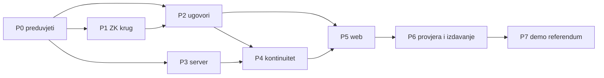
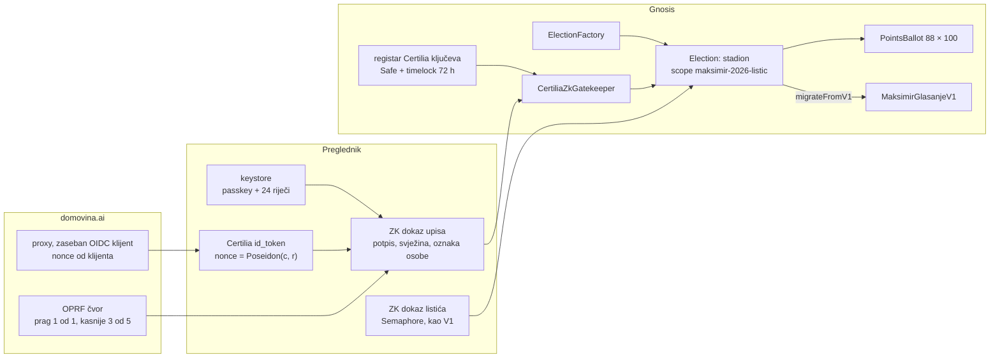

# 9. Stadion V2: referentna instanca općeg modela glasovanja

**Datum:** 8. 10. 2026.\
**Stanje:** plan. Ništa od ovoga još nije implementirano.\
**Polazište:** [opći model glasovanja](../2026-10-08-opci-model-glasovanja.md) i sustavna analiza
postojeće implementacije (ugovor i klijent, server i relayer, stanje svih F-* nalaza), napravljena
8. 10. 2026. samo čitanjem koda i git povijesti.

## Sažetak

Stadion V2 je prva instanca opće tvornice glasovanja. Za glasača se ništa bitno ne mijenja: isti
listić od 100 bodova, isti rezultati uživo, isto dijeljenje glasa. Mijenja se tko jamči da je glasač
stvaran: **umjesto našeg registrara to provjerava ugovor, preko ZK dokaza Certilijinog potpisa.**

Plan ima sedam dijelova. P0 je preduvjet za sve ostale, P1 i P2 mogu ići usporedno, a P7 (demo
referenduma s MACI-jem) dolazi tek nakon što V2 radi na Gnosisu.

| Plan | Što | Ishod |
|---|---|---|
| **P0** | Preduvjeti: otvoreni F-* nalazi, mjerenje Certilijinog tokena, odluke | nema prenesenih dugova; znamo što token sadrži |
| **P1** | ZK krug za Certilia token i oznaku osobe | dokaz u pregledniku, izmjereno vrijeme, verifier |
| **P2** | Ugovori: tvornica, instanca, modul listića, gatekeeperi, registar ključeva | generički ugovori, 100 % pokrivenost, mutacije |
| **P3** | Server: proxy, edge funkcija, OPRF, opća shema baze, relayer | registrar više nije potreban za nove glasače |
| **P4** | Kontinuitet: V1 i faza 1 → V2 bez dvostrukog glasa | pravilo poštenog zbroja preko svih verzija, javno provjerljivo |
| **P5** | Web: zbroj više verzija, ključ po izboru, CSP, vlastiti artefakti | korisnik vidi jedan rezultat; provjera neovisna o nama |
| **P6** | Provjera i izdavanje: Chiado E2E, treći review, Gnosis, dan D2 | V2 na produkciji, javni sažetak |
| P7 | Demo referenduma (DA/NE, MACI) na istoj tvornici | pokazuje referendumski način |

## 1. Polazno stanje: nalazi analize

### 1.1 Što je dobro i ostaje

- Ugovor bez proxyja i pauze, vlasnik Safe 2/3, glasač drži ključ, relayer bez ovlasti.
- Mehanizam selidbe V1 → nasljednik nullifierom već postoji i testiran je.
- Infrastruktura testova je stroga i prenosiva: 100 % pokrivenost ugovora i klijenta, fuzz sa
  stanjem prema referentnom modelu, 23 mutanta vezana uz sigurnosne ciljeve S1–S9, provjera da se
  objavljeni bytecode ne mijenja (`check-frozen`).
- Keystore (passkey + 24 riječi) je općenit.
- Lanac hasheva, OTS i `maksimir_verify.py` su općeniti mehanizmi s malo stadionskih konstanti.

### 1.2 Što je vezano uz stadion

| Sloj | Mjesto | Što |
|---|---|---|
| Ugovor | `MaksimirGlasanjeV1.sol:34-46, 76, 113, 271` | `88`, `100`, scope-ovi, tagovi, EIP-712 ime, `uint256[88]` |
| Klijent | `chain/client/ballot.ts`, `entries.ts`, `read.ts:9` | scope-ovi, domena, 88 |
| Web | `web/src/chainVote.ts:66-73, 306-327`; `glasajView.ts:465-479` | ključevi `maksimir-chain-*`, zbroj jednog ugovora, „100” u kodu |
| Relayer | `web/worker/relayer/relay.ts:59`, `abi.ts:5` | listić od 88 bajtova, ABI V1 |
| Baza | `domovina-api`, tablice `maksimir_*` | jedno glasanje po shemi; `maksimir_settings` je jedan red |
| Checkpoint | `scripts/maksimir_checkpoint.py:75` | manifest `v1.json`, schema `maksimir-snapshot/3` |

### 1.3 Rupe u V1 koje V2 mora zatvoriti

Provjereno u kodu:

1. **Registrar je jedina točka povjerenja za glasače.** Ukraden ključ registrara ili upis u
   `identity_verifications` daje neograničeno izmišljenih glasača, trajno (nema uklanjanja).
2. **`migrate` u V1 nema provjeru roka** (`MaksimirGlasanjeV1.sol:232`). Nakon `closesAt` V1 zbroj se
   još može mijenjati selidbom. V1 je zamrznut, pa provjeru roka mora raditi V2.
3. **`setMerkleTreeDuration(0)`** je poluga vlasnika koja ruši dokaze nad starim korijenima.
4. **Edge funkcija `certilia`** ne provjerava `nonce`, `maxTokenAge` ni `acr`; ukraden `id_token`
   vrijedi do `exp` (F-12).
5. **Nonce danas generira proxy** (`certilia-server/.../authController.js:100`), a klijent ga ne
   može zadati. To je preduvjet za vezanje tokena uz commitment.
6. **Relayer:** jedan glasač može beskonačno slati valjane revizije i potrošiti globalni dnevni
   limit od 5.000 za sve; brojač u KV-u nije atomičan; samo jedan RPC.
7. **Web zbraja samo jedan ugovor** (`chainVote.ts:308`). V2 se ne smije najaviti prije te izmjene.
8. **Cron checkpointa** stvarno radi 4–6 puta dnevno umjesto 24 (F-05).
9. **Sesije proxyja su u memoriji**: restart prekida prijave u tijeku.

### 1.4 Stanje F-* nalaza (8. 10. 2026.)

Od 22 nalaza popravljeni su F-21 i F-22, djelomično F-09/F-17, a F-02 i F-18 su zastarjeli nakon
dana D. Ostali su otvoreni kao rizik izričito prihvaćen 26. 9.
([08, 707-715](08-integracija-s-fazom-1.md)). Za V2:

| Razred | Nalazi |
|---|---|
| **Mora se riješiti prije V2** | F-01 (veza upisa i prvog listića, sad preko Certilia `nonce`), F-04 (vlastiti artefakti s hashem), F-07 (CSP, HSTS), F-10 (rubovi ugovora u tvornici), F-12 (`nonce`, jednokratnost tokena), F-14/F-16 (nema anonimnog upisa bez provjere), F-19 (stari korijeni i opoziv) |
| **Zastarijeva s V2** | F-02, F-08 (u referendumskom načinu), F-13 (nema prijenosa iz faze 1), F-15 (nema registrara), F-18 |
| **Prenosi se** | F-03, F-05, F-06 (s K-05), F-09, F-11, F-17, F-20, C-01 |

## 2. Ciljno stanje

## P0. Preduvjeti

| # | Zadatak | Gotovo kad |
|---|---|---|
| 0.1 | Izmjeriti Certilijin token na produkcijskom toku: ima li `birthdate`, `nonce`, `acr`, `documentType`, `documentIssuingCountry`; točan oblik i duljina JWT-a. Bez spremanja vrijednosti; bilježi se samo prisutnost i oblik. | tablica claimova u ovom dokumentu |
| 0.2 | Udio popunjenog `dob` u `identity_verifications` (samo `count`). | broj u ovom dokumentu |
| 0.3 | Može li Certilia izdati **javnog** PKCE klijenta, bez client secreta? Ako može, proxy nije potreban za glasanje. | odgovor AKD-a |
| 0.4 | Odluka o kompajleru (solc 0.8.28 ili noviji) za sve V2 ugovore. | zapis u ADR-u |
| 0.5 | Ispraviti netočne tvrdnje u dokumentima: `01-arhitektura.md:32`, `08:506` („operater ne zna čiji je listić”), `06:153` („relayer ne bilježi IP”). | commit |
| 0.6 | F-05: zamjenski okidač checkpointa (Cloudflare Cron → `workflow_dispatch`), prikvačen `opentimestamps-client`. | 24 checkpointa dnevno kroz tjedan dana |
| 0.7 | F-06 + K-05: `user.id` passkeyja ne izvoditi iz commitmenta (nova verzija keystorea, stara se i dalje čita). | testovi keystorea, 100 % |
| 0.8 | Testirati passkey na iPhoneu, Androidu i Windows Hellu. | zapis rezultata |

## P1. ZK krug za Certilia token

Cilj: glasač u pregledniku dokaže da ima valjan token, a ugovor provjeri dokaz.

**Javni ulazi:**
- `keyHash`: Poseidon Certilijinog RSA modulusa;
- `aud`: naš client_id za glasanje;
- `now`: trenutak dokaza, ugovor provjerava da je blizu `block.timestamp`;
- `commitment`: Semaphore commitment glasača;
- `t`: oznaka osobe;
- `electionId`;
- `adult`, `citizen`: bitovi.

**Tajni ulazi:** cijeli JWT, RSA potpis, `r` (sol za nonce), OPRF izlaz s dokazom.

**Krug provjerava:**
1. RS256 potpis (SHA-256 + RSA-2048) nad zaglavljem i tijelom JWT-a, ključ odgovara `keyHash`.
2. `iss`, `aud`, `iat ≤ now ≤ exp`, i `now - iat` manji od npr. 10 minuta (svježina).
3. `nonce == Poseidon(commitment, r)`. Sol `r` skriva commitment od Certilije i proxyja (F-01).
4. `birthdate + 18 godina ≤ datum iz definicije izbora` → `adult = 1`.
5. `documentType` / `documentIssuingCountry` → `citizen` (ako P0.1 pokaže da to razlikuje).
6. **Oznaka osobe, provjerljivi OPRF unutar kruga:**
   - `t = k · H(OIB)` na krivulji Baby Jubjub;
   - javni ključ `K = k · G` je u ugovoru;
   - krug provjerava DLEQ dokaz da je `t` izračunat istim `k` kao `K`.
   
   Zato čvor ne može istoj osobi dati dvije različite oznake, pa je jedinstvenost matematička. Čvor
   vidi samo zaslijepljen `H(OIB)`.

| Korak | Zadatak | Gotovo kad |
|---|---|---|
| 1.1 | **Spike:** circom (Anon Aadhaar, zkLogin) ili Noir (`zkemail/noir-jwt`, UltraHonk bez posebne ceremonije). Mjeri se broj ograničenja, vrijeme dokaza u pregledniku na mobitelu i laptopu, i veličina artefakata. | tablica mjerenja, odluka u ADR-u |
| 1.2 | Krug s točkama 1–6 i negativnim testovima: krivi potpis, istekao token, krivi `aud`, krivi `nonce`, 17 godina, strani dokument, krivi OPRF. | svi negativni testovi padaju na pravom mjestu |
| 1.3 | Ceremonija za Groth16 (ako circom) ili univerzalni SRS (ako Noir). | javni transkript |
| 1.4 | Artefakti na vlastitom hostu, hash prikvačen u kodu i u ugovoru (F-04). | klijent odbija artefakt s krivim hashem |
| 1.5 | OPRF čvor (P3.3) i krug koriste isti format `H(OIB)` (hash-to-curve). | zajednički testni vektori |

**Rizik:** ako dokaz na mobitelu traje predugo (npr. više od 60 s), dokaz se radi na laptopu ili
se koristi dokazivač u pregledniku s WebGPU-om. Dokazivanje na serveru nije prihvatljivo, jer bi
server vidio token.

## P2. Ugovori

| Ugovor | Uloga |
|---|---|
| `ElectionFactory` | stvara instance preko CREATE2, bez proxyja i bez dozvola; događaj `ElectionCreated(id, configHash)` |
| `Election` | nepromjenjiva konfiguracija: semaphore, gatekeeper, modul listića, `opensAt`, `closesAt`, scope-ovi, prethodnik; zbroj; `setSuccessor` + `migrate` za buduću V3 |
| `IBallotModule` → `PointsBallot` | `validate(bytes)`, `deltas(old, new)`; samo čita; stadion: `n = 88`, `budget = 100`, `uint8` |
| `IGatekeeper` → `CertiliaZkGatekeeper` | provjerava dokaz iz P1, vraća `personTag`; instanca bilježi iskorištene oznake |
| `CertiliaKeyRegistry` | `keyHash` + `kid` + prozor valjanosti; dodaje Safe 2/3 kroz `TimelockController` (72 h, izvršava bilo tko); opoziv s kraćom odgodom, nikad retroaktivno |
| `OprfKeyRegistry` | javni ključ `K` OPRF-a (kasnije zbirni ključ praga), ista pravila kao gore |

**Stadionska instanca:**
- `scope = "maksimir-2026-listic"`, isti kao V1, da se nullifier ne promijeni pri selidbi;
- `BallotCast` u istom obliku kao V1, zbog indeksera i `maksimir_verify.py`;
- `migrateFromV1(proof)` zove `V1.migrate` i dodatno traži `block.timestamp ≤ closesAt`
  (zatvara rupu 1.3/2);
- `cast` prima nullifier preseljen iz V1 i nullifier novog glasača upisanog preko gatekeepera;
- `merkleTreeDuration` nepromjenjiv ili s donjom granicom (rupa 1.3/3);
- `renounceOwnership` onemogućen, `share()` bez napada preko `validateProof` (F-10, F-19);
- ostaje Semaphore, ne MACI, jer stadion ima javne rezultate i dijeljenje glasa.

| Korak | Zadatak | Gotovo kad |
|---|---|---|
| 2.1 | ADR: sučelja `IBallotModule`, `IGatekeeper`, format `configHash` | ADR prihvaćen |
| 2.2 | Ugovori + testovi + fuzz s referentnim modelom za više vrsta listića | 100 % naredbi, grana, funkcija, linija |
| 2.3 | `mutation-test.mjs` s popisom mutanata po datoteci, novi sigurnosni ciljevi S10+ (gatekeeper, registar ključeva, timelock, rok selidbe) | svi mutanti ubijeni |
| 2.4 | `check-frozen` za tvornicu i instance (manifest tvornice + parametri instance) | CI zelen |
| 2.5 | E2E selidbe nad Chiado V1 (`MockSuccessorV2` zamijenjen pravom instancom) | E2E skripta prolazi |

## P3. Server

| Korak | Zadatak | Gotovo kad |
|---|---|---|
| 3.1 | **Proxy:** zaseban OIDC klijent samo za glasanje; `initialize` prima `nonce` od klijenta i strogo ga provjerava; sesije u Redisu ili KV-u umjesto u memoriji | restart proxyja ne prekida prijavu |
| 3.2 | **Edge funkcija `certilia`:** provjera `nonce`, `maxTokenAge`, jednokratnost tokena (F-12); CORS bez `*` | testovi s ponovljenim i starim tokenom |
| 3.3 | **OPRF čvor:** prima zaslijepljen `H(OIB)` uz ZK dokaz da je iz valjanog tokena (inače bi svatko mogao izračunati oznaku za tuđi OIB); vraća `k · X` + DLEQ; limit po oznaci. Na početku jedan čvor (domovina.ai), zatim prag 3 od 5 bez promjene ugovora: mijenja se samo `K` kroz timelock. | testni vektori zajednički s P1.5 |
| 3.4 | **Opća shema baze:** `elections`, `election_options`, sve tablice s `election_id`; nema anonimnog upisa bez provjere dokaza ili transakcije (F-14/F-16); domena pseudonima `'<election_id>:'`. `maksimir_*` ostaje za V1 i fazu 1. | migracija s assertima, testovi ponašanja |
| 3.5 | **Relayer:** limit po nullifieru i commitmentu (javni ulazi) umjesto samo po IP-u; atomični brojač u Durable Objectu; više RPC-ova; `electionId` i broj opcija iz tvornice; 500 bez poruke iznimke (F-09) | test: jedan glasač ne može potrošiti globalni limit |

Nakon V2, za nove glasače više nisu potrebni `maksimir-register`, `MAKSIMIR_REGISTRAR_KEY_*` ni
`_maksimir_chain_register_for`. Ostaju dok V1 radi, ali V2 ih ne koristi.

## P4. Kontinuitet: V1 i faza 1 → V2 bez dvostrukog glasa

**Problem.** Oznaka osobe u V2 je `t = F_k(OIB)`, a V1 ima samo registrarov HMAC u bazi. Bez
dodatnog koraka osoba koja je glasala u V1 mogla bi se novim ključem upisati i u V2, pa bi glasala
dvaput.

**Rješenje: unaprijed zauzete oznake.**

1. Prije otvaranja V2 server za svakog glasača iz faze 1 i V1 dešifrira OIB i izračuna `t` istim
   OPRF ključem.
2. Skup tih oznaka upisuje se u V2 kao **zauzet**, s vrstom `V1` ili `FAZA1`.
3. **Javna provjera:** broj zauzetih oznaka mora biti jednak `V1.registered` plus broju glasača
   faze 1 s listićem koji nisu preneseni. Oba broja su javna, pa se izostavljanje nekoga vidi.
4. Oznaka vrste `V1` ne može se ponovno upisati preko gatekeepera. Taj glasač glasa u V2 samo
   selidbom svojim V1 ključem (`migrateFromV1`). Ako je izgubio ključ i 24 riječi, njegov V1
   listić ostaje kakav jest.
5. Oznaka vrste `FAZA1` smije se upisati preko gatekeepera. Pravilo zbroja tada isključuje listić
   faze 1 te osobe. Javni zapis faze 1 dobiva stupac `t` po pseudonimu, pa je pravilo provjerljivo.

**Pošten zbroj (javno pravilo):**

> V2 + V1 bez preseljenih nullifiera + listići faze 1 čiji `t` nije upisan u V2 i koji nisu
> preneseni u V1. Listić V2 vrijedi samo ako je predan prije `closesAt`.

| Korak | Zadatak | Gotovo kad |
|---|---|---|
| 4.1 | Skripta za zauzete oznake (jednokratno, uz backup, asserti broja u istoj transakciji) | probni prolaz na kopiji baze |
| 4.2 | Glasači s obrisanim računom (`oib_hash` bez šifre OIB-a): broj se objavljuje, a njihov listić faze 1 ostaje zamrznut | broj u javnom sažetku |
| 4.3 | `maksimir_checkpoint.py` i `maksimir_verify.py`: parametar `--election`, popis ugovora iz manifesta, pravilo poštenog zbroja, provjera dokaza uz svaki `Registered` | verify ponavlja zbroj iz javnih podataka |
| 4.4 | Isti postupak promjene zastavica kao na dan D: asserti u istoj transakciji, put natrag | runbook u `03-deploy-runbook.md` |

**Što ostaje.** Zauzete oznake sastavlja operater. Brojanje to provjerava, ali ne i koja je oznaka
čija. To vrijedi samo za glasače prije V2; novi glasači su potpuno bez povjerenja u operatera.

## P5. Web

| Korak | Zadatak | Gotovo kad |
|---|---|---|
| 5.1 | Zbroj preko svih verzija po pravilu iz P4 (`chainResults` danas čita jedan ugovor) | isti broj kao `maksimir_verify.py` |
| 5.2 | Upis preko Certilia dokaza: prijava → nonce sa soli → dokaz u pregledniku → gatekeeper | E2E na Chiadu |
| 5.3 | Ključ po izboru `HKDF(tajna, electionId)`, da se upisi iste osobe na različitim glasanjima ne mogu povezati; stadion zadržava izvorni ključ zbog V1 | testovi keystorea |
| 5.4 | CSP i HSTS na Workeru, bez `html: true` u markdownu i bez `loose` u mermaidu gdje nije nužno (F-07) | provjera zaglavlja u `npm run check` |
| 5.5 | Veza commitment ↔ nullifier ne stoji u čistom tekstu u `localStorage` (F-20) | test |
| 5.6 | Provjera korijena na drugom RPC-u (C-01) i stranica „provjeri da je moj glas na lancu” (C3) | ručna provjera u pregledniku |
| 5.7 | `/glasanje` i `/glasaj` rade nad V2 (`npm run test:paritet`) | paritet prolazi |

## P6. Provjera i izdavanje

1. Svi gateovi: pokrivenost 100 %, mutacije, fuzz, `check-frozen`, `npm run check`, paritet.
2. Cijeli tok na Chiadu, uključujući selidbu iz Chiado V1 i zauzete oznake na kopiji baze.
3. **Treći neovisni review** kao zaseban dokument u `docs/review/`, s tagom
   `audit-<model>-<datum>-v2`; nalazi se popravljaju prije Gnosisa.
4. Deploy tvornice i stadionske instance na Gnosis; manifest u `chain/deployments/gnosis/`.
5. Web zbraja više verzija **prije** `setSuccessor`.
6. `setSuccessor(V2)` sa Safea (jednom, nepovratno).
7. Javni sažetak, primjerice `/glasanje-dan-d2`, po uzoru na [Dan D](../2026-09-26-dan-d.md).

## P7. Demo referenduma (nakon V2)

Druga instanca iste tvornice: DA/NE, `CertiliaZkGatekeeper` kao MACI politika upisa (MACI v3 već
ima `AnonAadhaarPolicy` i `SemaphorePolicy` istog oblika), šifrirani listići, rezultat tek nakon
zatvaranja, samo „glasao sam”. Detaljan plan nastaje nakon P6.

## Odluke koje treba donijeti

| # | Odluka | Preporuka |
|---|---|---|
| O1 | circom ili Noir za krug | odlučuje spike P1.1 po vremenu dokaza na mobitelu |
| O2 | OPRF na početku | jedan čvor (domovina.ai) s provjerom u krugu; prag 3 od 5 kad se nađu institucije, bez promjene ugovora |
| O3 | Izgubljen V1 ključ | V1 listić ostaje, novi upis nije moguć (jednostavno i provjerljivo) |
| O4 | Timelock za Certilia ključeve | 72 h za dodavanje, 24 h za opoziv |
| O5 | Rok stadionskog glasanja u V2 | isti kao V1: 31. 12. 2027. |

## Rizici plana

- **Certilia ne vraća `nonce` ili `birthdate`.** Bez `nonce` token se ne može vezati uz commitment.
  Tada je potreban drugi način, npr. potpis commitmenta ključem iz tokena, ako postoji. P0.1 je zato
  prvi korak.
- **Certilia rotira ključ bez najave.** Novi glasači tada čekaju timelock od 72 h. Ublažava se
  praćenjem JWKS-a (dojava pri promjeni) i dogovorom s AKD-om.
- **Operater poslužuje JavaScript prijave.** Mogao bi pri prijavi podmetnuti svoj commitment uz
  glasačev token. Ublažava se zasebnim OIDC klijentom, ponovljivom izgradnjom s objavljenim
  hashem, provjerom upisa iz neovisnog klijenta i time što glasač na lancu vidi svoj commitment
  odmah nakon upisa.
- **Mobiteli su prespori za RSA krug.** Spike P1.1 to mjeri prije svega ostalog.

## Vezani dokumenti

- [Opći model glasovanja](../2026-10-08-opci-model-glasovanja.md)
- [07 — verzioniranje](07-verzioniranje.md) i [08 — integracija s fazom 1](08-integracija-s-fazom-1.md)
- [Neovisni reviewi](../review/README.md)
- [Interni audit](audit/README.md)
