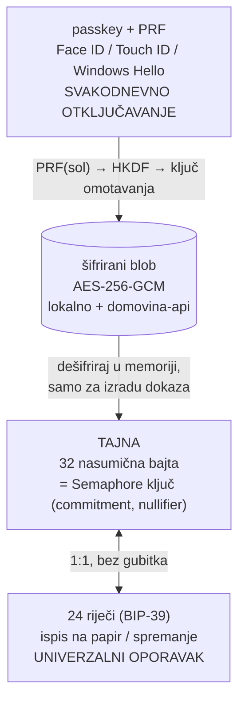
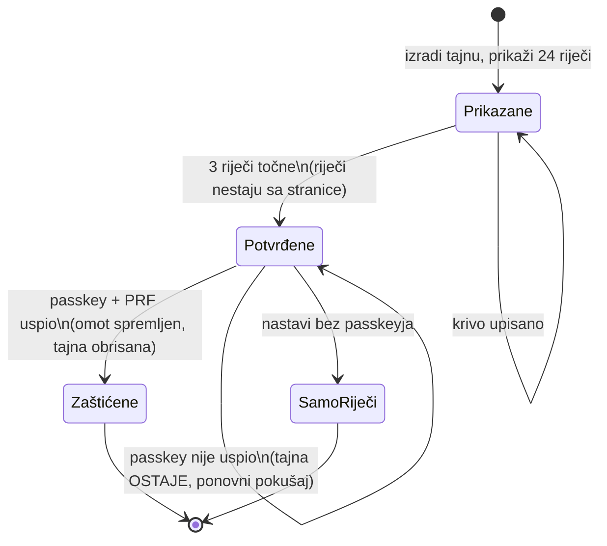

# ADR 0001 — Ključ glasača: 24 riječi + passkey (PRF) za svakodnevno otključavanje

**Status:** prihvaćeno (26. 9. 2026.); implementirano u `chain/client/keystore.ts`, 100 % pokrivenost testovima
**Odlučuje:** Matija Stepanić
**Odnosi se na:** `MaksimirGlasanjeV1` (ugovor se **ne mijenja**), [06-kontrola-glasaca.md](../06-kontrola-glasaca.md)
**Srodno:** `pay.domovina.ai` ADR 0011, 0012 (passkey + seed kao drugi vlasnik Safea), 0013

## Kontekst

Glasačev Semaphore ključ (32 bajta) je jedino što daje pravo mijenjati njegov listić
([06](../06-kontrola-glasaca.md)). U fazi 1 ključ živi u `localStorage` i u preuzetoj datoteci
`maksimir-zk-kljuc.txt` (base64). Ima dva problema:

1. **Curenje.** Datoteka u `Downloads`, u sinkroniziranoj mapi ili u privitku e-maila znači da
   netko drugi može mijenjati glasačev listić.
2. **Gubitak.** Tko je nema, ne može promijeniti listić, a registrar izdaje pravo glasa samo jednom
   po osobi.

Passkey (iCloud Keychain, Google Password Manager, Windows Hello) rješava oboje: sinkronizira se
preko računa, a otključava biometrijom. Postoje dvije prepreke:

- **ZK dokaz se izrađuje u pregledniku iz same tajne.** Passkey ne zna izraditi Semaphore dokaz,
  pa ne može sam „potpisivati” kao u `pay.domovina.ai` (P-256 potpis na lancu). Tajna u
  trenutku dokaza mora postojati u JS memoriji.
- Passkey potpis vezan je uz javni ključ passkeyja, a registrar zna čiji je koji. Potpisivanje na
  lancu passkeyjem uništilo bi anonimnost listića.

Zato passkey ne potpisuje, nego **otključava** tajnu, preko WebAuthn **PRF** ekstenzije.

## Odluka

### 1. Jedna tajna, dva pristupa



- **Tajna** je 32 nasumična bajta, isto kao danas (`Identity.export()` je base64 tih bajtova).
  Postojeći ključ iz faze 1 ostaje isti. Provjereno: base64 → 24 riječi → natrag daje isti commitment.
- **24 riječi** su ista tajna u obliku BIP-39 (256 bita entropije + kontrolni zbroj). Namijenjene su
  papiru i trezoru, kao seed fraza novčanika. Riječi nisu Ethereum seed i ne smiju se unositi
  u MetaMask. Web to piše uz njih.
- **Passkey** tajnu ne izvodi, nego je **omata**: ključ omotavanja izračuna se iz PRF izlaza, a
  njime se šifrira tajna. Šifrirani blob bez passkeyja nema nikakvu vrijednost.

### 2. Zašto omatanje, a ne izvođenje tajne izravno iz PRF-a

| | izvođenje (tajna = f(PRF)) | **omatanje (odabrano)** |
|---|---|---|
| Treba li spremati blob | ne | da (mali, šifriran) |
| Novi passkey (izgubljen stari, prelazak iPhone → Android) | **nova tajna**: drugi nullifier, a registracija je samo jedna, pa je glas izgubljen | ista tajna, samo novi omot |
| Više passkeyja (iPhone i Windows Hello) | svaki svoja tajna | svi otključavaju istu |
| 24 riječi | moraju se izvesti iz PRF-a, pa passkey mora postojati pri izradi | neovisne o passkeyju |

Presudan je gubitak passkeyja. Uz izvođenje on zauvijek mijenja ključ, a uz omatanje ne mijenja ništa.

### 3. Fiksne vrijednosti (ne mijenjaju se nikad, kao scope u ugovoru)

| Vrijednost | Prijedlog | Zašto je trajna |
|---|---|---|
| `rpId` passkeyja | `domovina.ai` | passkey je vezan uz domenu; `domovina.ai` vrijedi za sve poddomene (`maksimir.`, `stadion-maksimir.`) |
| PRF sol | `sha256("maksimir-2026/keystore/v1")` | druga sol daje drugi ključ omotavanja, pa stari blobovi postaju nečitljivi |
| HKDF | SHA-256, `info = "maksimir-keystore-v1"` | isto |
| Šifra | AES-256-GCM, nasumičan 96-bitni IV, AAD = `credentialId` | blob vezan uz točno taj passkey |

### 4. Gdje živi šifrirani blob

- **Lokalno** (`localStorage`, `maksimir-keystore-v1`) za brzi pristup.
- **U `domovina-api`**, tablica `maksimir_keystore(credential_id_hash, blob, created_at)`, čitljiva
  svakome tko zna `credentialId`. Blob je bez passkeyja beskoristan, pa javno čitanje ne otkriva
  ništa. Tako novi uređaj s istim (sinkroniziranim) passkeyjem odmah nađe svoj blob.
- **Ne** u passkeyju (`largeBlob` ekstenzija): podrška je neujednačena, a blob mora preživjeti
  i prelazak na drugi ekosustav.
- Tablica **ne** sadrži korisnika, OIB ni commitment. Upis ide bez prijave, s bilo kojeg uređaja.

### 5. Tokovi

```mermaid
sequenceDiagram
  autonumber
  actor U as Glasač
  participant B as Preglednik
  participant K as Passkey (Face ID)
  participant S as domovina-api (blob)

  rect rgb(235, 245, 255)
  Note over U,S: Prvi put (nakon eOsobne)
  B->>B: tajna = 32 nasumična bajta (ili uvoz ključa iz faze 1)
  B->>U: prikaži 24 riječi → „zapiši ili isprintaj”
  U->>B: potvrdi 3 nasumične riječi
  B->>K: create passkey (rpId domovina.ai, PRF)
  K-->>B: PRF(sol)
  B->>B: omot = AES-GCM(HKDF(PRF), tajna)
  B->>S: spremi omot pod hash(credentialId)
  B->>B: registracija commitmenta (registrar → relayer), kao u V1
  end

  rect rgb(240, 255, 240)
  Note over U,S: Svaki put (glasanje)
  U->>K: Face ID
  K-->>B: PRF(sol)
  B->>B: dešifriraj omot → tajna SAMO u memoriji
  B->>B: ZK dokaz → relayer; tajna se briše iz memorije
  end

  rect rgb(255, 245, 235)
  Note over U,S: Oporavak (izgubljen passkey / novi ekosustav)
  U->>B: upiše 24 riječi
  B->>B: tajna → isti commitment, isti nullifier, isti listić
  B->>K: novi passkey → novi omot → S
  end
```

### 6. Preglednik bez PRF-a

Web prvo provjeri podršku (`getClientExtensionResults().prf.enabled` pri izradi). Ako je nema:

- tajna se drži samo za trajanje posjeta (ne u `localStorage`);
- glasač se svaki put prijavljuje s **24 riječi** ili učita datoteku;
- jasna poruka: „Ovaj preglednik ne podržava otključavanje passkeyjem. Tvoje riječi su jedini ključ.”

Podrška u rujnu 2026.: iCloud Keychain (iOS 18.4+, macOS 15, Safari 18+, Chrome 132+, Firefox 139+),
Google Password Manager (Android, zadano), Windows Hello (od veljače 2026., Chrome 147+, Firefox 148+).
Izvori: [Corbado](https://www.corbado.com/blog/passkeys-prf-webauthn),
[Yubico](https://developers.yubico.com/WebAuthn/Concepts/PRF_Extension/Developers_Guide_to_PRF.html).

## Prijetnje

| Prijetnja | Faza 1 (datoteka) | Ova odluka |
|---|---|---|
| Kopija ključa na disku, sinkronizaciji ili u privitku | da (`Downloads`) | nema datoteke; tajna je samo šifrirana ili na papiru |
| Ključ u `localStorage` (XSS, ekstenzija s pristupom stranici) | da, trajno | samo šifriran; otvoren samo u trenutku dokaza, iza Face ID-ja |
| Ukraden uređaj | ključ je čitljiv | treba biometrija ili PIN uređaja |
| Procurio blob iz baze | — | bez passkeyja beskoristan (AES-256-GCM) |
| Zlonamjeran kôd stranice | krade ključ | **i dalje može**: dok je tajna otvorena, JS je vidi. To je granica svakog ZK-u-pregledniku rješenja ([06](../06-kontrola-glasaca.md#iskrene-granice)) |
| Procurjelih 24 riječi | isto kao datoteka | isto: netko može mijenjati listić. Riječi se čuvaju kao seed fraza |
| Izgubljen passkey | — | 24 riječi → novi passkey, isti ključ |
| Izgubljeni i passkey i riječi | listić zamrznut | isto: zadnji listić se broji, ali se ne može mijenjati |
| Kompromitiran Apple ili Google račun + otključan uređaj | — | napadač otvori tajnu; zaštita je ista kao za sve ostalo na tom računu |

## Odbačene opcije

- **Samo datoteka (faza 1):** curenje i gubitak, vidi kontekst.
- **Passkey potpisuje na lancu (P-256):** ZK dokaz ne može iz passkeyja, a potpis bi otkrio glasača.
- **Tajna izvedena iz PRF-a:** gubitak passkeyja gubi glas, vidi odluku 2.
- **Blob u `largeBlob`:** neujednačena podrška; ne preživi prelazak ekosustava.
- **Skrbnički oporavak (mi čuvamo kopiju):** tko može vratiti ključ, može i glasati umjesto glasača.

## Posljedice

- Ugovor V1 i relayer se ne mijenjaju. Mijenja se samo klijent (`chain/client/keystore.ts`) i web.
- Nova tablica `maksimir_keystore` u `domovina-api` (bez osobnih podataka).
- Postojeći ključevi iz faze 1: web ponudi „prikaži moje 24 riječi” i „zaštiti passkeyjem”. Ključ
  ostaje isti.
- `rpId = domovina.ai` znači da passkey za glasanje dijeli domenu s ostalim domovina.ai uslugama.
  Passkey je poseban zapis (drugi `user.id`), pa se ne miješa s prijavom ili novčanikom.

## Riješena pitanja (Matija, 26. 9. 2026.)

1. **`rpId = domovina.ai`**, dakle passkey vrijedi na svim poddomenama.
2. **Potvrda riječi je obavezna.** Prije prve predaje glasač upisuje 3 nasumične riječi od 24.
3. **Riječi se prikazuju pri izradi, a kasnije samo uz svjež passkey** (izmjena 26. 9. 2026.,
   nakon stvarnog testa u kojem Matija riječi nije zapisao).
   - Pri izradi: prikaz, potvrda 3 riječi, zatim riječi nestaju sa stranice.
   - Kasnije: „Prikaži moje riječi” traži svjež Face ID ili Touch ID (`revealWords()`), upozorava
     na promatrače i skriva riječi na klik ili nakon 2 minute.
   - Bez passkeyja (samo riječi) nema što prikazati, jer je papir jedina kopija.

   **Zašto ponovni prikaz ne smanjuje sigurnost:** tko ima passkey, već može otključati ključ i
   glasati, pa mu riječi ne daju ništa više. Zabrana bi samo spriječila vlasnika da napravi kopiju.
   Isto rade MetaMask i Coinbase Wallet („Reveal Secret Recovery Phrase” uz lozinku ili biometriju).

   Tekst za glasača: „Riječi se ne spremaju nigdje osim šifrirano tvojim passkeyjem. Mi ih ne
   možemo vidjeti ni vratiti. Ako izgubiš i passkey i riječi, ključ je nepovratno izgubljen.”
4. **EIP-7702** ne utječe na ovu odluku ([istraživanje](../istrazivanja/2026-09-26-eip7702-passkey-gnosis.md)).

## Pravilo toka: neuspjeli passkey ne smije izgubiti ključ (K-01)

Pronađeno pri prvom testu sa stvarnim passkeyjem. Kad izrada passkeyja ne uspije (npr. prozor
nema fokus, korisnik otkaže dijalog, preglednik nema PRF), tajna **ostaje u memoriji** i nudi se
ponovni pokušaj ili nastavak samo s riječima. Glasač je riječi već zapisao. Kad bi se tajna
obrisala, zapisane riječi bi i dalje vrijedile, ali stranica ne bi imala što zaštititi, pa bi
glasač morao počinjati ispočetka i ne bi znao koje riječi vrijede.



## Test sa stvarnim preglednikom (26. 9. 2026.)

| Provjera | Rezultat |
|---|---|
| Brave (Chromium 153) na macOS-u, `getClientCapabilities()` | `extension:prf: true`, `relatedOrigins: true`, `hybridTransport: true` |
| WebAuthn iz automatiziranog, nefokusiranog prozora | odbijeno: „page does not have focus”. Preglednik traži da je stranica u prvom planu (ispravno) |
| Tok izrade nakon te greške | otkrio K-01 (popravljeno) |
| Izrada passkeyja (Matija potvrdio dijalog) | ✔ passkey „Maksimir TEST (localhost)” u iCloud Keychainu, PRF izlaz dobiven, omot spremljen |
| Otključavanje passkeyjem | ✔ isti passkey, **isti commitment** kao pri izradi (`3790297512…`) |
| Opaženo | gumb „Izradi ključ” kliknut više puta, pa je svaki put nastala nova tajna i nove riječi (K-02). **Popravljeno:** gumb je neaktivan dok ključ postoji |

## Plan implementacije

- [x] `chain/client/keystore.ts`: `newSecret`, `toWords`/`fromWords`, `fromPhase1Export`,
      `wrapWithPasskey`/`unwrapWithPasskey` (WebAuthn PRF + HKDF + AES-GCM, sve Web Crypto),
      `prfSupported`
- [x] testovi (Node, 26 testova, 100 % naredbi/grana/funkcija/linija): riječi ↔ tajna ↔ commitment; omot/otomot s lažnim PRF izlazom; krivi
      `credentialId` (AAD) pada; neispravne riječi (kontrolni zbroj) padaju
- [x] test stranica (`npm run demo`, `chain/client/demo/`): vođeni tok od 7 koraka sa stanjima
      (čeka / sada / gotovo / nije uspjelo), objašnjenja za laike, rječnik
- [x] stvarni passkey (Brave, iCloud Keychain): izrada i otključavanje, isti otisak
- [x] `revealWords()` (ponovni prikaz uz passkey) + testovi u Braveu (Mac Mini, iCloud Keychain) i na iPhoneu
- [ ] `domovina-api`: tablica `maksimir_keystore` + dva javna RPC-a (upiši, čitaj po hashu)
- [ ] web (nakon Astro migracije): tokovi iz odluke 5
