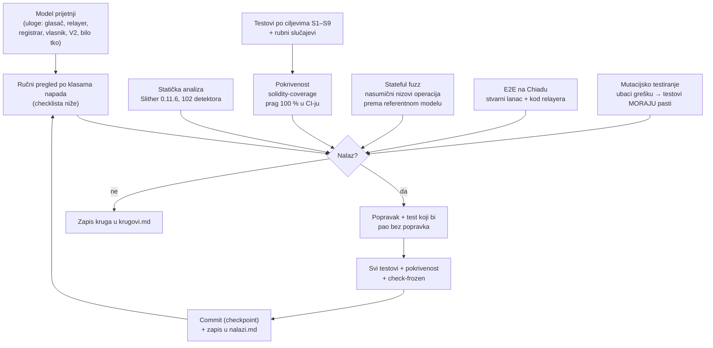

# Audit `MaksimirGlasanjeV1`

Ovo je trajni zapis o tome kako je ugovor provjeravan, što se tražilo, što je nađeno i kako je
popravljeno. Audit je iterativan: svaki krug ima metode, nalaze, popravke i commit (checkpoint).
Dnevnik nalaza je u [nalazi.md](nalazi.md), a rezultati po krugovima u [krugovi.md](krugovi.md).

> **Ograničenje.** Nijedan audit ni alat ne dokazuje da ranjivost ne postoji. Ovdje se dokazuje
> da su poznate klase napada provjerene, da svaka linija i grana ugovora ima test i da invarijante
> izdrže nasumične nizove operacija. Ugovor ne drži novac. Najveća šteta bila bi netočan zbroj ili
> tuđi glas, a upravo na to su testovi usmjereni. Za dodatnu sigurnost preporučuje se neovisni
> vanjski pregled prije nego glasanje dobije stvarnu težinu.

## Što se štiti (sigurnosni ciljevi)

| # | Cilj | Kršenje bi značilo |
|---|---|---|
| S1 | Listić vrijedi samo uz ključ glasača | netko glasa umjesto drugoga |
| S2 | Sadržaj listića ne može mijenjati nitko osim glasača | relayer ili operater mijenja bodove |
| S3 | Jedan ključ = jedan živi listić, u svim verzijama ukupno | dvostruko glasanje |
| S4 | Zbroj je uvijek jednak zbroju živih listića | lažni rezultat |
| S5 | Pravo glasa daje samo registrar | izmišljeni glasači bez registrara |
| S6 | Vlasnik ne može dirati listiće, rok ni zbroj | centralizirana manipulacija |
| S7 | Nakon roka nema promjena | naknadno glasanje |
| S8 | Listić nije povezan s osobom ni s objavom „glasao sam” | gubitak anonimnosti |
| S9 | Relayer ne može trajno cenzurirati | glasač ovisi o nama |

## Metode



### Checklista klasa napada

| Klasa | Kako je provjereno | Status |
|---|---|---|
| Krivotvoren / pokvaren ZK dokaz | test `pokvaren SNARK → InvalidProof`; Semaphore verifier (auditiran, PSE) | ✔ |
| Zamjena sadržaja uz valjan dokaz | poruka = hash listića + revizija + lanac + adresa; testovi `WrongMessage` | ✔ |
| Replay: isti paket ponovno | revizija strogo +1; test `BadRevision` | ✔ |
| Replay: stariji paket, preskakanje revizije | test relayer zadrži reviziju 2 i pošalje 3 | ✔ |
| Replay između lanaca / verzija | `chainId` i adresa u poruci i EIP-712 domeni; testovi | ✔ |
| Replay dokaza između funkcija (listić ↔ objava ↔ selidba) | različit scope/poruka; testovi `WrongScope`, `WrongMessage` | ✔ |
| Potpis registrara: tuđi, istekao, produžen rok, drugi commitment | 5 testova; OZ `ECDSA` (odbija malleable `s`) | ✔ |
| Dvostruka registracija | Semaphore `LeafAlreadyExists` + jedna osoba = jedan potpis (registrar) | ✔ / registrar |
| Dvostruko glasanje preko verzija | nalaz **A-01**, popravljen (`UseSuccessor`) | ✔ |
| Neispravan listić (duljina, zbroj) | `BadBallotLength`, `BadPointsSum` | ✔ |
| Overflow / underflow zbroja | Solidity 0.8 provjere; invarijanta S4 u fuzzu | ✔ |
| Reentrancy | vanjski pozivi samo prema `immutable` Semaphoreu; CEI u `register` (A-04) | ✔ |
| Kontrola pristupa | vlasnik: 3 funkcije + `Ownable2Step`; testovi neovlaštenih poziva | ✔ |
| Front-running | paket je zapečaćen; tko god ga pošalje, učinak je isti | ✔ po dizajnu |
| DoS: petlje, veliki ulaz | jedina petlja ima fiksnih 88 koraka | ✔ |
| DoS: istek korijena | stari korijen vrijedi 1 h; test | ✔ |
| Vrijeme | `closesAt` `immutable`; testovi zatvaranja; odstupanje validatora ±s nebitno | ✔ |
| Nadogradnja / proxy / selfdestruct | nema ih | ✔ |
| Povezivost (S8) | test: nullifier listića ≠ nullifier objave | ✔ |

## Alati i verzije

| Alat | Verzija | Uloga |
|---|---|---|
| solc | 0.8.28, optimizer 200, `cancun` | kompajler (zaključan) |
| Hardhat + viem | 2.29.1 / 2.56.9 | testovi, deploy |
| solidity-coverage | 0.8.x | pokrivenost; `scripts/check-coverage.mjs` = prag 100 % |
| Slither | 0.11.6 | statička analiza |
| Semaphore v4 | 4.14.3 | ZK krug i verifier (vanjski, auditiran) |
| OpenZeppelin | 5.6.1 | `Ownable2Step`, `EIP712`, `ECDSA` |

## Kako ponoviti

```sh
cd chain
npx hardhat test                 # svi testovi (V1 osnovni, rubni, fuzz)
npm run coverage                 # 100 % ili pada
npm run check-frozen             # zamrznuti izvor
npm run mutation                 # 22 mutanta, svi moraju biti ubijeni
FUZZ_SEEDS=10 FUZZ_OPS=80 npx hardhat test test/v1/v1.fuzz.test.ts
slither . --filter-paths "node_modules|contracts/test"
npx tsx scripts/e2e-chiado.ts    # stvarni lanac
```

## Regresija

Testovi svake verzije žive u `test/v<N>/` i **nikad se ne brišu**. Kad dođe V2, CI i dalje
pokreće `test/v1/`. Izvor V1 je zamrznut (`check-frozen`), a prag pokrivenosti vrijedi za svaku
verziju u `contracts/v*/`. Promjena koja slomi bilo koju raniju verziju ili njezine testove ne
može proći CI.
