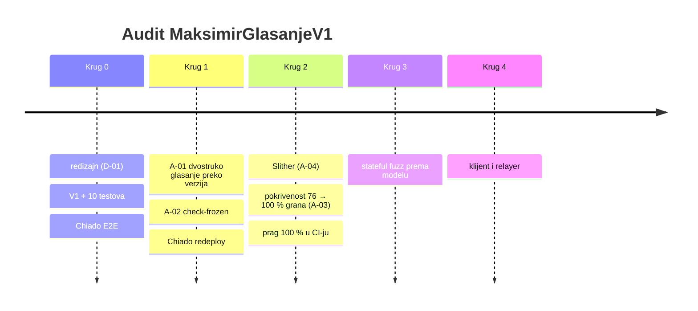

# Krugovi audita

Svaki krug završava zelenim testovima i commitom (checkpoint na grani `feat/glasanje-onchain`).

## Krug 0 — redizajn i prvi testovi

- **Metoda:** pregled nacrta prema zahtjevu „glasač ima kontrolu, relayer samo prosljeđuje”.
- **Nalaz:** D-01, pa redizajn u V1.
- **Rezultat:** 10 testova; Chiado E2E: 3 pokušaja podmetanja odbijena.

## Krug 1 — verzije i alat za zamrzavanje

- **Metoda:** pisanje checkliste za V2; obrnuti test alata (mora pasti kad treba).
- **Nalazi:** A-01 (visoka), A-02.
- **Rezultat:** popravak + test; Chiado redeploy `0x88Bd…3989` i ponovljen E2E.

## Krug 2 — statička analiza i pokrivenost

| Mjera | Prije | Poslije |
|---|---:|---:|
| Naredbe | 93,22 % | **100 %** |
| Grane | 75,71 % | **100 %** |
| Funkcije | 81,25 % | **100 %** |
| Linije | 94,94 % | **100 %** |
| Testova | 10 | 32 |

- **Slither:** 6 napomena, nijedna iskoristiva (A-04).
- **Pokrivenost:** 17 nepokrivenih grana, pa 22 nova rubna testa (`test/v1/v1.edge.test.ts`).
  Jedna grana nije bila dohvatljiva, jer je bila mrtav kôd (A-03).
- **Novo ponašanje pod testom** (pokrivenost ga ne mjeri): istek starog korijena, stari korijen
  unutar trajanja, EIP-712 domena (drugi ugovor ili lanac), produžen rok potpisa, dvostupanjski
  prijenos vlasništva, nepovezivost objave i listića, selidba ključa bez listića i povučenog listića.
- **CI:** `npm run coverage` pada ispod 100 % za bilo koji `contracts/v*/`.
