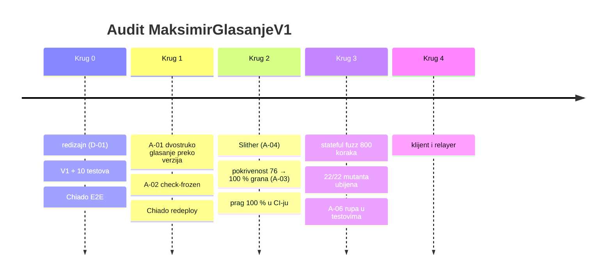
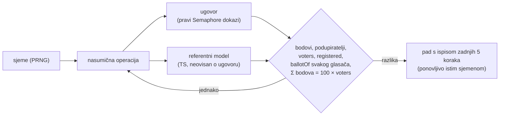

# Krugovi audita

Svaki krug završava zelenim testovima i commitom (checkpoint na grani `feat/glasanje-onchain`).

## Krug 0 — redizajn i prvi testovi

- **Metoda:** pregled nacrta prema zahtjevu „glasač ima kontrolu, relayer samo prosljeđuje”.
- **Nalaz:** D-01, pa redizajn u V1.
- **Rezultat:** 10 testova; Chiado E2E: 3 pokušaja podmetanja odbijena.

## Krug 1 — verzije i alat za zamrzavanje

- **Metoda:** pisanje checkliste za V2; obrnuti test alata (mora pasti kad treba).
- **Nalazi:** A-01 (visoka), A-02.
- **Rezultat:** popravak + test; Chiado redeploy `0x88Bd…3989` i ponovljen E2E.

## Krug 2 — statička analiza i pokrivenost

| Mjera | Prije | Poslije |
|---|---:|---:|
| Naredbe | 93,22 % | **100 %** |
| Grane | 75,71 % | **100 %** |
| Funkcije | 81,25 % | **100 %** |
| Linije | 94,94 % | **100 %** |
| Testova | 10 | 32 |

- **Slither:** 6 napomena, nijedna iskoristiva (A-04).
- **Pokrivenost:** 17 nepokrivenih grana, pa 22 nova rubna testa (`test/v1/v1.edge.test.ts`).
  Jedna grana nije bila dohvatljiva, jer je bila mrtav kôd (A-03).
- **Novo ponašanje pod testom** (pokrivenost ga ne mjeri): istek starog korijena, stari korijen
  unutar trajanja, EIP-712 domena (drugi ugovor ili lanac), produžen rok potpisa, dvostupanjski
  prijenos vlasništva, nepovezivost objave i listića, selidba ključa bez listića i povučenog listića.
- **CI:** `npm run coverage` pada ispod 100 % za bilo koji `contracts/v*/`.

## Krug 3 — stateful fuzz i mutacijsko testiranje

### Fuzz prema referentnom modelu (`test/v1/v1.fuzz.test.ts`)

Operacije: registracija, listić, povlačenje, objava, najava V2, selidba te **napadi**: podmetnuti
bodovi, stari paket, preskočena revizija, neregistriran ključ, zbroj ≠ 100, drugi scope, pokvaren
SNARK, kriva duljina, dvostruka objava, dvostruka selidba i listić nakon roka.

| Pokretanje | Sjemena × operacija | Rezultat |
|---|---|---|
| CI (zadano) | 3 × 30 | prolazi |
| lokalno | 10 × 80 = 800 koraka | prolazi, stanje = model nakon svakog koraka |

### Mutacijsko testiranje (`scripts/mutation-test.mjs`)

22 mutanta, svaki krši jedan sigurnosni cilj (S1–S8). Testovi moraju pasti za svaki.

| Rezultat | Broj |
|---|---:|
| ubijeno | **22** |
| preživjelo | 0 |

Nalaz **A-06**: M17 (provjera scopea) hvatao je samo jedan test, i to slučajno. Dodan je izravan
test i fuzz napad, pa sad padaju 2 testa iz pravog razloga.

| Mutant | Cilj | Testova pada |
|---|---|---:|
| M01 stari bodovi se ne oduzimaju | S4 | 4 |
| M02/M03 revizija preskače / ponavlja | S3 | 3 / 3 |
| M04 poruka se ne provjerava | S2 | 3 |
| M05 verifyProof ignoriran | S1 | 2 |
| M06 bez UseSuccessor (A-01) | S3 | 1 |
| M07 zbroj ≠ 100 | S4 | 3 |
| M09 registracija bez potpisnika | S5 | 4 |
| M10 bez roka | S7 | 3 |
| M17 bez provjere scopea (A-06) | S2/S3 | 2 |
| M22 rok nije u potpisu | S5 | 22 |
| ostali (M08, M11–M16, M18–M21) | S3–S8 | ≥ 1 |

Mutanti na koje pada samo jedan test (npr. M06, M14, M15, M21) imaju ciljani test za točno tu
provjeru. To je dovoljno, jer mutacija ne može proći neprimijećeno.
