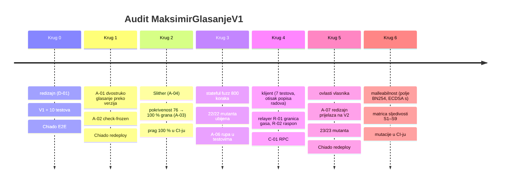
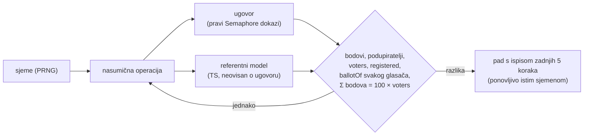
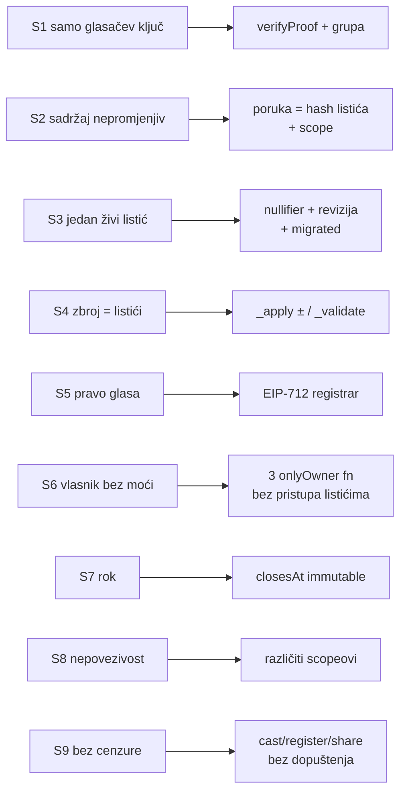

# Krugovi audita

Svaki krug završava zelenim testovima i commitom (checkpoint na grani `feat/glasanje-onchain`).

## Krug 0 — redizajn i prvi testovi

- **Metoda:** pregled nacrta prema zahtjevu „glasač ima kontrolu, relayer samo prosljeđuje”.
- **Nalaz:** D-01, pa redizajn u V1.
- **Rezultat:** 10 testova; Chiado E2E: 3 pokušaja podmetanja odbijena.

## Krug 1 — verzije i alat za zamrzavanje

- **Metoda:** pisanje checkliste za V2; obrnuti test alata (mora pasti kad treba).
- **Nalazi:** A-01 (visoka), A-02.
- **Rezultat:** popravak + test; Chiado redeploy `0x88Bd…3989` i ponovljen E2E.

## Krug 2 — statička analiza i pokrivenost

| Mjera | Prije | Poslije |
|---|---:|---:|
| Naredbe | 93,22 % | **100 %** |
| Grane | 75,71 % | **100 %** |
| Funkcije | 81,25 % | **100 %** |
| Linije | 94,94 % | **100 %** |
| Testova | 10 | 32 |

- **Slither:** 6 napomena, nijedna iskoristiva (A-04).
- **Pokrivenost:** 17 nepokrivenih grana, pa 22 nova rubna testa (`test/v1/v1.edge.test.ts`).
  Jedna grana nije bila dohvatljiva, jer je bila mrtav kôd (A-03).
- **Novo ponašanje pod testom** (pokrivenost ga ne mjeri): istek starog korijena, stari korijen
  unutar trajanja, EIP-712 domena (drugi ugovor ili lanac), produžen rok potpisa, dvostupanjski
  prijenos vlasništva, nepovezivost objave i listića, selidba ključa bez listića i povučenog listića.
- **CI:** `npm run coverage` pada ispod 100 % za bilo koji `contracts/v*/`.

## Krug 3 — stateful fuzz i mutacijsko testiranje

### Fuzz prema referentnom modelu (`test/v1/v1.fuzz.test.ts`)

Operacije: registracija, listić, povlačenje, objava, najava V2, selidba te **napadi**: podmetnuti
bodovi, stari paket, preskočena revizija, neregistriran ključ, zbroj ≠ 100, drugi scope, pokvaren
SNARK, kriva duljina, dvostruka objava, dvostruka selidba i listić nakon roka.

| Pokretanje | Sjemena × operacija | Rezultat |
|---|---|---|
| CI (zadano) | 3 × 30 | prolazi |
| lokalno | 10 × 80 = 800 koraka | prolazi, stanje = model nakon svakog koraka |

### Mutacijsko testiranje (`scripts/mutation-test.mjs`)

22 mutanta, svaki krši jedan sigurnosni cilj (S1–S8). Testovi moraju pasti za svaki.

| Rezultat | Broj |
|---|---:|
| ubijeno | **22** |
| preživjelo | 0 |

Nalaz **A-06**: M17 (provjera scopea) hvatao je samo jedan test, i to slučajno. Dodan je izravan
test i fuzz napad, pa sad padaju 2 testa iz pravog razloga.

| Mutant | Cilj | Testova pada |
|---|---|---:|
| M01 stari bodovi se ne oduzimaju | S4 | 4 |
| M02/M03 revizija preskače / ponavlja | S3 | 3 / 3 |
| M04 poruka se ne provjerava | S2 | 3 |
| M05 verifyProof ignoriran | S1 | 2 |
| M06 bez UseSuccessor (A-01) | S3 | 1 |
| M07 zbroj ≠ 100 | S4 | 3 |
| M09 registracija bez potpisnika | S5 | 4 |
| M10 bez roka | S7 | 3 |
| M17 bez provjere scopea (A-06) | S2/S3 | 2 |
| M22 rok nije u potpisu | S5 | 22 |
| ostali (M08, M11–M16, M18–M21) | S3–S8 | ≥ 1 |

Mutanti na koje pada samo jedan test (npr. M06, M14, M15, M21) imaju ciljani test za točno tu
provjeru. To je dovoljno, jer mutacija ne može proći neprimijećeno.

## Krug 4 — klijent i relayer

- **Klijent** (`test/client/ballot.test.ts`, 7 testova): otisak popisa radova zaključan na V1
  `entriesHash` (popis se nikad ne smije promijeniti), odbijanje svakog neispravnog listića
  (nepoznata šifra, zbroj ≠ 100, negativni, decimalni, NaN, > 100), poruka ovisi o svakom polju,
  EIP-712 domena.
- **Relayer:** R-01 (granica cijene gasa), R-02 (raspon uint256). Testovi za granice.
- **C-01:** povjerenje u jedan RPC nije iskoristivo za tuđi glas. Preporuka je dodana za web.

## Krug 5 — ovlasti vlasnika

- **Metoda:** za svaku `onlyOwner` funkciju i svaku posljedicu `setSuccessor` pitanje „što
  najgore može vlasnik ili kradljivac Safea?”, pa usporedba sa S1–S9.
- **Nalaz:** A-07 (srednja): popravak A-01 dao je vlasniku mogućnost zaustavljanja novih glasača.
- **Popravak:** redizajn prijelaza (V1 radi zauvijek, V2 prima samo zaključane nullifiere).
- **Testovi:** 45 (+3 za A-07), pokrivenost 100 %, **23/23 mutanta ubijena** (M23 novi).

| `onlyOwner` funkcija | Najgori slučaj | Utječe na listiće? |
|---|---|---|
| `setRegistrar` | novi registrar izdaje pravo glasa izmišljenim osobama (vidljivo: `Registered`) | ne |
| `setMerkleTreeDuration` | 0 → dokaz izrađen neposredno prije nove registracije mora se ponoviti; ogromno → dulje vrijedi stari korijen (V1 nema uklanjanja, pa bez posljedica) | ne |
| `setSuccessor` | lažna V2: **nakon A-07 ništa**, bez glasačeva dokaza | ne |
| `transferOwnership` | dvostupanjski; novi vlasnik ima iste (male) ovlasti | ne |

## Krug 6 — malleabilnost i sljedivost

- **Malleabilnost javnih ulaza ZK dokaza:** `nullifier + r` (r = red polja BN254) bio bi isti
  dokaz s „drugim” nullifierom, dakle drugi listić iste osobe. Semaphore verifier odbija svaki
  javni ulaz ≥ r (`checkField`), pa `cast` vraća `InvalidProof`. Zaštita je u vanjskom kodu,
  zato je vezana regresijskim testom.
- **Re-randomizacija Groth16 dokaza** (drugi `points` za iste javne ulaze): moguća je, ali
  bezopasna. Nullifier, poruka i scope su isti, pa je učinak isti kao ponovno slanje (`BadRevision`).
- **Malleabilnost ECDSA potpisa registrara** (`s → n − s`): OpenZeppelin `ECDSA.recover` odbija
  gornju polovicu `s` (`ECDSAInvalidSignatureS`). Test to potvrđuje.
- **Mutacije u CI-ju:** na svakom pull requestu koji dira `chain/` (oko 4 min).

### Matrica sljedivosti: cilj → zaštita → testovi → mutanti

| Cilj | Testovi (primjeri) | Mutanti koji ga krše (svi ubijeni) |
|---|---|---|
| S1 | pokvaren SNARK, ključ izvan grupe, prazna grupa, nullifier + r; fuzz: outsider, snark | M05 |
| S2 | relayer mijenja bodove; poruka ovisi o svakom polju (klijent); fuzz: tamper | M04, M17 |
| S3 | revizija +1, replay, preskakanje; drugi scope; A-01/A-07 selidba; fuzz: replay, skip, scope | M02, M03, M06, M12, M13, M16 |
| S4 | zbroj uživo, povlačenje, zbroj ≠ 100, duljina; fuzz: model nakon svakog koraka | M01, M07, M08, M19, M20 |
| S5 | tuđi potpis, istekao, produžen rok, drugi commitment, drugi lanac/ugovor, malleabilan `s` | M09, M11, M22 |
| S6 | neovlašteni pozivi, dvostupanjsko vlasništvo, lažni successor (A-07) | M14, M15, M21, M23 |
| S7 | cast i register nakon roka; fuzz: nakon roka ništa se ne mijenja | M10 |
| S8 | nullifier listića ≠ nullifier objave; objava s scopeom listića | M18 |
| S9 | bilo tko šalje paket (stranger); Chiado E2E kroz relayer | (nema mutanta: nema provjere pošiljatelja koju bi se moglo ukloniti) |
