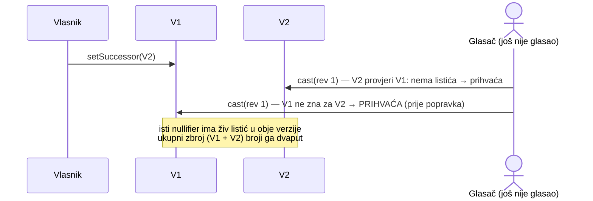
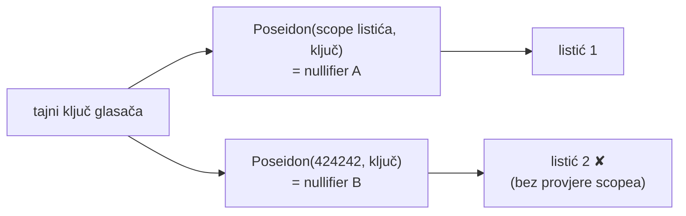
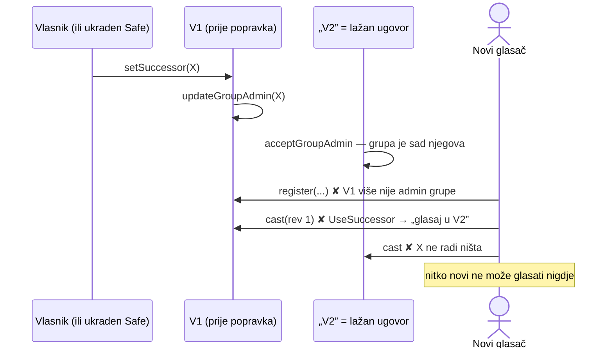
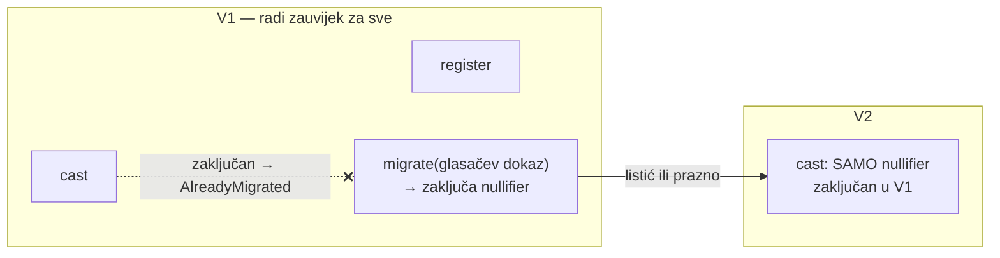

# Dnevnik nalaza

Ozbiljnost: **visoka** (krši S1–S9), **srednja** (krši cilj u rijetkom stanju ili ruši alat
zaštite), **niska** (higijena, nema iskorištavanja), **info** (dizajn ili ops).

| ID | Ozbiljnost | Nalaz | Kako je nađen | Status |
|---|---|---|---|---|
| D-01 | visoka (dizajn) | prvi nacrt: operater sam piše na lanac, glasač nema kontrolu | pregled prema zahtjevu „100 % kontrole” | riješeno redizajnom (V1) |
| D-02 | srednja (dizajn) | LeanIMT `remove` ostavlja nulu, a faza 1 izbacuje člana iz niza | čitanje Semaphore izvora | izbjegnuto: V1 grupa nema `remove` |
| A-01 | **visoka** | dvostruko glasanje preko verzija nakon najave V2 | ručni pregled pri pisanju V2 checkliste | popravljeno, test; popravak zamijenjen boljim u A-07 |
| A-07 | srednja | popravak A-01 dao je vlasniku polugu: lažnim successorom zaustaviti nove glasače i registracije | krug 5: napadi kroz ovlasti vlasnika | redizajn prijelaza, 3 testa, mutant M23 |
| A-02 | srednja (alat) | `check-frozen` lažno prolazi nakon izmjene izvora | test u obrnutom smjeru | popravljeno |
| A-03 | niska | mrtav uvjet `successor == address(0)` u `migrate` | pokrivenost grana | popravljeno |
| A-04 | niska | redoslijed provjera → zapis → vanjski poziv u `register`; neinicijaliziran `sum` | Slither | popravljeno |
| A-06 | srednja (testovi) | provjera scopea listića nije bila izravno testirana; bez nje isti glasač dobiva drugi listić | mutacijsko testiranje (M17) | test + fuzz napad |
| R-01 | srednja (relayer) | nema gornje granice cijene gasa; pri zagušenju član grupe može isprazniti sponzora | pregled relayera (model troška) | `MAX_FEE_GWEI` (zadano 5) |
| R-02 | niska (relayer) | parser propušta 78-znamenkaste brojeve > uint256 | test granica | provjera raspona + test |
| C-01 | info (klijent) | `fetchGroup` vjeruje jednom RPC-u (i događaji i korijen dolaze od njega) | pregled klijenta | preporuka: web provjerava korijen na drugom RPC-u |
| A-08 | info | malleabilnost nullifiera (+ r) i ECDSA `s` — zaštićeno vanjskim kodom (Semaphore, OZ) | krug 6 | regresijski testovi |
| K-02 | niska (UX) | ponovni klik „Izradi ključ” mijenja tajnu i riječi | stvarni test | gumb neaktivan dok ključ postoji |
| K-01 | srednja (klijent) | neuspjela izrada passkeyja brisala je tajnu nakon što su riječi već skrivene | test sa stvarnim passkeyjem (Brave) | pravilo toka u ADR 0001, demo popravljen |
| T-01 | niska (testovi) | test BIP-39 kontrolnog zbroja lažno pada ~1/256 pokretanja | pregled testa | deterministički primjer |
| K-03 | info (UX) | pravilo „riječi samo jednom” nije davalo sigurnost, a sprječavalo je kopiju | stvarni test (riječi nisu zapisane) | `revealWords()` uz svjež passkey |
| C-02 | niska (klijent) | `fetchGroup` filtrira grupu preko `args` koje viem tipovi uz više događaja ne predviđaju | stroga provjera tipova (DOM, TS 5.9) | test s tuđom grupom + obrambeni filter |
| C-03 | niska (klijent) | Web Crypto/WebAuthn tipovi traže `Uint8Array<ArrayBuffer>`; strogi build weba bi pao | stroga provjera tipova | kopija u svjež buffer (i brisanje kopije) |
| A-05 | info (ops) | javni Chiado RPC odbija procjenu gasa za deploy | deploy na Chiado | `DEPLOY_GAS` u skripti |

## D-01 — operater piše na lanac

**Stanje:** prvi nacrt (`MaksimirGlasanje.sol`, nikad deployan izvan lokalne mreže) imao je
operatera koji zrcali ZK grupu iz Postgresa i sidri vrh lanca listića. Listići su ostali u bazi.

**Zašto je problem:** glasač nije potpisivao svoj listić, pa je operater baze i dalje mogao
mijenjati listiće do sljedećeg sidra. „Relayer samo prosljeđuje potpisano” nije vrijedilo.

**Popravak:** V1, u kojem je listić ZK dokaz iz preglednika, a relayer nema ulogu. Vidi
[06-kontrola-glasaca.md](../06-kontrola-glasaca.md).

## D-02 — semantika uklanjanja člana

Semaphore `LeanIMT._remove` postavlja list na 0 i ne pomiče indekse, a `membersAt()` iz faze 1
člana izbacuje iz niza. Nakon prvog uklanjanja korijeni bi se razišli, pa novi dokazi ne bi prolazili.
V1 grupa ima samo dodavanje (`register`), a zamjena ključa ne postoji (izgubljen ključ =
zamrznut listić). Ako V2 uvede uklanjanje, klijent mora graditi stablo iz događaja (`fetchGroup`
to već radi s `MemberRemoved`).

## A-01 — dvostruko glasanje preko verzija (visoka)



**Kako je nađen:** pri pisanju kontrolne liste za V2 ([07](../07-verzioniranje.md)) postavljeno
je pitanje: „može li isti nullifier imati živ listić u dvije verzije?” V2 bi mogao provjeriti V1,
ali V1 ne zna za listiće u V2.

**Popravak:** nakon `setSuccessor` V1 prima samo izmjene postojećih listića, a prvi listić ide
u V2:

```solidity
if (b.revision == 0 && successor != address(0)) revert UseSuccessor(successor);
```

Uz pravilo za V2 („odbij nullifier koji u V1 ima reviziju > 0, a nije preseljen”) svaki
nullifier živi u točno jednoj verziji.

**Dokaz (tada):** registriran član bez listića nakon najave dobivao je `UseSuccessor`.

> **Zamijenjeno u krugu 5 (A-07).** Pravilo `UseSuccessor` je uklonjeno, jer je vlasniku davalo
> polugu. Dvostruko glasanje sad sprječava zaključavanje nullifiera u V1 glasačevim dokazom. Chiado nacrt bez popravka
(`0xD4C4…2692`) je zamijenjen, a manifest je u `deployments/chiado/superseded/`.

## A-02 — `check-frozen` lažno prolazi

**Kako je nađen:** nakon A-01 ugovor je namjerno promijenjen, a `check-frozen` je trebao pasti
jer se izvor razlikuje od Chiado deploya. Prošao je.

**Uzrok:** skripta je čitala *prvi* build-info u `artifacts/build-info/`. Hardhat stare
build-info datoteke ne briše, pa je usporedba išla sa starim izvorom.

**Popravak:** skripta čita build-info **trenutnog** artefakta preko `<Ugovor>.dbg.json`.
Provjereno u oba smjera: nepromijenjen izvor prolazi, a izmijenjen pada i imenuje datoteku.

## A-03 — mrtav uvjet u `migrate`

`if (msg.sender != successor || successor == address(0))`: drugi dio nikad ne može biti presudan,
jer je prije najave `successor` jednak 0, a `msg.sender` nikad nije 0. Pokrivenost je pokazala da
jedna strana grane nije dohvatljiva. Uvjet je uklonjen, a ponašanje je isto (test „prije najave
V2 nitko ne može zvati migrate”).

## A-04 — Slither

| Detektor | Mjesto | Procjena | Radnja |
|---|---|---|---|
| reentrancy-benign | `register`: `registered += 1` nakon `semaphore.addMember` | Semaphore je `immutable` i kanonski, pa napadač ne može podmetnuti ugovor; nema iskorištavanja | preslagano: zapis i događaj prije vanjskog poziva |
| reentrancy-events | `register`, `setSuccessor`, `share` | isto; u `share` događaj mora biti nakon provjere | `register` preslagan, ostalo prihvaćeno |
| uninitialized-local | `_validate`: `uint256 sum` | u Solidityju je 0, pa nema greške | `uint256 sum = 0` radi čitljivosti |
| timestamp | `register`: `block.timestamp > deadline` | namjerno; odstupanje od nekoliko sekundi je nebitno | prihvaćeno |

## A-05 — procjena gasa na Chiadu

Javni `rpc.chiadochain.net` povremeno vraća „gas required exceeds: 999999” za deploy koji
inače troši 2,13 M. Nije greška ugovora. `DEPLOY_GAS=3000000` u `deploy-v1.ts` zaobilazi procjenu.

## A-06 — rupa u testovima: drugi scope = drugi listić

**Kako je nađen:** mutacijsko testiranje (`scripts/mutation-test.mjs`). Kad se iz `cast` ukloni
`if (proof.scope != BALLOT_SCOPE) revert WrongScope();` (mutant M17), pao je samo jedan test, i to
iz pogrešnog razloga: podmetnuti dokaz „glasao sam” ima i drugu poruku, pa ga je odbila provjera
poruke.

**Zašto je važno:** nullifier = `Poseidon(scope, tajni ključ)`. Kad se scope ne bi provjeravao,
glasač bi s ispravnom porukom i **bilo kojim drugim scopeom** dobio drugi nullifier, a time i drugi,
neovisan listić. To je dvostruko glasanje (S3). Ugovor je bio ispravan, ali nijedan test ne bi
primijetio da netko tu provjeru ukloni.



**Popravak (testovi):** rubni test „isti glasač s drugim scopeom → WrongScope” (provjerava i da je
nullifier doista drugi) i fuzz napad „drugi scope” s nasumičnim scopeom.

## R-01 — relayer bez granice cijene gasa

Relayer je slao transakcije po bilo kojoj cijeni koju mreža traži. Pri zagušenju (npr. 100 gwei)
član grupe mogao bi slati izmjene listića (do 50 dnevno po IP-u, 5 000 ukupno) i potrošiti
sponzorov xDAI stotinama puta brže nego inače. **Popravak:** relayer odbija slanje (503) kad je
`maxFeePerGas` iznad `MAX_FEE_GWEI` (zadano 5 gwei, a Gnosis je danas na ~0,00000001 gwei) i šalje
s procijenjenim naknadama. Glasač tada može poslati paket sam.

## R-02 — raspon brojeva u relayeru

`/^\d{1,78}$/` propušta brojeve do 10⁷⁸, a uint256 ide do ~1,16·10⁷⁷. Takav broj ne bi prošao
ugovor, ali bi pao tek u kodiranju viema, s nejasnom greškom. **Popravak:** provjera
`≤ 2²⁵⁶ − 1` i testovi za granicu i najveću dopuštenu vrijednost.

## C-01 — klijent vjeruje jednom RPC-u

`fetchGroup` čita događaje i korijen s istog RPC-a. Zlonamjeran RPC mogao bi dati lažnu grupu i
lažan korijen. Posljedica je samo da dokaz ne prođe na lancu (pravi korijen je drugačiji), pa
listić ne bi bio ni prihvaćen ni podmetnut. Ne može se iskoristiti za tuđi glas. **Preporuka za
web:** korijen provjeriti na drugom neovisnom RPC-u.

## A-07 — lažni successor zaustavlja nove glasače (srednja)

**Kako je nađen:** krug 5, sustavni pregled svake ovlasti vlasnika pitanjem: „što najgore može
napraviti vlasnik, ili onaj tko ukrade Safe?” Cilj S6 kaže da vlasnik ne smije dirati listiće,
rok ni zbroj. Ovdje je mogao spriječiti **nove** glasače.



**Uzrok:** popravak A-01 riješio je dvostruko glasanje tako da je V1 nakon najave zatvorio vrata
novim nullifierima. Tako je ispravnost V1 ovisila o tome da je V2 ispravan. Uz to je predaja
upravljanja grupom značila da nove registracije ovise o V2.

**Popravak (redizajn prijelaza):**



- `setSuccessor` **samo zapisuje adresu**. Admin grupe ostaje V1 zauvijek, a `UseSuccessor` je
  uklonjen.
- Dvostruko glasanje i dalje nije moguće: V2 prima samo nullifier koji je glasač u V1 zaključao
  svojim dokazom (`migrate`, radi i bez listića). Zaključan nullifier u V1 više ne može glasati.
- Pravilo za V2 je **provjerljivo bez povjerenja**: `V1.ballotOf(n).migrated` mora biti `true` za
  svaki listić u V2. Ni pogrešna ili zlonamjerna V2 ne može dodati glas koji bi pošten zbroj priznao.
- Zlonamjeran successor bez glasačeva dokaza s porukom baš za njega ne može ništa: ni zaključati,
  ni preseliti, ni preuzeti grupu.

**Dokaz:** testovi „A-07: zlonamjeran successor (EOA)…” (napadač pokuša `migrate` s tuđim
dokazima listića i objave te preuzimanje grupe; V1 nakon toga prima novog člana, prvi listić i
izmjenu), „zaključan nullifier … više ne može glasati” te osnovni test prijelaza. Mutant **M23**
(vraćena predaja upravljanja grupom) je ubijen.

**Pouka:** popravak sigurnosne greške treba ponovno provjeriti prema **svim** ciljevima, ne samo
prema onom koji je popravljao. A-01 je popravio S3, a oslabio S6.
