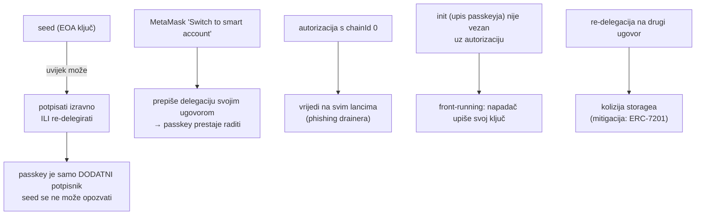

# EIP-7702 + passkey na Gnosisu umjesto Safea? (istraživanje, 26. 9. 2026.)

**Pitanje:** može li obična EOA adresa iz seeda (MetaMask-kompatibilna), nadograđena preko
EIP-7702, primati passkey (P-256 / WebAuthn) potpise za svakodnevno korištenje, uz seed kao
oporavak, bez Safea? Odnosi se na `pay.domovina.ai` (ADR 0011–0013), a za glasanje posredno.

**Odgovor:** tehnički **da**, i to već danas na Gnosisu: EIP-7702 i P-256 precompile su aktivni.
Za novac **još ne preporučujemo** zamjenu Safea (ADR 0012), iz tri razloga: nema auditiranog
7702 + WebAuthn delegata potvrđenog na Gnosisu, seed se ne može opozvati, a MetaMask prepisuje
tuđu delegaciju.

## Što je provjereno na lancu

| Činjenica | Dokaz |
|---|---|
| Pectra (EIP-7702) na Chiadu | 6. 3. 2025., slot 15171584 ([Gnosis docs](https://docs.gnosischain.com/about/specs/hard-forks/pectra)) |
| Pectra na Gnosis mainnetu | 30. 4. 2025. 14:03:40 UTC, slot 21405696 |
| 7702 se koristi | type-4 transakcije s `chainId 0x64` u zadnjih ~150 blokova (npr. `0x0292d6e5…9ee3`, blok 48437432); `eth_getCode` pošiljatelja = `0xef0100…` (delegation designator) |
| Fusaka (EIP-7951, P-256 precompile `0x100`) na mainnetu | 14. 4. 2026. 12:06:20 UTC, epoha 1714688 ([Validate Gnosis](https://blog.validategnosis.com/p/gnosis-chain-fusaka-hard-fork-announcement)) |
| P-256 precompile radi | ispravan potpis → `…01`, neispravan → `0x`, na **mainnetu i Chiadu**; cijeli poziv ≈ 30 811 gasa, a sam precompile 6 900 ([EIP-7951](https://eips.ethereum.org/EIPS/eip-7951)) |
| ERC-4337 EntryPoint | v0.7 (`0x0000000071727De…a032`) i v0.8 (`0x4337084D…F108`) postoje na Gnosisu |

Bez precompilea P-256 u Solidityju košta oko 330 000 gasa (Daimo verifier). Na Gnosisu to
više nije potrebno.

## Delegatski ugovori koji primaju passkey

| Ugovor | Audit | WebAuthn potpisnik (7702) | Na Gnosisu |
|---|---|---|---|
| MetaMask EIP7702StatelessDeleGator | da ([Diligence 2025](https://diligence.security/audits/2025/04/metamask-delegation-framework-april-2025/)) | **ne** (samo EOA ključ) | da |
| Ithaca Porto | bio je | da | **deprecated**, repo arhiviran 19. 8. 2026. |
| Coinbase EIP7702Proxy + SmartWallet | Cantina natjecanje | da | nije potvrđeno |
| Safe EIP-7702 (SafeLite) | **ne** („experimental, not yet audited”) | nije dokumentirano | — |
| ZeroDev Kernel v3.3 + WebAuthn validator | Kernel da, 7702 varijanta nepotvrđena | da | nije potvrđeno |
| Alchemy Modular Account v2 | da, uz bounty | da (WebAuthnValidationModule) | nije potvrđeno |
| OpenZeppelin Account + SignerEIP7702 + SignerWebAuthn | nepotvrđeno za WebAuthn dio | građevni blokovi | vlastiti deploy |

## Zamke

1. **Seed se ne može opozvati.** Kod Safea 1-od-2 seed-owner se može ukloniti. Kod 7702 EOA ključ
   zauvijek ima punu kontrolu, pa je seed trajno „vrući korijen”.
2. **MetaMask** podržava 7702 samo za svoj ugovor, a Gnosis je na popisu. Import seeda radi, ali
   „Switch to smart account” prepisuje passkey delegaciju.
3. **Phishing autorizacija** s `chainId 0` koja vrijedi na svim lancima. Uvijek potpisivati samo
   `chainId = 100`.
4. **Front-running inicijalizacije.** Upis passkey ključa mora biti potpisan EOA ključem ili atomski
   vezan uz delegaciju (tako radi Coinbase proxy).
5. **Kolizija storagea** pri promjeni delegata. Mitigacija je ERC-7201.

## Kako bi izgledalo (za pokus na Chiadu)

1. Delegat: Coinbase EIP7702Proxy + CoinbaseSmartWallet (vlastiti deploy ako ga nema) ili OZ
   `Account + SignerEIP7702 + WebAuthn` uz vlastiti audit.
2. Postavljanje: seed potpiše autorizaciju (`chainId = 100`) i init s passkey javnim ključem (x, y).
   Relayer to pošalje kao jednu type-4 transakciju.
3. Svaki dan: passkey potpiše EIP-712 hash batcha, relayer pozove `execute(...)` na adresi
   korisnika, a provjera ide preko precompilea `0x100` (~7k gasa).
4. Oporavak: seed potpisuje izravno ili re-delegira.

Relayer iz `pay.domovina.ai` to može slati izravno (type-4, pa obični pozivi), bez ERC-4337.

## Što ovo znači

- **pay.domovina.ai:** Safe 1-od-2 (passkey + seed, ADR 0012) ostaje sigurniji izbor dok ne
  postoji auditiran 7702 + WebAuthn delegat na Gnosisu. Pokus na Chiadu je jeftin i siguran.
- **Glasanje (ADR 0001):** ništa se ne mijenja. Passkey ondje ne potpisuje, nego otključava ZK
  tajnu, a potpis passkeyja na lancu otkrio bi glasača. Precompile `0x100` je zanimljiv tek ako
  neka buduća verzija (V2) želi passkey potpis za nešto neanonimno.

**Nije provjereno:** datum Fusake na Chiadu (precompile tamo ipak radi, provjereno), audit OZ
WebAuthn dijela, deploy Coinbase/Kernel/Nexus/MAv2 na Gnosisu.
