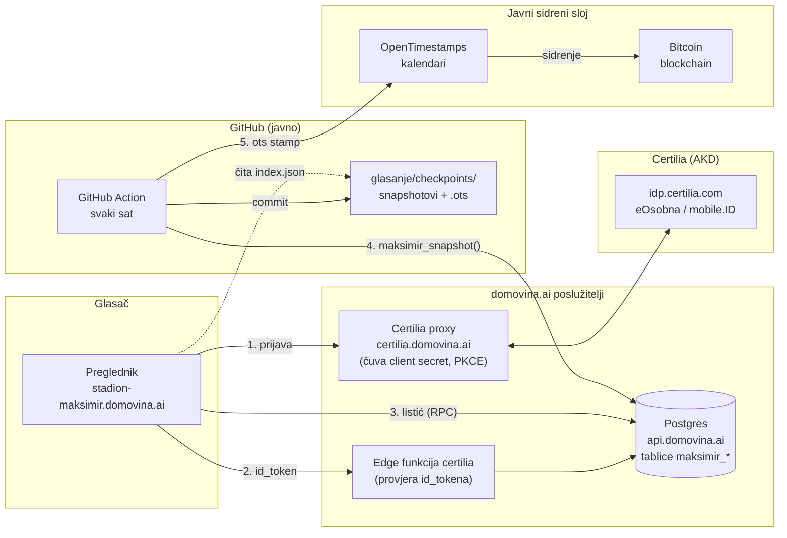
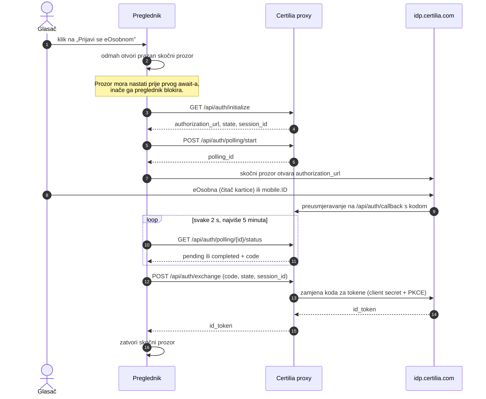
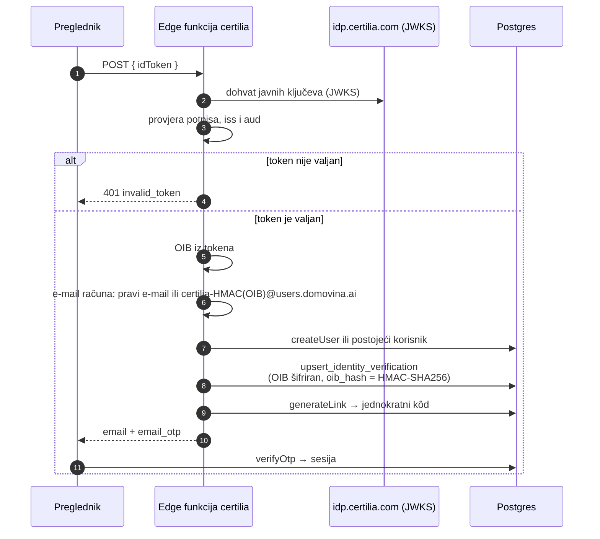
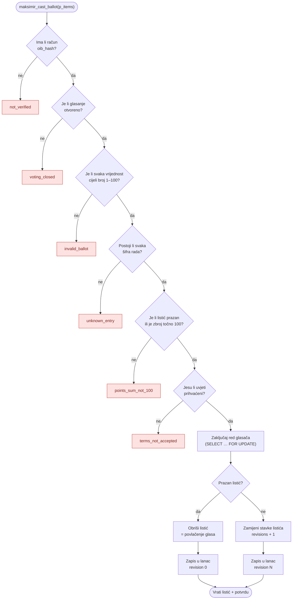
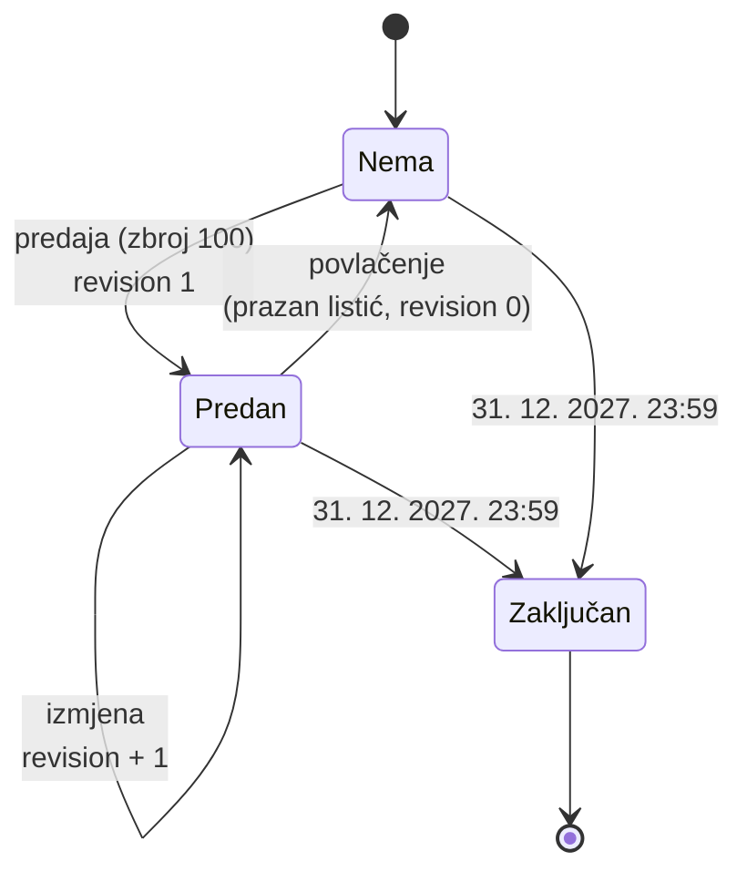
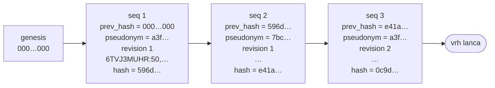
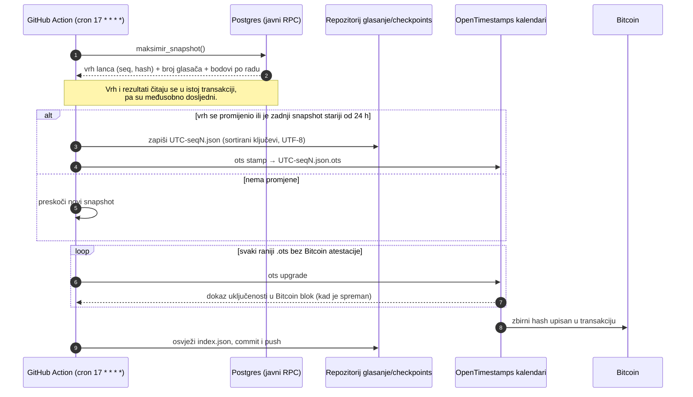
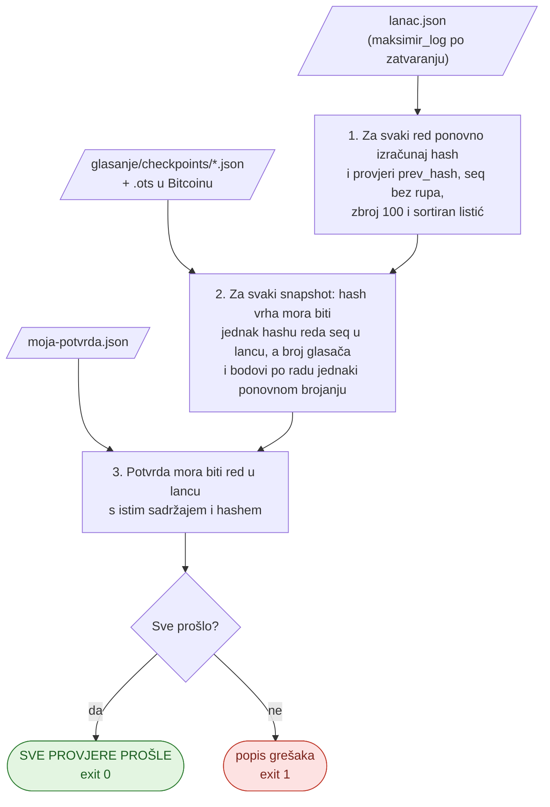

# Kako tehnički radi glasanje javnosti

Ovaj dokument korak po korak opisuje što se događa od trenutka kad netko otvori stranicu
[stadion-maksimir.domovina.ai/#/glasanje](https://stadion-maksimir.domovina.ai/#/glasanje)
do trenutka kad bilo tko, bez povjerenja u nas, može provjeriti da nitko nije promijenio
nijedan glas.

Glasanje je **neslužbeno** i nema utjecaja na odluku ocjenjivačkog suda. Pravila su jednostavna:

- glasati može svaka osoba koja se prijavi **eOsobnom** ili **Certilia mobile.ID-jem**;
- jedna osoba ima jedan glas od **100 bodova** koje raspoređuje po 88 natječajnih radova kako želi
  (svih 100 jednom radu ili npr. 50/30/20);
- listić se smije mijenjati ili povući do **31. 12. 2027. u 23:59** (po zagrebačkom vremenu), a broji se zadnja verzija;
- rezultati su javni uživo.

## Sadržaj

1. [Pregled sustava](#1-pregled-sustava)
2. [Korak 1: prijava eOsobnom](#korak-1-prijava-eosobnom)
3. [Korak 2: od identiteta do glasača](#korak-2-od-identiteta-do-glasača)
4. [Korak 3: predaja listića](#korak-3-predaja-listića)
5. [Korak 4: lanac hasheva](#korak-4-lanac-hasheva)
6. [Korak 5: potvrda za glasača](#korak-5-potvrda-za-glasača)
7. [Korak 6: satni snapshot u Bitcoinu](#korak-6-satni-snapshot-u-bitcoinu)
8. [Korak 7: neovisna provjera](#korak-7-neovisna-provjera)
9. [Tko što vidi](#tko-što-vidi)
10. [Što sustav ne rješava](#što-sustav-ne-rješava)
11. [Gdje je kôd](#gdje-je-kôd)

## 1. Pregled sustava

Sustav ima pet dijelova. Nijedan od njih ne treba tajni ključ koji bi bio u pregledniku ni u
javnom repozitoriju.



| Dio | Uloga |
|---|---|
| Preglednik | Prikazuje radove, drži nacrt listića u `localStorage` dok se ne preda, zove RPC-eve baze. |
| Certilia proxy | Posreduje u OIDC prijavi prema Certiliji. Jedini zna client secret. |
| Edge funkcija `certilia` | Provjerava potpis `id_tokena`, pretvara identitet u sesiju u bazi. |
| Postgres | Čuva glasače, listiće i lanac hasheva. Sva pravila glasanja provode se u bazi, ne u pregledniku. |
| GitHub Action | Svaki sat uzima snapshot stanja i žigoše ga u Bitcoinu preko OpenTimestampsa. |

## Korak 1: prijava eOsobnom

Prijava se odvija u skočnom prozoru. Stranica ne čeka da se prozor zatvori, nego svake dvije
sekunde pita proxy je li prijava gotova (*polling*). Razlog je taj što Certilijin tok zna
presjeći vezu između prozora (COOP), pa bi stranica pogrešno zaključila da je korisnik odustao.



Na kraju ovog koraka preglednik ima Certilijin `id_token`: potpisani JWT koji potvrđuje identitet
osobe. U njemu je OIB (kao `sub`).

## Korak 2: od identiteta do glasača

Preglednik šalje `id_token` edge funkciji. Funkcija **ne vjeruje pregledniku**: sama provjerava
potpis tokena prema Certilijinim javnim ključevima (JWKS), izdavatelja (`iss`) i primatelja (`aud`).



Važno o identitetu:

- **OIB se ne sprema u čitljivom obliku.** U tablici `identity_verifications` nalazi se šifriran,
  a za usporedbu se koristi `oib_hash = HMAC-SHA256(OIB, tajni ključ)`. Ključ je samo u edge
  funkciji, nikad u bazi.
- **Jedan OIB znači jednog glasača.** `oib_hash` je jedinstven, pa ista osoba ne može dobiti dva računa.
- **Glasač je trajni pseudonim.** Prvom predajom nastaje red u `maksimir_voters` s nasumičnim
  `voter_id`. Veza na račun je `on delete set null`, pa brisanje računa i ponovna prijava vraćaju
  **isti** listić, a ne novi.

Prije prvog glasa glasač mora prihvatiti uvjete (`maksimir_accept_terms`), što se bilježi kao
`consented_at`.

## Korak 3: predaja listića

Dok glasač raspoređuje bodove, nacrt listića živi samo u njegovu pregledniku. Tek klikom na
„Predaj” preglednik šalje cijeli listić jednim pozivom `maksimir_cast_ballot(p_items)`, npr.
`{"6TVJ3MUHR": 50, "GY0F1A9OM": 30, "W3YS5VJBZ": 20}`.

Sva pravila provjerava baza, unutar **jedne transakcije**. Ako bilo koja provjera padne, ništa
se ne zapisuje.



Zaključavanje reda glasača osigurava da dvije istodobne predaje iste osobe ne mogu stvoriti
dva listića. Testirano je s 12 paralelnih predaja iste osobe: rezultat je jedan listić, zbroj
100 i 12 revizija.

Životni ciklus jednog listića:



## Korak 4: lanac hasheva

Svaka predaja, izmjena i povlačenje dodaje jedan red u tablicu `maksimir_log`. Svaki red sadrži
hash prethodnog reda, pa redovi tvore lanac. Promjena bilo kojeg starog reda mijenja njegov hash,
a time i hash svakog sljedećeg reda.



Hashevi u dijagramu su skraćeni; osim `596d…` (stvarni prvi glas) ilustrativni su.

Hash svakog reda računa se ovako (SHA-256, heksadecimalno, UTF-8):

```
hash = sha256(prev_hash | seq | pseudonym | revision | ts_ms | items_canon)
```

| Polje | Značenje |
|---|---|
| `prev_hash` | hash prethodnog reda; za prvi red 64 nule |
| `seq` | redni broj, bez rupa: 1, 2, 3, … |
| `pseudonym` | `sha256("maksimir:" + voter_id)`; ista osoba uvijek ima isti pseudonim, ali se iz njega ne može doznati tko je |
| `revision` | 1 za prvu predaju, zatim 2, 3, …; 0 znači povlačenje |
| `ts_ms` | trenutak zapisa u milisekundama |
| `items_canon` | listić u kanonskom obliku `ŠIFRA:bodovi,…`, sortiran po šifri; prazan niz znači povlačenje |

Tri zaštite u bazi čuvaju lanac:

1. **Samo dodavanje.** Okidači (*triggeri*) odbijaju svaki `UPDATE`, `DELETE` i `TRUNCATE` nad
   `maksimir_log`.
2. **Jedan zapis u isto vrijeme.** Prije dodavanja reda uzima se globalni *advisory lock*, pa dva
   istodobna glasa ne mogu dobiti isti `seq` ni pogrešan `prev_hash`. Testirano s 12 glasača koji
   istodobno predaju po dva puta: 24 uzastopna zapisa, bez rupa.
3. **Nema izravnog pisanja.** Pregledniku su dostupni samo javni RPC-evi. Interne funkcije
   (`_maksimir_append_log` i slične) smije pozivati samo sama baza.

## Korak 5: potvrda za glasača

Nakon predaje glasač može preuzeti JSON potvrdu s vlastitim redom iz lanca:

```json
{
  "seq": 1,
  "prev_hash": "0000000000000000000000000000000000000000000000000000000000000000",
  "hash": "596d9959a92f1c845272d4d9e1d0df500f7282111e34cec5c8b6b596aea18a9a",
  "pseudonym": "…",
  "revision": 1,
  "ts_ms": 1790343380427,
  "items_canon": "6TVJ3MUHR:50,GY0F1A9OM:30,W3YS5VJBZ:20"
}
```

Iz potvrde glasač sam može izračunati `hash` i kasnije provjeriti da je njegov red u objavljenom
lancu, nepromijenjen.

## Korak 6: satni snapshot u Bitcoinu

Lanac hasheva štiti od tihe promjene samo ako netko izvan baze zna kako je lanac izgledao u
određenom trenutku. Zato GitHub Action svaki sat (u 17. minuti) radi sljedeće:



Što to znači u praksi:

- **Snapshot** je mala JSON datoteka s vrhom lanca, brojem glasača i bodovima svih 88 radova u
  tom trenutku. Primjer:
  [`20260925T134427Z-seq1.json`](../glasanje/checkpoints/20260925T134427Z-seq1.json).
- **`.ots` datoteka** dokazuje da je upravo taj snapshot postojao najkasnije u trenutku Bitcoin
  bloka u koji je upisan. Nakon nekoliko sati dobiva trajnu Bitcoin atestaciju, a u
  [`index.json`](../glasanje/checkpoints/index.json) se to vidi kao `"bitcoin": true`.
- **Dnevni otkucaj.** I kad nitko ne glasa, jednom u 24 sata nastaje snapshot. On dokazuje da se
  stanje nije mijenjalo i drži repozitorij aktivnim (GitHub gasi zakazane Actione u javnim
  repozitorijima nakon 60 dana mirovanja).
- **Bez tajni.** Action čita samo javni RPC s javnim anon ključem. Za to mu ne treba nikakva
  lozinka.

Nakon što je snapshot upisan u Bitcoin, operater baze više ne može tiho prepisati povijest
glasanja do tog trenutka: svaka prepravka dala bi drugi hash vrha, a stari hash je trajno
zabilježen.

## Korak 7: neovisna provjera

Po zatvaranju glasanja RPC `maksimir_log()` vraća cijeli lanac. Svatko ga može provjeriti
skriptom [`scripts/maksimir_verify.py`](../scripts/maksimir_verify.py), koja koristi samo
standardnu biblioteku Pythona i ne vjeruje ni bazi ni web stranici.

```sh
python3 scripts/maksimir_verify.py lanac.json glasanje/checkpoints/*.json --receipt moja-potvrda.json
```



Pojedinačni `.ots` dokaz može se provjeriti i bez naše skripte: na
[opentimestamps.org](https://opentimestamps.org) spusti par `.json` i `.ots` datoteka ili pokreni
`ots verify glasanje/checkpoints/<datoteka>.json.ots`.

Provjera je isprobana i u suprotnom smjeru: namjerno izmijenjen listić u jednom redu lanca
skripta je otkrila s dvije greške i izlaznim kodom 1.

## Tko što vidi

| Podatak | Javnost tijekom glasanja | Javnost po zatvaranju | Operater baze |
|---|---|---|---|
| Rezultati (bodovi, udio, broj podupiratelja po radu) | da, uživo | da | da |
| Broj glasača | da | da | da |
| Vrh lanca (`seq`, `hash`) | da, u satnim snapshotovima | da | da |
| Cijeli lanac pod pseudonimima | ne | da | da |
| Pojedinačni listić povezan s osobom | ne | ne | da |
| OIB | ne | ne | samo šifriran; ključ je u edge funkciji |

Cijeli lanac tijekom glasanja namjerno nije javan: pseudonim i točno vrijeme predaje omogućili bi
nekome tko zna da je određena osoba glasala u 15:36 da pronađe njezin listić.

## Što sustav ne rješava

- **Glasanje nije tajno prema operateru baze.** Veza `voter_id → oib_hash` postoji u bazi.
  Javno se objavljuju samo zbrojevi i, po zatvaranju, lanac pod pseudonimima.
- **Izmišljeni glasači.** Pravo glasa potvrđuje Certilia, ali preko našeg poslužitelja, pa bi
  operater baze teoretski mogao upisati glasače koji ne postoje. Blockchain ni ZK dokazi to ne bi
  riješili, jer popis ovlaštenih glasača i dalje sastavlja operater. Zaštita je u tome što je broj
  glasača u svakom satnom snapshotu, pa bi svaki nagli skok bio trajno i javno zabilježen.

Ono što sustav rješava: nakon satnog snapshota nitko, pa ni operater, ne može tiho promijeniti,
obrisati ili preslagati već predane glasove niti lažirati zbrojeve iz tog trenutka.

## Gdje je kôd

| Dio | Mjesto |
|---|---|
| Prijava (skočni prozor + polling) i RPC pozivi | [`web/src/glasanje.ts`](../web/src/glasanje.ts) |
| Ekran listića, rezultata i potvrde | [`web/src/glasanjeView.ts`](../web/src/glasanjeView.ts) |
| Satni snapshot → OpenTimestamps | [`scripts/maksimir_checkpoint.py`](../scripts/maksimir_checkpoint.py), [`.github/workflows/maksimir-checkpoint.yml`](../.github/workflows/maksimir-checkpoint.yml) |
| Neovisna provjera | [`scripts/maksimir_verify.py`](../scripts/maksimir_verify.py) |
| Snapshotovi i `.ots` dokazi | [`glasanje/checkpoints/`](../glasanje/checkpoints/) |
| Baza: tablice, pravila, lanac, RPC-evi | [`domovina-api`: `supabase/migrations/20260925120000_maksimir_voting.sql`](https://github.com/domovinatv/domovina-api/blob/main/supabase/migrations/20260925120000_maksimir_voting.sql) |
| Test ponašanja baze (18 provjera) | [`domovina-api`: `supabase/tests/20260925_maksimir_voting.sql`](https://github.com/domovinatv/domovina-api/blob/main/supabase/tests/20260925_maksimir_voting.sql) |
| Edge funkcija `certilia` | [`domovina-api`: `supabase/functions/certilia/index.ts`](https://github.com/domovinatv/domovina-api/blob/main/supabase/functions/certilia/index.ts) |

Vezani dokumenti:

- [glasanje/README.md](../glasanje/README.md): sažetak i upravljanje (rok, ručni checkpoint, lokalni razvoj)
- [2026-09-25-glasanje-javnosti.md](2026-09-25-glasanje-javnosti.md): odluke, mjerenja, zamke i otvorene stavke
