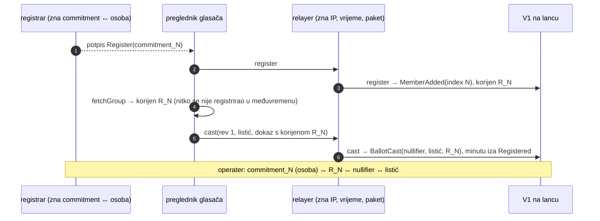
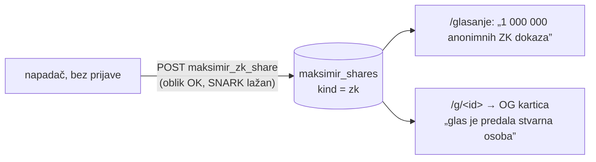

# Neovisni sigurnosni pregled glasanja javnosti (offchain faza 1 + onchain V1)

**Datum:** 26. 9. 2026.
**Recenzent:** Claude Fable 5.1, kao neovisni reviewer koda koji je napisao Claude Opus 5.5
**Pregledano stanje:** commit `faaaa5f` na `main` (čisto radno stablo na početku pregleda), `domovina-api` na `d5d88b7`.
Sve linije u nalazima odnose se na to stanje. Spajanje offchain i onchain dijela (wiring) počinje nakon ovog
pregleda u drugoj sesiji; te promjene ovdje **nisu** obuhvaćene i dobivaju zaseban pregled kad budu commitane.
**Opseg:** samo čitanje i analiza. Ništa u implementaciji, testovima ni dokumentaciji nije mijenjano.
**Odnos prema `docs/blockchain/audit/`:** taj audit je radio implementator (Opus 5.5) u istoj sesiji u kojoj je
pisao kôd. Ovaj dokument je drugi par očiju i namjerno je odvojen od njega. Nalazi se ne preklapaju s
D-01…K-05; gdje se dotiču, to je izrijekom rečeno.

## Sažetak

Implementacija je nadprosječno dobra. Ugovor `MaksimirGlasanjeV1` nema pronađenu grešku koja bi kršila
integritet (S1–S7 iz audita): nisam našao način da netko glasa umjesto drugoga, promijeni tuđi listić, glasa
dvaput, pokvari zbroj ili da vlasnik dira listiće. Baza u fazi 1 ima ispravno postavljene granice (security
definer + prazan `search_path`, revoke naspram default privilegija, RLS bez klijentskih politika na
osjetljivim tablicama, append-only okidači, advisory lockovi, nedvosmislen format hasha).

Ono što treba popeglati nije u dokazima ni u hashevima, nego **oko njih**: u privatnosti (tvrdnje o
anonimnosti prema operateru su jače od onoga što sustav daje), u jednoj anonimnoj točki pisanja bez ikakve
kočnice, u lancu opskrbe ZK artefakata i u operativnoj pouzdanosti satnog sidrenja.

| ID | Ozbiljnost | Dio | Nalaz |
|---|---|---|---|
| [F-01](#f-01) | **visoka** (privatnost, tvrdnja S8) | V1 + faza 1 | registracija i prvi listić / ZK objava idu u istom dahu, pa operater (registrar + relayer) može povezati listić s osobom; dokumentacija tvrdi suprotno |
| [F-02](#f-02) | **srednja** | faza 1, baza + web | `maksimir_zk_share` je anoniman, neograničen i ne provjerava SNARK: bilo tko puni bazu lažnim „ZK dokazima”, napuhuje javni brojač i dobiva službene OG kartice za smeće |
| [F-03](#f-03) | **srednja, uvjetno** | identitet (`certilia` edge fn) | račun se veže po `email` claimu kad postoji; dvije osobe s istim e-mailom dijele GoTrue račun, a `oib_hash` se prepisuje, pa sesija jedne osobe upravlja listićem druge |
| [F-04](#f-04) | **srednja** | faza 1 + V1 klijent | ZK artefakti (`.wasm`, `.zkey`) preuzimaju se s tuđeg hosta bez provjere hasha; kompromitiran host može kroz „dokaz” izvući tajni ključ glasača |
| [F-05](#f-05) | **srednja** (ops) | sidrenje | satni cron na GitHubu preskače sate (25. 9.: 2 od ~9 zakazanih runova), a Action instalira nepinnan PyPI paket s tokenom koji smije pisati u repo |
| [F-06](#f-06) | niska–srednja (privatnost) | keystore | `user.id` i ime passkeyja izvedeni su iz **javnog** commitmenta, pa upravitelj lozinki (Apple/Google) može povezati osobu s commitmentom; ADR tvrdi da `user.id` ne napušta preglednik |
| [F-07](#f-07) | niska | web | nema CSP-a ni HSTS-a, `markdown-it` s `html: true`, mermaid `securityLevel: "loose"`, a tajni ZK ključ i sesija su u `localStorage` |
| [F-08](#f-08) | niska (privatnost) | javna objava | javna kartica otkriva pseudonim, pa po zatvaranju cijela povijest revizija te osobe postaje trajno imenovana; „isključivanje” to ne poništava |
| [F-09](#f-09) | niska | relayer | 500 odgovori prosljeđuju poruke viema (mogu sadržavati RPC URL s ključem), KV čuva IP 36 h iako dokumentacija kaže da relayer IP ne bilježi, brojač nije atoman |
| [F-10](#f-10) | niska | ugovor | `share()` se može front-runnati izravno na Semaphoreu (`validateProof` nema admin provjeru); `setMerkleTreeDuration(0)` je poluga za blokadu; `renounceOwnership` je dostupan; `setSuccessor` nema potvrdu s druge strane |
| [F-11](#f-11) | info | provjera | `maksimir_verify.py` ne provjerava `.ots` ni to da je Bitcoin atestacija blizu vremena `at`; `index.json` `bitcoin: true` nitko ne provjerava |
| [F-12](#f-12) | info | identitet | `id_token` se ne veže uz `nonce` niti se troši jednokratno; edge funkcija ima CORS `*` |

**Za sesiju koja radi wiring, prije spajanja:** F-01 (tok registracija → prvi listić mora biti vremenski
razdvojen ili pošteno dokumentiran), F-04 (artefakti s vlastitog hosta + hash), F-02 (provjera dokaza prije upisa),
F-06 (`user.id` iz tajne, ne iz commitmenta). Sve četiri stvari je jeftinije napraviti dok se tok tek piše nego poslije.

Redoslijed popravaka koji predlažem: F-02 i F-04 (jeftini, zatvaraju stvarne rupe), F-05 (operativno),
F-01 (dizajn toka + iskrena dokumentacija prije Gnosis deploya), F-03 (provjeriti pretpostavku, pa
popraviti u `domovina-api`), ostalo redom.

## Opseg i metoda

Pročitano u cijelosti:

- `chain/contracts/v1/MaksimirGlasanjeV1.sol`, `chain/contracts/test/*`, `chain/client/*.ts`,
  `chain/relayer/src/*.ts`, `chain/relayer/wrangler.toml`, `chain/scripts/deploy-v1.ts`,
  `chain/scripts/check-frozen.mjs`, `chain/scripts/e2e-chiado.ts`, `chain/deployments/chiado/v1.json`,
  imena svih testova u `chain/test/**` i `chain/relayer/test/**`
- `web/src/glasanje.ts`, `glasanjeView.ts`, `zk.ts`, `shareView.ts`, `markdown.ts` (dio),
  `web/worker/index.ts`, `web/worker/share.ts`, `web/wrangler.jsonc`, `web/.env`, `web/index.html`
- `scripts/maksimir_checkpoint.py`, `scripts/maksimir_verify.py`, `.github/workflows/*.yml`,
  `glasanje/checkpoints/index.json`
- `domovina-api`: `supabase/migrations/20260925120000_maksimir_voting.sql`,
  `20260925160000_maksimir_share_zk.sql`, `20260925170000_maksimir_zk_member_removed.sql`,
  `20260529120000_identity_verifications.sql`, `20260520120600_grants_and_search_path.sql`,
  `supabase/functions/certilia/index.ts`, `_shared/cors.ts`, imena provjera u `supabase/tests/20260925_*.sql`
- sva dokumentacija u `docs/blockchain/`, `docs/glasanje-kako-radi.md`, `docs/2026-09-2{5,6}-*.md`,
  `glasanje/README.md`, `chain/README.md`

Vanjski izvori provjereni radi potvrde tvrdnji: Semaphore v4.14.3 `Semaphore.sol` i `SemaphoreVerifier.sol`
(GitHub tag `v4.14.3`), `@semaphore-protocol/proof` `generate-proof.ts` (isti tag). Uživo, samo čitanjem:
`maksimir_snapshot()` i `maksimir_public_ballots()` na `api.domovina.ai`, HTTP zaglavlja
`maksimir.domovina.ai`, `gh run list` za workflow `maksimir-checkpoint`.

Nije bilo dostupno, pa je izvan opsega: kôd Certilia proxyja (`certilia.domovina.ai`), stvarne grante i
stanje produkcijske baze (pretpostavka: migracije su primijenjene kako su napisane), tajne Workera,
sadržaj Certilijina `id_tokena` (posebno postoji li `email` claim, vidi F-03).

Ništa nije pokretano što piše: nijedan RPC koji mijenja stanje, nijedna transakcija, nijedan test koji
dira `localStorage` na produkciji.

## Nalazi

### F-01

**Registracija i prvi listić u istom dahu: operater može povezati listić s osobom** — *visoka (privatnost), krši tvrdnju S8 kako je dokumentirana*

**Gdje:** dizajn toka u `docs/blockchain/04-web-i-baza.md` (registracija → odmah `cast`),
`chain/scripts/e2e-chiado.ts` (isti redoslijed), događaj `BallotCast(..., merkleTreeRoot)` u ugovoru; u
fazi 1 `web/src/glasanjeView.ts` `makeZkProof()` (`registerIdentity` pa odmah `createZkShare`) i
`web/src/zk.ts` `createZkShare()` (`p_zk_seq = g.head.seq`).

**Tvrdnje u kodu i dokumentaciji koje ovo pobija:**

- `MaksimirGlasanjeV1.sol:17-18`: „ni operater koji je potvrdio pravo glasa ne zna kako je tko glasao”
- `docs/blockchain/01-arhitektura.md:32`: „Nitko ga ne može povezati s commitmentom, pa ni registrar ne zna čiji je listić”
- `docs/blockchain/06-kontrola-glasaca.md`, tablica registrara: „ne može vidjeti kako je tko glasao”

**Zašto to ne vrijedi.** Semaphore dokaz sakriva *koji* list stabla pripada glasaču, ali javni ulaz
`merkleTreeRoot` kaže **u kojem stanju grupe** je dokaz izrađen. Korijen LeanIMT stabla se mijenja sa svakim
dodanim članom, pa korijen jednoznačno određuje prefiks članova. Tok koji web planira (i koji E2E radi) je:
registrar potpiše, relayer pošalje `register`, preglednik odmah pročita grupu i pošalje `cast`. Dok se
nitko drugi nije registrirao, korijen u `BallotCast` jednak je korijenu **neposredno nakon glasačeve
registracije**, a transakcija stiže minutu iza `Registered`. Registrar zna commitment ↔ osoba, relayer zna
IP ↔ paket ↔ vrijeme, a oba su isti operater. Rezultat: prvi listić svake osobe je povezan s osobom bez
ikakvog isprobavanja.

Isto vrijedi u fazi 1 za anonimne objave: `makeZkProof()` upiše commitment i odmah izradi dokaz nad
`head.seq`, pa je `zk_seq` objave jednak rednom broju vlastitog upisa. Zapisnik grupe je javan, pa **i
javnost** povezuje objavu s commitmentom (za osobu treba još i operaterova tablica `maksimir_zk_members`).
Na produkciji je danas jedna objava sa `zk_seq = 1` i jedan član; stranica uz dokaz pošteno piše da s jednim
članom ne skriva ništa, ali s 50 članova bi pisala „jedna od 50” iako bi `zk_seq` odavao točno koja.

Dokumentacija u 06 („Iskrene granice”, točka 3) priznaje povezivanje po **vremenu** predaje, ali ne i to
da registrar i relayer, kao isti operater, to povezivanje mogu napraviti **sustavno i bez pogađanja**.
To je razlika između „anonimno prema operateru” (tvrdnja) i „operater obećava da neće spajati svoje
zapise” (stvarnost). Na blockchainu se to ne može naknadno popraviti: događaji s korijenom ostaju zauvijek.

**Preporuka.**

1. Prije Gnosis deploya ispraviti tvrdnje u `MaksimirGlasanjeV1.sol` (NatSpec), 01, 06 i README-u:
   anonimnost listića prema operateru je **pretpostavka o ponašanju operatera**, ne svojstvo sustava.
   Isto u fazi 1 uz ZK objave.
2. Razdvojiti registraciju i prvi listić u vremenu. Najjednostavnije bez promjene ugovora: web ne nudi
   „predaj” dok se iza glasača nije registriralo još barem K osoba (npr. K = 20) ili dok nije prošlo N sati,
   uz jasan tekst („listić šalješ kasnije, da se ne vidi tko si”). U fazi 1 isto pravilo za ZK objavu
   (`head.seq ≥ vlastiti seq + K`), a stranica objave neka pokazuje **stvarni** anonimni skup:
   broj članova dodanih nakon `zk_seq` je nula, pa je skup zapravo „posljednji upisani”.
3. Za V2: `registerMany(commitments[], deadlines[], sigs[])` koji zove `semaphore.addMembers`, pa cijela
   serija dijeli jedan korijen (`MembersAdded`). Relayer tada skuplja registracije i šalje ih u serijama
   (prijedlog „serijsko slanje” iz 05 rješava listiće, ali ne i registracije).
4. Relayer i registrar bi trebali biti **različiti operateri** (ili relayer koji ne vidi IP, npr. iza
   Tora / vlastitog novčanika), inače je točka 1 jedino pošteno rješenje.

**Kako provjeriti (test koji bi danas pao):** u lokalnoj mreži registrirati 10 glasača i za svakog
odmah poslati `cast`; za svaki `BallotCast` provjeriti je li `merkleTreeRoot` jednak korijenu iz
`MemberAdded` tog istog glasača. Očekivano nakon popravka: nije, ni za jednog.

### F-02

**`maksimir_zk_share` je anonimna, neograničena točka pisanja bez provjere dokaza** — *srednja*

**Gdje:** `domovina-api` `20260925160000_maksimir_share_zk.sql:307-357` (grant `anon`), `web/worker/share.ts:47-50`
(OG kartica za `kind = 'zk'` bez ikakve provjere), `web/src/glasanjeView.ts:493-494` (javni brojač
`zk_shares`), `web/src/shareView.ts:180-246` (stranica objave).

**Što se može.** RPC prima bilo koji JSON koji ima ispravan **oblik** (8 brojeva u polju, brojevi manji od
reda polja BN254, točna poruka i scope, `zk_seq ≤ head`). SNARK se ne provjerava (Postgres nema
Poseidon/pairing, što migracija pošteno kaže). Nema prijave, nema limita, nema captche. Posljedice:

- **Napuhavanje javnog brojača.** Svaki poziv s novim nasumičnim `nullifier` stvara red. Skripta od
  sto linija napravi milijun „anonimnih ZK dokaza”; stranica `/glasanje` to prikazuje uz javne glasove
  („N anonimnih ZK dokaza”). Brojač postaje besmislen, a slika „koliko je ljudi glasalo anonimno” lažna.
- **Službene kartice za smeće.** Svaka objava dobiva `/g/<id>` i Worker joj daje OG karticu „Anonimni
  glas za novi Maksimir, sa ZK dokazom … Glas je predala stvarna osoba potvrđena eOsobnom”. Kartica se
  ne provjerava. Tko želi ismijati sustav, dijeli tisuću takvih poveznica; tek klik u pregledniku pokaže
  „Dokaz NIJE prošao provjeru”, a društvene mreže prikazuju samo karticu.
- **Trošak.** Red ima ~1 KB JSON-a; tablica raste bez granice, snapshot i `maksimir_public_ballots`
  broje `count(*)` po njoj.

**Preporuka.** Najčišće: provjera dokaza **prije** upisa, u edge funkciji (`snarkjs.groth16.verify` s
Semaphore verification keyom traje milisekunde; k tome se u JS-u može izračunati i korijen
`Group(membersAt(zk_seq)).root` i usporediti s `merkleTreeRoot`, što baza ne može). RPC ostaje anoniman,
ali ga zove samo edge funkcija (`service_role`). Ako se to ne stigne: (a) `zk_shares` ne prikazivati kao
broj potvrđenih objava, (b) OG kartica za `zk` neka bude neutralna dok objava nema oznaku `verified`,
(c) rate-limit po IP-u na razini Cloudflarea/PostgREST-a. Test u `supabase/tests`: poziv s nasumičnim
poljima danas **prolazi** i stvara red; nakon popravka mora pasti s `invalid_proof`.

### F-03

**Vezanje računa po `email` claimu: dvije osobe s istim e-mailom dijele račun, a `oib_hash` se prepisuje** — *srednja, uvjetno (treba potvrditi vraća li Certilia `email`)*

**Gdje:** `domovina-api` `supabase/functions/certilia/index.ts:93-103, 113-135, 138-148`;
`20260529120000_identity_verifications.sql:70-90` (`on conflict (user_id) do update set oib_hash = …`);
`20260925120000_maksimir_voting.sql:531-537, 564-567` (glasač se traži po **trenutnom** `oib_hash` korisnika).

**Scenarij.** Osoba A (OIB₁) i osoba B (OIB₂) imaju isti e-mail u Certilijinu profilu (obiteljska adresa).
A se prijavi: GoTrue račun U s e-mailom e, `identity_verifications(U, hash₁)`, listić A. B se prijavi
istim e-mailom: `createUser` pada na „exists”, `generateLink(e)` vraća **isti** U,
`upsert_identity_verification(U, OIB₂)` na sukob po `user_id` **prepiše** `oib_hash` na hash₂. Od tog
trenutka svaka sesija računa U, uključujući A-inu sesiju koja je još živa u pregledniku, radi nad listićem
`hash₂` (B-inim): A može B-u promijeniti ili povući glas, ili objaviti javno s B-inim imenom (ime dolazi
iz istog reda `identity_verifications`, koji sad nosi B-ine podatke). Kad se A ponovno prijavi, sve se
okrene natrag. Nema dvostrukog glasa (pseudonim je po `oib_hash`), ali je granica „jedna sesija = jedna
osoba” probijena.

Dokument `2026-09-25-glasanje-javnosti.md` bilježi susjedni problem (ista osoba, drugi e-mail →
`kyc_store_failed`), ali ne i ovaj smjer.

**Preporuka.** (1) Provjeriti u produkcijskim logovima ili s Certilijom vraća li `id_token` `email` i je
li on vezan uz osobu ili slobodno upisan. (2) Neovisno o odgovoru: račun uvijek ključati po
`HMAC(OIB)` e-mailu (pravi e-mail spremiti kao metapodatak), ili barem u `upsert_identity_verification`
odbiti promjenu `oib_hash` za postojeći `user_id` (`raise exception 'oib_mismatch'`). (3) Test u
`supabase/tests`: dva OIB-a na isti `user_id` moraju pasti.

### F-04

**ZK artefakti s tuđeg hosta bez provjere hasha** — *srednja (lanac opskrbe; cilja tajni ključ glasača)*

**Gdje:** `web/src/zk.ts:164` (`generateProof(id, group, ZK_MESSAGE, ZK_SCOPE)` bez `snarkArtifacts`),
`chain/client/ballot.ts:97, 107, 111, 119` (isto), `@semaphore-protocol/proof` `generate-proof.ts:87`
(`snarkArtifacts ??= await maybeGetSnarkArtifacts(Project.SEMAPHORE, …)`), `docs/glasanje-kako-radi.md`
(„PSE artefakti … preglednik ih preuzima samo pri izradi dokaza (oko 2 MB)”).

**Zašto je važno.** `.wasm` računa svjedoka i **dobiva tajni ključ kao ulaz**; `.zkey` određuje što se
dokazuje. Preglednik ih preuzima s `snark-artifacts.pse.dev` (ili CDN-a) bez usporedbe s poznatim hashem.
Kompromitiran host, CDN ili DNS daje kôd koji ključ upakira u „dokaz” (koji se zatim javno objavljuje) ili
proizvodi dokaze koji ne prolaze. Tvrdnja „tajni ključ nikad ne napušta preglednik” (`glasanje-kako-radi.md:527`,
06) vrijedi samo uz ispravne artefakte. Ista rupa vrijedi i za V1 (`proveBallot`, `proveShare`,
`proveMigrate`), gdje je ključ ujedno i pravo mijenjanja listića. Napomena: tuđi Merkle korijen stranica
odbija (test C-01), ali ovdje napadač ne mijenja grupu nego sam prover.

**Preporuka.** Artefakte servirati s `maksimir.domovina.ai` (ili ih staviti u `web/public/`) i proslijediti
`generateProof(…, { wasm, zkey })`; u repo zapisati SHA-256 obiju datoteka za točnu verziju Semaphorea
(4.14.3, dubina koju koristi grupa) i u klijentu provjeriti hash prije uporabe (`fetch` → `crypto.subtle.digest`).
To je i preduvjet za plan „reproducibilan build na IPFS-u” iz 06.

### F-05

**Satno sidrenje nije satno; nepinnan paket s pravom pisanja u repo** — *srednja (operativno)*

**Dokaz** (`gh run list --workflow maksimir-checkpoint.yml`, 25. 9. 2026., UTC):

| Vrijeme | Okidač |
|---|---|
| 13:11–17:43 | 5 × `workflow_dispatch` (ručno) |
| 17:56 | `schedule` |
| 21:33 | `schedule` |
| 18:17, 19:17, 20:17, 22:17 | **nema runa** (provjereno u 22:57 UTC) |

GitHub zakazane workflowe u javnim repozitorijima odgađa i **preskače** pod opterećenjem; to je poznato
ponašanje, ne greška u skripti. Posljedica: „svaki sat” (`glasanje-kako-radi.md:315`, README) u praksi
znači „nekoliko puta dnevno, nepredvidivo”. Povlačenje glasa od 25. 9. u 22:15 UTC (vrh lanca `seq 2`,
0 glasača) u trenutku pregleda još nije sidreno. Za integritet to nije rupa (lanac je i dalje append-only),
ali prozor u kojem bi operater mogao tiho prepisati stanje nije jedan sat nego nekoliko.

Uz to, `maksimir-checkpoint.yml` radi `pip install opentimestamps-client` bez verzije i hasha, s tokenom
`contents: write`. Zlonamjerno izdanje tog paketa (ili njegove ovisnosti) može pushati proizvoljan commit u
javni repo (checkpoints, docs, web izvor). Web se deploya ručno, pa napad ne ide odmah na stranicu, ali bi
mogao zamijeniti `.ots` datoteke i `index.json`.

**Preporuka.** (1) Vanjski okidač koji je pouzdan: Cloudflare Cron Trigger (Worker) koji zove
`POST /repos/…/actions/workflows/maksimir-checkpoint.yml/dispatches`, ili cijeli checkpoint preseliti u
Worker s `ots` klijentom. (2) `pip install opentimestamps-client==<verzija> --require-hashes`. (3)
Razmisliti o zasebnom repou samo za `checkpoints/`, da token Actiona ne može dirati izvor. (4) Na stranici
prikazivati „zadnji sidreni vrh” i koliko je zapisa iza njega, da se kašnjenje vidi.

### F-06

**Passkey `user.id` i ime izvedeni iz javnog commitmenta** — *niska–srednja (privatnost)*

**Gdje:** `chain/client/keystore.ts:93-110` (`keyFingerprint`, `passkeyUserId`, `passkeyLabel`),
`docs/blockchain/adr/0001…md`, odluka 4: „`user.id` ne napušta preglednik”.

**Što je krivo u tvrdnji.** WebAuthn `user.id` (user handle) autentifikator **sprema u vjerodajnicu**,
sinkronizira preko iCloud Keychaina / Google Password Managera i vraća ga kao `userHandle` pri svakoj
prijavi. Ime passkeyja („Maksimir glasanje · ključ 904493…340948”) vidljivo je u Lozinkama i u sinkronizaciji.
Oboje je izvedeno iz commitmenta, koji je javan na lancu. Tko ima uvid u upravitelj lozinki (Apple, Google,
Microsoft, obiteljsko dijeljenje, forenzika uređaja) može povezati osobu s commitmentom, a onda kroz F-01 i
s listićem. To je ista klasa curenja koju ADR inače pažljivo izbjegava.

**Preporuka.** Izvesti oboje iz **tajne**, ne iz commitmenta: `user.id = HKDF(secret, "maksimir-passkey-user")[0..16]`,
otisak za ime = prvih 6 hex znakova `sha256(secret ‖ "fingerprint")`. Svojstvo iz K-05 (isti ključ →
isti `user.id` → zamjena umjesto gomilanja) ostaje, a iz javnog podatka se ništa ne može izračunati. Na
stranici i na ispisu koristiti isti otisak iz tajne. Ispraviti rečenicu u ADR-u.

### F-07

**Web bez CSP-a i HSTS-a, uz tajni ključ u `localStorage`** — *niska*

**Dokaz:** `curl -sI https://maksimir.domovina.ai/glasanje` vraća samo `cache-control` i
`x-content-type-options`. `web/src/markdown.ts:26` `html: true`, `:16` mermaid `securityLevel: "loose"`.
`web/src/zk.ts:46` sprema ključ u `localStorage["maksimir-zk-identity"]`; sesija je u
`localStorage["maksimir-auth"]`.

Bez CSP-a svaki XSS (npr. kroz `html: true` u nekom budućem markdownu, kroz treću biblioteku ili
ekstenziju) odnese tajni ZK ključ i sesiju jednim `fetch`-om. Danas su svi ulazi koje sam vidio escapirani
(`esc` u view-ovima, `esc` u `share.ts`, id regex), pa je ovo obrana u dubinu, ne aktivna rupa.

**Preporuka.** U `web/worker/index.ts` dodati zaglavlja: `Content-Security-Policy` (`default-src 'self'`,
`script-src 'self'` + nonce za inline `location.replace` u `/g/<id>`, `connect-src` samo
`api.domovina.ai certilia.domovina.ai raw.githubusercontent.com` + host artefakata iz F-04,
`frame-ancestors 'none'`, `worker-src 'self' blob:` zbog snarkjs-a), `Strict-Transport-Security`,
`Referrer-Policy: strict-origin-when-cross-origin`. Mermaid na `strict`; `html: false` osim ako neki
dokument to stvarno treba. Nakon ADR-a 0001 ključ u `localStorage` ionako nestaje.

### F-08

**Javna kartica trajno veže osobu uz cijelu povijest revizija** — *niska (privatnost, tekst privole)*

**Gdje:** `20260925160000_maksimir_share_zk.sql:365` (`pseudonym` u kartici), `:373-375` (potvrda sa
`seq`, `hash`), `20260925120000_maksimir_voting.sql:365-383` (`maksimir_log` po zatvaranju sadrži
`pseudonym`, `ts_ms`, sve revizije), `web/src/glasanjeView.ts:323` („Stara poveznica ne prikazuje ništa”).

Tko spremi javnu karticu (ili je samo pogleda i zapiše pseudonim), po zatvaranju iz javnog lanca čita
**sve** revizije te osobe s vremenima, uključujući listiće koje je glasač poslije promijenio. Isključivanje
javnog prikaza to ne poništava. Kartica bez pseudonima ne bi pomogla: `hash` potvrde jednako pronalazi red.

**Preporuka.** Tekst privole uz „Objavi moj glas javno” neka kaže: „Pseudonim ostaje javno povezan s
tvojim imenom i nakon isključivanja, a po zatvaranju glasanja i sa svim prijašnjim verzijama listića.”
Alternativa s većim zahvatom: pseudonim po reviziji (`sha256(voter_id ‖ revision)`), ali tada javni lanac
ne dokazuje „jedna osoba = jedan živi listić”, što je vrjednije. Ostaviti kako jest, uz iskren tekst.

### F-09

**Relayer: curenje poruka grešaka, IP u KV-u, neatomaran brojač, localhost u CORS-u** — *niska*

- `chain/relayer/src/index.ts:67`: `500` vraća `(e as Error).message`. Viemove greške sadrže
  `URL: <rpc url>` i `Request body`. Ako `GNOSIS_RPC_URL` jednom dobije ključ (Alchemy, dRPC), ključ curi
  svakom klijentu. Vratiti generičan tekst, detalje u `console.error`.
- `relay.ts:107`: KV ključ `ip:<ip>:<dan>` s TTL 36 h. Dokumentacija 06 (`:153`) kaže „relayer ne bilježi
  IP”. Uz uključen `[observability]` bilježi se i više. Ili ispraviti tvrdnju, ili ključ = `sha256(dnevna tajna ‖ ip)`.
- `relay.ts:69-74`: `bump` je čitaj-pa-piši; paralelni zahtjevi prelaze limit. Kočnica je meka, što je
  vjerojatno u redu; zapisati kao poznato.
- `wrangler.toml:19`: `http://localhost:5173`, `http://localhost:4321` u produkcijskom `ALLOWED_ORIGINS`.
  Paketi su samopotpisani pa nema kompromitacije, ali nema ni razloga da produkcijski relayer odgovara
  lokalnim stranicama; držati ih u `.dev.vars`.
- Kvota se troši prije slanja, a `simulateContract` ne jamči uspjeh (drugi uređaj istog glasača u
  međuvremenu): sponzor plaća revertanu transakciju. Trošak je zanemariv (10 wei), ali front-runner koji
  kopira svaki relayerov `cast` iz mempoola natjera relayer da plaća samo reverte. Vrijedi kao napomena
  uz `MAX_FEE_GWEI`.

### F-10

**Ugovor: rubovi koji ne krše S1–S7, ali ih V2 može zatvoriti** — *niska*

- **`share()` front-run.** Semaphore v4 `validateProof(groupId, proof)` (potvrđeno u `Semaphore.sol`,
  tag v4.14.3) **nema** provjeru pozivatelja. Tko vidi glasačev `share` paket u mempoolu (ili relayerov
  `/share` zahtjev) pozove `semaphore.validateProof` izravno: nullifier je potrošen, `V1.share` pada s
  `YouAreUsingTheSameNullifierTwice`, a događaj `AnonymousShare` nikad ne nastane (postoji samo
  Semaphoreov `ProofValidated`). Šteta: objava „glasao sam” nestane s našeg popisa događaja. Za V2:
  vlastito `mapping(uint256 => bool) shared` uz `verifyProof`, bez `validateProof`.
- **`setMerkleTreeDuration(0)`** zajedno s registrarom koji registrira jednog člana po bloku čini svaki
  dokaz zastarjelim prije uključenja: vlasnik + registrar mogu praktički blokirati `cast`. Audit ovo
  bilježi kao „dokaz se mora ponoviti”, ali ne kao polugu za blokadu. Za V2: donja granica trajanja kao
  konstanta (npr. 10 min), ili bez te funkcije.
- **`renounceOwnership()`** iz OpenZeppelinova `Ownable` ostaje javno dostupan. Nakon odricanja
  `setRegistrar` više ne postoji, pa ukraden registrarov ključ nema lijeka (registrira izmišljene glasače do
  roka). Override koji reverta košta jednu liniju.
- **`setSuccessor`** je jednokratan bez potvrde s druge strane. Tipfeler u adresi zauvijek onemogućuje V2
  (V1 radi dalje, pa nema gubitka glasova). Uzorak „propose + `acceptSuccessor()` koji smije zvati samo
  ugovor čiji `v1() == address(this)`” to sprječava.
- **`share()` i `migrate()` nemaju `open`**: namjerno, ali nije dokumentirano uz tablicu funkcija u 01.

### F-11

**Skripta za provjeru ne provjerava `.ots`** — *info*

`scripts/maksimir_verify.py` provjerava lanac, snapshotove i potvrde, ali ne i to da `.ots` dokaz
pripada toj datoteci i da je Bitcoin atestacija **vremenski blizu** `at` iz snapshota. `index.json`
`bitcoin: true` piše sama skripta koja žigoše. Tko ima pravo pisanja u repo može zamijeniti par
`.json` + `.ots` novim, kasnije žigosanim, i skripta to ne bi primijetila; primijetio bi samo netko tko
ručno usporedi vrijeme bloka s imenom datoteke. Preporuka: `--ots` opcija koja zove `ots verify` (ili
parsira atestaciju) i zahtijeva `at ≤ vrijeme bloka ≤ at + 24 h`; usporediti i `zk.members` iz snapshota s
brojem članova iz zapisnika do `zk.seq`.

### F-12

**`id_token` bez `nonce` i jednokratnosti** — *info*

`certilia/index.ts:70-74` provjerava potpis, `iss`, `aud` i `exp`, ali ne veže token uz sesiju prijave
(`nonce`) niti ga troši jednokratno. Ukraden token (XSS, log, proxy) unutar roka valjanosti daje novu
sesiju više puta. CORS je `*`. Standardno za ovakav most, ali uz F-07 vrijedi zapisati. Tok kroz
proxy (`polling_id` → `code` → `exchange`) nisam mogao pregledati; ako je `polling_id` pogodiv, tuđi
`code` se može presresti. Provjeriti entropiju i jednokratnost na proxyju.

## Što je provjereno i drži

Ovo je popis napada koje sam ciljano tražio i **nisam** našao, s mjestom koje ih sprječava, da se zna što
je pokriveno ovim pregledom.

| Napad | Zašto ne prolazi |
|---|---|
| relayer mijenja bodove, reviziju ili šalje stari listić | `ballotMessage` veže lanac, adresu, reviziju i `keccak(points)`; `revision == b.revision + 1` |
| dokaz za listić upotrijebljen kao objava, selidba ili obrnuto | različiti `scope`/`message`; `WrongScope`/`WrongMessage` |
| javni ulazi dokaza ≥ reda polja (nullifier + r) | `SemaphoreVerifier.checkField` na sva četiri ulaza (potvrđeno u izvoru v4.14.3) |
| poruka/scope izvan polja | Semaphore `_hash` = `keccak256 >> 8` prije verifikatora, u ugovoru i u JS-u |
| malleabilan ECDSA potpis registrara | OZ 5 `ECDSA.recover` odbija gornji `s` |
| potpis registrara za drugi lanac/ugovor/verziju | EIP-712 domena s `chainId`, `verifyingContract`, `version` |
| reentrancy | jedini vanjski pozivi idu na `immutable` kanonski Semaphore; CEI u `register` |
| vlasnik dira listiće, rok, zbroj | nema takve funkcije; `closesAt` `immutable`; nema proxyja |
| zbroj se razilazi od listića | `_apply(−staro) + _apply(+novo)` u istoj transakciji; `voters` samo na prijelazu prazno ↔ neprazno |
| dvostruko glasanje preko verzija | `migrated` zaključava nullifier; V2 mora provjeravati `ballotOf(n).migrated` (dokumentirano u 07) |
| baza: klijent piše izravno u tablice | `revoke all` na `voters`, `ballots`, `ballot_items`, `log`, `shares`, `zk_*`; RLS bez politika; interne funkcije bez `execute` za `anon`/`authenticated` unatoč default privilegijama iz `20260520120600` |
| baza: `search_path` napad na security definer | sve funkcije imaju `set search_path = ''` i puno kvalificirana imena |
| baza: rupa ili preslagivanje u lancu | `pg_advisory_xact_lock` + `seq` PK + `hash` unique + okidači za `update`/`delete`/`truncate` |
| baza: dvosmislen ulaz u hash | polja odvojena `|`, a nijedno ne može sadržavati `|` (`code ~ '^[A-Z0-9]{9}$'`, brojevi, hex) |
| baza: dva listića iste osobe (utrka) | `select … for update` na glasaču prije zamjene |
| baza: povučen ZK commitment vraćen u grupu (replay zapisnika) | `commitment_taken` provjerava i `maksimir_zk_log`, ne samo `zk_members` |
| baza: `NULL <> 'array'` zamka | `is distinct from` u `maksimir_zk_share` (i test za to) |
| ZK grupa i tablica članova se razilaze | okidač `after delete` uvijek piše `remove` (`20260925170000`) |
| pogrešno zalijepljen tekst prepisuje ključ | `parseIdentity` traži base64 od točno 32 bajta; uvoz odbija ključ koji ne odgovara grupi kad lokalni odgovara |
| XSS kroz imena radova, imena glasača, id objave | `esc()` u view-ovima i u `share.ts`; `id ~ '^[a-z0-9]{12}$'`; hex/brojevi iz baze imaju `check` |
| pogađanje `/g/<id>` | 48 bita iz `gen_random_uuid()` |
| snapshot vrha lanca i rezultata nedosljedan | jedan SQL izraz = jedan MVCC snapshot (`maksimir_snapshot`) |
| verifikator ovisi o bazi ili stranici | `maksimir_verify.py` samo stdlib, ponovno računa sve hasheve i zbrojeve |
| tuđa grupa na istom Semaphoreu ulazi u našu | `fetchGroup` filtrira po `groupId` i uspoređuje korijen s lancem (C-02) |
| omot ključa bez passkeyja | AES-256-GCM, ključ iz PRF-a kroz HKDF, AAD = `credentialId`; testovi za krivi PRF, ID, IV, šifrat |

## Ispravci koje dokumentacija treba

| Gdje | Danas piše | Treba pisati |
|---|---|---|
| `MaksimirGlasanjeV1.sol:17-18`, `01-arhitektura.md:32`, `06` tablica registrara | operater/registrar ne zna kako je tko glasao | operater to može povezati kroz vrijeme i korijen ako spoji zapise registrara i relayera (F-01) |
| `06-kontrola-glasaca.md:153` | relayer ne bilježi IP | relayer drži brojač po IP-u 36 h u KV-u i ima uključen observability (F-09) |
| `adr/0001`, odluka 4 | `user.id` ne napušta preglednik | `user.id` i ime passkeyja sinkroniziraju se s upraviteljem lozinki (F-06) |
| `glasanje-kako-radi.md:527`, `06` | tajni ključ nikad ne napušta preglednik | uz uvjet da su ZK artefakti ispravni; danas se preuzimaju s tuđeg hosta bez provjere (F-04) |
| `glasanje-kako-radi.md:315`, README | snapshot svaki sat | GitHub cron preskače; stvarni razmak je nekoliko sati (F-05) |
| `01-arhitektura.md` tablica funkcija | — | `share` i `migrate` rade i nakon `closesAt` (namjerno) |

## Testovi koje vrijedi dodati (nisu implementirani)

1. **F-01, lokalna mreža:** 10 × (register, cast odmah); assert da nijedan `BallotCast.merkleTreeRoot`
   nije jednak korijenu odmah nakon vlastite registracije (pada dok se tok ne promijeni).
2. **F-02, `supabase/tests`:** `maksimir_zk_share` s nasumičnim brojevima u polju mora pasti; brojač
   `zk_shares` ne smije rasti.
3. **F-03, `supabase/tests`:** `upsert_identity_verification(U, OIB₂)` nakon `(U, OIB₁)` mora pasti;
   `_maksimir_cast_ballot_for(U, …)` nakon takvog pokušaja i dalje radi nad `hash₁`.
4. **F-04, klijent:** `generateProof` se zove s eksplicitnim `snarkArtifacts` čiji hash odgovara konstanti u repu;
   test koji podmetne drugu datoteku mora pasti prije izrade dokaza.
5. **F-06, keystore:** `passkeyUserId(secret)` se ne može izračunati iz `commitment` (test koji to pokuša
   mora dobiti drugu vrijednost).
6. **F-10, ugovor:** napadač zove `semaphore.validateProof(groupId, shareProof)` prije `V1.share` →
   dokumentirati ponašanje (danas: `share` pada) i, u V2, assert da `share` prolazi jer koristi vlastiti registar.
7. **F-11, verifikator:** lažni `.ots` s kasnijom atestacijom mora dati grešku.

## Napomena o ograničenju

Ovo je statički pregled s nekoliko čitanja uživo. Nisam pokretao Slither, fuzz ni mutacije (to je audit
implementatora već napravio, a ja sam provjeravao njegove zaključke čitanjem koda i vanjskog izvora
Semaphorea). Nisam pregledao Certilia proxy ni produkcijske grante, pa F-03 i F-12 stoje pod uvjetom.
Nijedan alat ne dokazuje odsutnost ranjivosti; ovaj dokument dokazuje samo da su gore navedene klase napada
provjerene i s kojim ishodom.
