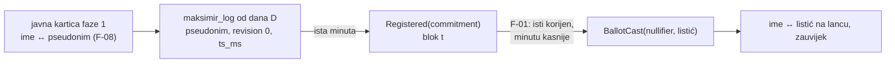

# Neovisni sigurnosni pregled wiringa offchain ↔ onchain (drugi pregled)

**Datum:** 26. 9. 2026.
**Recenzent:** Claude Fable 5.1, kao neovisni reviewer koda koji je napisao Claude Opus 5.5
**Pregledano stanje (prvi dio, ~01:50 CEST):** grana `feat/glasanje-integracija` na `ef4c5d8` (tri commita iznad
`faaaa5f`: `c65fce9` plan 08, `178a2c2` klijent, `ef4c5d8` relayer u Workeru) i `domovina-api` grana
`feat/maksimir-chain` na `6b6ad33` (dva commita iznad `d5d88b7`: migracija `20260926120000_maksimir_chain.sql`
+ test, edge funkcija `maksimir-register`). Nalazi F-13…F-19 i sve linije u njima odnose se na ta dva commita.
**Proširenje (~02:00 CEST, odjeljak [Proširenje](#proširenje-1ecab96--106f205)):** ista grana na `1ecab96` (četiri
commita više: web tok `7f83aaf`, snapshot v3 + `verify --chain` `382d046`, Safe 2/3 na Chiadu `eafde60`, docs
`1ecab96`) i `domovina-api` na `106f205` (`_maksimir_set_public_for` za listić s lanca). Oba worktreea čista.
Nalazi F-20…F-22 i status starih nalaza odnose se na to stanje; gdje se broj retka u migraciji promijenio,
naveden je novi.
**Opseg:** samo čitanje i analiza. Ništa u implementaciji, testovima ni dokumentaciji nije mijenjano.
**Prethodni pregled:** [2026-09-26-neovisni-review-glasanje.md](2026-09-26-neovisni-review-glasanje.md)
(F-01…F-12, tag `audit-fable-2026-09-26`). Nalazi ovdje nastavljaju numeraciju (F-13…).

## Sažetak

Commitani dio wiringa je dobro složen tamo gdje je prvi audit bio jak: pravila u bazi (jedna osoba = jedan
commitment po ugovoru, prijenos listića faze 1 u istoj transakciji, keystore koji samo dodaje, zaključavanje
reda glasača, revoke + RLS na novim tablicama), registrar koji potpisuje tek kad se njegov ključ slaže s
`registrar()` na lancu, fiksni EIP-712 vektor koji veže Deno i Hardhat, i dokaz vlasništva nullifiera koji je
vezan uz lanac, ugovor i pseudonim pa ne vrijedi ni kao listić ni kao selidba.

Ono što wiring **nije** napravio: nijedan od četiri nalaza koje je prvi pregled tražio prije spajanja (F-01,
F-02, F-04, F-06) nije adresiran, a nijedan redak iz tablice „Ispravci koje dokumentacija treba” nije
ispravljen. Plan 08 tvrdnju iz F-01 ponavlja („operater zna čiji je listić: **ne**”) i tok registracija →
prva predaja izrijekom propisuje kao **jedan korak**. Uz to wiring dodaje tri stvari koje šire stare rupe:
zapis „prijenos” koji od dana D javno veže pseudonim faze 1 s vremenom registracije na lancu (F-13), dvije
nove anonimne točke pisanja bez kočnice (F-14) i registraciju bez dokaza da glasač drži tajnu commitmenta,
iako su commitmenti faze 1 javni (F-15).

| ID | Ozbiljnost | Dio | Nalaz |
|---|---|---|---|
| [F-13](#f-13) | **visoka** (privatnost) | baza + plan 08 | zapis „prijenos” (revision 0, točan `ts_ms`) nastaje u trenutku registracije i od dana D je javan; s F-01 i F-08 to javno veže ime → pseudonim faze 1 → registracija → prvi listić na lancu |
| [F-14](#f-14) | **srednja** | baza | `maksimir_chain_share` i `maksimir_keystore_put` su nove anonimne, neograničene točke pisanja; `maksimir_zk_share` i dalje ne provjerava SNARK (F-02 neriješen i proširen); `zk_shares` sad broji i lažne `chain` objave |
| [F-15](#f-15) | srednja–niska | registrar | registracija ne traži dokaz posjeda tajne; commitmenti faze 1 su javni (`maksimir_zk_group`), pa tuđi commitment može biti upisan prije vlasnika (`commitment_taken`), a knjigovodstvo baze i lanca se razilaze |
| [F-16](#f-16) | niska (privatnost, isti obrazac kao F-02) | baza | `_maksimir_set_public_chain_for` upisuje ime + tuđi ili testni nullifier bez ikakve provjere dokaza; posjetiteljev preglednik je jedini sudac, a popis i OG kartica ne čekaju presudu |
| [F-17](#f-17) | niska | Worker | relayer u istom Workeru: 500 i dalje vraća poruku viema, `localhost:5173` u produkcijskom CORS-u, observability bilježi IP, tajne sponzora sad žive uz statičku stranicu i na `workers.dev`/preview hostovima |
| [F-18](#f-18) | niska (ops) | baza + plan | registracija na ugovor koji se broji (i prijenos) moguća je prije dana D, a web do dana D prikazuje samo fazu 1: preneseni glasači nestaju iz prikaza |
| [F-19](#f-19) | info | klijent | dokaz vlasništva je javan i valjan za `semaphore.validateProof` (nullifier listića); V1 ne trpi, V2 mora paziti; `rpc_url` iz baze određuje što web vidi |

**Redoslijed popravaka koji predlažem:** F-14 i F-16 zajedno (jedna edge funkcija koja provjerava SNARK +
poruku + korijen prije upisa rješava F-02, F-14 i F-16), F-13 zajedno s F-01 (isti dizajn toka), F-15
(potpis Semaphore identiteta u `maksimir-register`), F-17 (jednolinijski popravci), tablica dokumentacije
iz prvog pregleda + nove stavke dolje. F-04 i F-06 ostaju kako su opisani u prvom pregledu; wiring ih nije
dotaknuo, a `proveOwnership` je nova uporaba iste rupe iz F-04.

## Opseg i metoda

Pročitano u cijelosti (na navedenim commitima):

- ovaj repo, `git diff faaaa5f ef4c5d8` bez lock datoteka: `.github/workflows/chain.yml`,
  `chain/client/{ballot,group,read}.ts`, `chain/test/client/{ballot,read}.test.ts`, `chain/scripts/e2e-chiado.ts`,
  `web/worker/index.ts`, `web/worker/relayer/{route,relay,chain,types,abi}.ts` i testovi, `web/wrangler.jsonc`,
  `web/package.json`, `web/tsconfig.json`, `web/src/docs.ts`, `docs/blockchain/{04,08,README}.md`;
  plus nepromijenjene datoteke o kojima nalazi ovise: `MaksimirGlasanjeV1.sol` (`register`, `cast`, `share`,
  `migrate`, događaji), `web/worker/share.ts`, `chain/client/keystore.ts`, `web/src/zk.ts`
- `domovina-api`, `git diff d5d88b7 6b6ad33`: `supabase/migrations/20260926120000_maksimir_chain.sql` (838 redaka),
  `supabase/tests/20260926_maksimir_chain.sql`, `supabase/functions/maksimir-register/{index,logic,logic_test}.ts`,
  `supabase/config.toml`; iz starijih migracija `_maksimir_is_field`, `_maksimir_pseudonym`, `maksimir_log`,
  `maksimir_zk_group`

Uživo, samo čitanjem (25. 9. 23:44 UTC):

| Provjera | Rezultat |
|---|---|
| `GET https://maksimir.domovina.ai/relayer/10200/status` | HTML stranica 404: **relayer nije deployan**, produkcija je i dalje `main` |
| `POST …/rpc/maksimir_chain_config` | PostgREST 404 (`PGRST202`): **migracija `20260926120000` nije primijenjena** na produkciji |
| `maksimir_snapshot()` | `schema maksimir-snapshot/2`, `head.seq 2`, `zk.seq 1`, `voters 0`, `public_voters 0` |
| `maksimir_public_ballots()` | `count 0`, `zk_shares 1` |
| Chiado `V1.registrar()` na `0xe790…e029` | `0x3bbede9f24ff636a9f48216ad9945acc479d2137` |
| `curl -sI …/glasanje` | i dalje samo `cache-control`, `x-content-type-options` (F-07 nepromijenjen) |
| `gh run list -w maksimir-checkpoint.yml` | zadnji `schedule` 25. 9. 21:33 UTC; 22:17 i 23:17 UTC **nema runa** (F-05, vidi status) |
| `gh run list -w chain.yml` | **nijedan run za `feat/glasanje-integracija`**: grana nije pushana, CI nije provjerio wiring |

Ništa nije pokretano što piše: nijedan RPC koji mijenja stanje, nijedna transakcija, nijedan `localStorage`
na produkciji.

## Status nalaza iz prvog pregleda

| ID | Traženo prije spajanja | Stanje u wiringu |
|---|---|---|
| F-01 | da | **nije adresiran, pogoršan.** 08 §1 („Web zato registraciju i prvu predaju radi kao jedan korak”), 08 §3 dijagram (`Pravo → Listić → Dokaz → Poslano` bez čekanja), 08 §Privatnost tablica („Operater zna čiji je listić: ne”). Nema odgode ni serija; otvoreno pitanje 7 preporučuje „odmah” |
| F-02 | da | **nije adresiran, proširen** (F-14). `maksimir_zk_share` samo dobiva `voting_closed` nakon `chain_from`; SNARK se i dalje ne provjerava; OG kartica za `zk` nepromijenjena (`share.ts:42-46`) |
| F-03 | — | nepromijenjeno; obrazac se prenosi na lanac: `_maksimir_chain_register_for:445-449` i `_maksimir_set_public_chain_for:566-570` traže glasača po **trenutnom** `oib_hash` računa |
| F-04 | da | **nije adresiran.** `ballot.ts:97,107,111,132,140` i `zk.ts:164` i dalje bez `snarkArtifacts`; `proveOwnership` (`ballot.ts:131`) je nova uporaba iste rupe |
| F-05 | — | nije adresiran; 08 §Checkpoint ga odgađa „prije dana D”. Novi dokaz: nakon `schedule` u 21:33 UTC nema runova za 22:17 ni 23:17 (provjereno 23:45 UTC), dakle 4 od zadnjih 6 sati preskočena |
| F-06 | da | **nije adresiran.** `chain/client/keystore.ts` nepromijenjen |
| F-07 | — | nepromijenjeno (zaglavlja uživo) |
| F-08 | — | nepromijenjeno; sad vrijedi i za karticu s lanca (`maksimir_chain_public` veže ime uz nullifier, `_maksimir_public_card` vraća `pseudonym` i cijeli `proof`) |
| F-09 | — | djelomično: ključevi kvota po mreži, `no-store`, CORS lista bez `4321`; ali 500 i dalje vraća `e.message` (`route.ts:110`, test „lanac nedostupan → 500 s porukom” to učvršćuje), IP u KV-u ostaje, `localhost:5173` u produkcijskim `vars` (F-17) |
| F-10 | — | nepromijenjeno (ugovor zamrznut); F-19 dodaje novi rub za V2 |
| F-11 | — | nepromijenjeno; 08 §verify planira `--chain`, još nema koda |
| F-12 | — | nepromijenjeno; `maksimir-register` ima isti CORS `*` i `verify_jwt = false` (u redu za ovaj obrazac) |

## Nalazi

### F-13

**Zapis „prijenos” javno veže pseudonim faze 1 s registracijom na lancu** — *visoka (privatnost); nadovezuje se na F-01 i F-08*

**Gdje:** `domovina-api` `20260926120000_maksimir_chain.sql:498-507` (`_maksimir_chain_register_for`: pri
registraciji na ugovor s `counts` briše listić i zove `_maksimir_append_log(v_voter.id, 0, '{}')`, s
`ts_ms = now`), `:206-224` (`maksimir_log()` javan od `least(closes_at, chain_from)`), `08:492-496`
(rizik priznat, otvoreno pitanje 6 preporučuje „ne” popraviti), `08:18-20` („to svatko može provjeriti iz javnog lanca”).

**Scenarij.** Od dana D lanac faze 1 je javan i sadrži za svaku prenesenu osobu red
`(pseudonym, revision 0, ts_ms)` s točnim vremenom registracije. Na Gnosisu je u istoj minuti događaj
`Registered(commitment)` (blok s vremenom), a po 08 §1 odmah zatim i `BallotCast(nullifier, …, root)` s
korijenom iz F-01. Javnost tako, bez ikakvih operaterovih tablica, sparuje: pseudonim faze 1 ↔ commitment ↔
nullifier ↔ listić na lancu. Tko je u fazi 1 ikad bio javan (kartica `/g/<id>` s imenom i pseudonimom, F-08),
ima ime trajno vezano uz listić na lancu i sve njegove buduće revizije, i kad je javni prikaz isključio.
Za ostale to vrijedi za operatera (registrar zna `oib_hash ↔ commitment`, tablica `maksimir_chain_registrations`
ima i `created_at`).

Zapis prijenosa je pravilno zamišljen za **integritet** (isti glas se ne broji dvaput, provjerljivo), ali
je cijena privatnosti veća nego što 08 kaže („oba su pseudonimi”): pseudonim faze 1 ima ime kad god je osoba
bila javna, a pseudonim lanca ima listić uvijek.

**Preporuka.**

1. Ne pisati prijenos u trenutku registracije s točnim vremenom. Dvije mogućnosti bez promjene formata
   lanca: (a) `ts_ms` prijenosa zaokružen na dan (server sam gradi red, pa hash ide preko zaokružene
   vrijednosti; `maksimir_verify.py` ne traži monotonost), i (b) prijenose skupljati i upisivati u
   serijama (npr. jednom dnevno u fiksno vrijeme), pa `seq` ne odaje redoslijed registracija. Uz (a) i (b)
   javni lanac kaže samo „taj dan”, što je isti razred kao F-01 s odgodom.
2. Prvi listić na lancu odgoditi po F-01 (K registracija ili N sati); bez toga (1) pomaže samo djelomično.
3. Tekst uvjeta v2 (08 §Privatnost) neka kaže točno ovo: „Ako si u fazi 1 imao javnu karticu, tvoj listić na
   lancu ostaje javno povezan s tvojim imenom.”
4. Ispraviti 08 tablicu privatnosti (redak „Operater zna čiji je listić”) i točke 18–20.

**Test koji bi danas pao:** SQL test u `domovina-api`: nakon `_maksimir_chain_register_for` s prijenosom,
`maksimir_log()` (nakon `chain_from`) ne smije sadržavati red čiji je `ts_ms` unutar 60 s od
`maksimir_chain_registrations.created_at` iste osobe.

### F-14

**Dvije nove anonimne, neograničene točke pisanja; F-02 neriješen** — *srednja*

**Gdje:** `20260926120000_maksimir_chain.sql:639-660` (`maksimir_chain_share`, grant `anon`), `:520-547`
(`maksimir_keystore_put`, grant `anon`), `:716` (`zk_shares` broji `kind in ('zk','chain')`), `:353-402`
(`maksimir_zk_share` nepromijenjen osim `voting_closed`).

- **`maksimir_chain_share(chain_id, contract, tx_hash)`** upisuje red za **bilo koji** 32-bajtni hash; jedina
  brana je `unique (tx_hash)`, a prostor hasheva je 2^256. Svaki red dobiva `/g/<id>` i ulazi u javni brojač
  `zk_shares` na `/glasanje`. Baza pošteno piše da „ne zna je li transakcija stvarna”, ali brojač i poveznica
  se ponašaju kao da zna. Ovo je F-02 u novom obliku, samo bez dokaza uopće. Nakon dana D `maksimir_zk_share`
  se zatvara, pa ova funkcija postaje **jedini** anonimni upis objava, i to bez kočnice.
- **`maksimir_keystore_put(hash, blob)`**: anoniman, 2 KB po redu, bez granice broja redova, bez limita po
  IP-u. Skripta puni tablicu proizvoljnim hashevima. Pravilo „prvi upis pobjeđuje” je dobro (i testirano), ali
  ne štiti od volumena.
- **`maksimir_zk_share`** i dalje prima svaki dobro oblikovan JSON bez SNARK-a, uz OG karticu „glas je predala
  stvarna osoba” (`share.ts:42-46`).

**Preporuka.** Jedna edge funkcija `maksimir-share-verify` (`service_role`) koja **prije upisa** provjeri:
za `zk` SNARK + korijen (`Group(membersAt(zk_seq)).root`), za `chain` `eth_getTransactionReceipt` s
`AnonymousShare` našeg ugovora (isto što `readShareTx` radi u pregledniku; ~50 redaka u Denou), za
kartice s lanca (F-16) SNARK + `publicMessage` + korijen. RPC-evi ostaju, ali samo za `service_role`. Za
keystore: `put` iza prijave (glasač je u tom koraku ionako prijavljen, 08 §3 dijagram `Prijava → Uvjeti →
Ključ`); tablica i dalje ne sprema korisnika, ali PostgREST više ne prima anonimne upise. Ako se želi ostati
anoniman, Turnstile ili limit po IP-u na Cloudflareu ispred `/rest/v1/rpc/maksimir_keystore_put`.
Alternativa za `chain` objave bez baze: `/g/0x<tx>` (08, otvoreno pitanje 5), pa nema što spamati.

**Test koji bi danas pao:** `maksimir_chain_share(100, <ugovor>, '0x' || random)` × 1000 kao `anon` mora
biti odbijeno ili ne smije povećati `zk_shares`; danas stvara 1000 redova i brojač raste.

### F-15

**Registracija ne dokazuje posjed tajne; commitmenti faze 1 su javni** — *srednja–niska (griefing)*

**Gdje:** `maksimir-register/logic.ts:70-95` (prima `commitment` kao broj, ništa drugo), migracija
`:440-514` (`commitment_taken` ako je commitment već upisan), `maksimir_zk_group()` u `20260925160000:291-302`
(javni zapisnik svih commitmenta faze 1), `08:21` („isti commitment, bez nove tajne”).

**Scenarij.** A pročita B-ov commitment iz javnog ZK zapisnika faze 1 i registrira **njega** na ugovor koji se
broji. Baza upiše `(A.oib_hash, commitment_B)` i, ako je A imao listić faze 1, obriše ga (prijenos).
Registrar potpiše, relayer pošalje, B-ov commitment je list u grupi. Posljedice:

- B pri registraciji dobiva `commitment_taken` i mora napraviti **novi** ključ; gubi vezu sa svojom anonimnom
  objavom iz faze 1 (isti nullifier `SHARE_SCOPE`, 08 §ZK ključ).
- B **može** glasati listom koji je A upisao (B drži tajnu), iako baza misli da je to A-ov commitment: A-ov
  glas nestaje (listić faze 1 obrisan, na lancu nema ključa), B glasa bez uvjeta v2 i bez retka u
  `maksimir_chain_registrations`, pa B-u `maksimir_set_public_chain` vraća `not_registered`.
- Nema dvostrukog glasa (jedan list = jedan nullifier), ali A trajno gubi vlastiti glas, pa napad košta
  napadača koliko i žrtvu. Zato je ozbiljnost niža; ipak, tko želi „ukrasti” tuđi ključ za nekog drugog ne
  treba tajnu, samo brz prst prije dana D.

Isti obrazac ima i `maksimir_zk_register` u fazi 1 (prvi pregled ga nije zabilježio): commitment se upisuje
bez dokaza posjeda, a jednom upisan blokira pravog vlasnika.

**Preporuka.** U `maksimir-register` tražiti potpis Semaphore identiteta: klijent uz `commitment` šalje
`publicKey` i `Identity.signMessage(chainId ‖ contract ‖ oibNeovisniNonce)`; funkcija provjeri
`Identity.generateCommitment(publicKey) === commitment` i `Identity.verifySignature(...)` (oboje u
`@semaphore-protocol/identity` v4, EdDSA nad Baby Jubjubom, radi u Denou). Nonce neka bude `sha256(user_id ‖ dan)`
da se potpis ne može ponoviti sutra. Test: registracija tuđeg (javnog) commitmenta bez potpisa mora pasti s
`not_owner`.

### F-16

**Javna kartica s lanca: upis bez provjere, testna mreža s pravim imenom** — *niska (isti obrazac kao F-02)*

**Gdje:** migracija `:555-625` (`_maksimir_set_public_chain_for`: provjerava oblik, scope i da je
`p_nullifier = proof.nullifier`; poruka samo `~ '^[0-9]{1,78}$'`; ugovor bilo koji na koji je osoba upisana,
uključujući `counts = false`), `:705-722` (`maksimir_public_ballots` broji karticu u `count`), snapshot
`public_voters`.

- Glasač može pod svojim imenom objaviti **tuđi** nullifier s bilo kojim 8-brojnim „dokazom”. Popis javnih
  glasova, `count`, `public_voters` u snapshotu i OG kartica to prikazuju; tek posjetiteljev preglednik
  (`checkOwnership`, `read.ts:75-86`) kaže da dokaz ne prolazi. Šteta je ismijavanje sustava i lažne kartice
  na mrežama (kao F-02), ne krivi zbroj.
- Registracija na Chiado (`counts = false`) dopušta karticu s **testnim** listićem pod pravim imenom na
  produkcijskom popisu. 08 kaže „Chiado nikad nije produkcijski izvor”, ali kartica to ne zna.

**Preporuka.** Provjera dokaza prije upisa (ista edge funkcija kao u F-14: `verifyProof` +
`BigInt(message) === publicMessage({chainId, contract, pseudonym})` + korijen iz `groupRoots`), i uvjet
`cr.counts` (ili vidljiva oznaka „TESTNA MREŽA” u kartici i isključenje iz `count`/`public_voters`).
Test u `supabase/tests`: `_maksimir_set_public_chain_for` s nullifierom druge osobe i nasumičnim `points`
danas **prolazi** (test 12 koristi upravo takav fiksni dokaz i očekuje uspjeh); nakon popravka mora pasti.

### F-17

**Relayer u istom Workeru: stari rubovi iz F-09 plus novi hostovi i tajne** — *niska*

- `web/worker/relayer/route.ts:110`: `500` vraća `(e as Error).message`; viem u poruku stavlja URL RPC-a i
  tijelo zahtjeva. Danas su RPC-evi javni (`rpc.chiadochain.net`), pa ne curi ključ, ali test
  `route.test.ts` „lanac nedostupan → 500 s porukom” učvršćuje ponašanje koje prvi pregled traži maknuti.
- `web/wrangler.jsonc:28`: `RELAYER_ALLOWED_ORIGINS = "http://localhost:5173"` u **produkcijskim** `vars`.
  Bilo koji lokalni dev server na glasačevu računalu (npr. zlonamjeran npm paket) smije iz preglednika zvati
  produkcijski relayer i trošiti kvotu. Paketi nose dokaze pa integritet ne trpi; držati u `.dev.vars`.
- `wrangler.jsonc:33-35`: `workers_dev: true`, `preview_urls: true`, `observability: enabled`. Relayer s
  tajnama `SPONSOR_PRIVATE_KEY_<id>` sada odgovara i na `maksimir.<račun>.workers.dev` i na preview URL-ovima
  svake verzije (uključujući verzije koje još nisu promovirane). Observability bilježi IP i put
  `/relayer/<id>/cast` s vremenom; 06:153 i dalje kaže „relayer ne bilježi IP”.
- Ista Workerova okolina sad drži i statičku stranicu i ključ sponzora: svaka buduća ranjivost u Workeru
  (npr. SSRF kroz `share.ts` `fetch`) ima pristup tajnama koje prije nije imala. Nije rupa danas, nego manja
  izolacija nego u planu 08 §2 (zaseban Worker `maksimir-relayer`), koji kôd nije slijedio.
- `web/worker/index.ts:38`: `/relayer/` ide prije preusmjeravanja hosta, pa `stadion-maksimir.domovina.ai/relayer/*`
  služi relayer umjesto 301. Bezopasno, ali dokumentirati.

**Preporuka.** Generičan tekst u 500 + `console.error`; `RELAYER_ALLOWED_ORIGINS` prazan u produkciji;
`workers_dev: false` i `preview_urls: false` (E2E ionako mora na produkcijsku domenu, 08 §E2E); u 06 ispraviti
rečenicu o IP-u ili ključ kvote zamijeniti `sha256(dnevna tajna ‖ ip)`.

### F-18

**Registracija koja se broji radi i prije dana D, a prikaz ne** — *niska (ops)*

**Gdje:** migracija `:165-177` (`_maksimir_chain_open()` ne gleda `chain_from`), `:498-507` (prijenos ovisi
samo o `v_chain.counts`), `08:374-385` (do dana D izvor rezultata je samo `maksimir_results()`).

Čim Gnosis red dobije `counts = true` (korak 7 u 08), svaka registracija briše listić faze 1 te osobe, a web do
`chain_from` prikazuje samo fazu 1: osoba nestaje iz brojača i iz rezultata dok dan D ne dođe. Za Matijin
pravi glas u koraku 8 to je namjerno i kratko; za bilo koga drugoga tko nabasa na `?lanac=` prije dana D
to je tihi gubitak prikaza (ne glasa). Također, `chain_from` u budućnosti („najava”) ne sprječava prijenose.

**Preporuka.** Ili `_maksimir_chain_open()` traži `chain_from is not null and now() >= chain_from` za ugovore
s `counts` (testni ugovori ostaju otvoreni), ili web od prvog dana zbraja lanac + ostatak neovisno o
`chain_from`. Test: registracija na ugovor s `counts` dok je `chain_from null` mora pasti s `chain_not_open`.

### F-19

**Rubovi za V2 i za neovisnost čitanja** — *info*

- Dokaz vlasništva (`ballot.ts:120-133`) je pravi Semaphore dokaz sa `BALLOT_SCOPE`, dakle s **nullifierom
  listića**, i javan je (kartica vraća cijeli `proof`). Bilo tko ga može poslati na
  `semaphore.validateProof(groupId, proof)`: Semaphore potroši taj nullifier u vlastitoj mapi grupe. V1 to ne
  dira (`cast` i `migrate` zovu `verifyProof`, `MaksimirGlasanjeV1.sol:157,237`), ali V2 ne smije `cast`
  graditi na `validateProof`, inače javna kartica postaje alat za blokadu tuđeg listića. Zabilježiti uz F-10.
- `checkOwnership` prihvaća **bilo koji** korijen koji je grupa ikad imala (`groupRoots`, `group.ts:68`). Za V1
  bez uklanjanja članova to je točno; za V2 s uklanjanjem bio bi rupa (dokaz uklonjenog člana nad starim
  korijenom). Zabilježiti uz 07.
- `maksimir_chain_config()` iz baze webu daje `rpcUrl`, `relayerUrl`, `semaphore`, `groupId`, `deployBlock`.
  Neovisnost „web čita lanac bez nas” vrijedi samo koliko i RPC koji operater imenuje; lažljiv RPC prikazuje
  lažne rezultate i lažan `ballotOf`. `maksimir_verify.py --chain` (planiran) ima vlastiti `--rpc`, što je
  dobro. Za web: fiksni popis javnih RPC-eva u kodu + korisnikov izbor, a baza samo bira među njima.
- `08:400-403` opisuje poruku dokaza kao `keccak256("maksimir-javno" | share_id)`, a kôd veže `chainId`,
  `contract` i `pseudonym` (`ballot.ts:120-128`). Kôd je bolji (tuđi dokaz se ne može prepisati na drugu
  karticu, testirano); dokument treba uskladiti.

## Što je provjereno i drži

| Napad / tvrdnja | Zašto ne prolazi / gdje je jamstvo |
|---|---|
| registrar potpisuje za ugovor kojemu nije registrar (krivi ključ, kriva mreža) | `logic.ts:79-83`: `eth_call registrar()` mora biti jednak adresi ključa, inače `registrar_mismatch` i **baza se ne dira** (test „nema prijenosa bez potpisa”); ugovor samo iz `maksimir_chains`, lowercase |
| ista osoba dva commitmenta / dva ljudi isti commitment | PK `(chain_id, contract, oib_hash)` + `unique (…, commitment)`; `already_registered` vraća postojeći, `commitment_taken` odbija; test 6 |
| utrka registracija ↔ listić faze 1 | `select … for update` na glasaču u obje funkcije; `chain_registered` provjeren i prije i nakon zaključavanja (`:252-255`, `:288-291`) |
| prijenos na testnom ugovoru | samo `v_chain.counts`; test 4 potvrđuje da Chiado ne dira `maksimir_log` |
| povratak razine 4 broji istu osobu dvaput | `chain_registered` ne ovisi o `chain_from`; test 10 |
| potpis registrara iz Denoa ne prolazi na lancu | fiksni vektor (Hardhat račun #1) identičan u `logic_test.ts` i `chain/test/client/ballot.test.ts` |
| commitment izvan polja / nula | `_maksimir_is_field` + edge funkcija (`FIELD`, `0n`), testirano na oba mjesta |
| `anon` zove registrar ili čita nove tablice | `revoke` + `grant … to service_role`; RLS bez politika; test 14 (`insufficient_privilege`) |
| omot ključa prepisan tuđim | `maksimir_keystore_put` samo dodaje, isti blob = ok, drugačiji = `keystore_exists`; 2 KB; test 11 |
| dokaz vlasništva upotrijebljen kao listić / selidba / objava | poruka ≠ `ballotMessage`/`migrateMessage`, scope ≠ `SHARE_SCOPE`; `cast` reverta `WrongMessage` (test), `checkOwnership` traži `BALLOT_SCOPE` |
| tuđi dokaz prepisan na drugu karticu | `publicMessage` veže `pseudonym`, `chainId`, `contract`; test „tuđi pseudonim → message false” |
| kartica tvrdi drugi nullifier od dokaza | `proof.nullifier === w.nullifier` u klijentu, `p_proof->>'nullifier' is distinct from p_nullifier` u SQL-u |
| `readShareTx` prihvaća tuđi ugovor ili neuspjelu transakciju | filtar po `address` i `eventName`; revertana transakcija nema događaja; test s drugim ugovorom i `register` transakcijom |
| relayer za mrežu bez ključa/KV-a | `relayerEnv` vraća `null` → 503 „paket možeš poslati i sam”; test |
| CORS s tuđeg izvora | `allowed.includes(origin)`, prazno inače; isti izvor (`maksimir.domovina.ai`) ne treba CORS |
| kvota jedne mreže troši drugu | ključevi `${CHAIN_ID}:global:…`, `${CHAIN_ID}:ip:…` |
| odgovori relayera u predmemoriji | `Cache-Control: no-store` na svakom JSON-u |
| faza 1 prima listiće nakon prijelaza | `_maksimir_is_open()` uključuje `chain_from`; `cast`, `zk_register`, `zk_share` → `voting_closed`; test 8 |
| lanac faze 1 javan prerano | `maksimir_log()` traži `now() >= least(closes_at, chain_from)`; najava (`chain_from` u budućnosti) ne otvara |
| snapshot v3 lomi stari verifikator | v3 je nadskup v2 (test `20260925_maksimir_share_zk.sql` prihvaća oba) |
| `sumTallies` broji nepoznatu šifru | preskače je; test |

## Ispravci koje dokumentacija treba

Svi redci iz prvog pregleda ostaju otvoreni (nijedan citirani redak nije promijenjen na `ef4c5d8`:
`MaksimirGlasanjeV1.sol:17-18`, `01-arhitektura.md:32`, `06:153`, `adr/0001:196`, `glasanje-kako-radi.md:315,527`).
Novo:

| Gdje | Danas piše | Treba pisati |
|---|---|---|
| `08:484` tablica privatnosti | operater zna čiji je listić: **ne** | zna ako spoji zapise registrara i relayera (F-01), a od dana D i javnost preko zapisa „prijenos” (F-13) |
| `08:18-20`, `08:492-496` | prijenos „svatko može provjeriti iz javnog lanca”; „oba su pseudonimi” | isto, uz posljedicu: pseudonim faze 1 s javnom karticom imenuje listić na lancu (F-13) |
| `08:195-197`, `08:242-244` | registracija i prva predaja kao jedan korak | ili odgoda po F-01, ili rečenica da anonimnost prema operateru ovisi o tome da operater ne spaja zapise |
| `08:202-214`, `08:52`, `08:579-580` (pitanje 10) | zaseban Worker `maksimir-relayer`, vlastita domena, `wrangler.toml` | relayer je podruta `/relayer/<chainId>/…` Workera `maksimir` (`web/worker/relayer/`), konfiguracija u `web/wrangler.jsonc` |
| `08:400-403` | `message = keccak256("maksimir-javno" \| share_id)` | `keccak256(abi.encode(keccak256("maksimir-javno"), chainId, contract, pseudonym))` (`ballot.ts:120`) |
| `08:37` | relayer nije deployan, `chain/relayer/` | `chain/relayer/` više ne postoji |
| `README.md:37` (blockchain) | operater ne zna čiji je koji listić | vidi F-01/F-13 |
| `06:153` | relayer ne bilježi IP | KV brojač po IP-u 36 h + Cloudflare observability (F-17) |
| 08 §Objave | `maksimir_chain_share` „baza dobije samo kratku poveznicu” | i da je poveznica neprovjerena i anonimna (F-14) dok se ne doda provjera |

## Testovi koje vrijedi dodati (nisu implementirani)

1. **F-13, SQL:** vrijeme reda „prijenos” ne smije biti unutar minute od `created_at` registracije (pada danas).
2. **F-14, SQL:** 1000 × `maksimir_chain_share` s nasumičnim hashem kao `anon` → odbijeno ili `zk_shares` nepromijenjen (pada danas); `maksimir_keystore_put` kao `anon` bez sesije → odbijeno ako se prihvati preporuka.
3. **F-15, Deno:** `maksimir-register` s commitmentom bez potpisa identiteta → `not_owner` (pada danas); Hardhat: `Identity.verifySignature` nad istim vektorom.
4. **F-16, SQL:** test 12 s tuđim nullifierom mora pasti umjesto proći.
5. **F-17, relayer:** 500 ne sadrži `http` (pada danas zbog `e.message`); `RELAYER_ALLOWED_ORIGINS` prazan → nikakav `Access-Control-Allow-Origin`.
6. **F-18, SQL:** `_maksimir_chain_register_for` na ugovor s `counts` uz `chain_from null` → `chain_not_open`.
7. **F-19, ugovor (V2):** `semaphore.validateProof(groupId, ownershipProof)` pa `cast` istog glasača mora proći.
8. **CI:** `chain.yml` mora se izvršiti na grani wiringa prije PR-a (`git push` grane); danas nema nijednog runa.

## Proširenje (`1ecab96` / `106f205`)

Pročitano u cijelosti: `web/src/chainVote.ts` (375), `chainVoteView.ts` (824), izmjene `glasanje.ts`,
`glasanjeView.ts`, `shareView.ts`, `web/worker/share.ts`, `web/worker/relayer/{relay,route,types}.ts` + test,
`web/scripts/glasanje-chain-e2e.mjs`, `scripts/maksimir_chain.py`, `maksimir_checkpoint.py`, `maksimir_verify.py`,
`test_maksimir_chain.py`, `chain/scripts/safe-chiado.ts`, `chain/deployments/chiado/owner.json`,
`.github/workflows/chain.yml`, `web/vite.config.ts`, docs 02/03/08/README/audit/nalazi.md; u `domovina-api`
nova `_maksimir_set_public_for` i test.

Uživo, samo čitanjem (25. 9. 23:54 UTC): `V1.owner()` na Chiadu = `0x2b7c…64e9` (Safe iz `owner.json`, drži);
`gh run list -w chain.yml --branch feat/glasanje-integracija`: **jedan run, `failure`** (vidi F-22);
checkpoint: i dalje zadnji `schedule` 21:33 UTC, dakle 22:17 i 23:17 preskočeni (F-05).

### Odgovori na šest točaka iz prve verzije

| # | Pitanje | Nalaz u `1ecab96` |
|---|---|---|
| 1 | gdje web zove `generateProof` (F-04) | `chainVote.ts:282,340,353` preko `proveBallot`/`proveOwnership`/`proveShare` iz `chain/client/ballot.ts`, i dalje bez `snarkArtifacts`; poruka na ekranu to i kaže („prvi put preuzima ~2 MB”, `:280`). **F-04 otvoren** |
| 2 | je li registracija → predaja jedan korak (F-01, F-13) | da, doslovno: `chainVoteView.ts:262-276` (`advance()`: `ensureRegistered` → `refreshMy` → `send` bez ikakvog čekanja); `chainVote.ts:238-253` čeka potvrdu `register` u bloku pa odmah gradi dokaz nad grupom u kojoj je zadnji dodani član upravo glasač. **F-01 i F-13 otvoreni**, a tekst uvjeta (`chainVoteView.ts:570`) tvrdi „domovina.ai … ne zna koji je listić tvoj” |
| 3 | što `share.ts`/`shareView.ts` prikazuju za `chain` objave (F-14) | stranica objave (`shareView.ts:270-310`) provjerava događaj na lancu, dobro; OG kartica (`share.ts:53-56`) za `kind = 'chain'` bez provjere tvrdi „glas je predala stvarna osoba potvrđena eOsobnom, a dokaz je na lancu”. **F-14 otvoren** (kartica potvrđuje neprovjeren red) |
| 4 | `keystore.ts` (F-06) | nepromijenjen: `keyFingerprint` (`:91-97`) i `user.id` (`:99-106`) i dalje iz commitmenta. **F-06 otvoren** |
| 5 | citirana mjesta u migraciji | funkcije do retka 633 nepromijenjene; nova `_maksimir_set_public_for` (`:638-677`) pomiče ostatak za 41: `maksimir_chain_share` `:680-701`, `maksimir_public_ballots` `:746-763`, `zk_shares` `:757`. Sadržaj isti, nalazi F-14 i F-16 vrijede |
| 6 | `chain.yml` na grani | grana je pushana; run na `1ecab96` **pada** u jobu `relayer` (F-22) |

### Što proširenje potvrđuje da drži

| Tvrdnja | Gdje |
|---|---|
| ključ na uređaju: tajna samo u memoriji, s passkeyjem se briše nakon radnje (`finishKey`), riječi nestaju prije potvrde, kriva potvrda odbijena | `chainVoteView.ts:290-297, 385-399`; E2E A1, B |
| tuđi valjani ključ ne prolazi kao „moj”: commitment mora biti onaj iz `maksimir_chain_registrations` | `acceptKey`, `chainVoteView.ts:358-371`; E2E B („to nije ključ upisan za tebe”) |
| dokaz vlasništva na stranici objave: SNARK + poruka + korijen + `ballotOf`, podmetnut nullifier pada | `shareView.ts:212-257`; E2E A3 |
| anonimna objava provjerava se s lanca, ne iz baze | `shareView.ts:270-310` → `readShareTx` |
| rezultati = lanac + ostatak faze 1 samo za ugovor s `counts`; testna mreža se ne zbraja | `chainVote.ts:311-330`; E2E D |
| „preuzmi paket i pošalji sam” kad relayer padne; paket = točno `cast(revision, points, proof)` | `chainVote.ts:296-306`, `chainVoteView.ts:775-783` |
| relayer: napojnica ≥ 0,01 gwei, gornja granica i dalje `MAX_FEE_GWEI` | `relay.ts:82-90, 111-114`; test `withTip` |
| verifikator neovisan o webu: vlastiti keccak (vektori), `runtimeCodeKeccak256` koda na adresi, zbroj iz `BallotCast`/`Migrated` = `results()`, snapshot v3 = događaji do bloka + `blockHash` | `maksimir_chain.py`, `maksimir_verify.py:153-191`; 9 testova bez mreže + `MAKSIMIR_LIVE` |
| vlasnik V1 na Chiadu = Safe 2/3, 1 potpis odbijen, stari vlasnik odbijen (probni put za Gnosis, F-10 `renounceOwnership` sad traži 2 potpisa) | `owner.json`, `owner()` uživo |
| web radi nad bazom bez migracije (I-04): konfiguracija lanca samo uz `chain_from` ili `?lanac=` | `chainVoteView.ts:93-102` |

### F-20

**Uređaj i stranica čuvaju vezu commitment ↔ nullifier u čistom tekstu** — *niska–srednja (privatnost)*

**Gdje:** `chainVote.ts:74-81` (`localStorage` ključevi `maksimir-chain-commitment`,
`maksimir-chain-nullifier:<chainId>:<ugovor>:<commitment>`, `maksimir-chain-share:…:<commitment>`,
`maksimir-chain-last-tx`), `:259-265` (`nullifierFor` sprema nullifier pod commitmentom), `chainVoteView.ts:68-80`
(`globalThis.__chainVote.state` vraća `commitment`, `nullifier`, `ballot` svakoj skripti na stranici, i u produkciji),
komentar `chainVote.ts:9-10` („u localStorage idu samo javni podaci”).

Commitment i nullifier jesu pojedinačno javni, ali **veza** među njima je upravo ono što Semaphore skriva: tko je
ima, zna „ovaj commitment (= ova osoba po registraru) predao je ovaj listić”. Danas je ta veza u `localStorage`
(trajno, po uređaju) i u globalnom objektu (svaka ekstenzija, svaki XSS iz F-07, svaki sinkronizirani profil).
Faza 1 tu vezu nikad nije stavila na klijent (nullifier objave nije bio vezan uz commitment u pohrani).
Namjera je legitimna (prikaz „moj listić” bez otključavanja ključa), ali se cijena ne spominje ni u ADR-u 0001 ni
u uvjetima. Isto vrijedi za `maksimir-chain-share:<commitment>` (anonimna objava ↔ commitment).

**Preporuka.** Nullifier i id objave držati u `sessionStorage` ili ih ponovno izračunati nakon otključavanja (ključ
je ionako potreban za svaku promjenu), a `__chainVote` izložiti samo kad je `import.meta.env.MODE === "e2e"`. Ako
trajna pohrana ostaje, u uvjete i ADR 0001 dodati rečenicu: „Ovaj uređaj pamti koji je listić tvoj.”
Test: nakon predaje, `localStorage` ne sadrži nijedan ključ koji istodobno sadrži commitment i nullifier (pada danas).

### F-21

**Testna oznaka `?lanac=` bira i ugovor koji se broji; checkpoint faze 1 ovisi o RPC-u Gnosisa** — *niska (ops), proširuje F-18*

- `chainVoteView.ts:104-122` (`selectChain`): `?lanac=<label>` uzima **bilo koji** red iz `maksimir_chains`,
  pa i `gnosis` s `counts = true`, i to prije `chain_from`. Popis oznaka je javan (`maksimir_chain_config().chains`).
  Tko prije dana D otvori `?lanac=gnosis`, registrira se i prenese listić: baza ga briše iz faze 1 (F-18), a web
  do dana D prikazuje samo fazu 1. Traka „TESTNA MREŽA” se ne prikazuje jer `counts = true`. Preporuka: `?lanac=`
  smije birati samo redove s `counts = false`, ili `_maksimir_chain_open()` traži `chain_from` za ugovore koji se broje.
- `scripts/maksimir_checkpoint.py:75-83, 105-107`: čim postoji `chain/deployments/gnosis/v1.json`, `chain_part()`
  zove RPC Gnosisa i **baca** iznimku kad RPC ne odgovori; `main()` je ne hvata, pa nema ni checkpointa faze 1.
  Satno sidrenje faze 1 tako dobiva novu točku kvara (uz F-05). Preporuka: `try/except` oko `chain_part()`,
  snapshot bez `chain` uz upozorenje, i rezervni RPC.

### F-22

**CI na grani pada; typecheck weba ovisi o `chain/node_modules`** — *info (ops)*

`gh run view` za `1ecab96`: `contracts` i `verify-scripts` prolaze, `relayer` pada na `npm run typecheck` s
`TS2307: Cannot find module '@semaphore-protocol/core'` / `'viem'` / `'@scure/bip39'` u `../chain/client/*.ts`.
Lokalno prolazi jer `chain/node_modules` postoji; u CI-ju `web/` instalira samo svoje pakete, a TypeScript
module iz `chain/client/` razrješava od te mape naviše. Vite `dedupe` (`vite.config.ts:13-15`) rješava bundle,
ne i typecheck. Dokument 08 tablica „Stanje implementacije” to ne bilježi, a 2026-09-26-glasanje-onchain.md
točno predviđa („CI još nije vidio granu”). Preporuka: `paths` u `web/tsconfig.json` na `web/node_modules`, ili
`npm ci` i u `chain/` u tom jobu; PR u `main` tek sa zelenim CI-jem.

### Ažuriran status starih nalaza

| ID | Stanje na `1ecab96` / `106f205` |
|---|---|
| F-01 | otvoren; web tok ga izvodi doslovno (točka 2 gore); uvjeti v2 na ekranu ponavljaju tvrdnju |
| F-02, F-14 | otvoreni; OG kartica sad afirmativno opisuje i neprovjerene `chain` redove |
| F-04 | otvoren; nova uporaba u `proveOwnership` |
| F-05 | otvoren; nakon 21:33 UTC nema zakazanih runova do 23:54 UTC |
| F-06 | otvoren |
| F-08 | otvoren; nova `_maksimir_set_public_for` (`106f205`) dopušta ponovno uključivanje kartice s lanca, ista trajnost |
| F-09, F-17 | otvoreni (500 s `e.message`, `localhost:5173`, observability) |
| F-10 | `renounceOwnership`/`setMerkleTreeDuration` sad iza Safea 2/3 na Chiadu; V1 ostaje isti |
| F-13, F-15, F-16, F-18, F-19 | otvoreni; F-18 konkretiziran u F-21 |
| I-01…I-08 (Opusovi nalazi iz E2E) | pročitani; I-07 (provjera `registrar()` prije upisa) je isto što ovaj pregled navodi kao „drži”; nijedan ne preklapa F-13…F-22 |

### Dopuna tablice ispravaka dokumentacije

| Gdje | Danas piše | Treba pisati |
|---|---|---|
| `chainVoteView.ts:570` (uvjeti v2 na ekranu) | domovina.ai … ne zna koji je listić tvoj | zna ako spoji zapise registrara i relayera; listić se šalje odmah nakon upisa (F-01) |
| `chainVote.ts:9-10` | u localStorage idu samo javni podaci | i veza commitment ↔ nullifier (F-20) |
| `08` „Stanje implementacije” | 33/33, `npm run check` | + CI na grani pada u `relayer` (F-22) dok se ne popravi |
| `08:474-478` (E2E prije testa) | `maksimir-zk-identity`, `maksimir-keystore-v1`, `maksimir-draft`, `maksimir-auth` | + `maksimir-chain-*` ključevi (F-20) u backup i vraćanje |

### Testovi koje vrijedi dodati (proširenje)

9. **F-20:** nakon predaje `Object.keys(localStorage)` ne sadrži ključ s commitmentom i nullifierom zajedno; `globalThis.__chainVote` je `undefined` u produkcijskom buildu.
10. **F-21:** `selectChain(cfg, "?lanac=gnosis")` vraća `null` kad je `counts = true` i `chain_from` nije nastupio; `maksimir_checkpoint.py` s nedostupnim RPC-om i dalje piše snapshot faze 1.
11. **F-22:** `npm run typecheck` u `web/` prolazi bez `chain/node_modules` (CI to već traži).

## Napomena o ograničenju

Statički pregled s nekoliko čitanja uživo. Testove wiringa nisam pokretao (Mac bez swapa; druga sesija ih je vrtjela do `1ecab96`); tvrdnje o tome što testovi pokrivaju dolaze iz čitanja njihova koda. Produkcija u trenutku pregleda
nema ništa od wiringa (relayer 404, migracija nije primijenjena), pa nijedan nalaz odavde nije danas
iskoristiv na `maksimir.domovina.ai`; svi vrijede od trenutka deploya. Nijedan alat ne dokazuje odsutnost
ranjivosti; ovaj dokument dokazuje samo koje su klase napada provjerene i s kojim ishodom.
