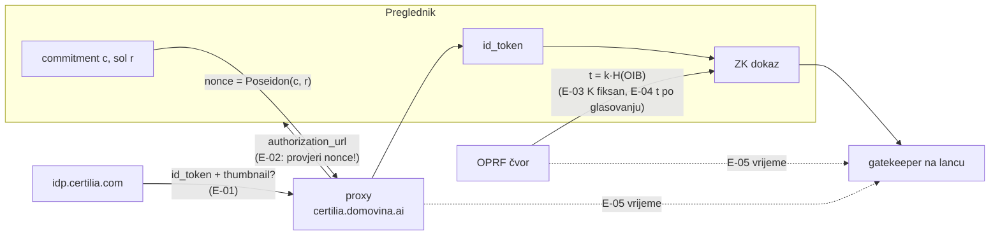

# Neovisni pregled planova: opći model glasovanja, stadion V2, „Složi svoj sabor”

**Datum:** 9. 10. 2026.
**Recenzent:** Claude Fable 5.1, kao neovisni reviewer dokumenata koje je napisao Claude Opus 5.5
**Pregledano stanje:** `main` na `d02bf0b`: [`docs/2026-10-08-opci-model-glasovanja.md`](../2026-10-08-opci-model-glasovanja.md)
(31 problem, A1–D6), [`docs/blockchain/09-v2-plan.md`](../blockchain/09-v2-plan.md) (P0–P7),
[`docs/2026-10-03-slozi-svoj-sabor.md`](../2026-10-03-slozi-svoj-sabor.md). Tvrdnje o kodu provjerene u
`MaksimirGlasanjeV1.sol`, `chainVote.ts`, edge funkciji `certilia` (`domovina-api`) i Certilia proxyju
(`certilia-server`: `config/index.js`, `authController.js`).
**Opseg:** samo čitanje i analiza. Ništa nije mijenjano. Prijedlozi su prijedlozi za sljedeću verziju plana, ne
odluke; odluke su označene kao takve.
**Vezani pregled:** [kod ovog tjedna, F-23…F-37](2026-10-09-neovisni-review-tjedan-glasaj.md). Nalazi ovdje
nose prefiks **E-** (eGlasovanje) da se ne miješaju s F-* (kod) ni s P0–P7 (faze plana).

## Sažetak

Oba dokumenta su ozbiljna i rijetko iskrena: tablica „što rješava matematika, a što organizacija” i popis
otvorenih pitanja su točno ono što certifikacija po CM/Rec(2017)5 traži. Ključna ideja (ugovor provjerava
Certilijin RS256 potpis umjesto da vjeruje našem registraru) je ispravna i izvediva: isti krug postoji u Anon
Aadhaaru i zkLoginu, a `noir-jwt` pokriva i parsiranje JWT-a. Odluke O1–O5 su razumne, a P0 kao preduvjet za
sve je pravi redoslijed.

Preskočeno je ono što se vidi tek kad se gleda stvarni token, stvarni proxy i rubovi protokola, a ne
arhitektura. Pet stvari mijenjaju plan, ne samo tekst:

1. **Token vjerojatno nosi fotografiju** (`thumbnail`, scope `profile`/`eid`), pa je mnogo veći od onoga što
   se u pregledniku može hashirati u krugu. P0.1 to mora izmjeriti **prije** spikea P1.1 (E-01).
2. **Proxy može podmetnuti svoj `nonce`** i time uz glasačevu prijavu upisati **svoj** ključ; u stadionu V2
   (Semaphore, bez promjene ključa) to je trajno oduzimanje prava glasa toj osobi. Obrana je jeftina: klijent
   provjerava `nonce` u `authorization_url` prije otvaranja (E-02).
3. **Promjena OPRF ključa `K` mijenja sve oznake osoba**, pa rečenica „prag 3 od 5 kasnije, bez promjene
   ugovora, mijenja se samo `K`” omogućuje dvostruki upis. `K` mora biti nepromjenjiv po glasovanju; prag se
   uvodi proaktivnim dijeljenjem istog `k` (E-03).
4. **Oznaka osobe je ista na svim glasovanjima**, pa javni lanac otkriva tko je sudjelovao u kojem glasovanju
   (E-04). Rješenje je jedan Poseidon u krugu.
5. **Nema ni jedne brojke o skali**: gas za 2 milijuna upisa, vrijeme dokaza koordinatora za 2 milijuna
   poruka, propusnost OPRF-a na dan papira, vrijeme dokaza na slabom Androidu (E-09).

| ID | Ozbiljnost | Dio | Nalaz |
|---|---|---|---|
| [E-01](#e-01) | **visoka** (izvedivost) | P0.1, P1 | veličina JWT-a nije u planu; proxy traži `profile eid email offline_access` i loguje `thumbnailSize`: token s fotografijom je prevelik za SHA-256 u krugu |
| [E-02](#e-02) | **visoka** (sigurnost upisa) | A9, P3.1, P5.2 | proxy može zamijeniti `nonce` i upisati vlastiti commitment uz glasačevu prijavu; u Semaphore V2 nema oporavka (A7 je MACI) |
| [E-03](#e-03) | **visoka** (dizajn) | A3, O2, P3.3 | promjena OPRF ključa `K` mijenja sve `t`: dvostruki upis preko stare i nove oznake; „bez promjene ugovora” nije točno |
| [E-04](#e-04) | srednja (privatnost) | A3, B8, P5.3 | `t = k·H(OIB)` je globalan: sudjelovanje iste osobe povezivo preko svih glasovanja; P5.3 štiti commitment, ne oznaku |
| [E-05](#e-05) | srednja (privatnost) | A2, A9, F-01 | vremenski kanal ostaje: prijava na proxyju, OPRF upit i upis na lanac u istom dahu, sve kod istog operatera |
| [E-06](#e-06) | srednja (privatnost, GDPR) | D2, P4.5 | `t` na lancu je pseudonimizirani osobni podatak, ne „ništa osobno”; par (`commitment`, `t`) je javan pri upisu; stupac `t` po pseudonimu faze 1 veže javna imena s lancem |
| [E-07](#e-07) | srednja (kontinuitet) | P4.2, P4.3 | glasači s obrisanim računom mogu glasati dvaput (listić faze 1 + novi upis); lanac nasljednika V1→V2→V3 nije u pravilu zbroja |
| [E-08](#e-08) | srednja (prisila) | A7, B4, P7 | ponovni upis kroz gatekeeper je javna transakcija s `t`: prisilitelj vidi da je glasač promijenio ključ; MACI-jeva zaštita time pada |
| [E-09](#e-09) | srednja (skala) | cijeli plan | nema procjene: gas, vrijeme dokaza koordinatora, propusnost OPRF-a, vrijeme dokaza na mobitelu |
| [E-10](#e-10) | srednja (dostupnost) | A8, D1 | OPRF je jedina točka za upis **i** za opoziv s papira; pad na dan papira = dvostruko brojanje; Estonija poništava naknadno, ne uživo |
| [E-11](#e-11) | niska (P0 popis) | P0.1 | nedostaju: `exp − iat`, duljina/abeceda `nonce`, RSA eksponent, `kid` i više ključeva, odsutan `birthdate`/`documentType`, mobile.ID vs eOsobna; proxy već validira `nonce` „ako postoji” |
| [E-12](#e-12) | niska (protokol) | P3.3 | „limit po oznaci” na zaslijepljenom ulazu ne postoji; ZK dokaz uz OPRF upit je jedina obrana od rječničkog napada na `t` svih glasača, i to treba reći |
| [E-13](#e-13) | niska (ugovori) | P2 | tvornica bez dozvola → web manifest je sidro povjerenja za „pravu” instancu; `configHash` nigdje nije vezan uz build weba ni `maksimir_verify.py` |
| [E-14](#e-14) | info | Složi svoj sabor | odobravanje više zapisa uz Semaphore nullifier radi samo kao jedan listić po glasaču; HMAC s paprom ne štiti OIB od operatera; „trajno odbijanje” je samo po sebi obrada podataka |
| [E-15](#e-15) | info | C1, C3 | s MACI-jem „glasač provjerava svoj listić na lancu” znači dešifriranje vlastitom ECDH tajnom na drugom uređaju; to treba opisati, jer je drukčije od V1 |

**Redoslijed koji predlažem za sljedeću verziju plana:** E-01 i E-11 u P0.1 (jedno mjerenje odgovara na oboje),
E-02 kao P5.2a (klijentska provjera `nonce`, odmah izvediva i u V1 toku), E-03 i E-04 kao izmjena P1/P3.3 prije
ADR-a o ugovorima, E-09 kao novi problem „C9 Skala” s brojkama iz spikea, ostalo redom.

## Opseg i metoda

Za svaku tvrdnju u dokumentima pitao sam: koji redak koda ili koji vanjski dokument je jamči, i tko je može
prekršiti. Provjereno u kodu: `MaksimirGlasanjeV1.sol:232-250` (`migrate` bez roka, potvrđeno),
`chainVote.ts:310-329` (`chainResults` čita jedan ugovor, potvrđeno), edge funkcija `certilia/index.ts:67-78`
(samo `issuer` + `audience`, bez `nonce`/`maxTokenAge`, potvrđeno), `certilia-server/src/config/index.js:26`
(scopes), `authController.js:100-116` (nonce generira proxy), `:285-287` (nonce se validira „ako postoji”),
`:296-306` (`hasThumbnail`, `thumbnailSize`). Nije bilo dostupno: stvarni `id_token` (nije ni tražen; P0.1 je
zadatak implementatora), AKD-ova dokumentacija o `thumbnail` claimu i o javnim PKCE klijentima.

## Nalazi

### E-01

**Ozbiljnost:** visoka (izvedivost cijelog P1). **Gdje:** `09-v2-plan.md` P0.1 („točan oblik i duljina JWT-a”
je naveden, ali bez posljedica), P1.1 spike; `opci-model` §11 pitanje 4.

**Scenarij.** Proxy traži scopes `openid profile eid email offline_access` (`config/index.js:26`) i pri svakoj
razmjeni loguje `hasThumbnail` i `thumbnailSize` (`authController.js:304-305`), a `userController.js` claim
`thumbnail` izrijekom preskače „jer je velik”. To znači da Certilia u `id_token` stavlja **fotografiju s
osobne iskaznice** (base64). JWT s fotografijom ima desetke kilobajta. RS256 potpisuje SHA-256 cijelog
`header.payload`; u krugu to znači SHA-256 nad svim tim bajtovima: oko 25–30 k ograničenja po 64-bajtnom
bloku, pa 30 KB tokena = ~470 blokova = **12–15 milijuna ograničenja** samo za hash, prije RSA. Anon Aadhaar
i zkLogin rade jer su njihovi ulazi mali (QR od ~2 KB, JWT od ~1 KB). Spike P1.1 bi na takvom tokenu dao
„nemoguće u pregledniku”, a razlog ne bi bio circom ni Noir.

**Zašto plan to nije vidio.** Discovery dokument navodi `claims_supported`, ali ne što **naš** klijent dobiva;
to ovisi o scopeu i o AKD-ovoj konfiguraciji klijenta.

**Preporuka (implementacija).**
1. P0.1 prvo mjeri **duljinu tokena u bajtovima** i prisutnost `thumbnail`. Imena polja su već u logovima
   proxyja (`allFields`), v. F-23; duljina nije, pa jedna probna prijava na Chiadu s `console.log(idToken.length)`
   u `signInWithCertilia` (bez spremanja vrijednosti) daje broj.
2. Zaseban OIDC klijent za glasanje (P3.1) traži **najmanji scope** koji daje `sub` i `birthdate`: po
   `claims_supported` to je vjerojatno `openid eid`, bez `profile`. Provjeriti s AKD-om može li se `thumbnail`
   isključiti po klijentu ili `claims` parametrom (proxy već koristi `claims` za `pin`, `certiliaService.js:92`).
3. Ako Certilia uvijek šalje fotografiju, P1 se mijenja: RS256 nad cijelim tokenom nije izvediv u pregledniku.
   Tada su mogućnosti: (a) dokazivanje na glasačevu **telefonu** nativno (mobile.ID je ionako tamo), gdje je
   15 M ograničenja s UltraHonkom nekoliko minuta, ne sekunde; (b) Certilijin `userinfo` ili drugi potpisani
   odgovor bez fotografije, ako postoji; (c) odustati od dokaza nad Certilijinim potpisom i dokazivati nad
   potpisom **neovisnog izdavatelja vjerodajnice** (npr. EUDI novčanik, A6), što vraća jednu točku povjerenja.
   Odluka ovisi o mjerenju, ali mora biti u planu kao grana, ne kao rizik u jednom retku.
4. U spike P1.1 uvrstiti **gornju granicu duljine tokena** kao parametar kruga (krug s fiksnim maksimumom,
   npr. 2 KB), i mjerenje na stvarnoj duljini.

### E-02

**Ozbiljnost:** visoka (sigurnost upisa). **Gdje:** `opci-model` A9 (rješenje), `09-v2-plan` P3.1, P5.2, „Rizici
plana” (treća točka).

**Scenarij.** Klijent zada `nonce = Poseidon(c, r)` i pošalje ga proxyju u `initialize`. Proxy sastavlja
`authorization_url` (danas `authController.js:100-116`: sam generira `nonce` i stavlja ga u URL). Zlonamjeran
ili kompromitiran proxy umjesto klijentova stavi **svoj** `nonce' = Poseidon(c', r')` za vlastiti ključ `c'`.
Glasač u Certilia prozoru ne vidi `nonce`, obavi MFA i prijavu. Proxy dobije token vezan uz `c'` i:
- sam izradi dokaz (ima token, `r'` i `c'`), upiše `c'` kao tu osobu i zauzme njezin `t`;
- klijentu vrati token čiji `nonce` ne odgovara, klijent odbije, glasač pokuša ponovno, ali `t` je zauzet.

U MACI načinu A7 to popravlja (nova prijava daje isti `t` → promjena ključa, uz E-08). U **stadionu V2** s
Semaphoreom nema promjene ključa: osoba je trajno bez prava glasa, a operater ima jedan lažni glas po
napadnutoj osobi. Plan to spominje kao „operater poslužuje JavaScript” i nudi ponovljivu izgradnju weba; to ne
pokriva proxy, koji nije dio weba.

**Preporuka (implementacija).**
1. **Klijentska provjera `nonce`** (jeftino, izvedivo i u V1 toku već sad): u `signInWithCertilia`, prije
   `popup.location.href = init.authorization_url`, parsirati URL i provjeriti `new URL(url).searchParams.get("nonce") === myNonce`
   i `client_id` === očekivani; inače prekinuti s greškom „Poslužitelj za prijavu je promijenio parametre”.
   Isto za `redirect_uri` i `state`.
2. **Krug provjerava `aud`** (plan već ima) i `nonce`; `exchange` na proxyju ostaje, ali proxy više nema što
   podmetnuti jer klijent kontrolira URL koji otvara.
3. **P0.3 (javni PKCE klijent) dobiva višu težinu:** s njim proxy nestaje iz toka prijave, a `nonce` i PKCE
   verifier su u pregledniku. Ako AKD to ne daje, točka 1 je obavezna, ne opcionalna.
4. Za stadion V2 ipak predvidjeti **oporavak od krivog upisa**: upis postaje konačan tek nakon prozora (npr.
   24 h); unutar prozora novi dokaz s istim `t` zamjenjuje commitment (Semaphore v4 `removeMember` +
   `addMember`; nullifier starog ključa se nikad nije koristio jer `cast` nije dopušten dok upis nije konačan).
   To ujedno rješava „izgubio sam ključ odmah nakon upisa”. Trošak: glasač ne može glasati prvih 24 h; za
   stadion prihvatljivo, za referendum s rokom od 7 dana također.

**Test koji bi pao.** Lažni proxy koji vraća `authorization_url` s tuđim `nonce`; klijent mora odbiti prije
otvaranja prozora.

### E-03

**Ozbiljnost:** visoka (dizajn). **Gdje:** `09-v2-plan` O2 („prag 3 od 5 kad se nađu institucije, bez
promjene ugovora”), P3.3 („mijenja se samo `K` kroz timelock”), `OprfKeyRegistry`.

**Scenarij.** `t = k·H(OIB)`. Ako se `K = k·G` zamijeni novim `K' = k'·G` (nove institucije, novi ključ), ista
osoba dobiva `t' ≠ t`. Gatekeeper pamti iskorištene oznake; `t'` nije među njima → ista osoba se upisuje
**drugi put**. Timelock od 72 h to ne sprječava, samo odgađa. Jedini način da promjena `K` ne stvori rupu je
da se sve stare oznake preslikaju u nove, a to bez OIB-a nije moguće (to je i smisao OPRF-a).

**Preporuka.**
1. `K` je **nepromjenjiv po glasovanju**: dio `configHash` instance, zapisan pri stvaranju. `OprfKeyRegistry`
   smije dodati ključ za **buduća** glasovanja, nikad promijeniti ključ otvorenog.
2. Prijelaz s jednog čvora na prag 3 od 5 **bez promjene `K`**: proaktivno dijeljenje tajne (Shamir nad istim
   `k`; prvi čvor podijeli `k` na 5 dijelova s pragom 3, preda ih institucijama i obriše cjelinu). `K` ostaje,
   DLEQ dokazi u krugu ostaju valjani, ugovor se ne mijenja. Što ostaje: prvi čvor je **jednom** imao cijeli `k`;
   to treba reći javno, kao što je rečeno za registrara u V1. Kad se pojavi novo glasovanje, novi `K` nastaje
   distribuiranim generiranjem (DKG) i tada nitko nikad ne vidi cijeli `k`.
3. U „Rizici plana” dodati: kompromitiran `k` = napadač može izračunati `t` za bilo koji OIB → deanonimizacija
   „tko je glasao” za sva glasovanja s tim `K` (ne sadržaja, uz B1). To je argument za prag od prvog dana, ne
   „kasnije”.

### E-04

**Ozbiljnost:** srednja (privatnost). **Gdje:** `opci-model` A3, B8; `09-v2-plan` P1 javni ulaz `t`, P5.3.

**Scenarij.** `t` ovisi samo o OIB-u i `k`. Osoba se upiše na glasanje o stadionu i na potpise za referendumsku
inicijativu: na oba lanca stoji isti `t`. Svatko može presjeći skupove i reći „ovih 4.000 oznaka sudjelovalo
je u oba”, a uz E-06 (javna imena faze 1 → `t`) i imenom. P5.3 (`HKDF(tajna, electionId)`) rješava povezivost
**commitmenta**, ne oznake, pa cilj „upisi iste osobe na različitim glasanjima ne mogu se povezati” nije
postignut.

**Preporuka (implementacija).** U krugu: `t` ostaje privatni ulaz, a javni ulaz je `t_e = Poseidon(t, electionId)`.
DLEQ se i dalje provjerava nad `t` (privatno). Gatekeeper pamti `t_e`. Posljedice za plan: P4 „zauzete oznake”
upisuju `t_e` za stadionsko glasovanje; D1 opoziv s papira računa `t` pa `t_e`; A8 samoprovjera uspoređuje
`t_e`. Trošak: jedan Poseidon u krugu (~250 ograničenja), zanemariv.

### E-05

**Ozbiljnost:** srednja (privatnost; F-01 u novom obliku). **Gdje:** `opci-model` A2 („operater ne sudjeluje u
upisu, pa vezu nema odakle znati”), A9, B6; `09-v2-plan` „Rizici plana”.

**Scenarij.** Tvrdnja A2 je matematički točna i vremenski netočna. Isti operater (domovina.ai) vidi: trenutak
prijave na proxyju (s OIB-om u logu, F-23), trenutak OPRF upita (zaslijepljen, ali s IP-om i vremenom), i
trenutak transakcije upisa na lancu (javno, s `t` i `c`). S jednim glasačem na sat to je jednoznačno
preslikavanje OIB → `t` → `c`, bez ikakvog razbijanja kriptografije. F-01 iz prvog pregleda je bio točno to, i
plan ga u §1.4 svrstava u „mora se riješiti prije V2 (sad preko Certilia `nonce`)”, ali `nonce` rješava
podmetanje, ne vrijeme.

**Preporuka.**
1. Odvojiti upis od prijave **u vremenu, na strani glasača**: nakon prijave i dokaza, klijent nudi „Upiši
   odmah” ili „Upiši kasnije” s nasumičnom odgodom (npr. 1–24 h, dok je stranica zatvorena, uz
   `localStorage` paket spreman za slanje; dokaz mora imati `now` prozor koji to dopušta, v. E-11).
2. Relayer **skuplja upise i šalje ih u serijama** u nasumičnim trenucima (B6 to predlaže za listiće; vrijedi i
   za upise), pa vrijeme na lancu nije vrijeme klika.
3. Logovi proxyja bez OIB-a (F-23) i bez IP-a na OPRF čvoru.
4. U dokumentaciji A2 zamijeniti „vezu nema odakle znati” s „vezu može izvesti iz vremena dok se upisi ne
   odgađaju i ne grupiraju; to su mjere X i Y”. Isto u `08:506` koje P0.5 već planira ispraviti.

### E-06

**Ozbiljnost:** srednja (privatnost, pravo). **Gdje:** `opci-model` D2 („na lanac ne ide nijedan osobni
podatak”), B8; `09-v2-plan` P4.5 („javni zapis faze 1 dobiva stupac `t` po pseudonimu”), P2 (`CertiliaZkGatekeeper`
„vraća `personTag`; instanca bilježi iskorištene oznake”).

**Tri stvari.**
1. **`t` je pseudonimizirani osobni podatak.** Tko drži `k` (ili 3 od 5 dijelova) može iz OIB-a izračunati `t`,
   dakle povezati osobu s oznakom. Po GDPR-u (čl. 4 st. 5, EDPB smjernice o blockchainu 2025) to je
   pseudonimizacija, ne anonimizacija, a lanac je nepromjenjiv. Rečenica „ništa osobno na lancu” je u DPIA-i
   neodrživa. Treba pisati: „na lancu je pseudonimizirani identifikator sudjelovanja, pravna osnova je X,
   rizik ponovne identifikacije ovisi o pragu institucija”.
2. **Par (`commitment`, `t`) je javan** pri upisu: gatekeeper u istoj transakciji vidi oba. Semaphore poslije
   skriva koji je listić čiji unutar skupa; skup je danas veličine 1–2. Dokumentacija mora reći da je
   „tko je glasao” javno po oznaci, a „kako” skriveno samo u mjeri anonimnog skupa (B7), i to prije nego što
   netko glasa u V2.
3. **Stupac `t` po pseudonimu faze 1** (P4.5) povezuje javna imena (tko je u fazi 1 dijelio glas s imenom,
   F-08) s `t`, pa s commitmentom na lancu, pa s anonimnim skupom. To je F-13 u V2 obliku.

**Preporuka.** (a) D2 i uvjeti glasanja (tekst u `flowHtml`, grana `terms`) prepisani po točki 1. (b) P4.5:
umjesto stupca `t` po pseudonimu objaviti **Merkle korijen** skupa `(pseudonym, t_e)` i broj; glasač koji želi
može sam provjeriti svoj list (dokaz uključenja), javnost provjerava broj i to da nijedan `t_e` iz skupa nije
dvaput upisan (to gatekeeper jamči). Gubi se mogućnost da bilo tko javno provjeri *koji* pseudonim je koji
`t_e`, što je i cilj. (c) B7 minimalna veličina skupa prije nego se V2 počne brojati; za stadion npr. 20.

### E-07

**Ozbiljnost:** srednja (kontinuitet, dvostruki glas). **Gdje:** `09-v2-plan` P4.2, P4.3, pravilo poštenog zbroja.

**Scenarij A.** Glasač faze 1 obrisao je račun (`oib_hash` bez šifre OIB-a, P4.2). Njegov `t` se ne može
izračunati, pa nije zauzet. Pravilo zbroja kaže: listić faze 1 vrijedi ako `t` nije upisan u V2 i nije prenesen
u V1. Ta osoba se Certilijom upiše u V2 (njen `t` je slobodan), glasa, **i** njezin listić faze 1 i dalje
vrijedi. Dva glasa. Broj takvih osoba je javan (4.2), ali pravilo ih ne isključuje.

**Scenarij B.** V1 ima `setSuccessor` jednom i zauvijek. Ako V2 ima grešku prije nego su svi preselili, V3 mora
biti nasljednik V2, a listići iz V1 idu V1→V2→V3. Pravilo zbroja i `maksimir_verify.py` govore o „V2 + V1 bez
preseljenih”, ne o lancu nasljednika; `Migrated` događaje treba slijediti tranzitivno.

**Preporuka.** (a) Odluka: listić faze 1 osobe s obrisanim računom **se ne broji** u V2 razdoblju (osoba
može glasati novim upisom); broj isključenih objavljen. Alternativa (broji se, upis nije moguć) nije izvediva
jer `t` nije poznat. (b) Pravilo zbroja definirati rekurzivno: „instanca V_n + svi prethodnici bez nullifiera
preseljenih u bilo kojeg nasljednika”, `verify --election` prati `successor()` dok nije nula. (c) P6.6 dodati:
`setSuccessor(V2)` tek kad V2 ima **svoj** testiran `setSuccessor`, jer je to jedini izlaz iz V2.

### E-08

**Ozbiljnost:** srednja (prisila, kupovina). **Gdje:** `opci-model` A7, B4; `09-v2-plan` P7.

**Scenarij.** B4 kaže: glasač prije prodaje tajno promijeni ključ. A7 kaže: nova Certilia prijava daje isti `t`,
gatekeeper šalje MACI poruku promjene ključa. Ako promjena ključa ide **kroz gatekeeper** (jer treba novi
Certilia dokaz), to je javna transakcija na lancu s `t`: prisilitelj koji je upisao žrtvu svojim ključem gleda
lanac i vidi da je za `t` stigla druga registracija. Tajnost promjene ključa, koja je cijela poanta MACI-ja,
time pada za upravo onaj slučaj koji A7 rješava. U izvornom MACI-ju promjena ključa je šifrirana poruka bez
javnog identifikatora.

**Preporuka.** Razdvojiti dva slučaja i reći koji je koji:
- **Glasač ima stari ključ** (B4, prodaja): promjena ključa je obična šifrirana MACI poruka potpisana starim
  ključem, bez gatekeepera i bez `t`. Nevidljivo.
- **Glasač nema stari ključ** (A7 izgubljen uređaj; E-02 podmetnut ključ): potreban je novi Certilia dokaz. Da
  ne bude vidljiv, dokaz ide **unutar** šifrirane poruke (koordinator ga provjerava u krugu obrade) ili kroz
  prozor upisa iz E-02 točke 4 (zamjena prije konačnosti). Prvo je istraživački (PSE nema gotov krug), drugo
  je jednostavno, ali vidljivo. Plan mora izabrati i napisati što prisilitelj vidi.

### E-09

**Ozbiljnost:** srednja (skala). **Gdje:** cijeli opći model, posebno „Zaključak: može”, faza 4 (MACI) i D1.

**Što nedostaje.** Nijedna brojka o kapacitetu. Grube procjene koje plan treba zamijeniti mjerenjima:

| Što | Red veličine za državni referendum (2 M e-glasača) | Posljedica |
|---|---|---|
| Upis na Gnosis | `register` s verifikacijom Groth16 + Semaphore `addMember`: ~400 k gas; 2 M upisa = 8·10¹¹ gas; Gnosis blok ~17 M gas / 5 s → ~47 k blokova = **2,7 dana punih blokova** | upis mora početi tjednima prije; ili rollup/agregirani dokazi |
| MACI obrada | koordinator dokazuje serije poruka; javni PSE podaci: minute po seriji od stotina poruka na jakom stroju; 2 M poruka = **dani** | rezultat nije isti dan; prag-koordinator to množi |
| OPRF na dan papira (D1) | svaki papirnati birač (do 2 M) traži jedan OPRF upit s DLEQ-om u 12 sati = ~50/s na čvor, uz dostupnost od 99,99 % | v. E-10 |
| Dokaz u pregledniku | Anon Aadhaar (2 KB ulaz) na mobitelu: desetke sekundi do minuta; s E-01 (30 KB) nemjerljivo | P1.1 mjeri na Androidu od 150 €, ne na iPhoneu |
| Relayer | 2 M poruka × gas; tko plaća; DoS zaštita bez nullifiera (MACI poruke su anonimne) | P3.5 limit po nullifieru ne postoji u MACI-ju |

**Preporuka.** Dodati problem **C9 Skala** s ovom tablicom kao hipotezom, i u P1.1 i P6 mjerenja koja je
potvrđuju ili ruše. Uz to pošteno napisati: „stadion i udruge: dokazano izvedivo; referendum: izvedivo uz
rollup ili agregaciju dokaza, što nije isprobano”. „Zaključak: može” je točan za integritet, a za skalu je
pretpostavka.

### E-10

**Ozbiljnost:** srednja (dostupnost, dvostruko brojanje). **Gdje:** `opci-model` A8, D1.

**Scenarij.** D1: biračko mjesto za svakog papirnatog birača traži `t` od OPRF-a i šalje opoziv. Ako OPRF
(ili mreža na biračkom mjestu) ne radi, odbor ne može znati je li osoba e-glasala. Dvije mogućnosti, obje
loše: odbiti papir (oduzimanje prava) ili prihvatiti papir bez opoziva (dvostruki glas). Estonija to rješava
tako da e-glasovi birača koji su glasali na papiru budu poništeni **nakon** zatvaranja, usporedbom popisa,
ne uživo na biračkom mjestu.

**Preporuka.** D1 preraditi na estonski model: biračko mjesto radi kao danas (popis birača, potpis); nakon
zatvaranja DIP preko praga OPRF-a izračuna `t_e` za sve papirnate birače (ili za sve u registru, jednom) i
objavi popis opoziva s dokazom; koordinator ih izostavi pri brojanju. Javni trag: broj opoziva po biračkom
mjestu. Gubi se: ništa bitno, jer e-glas ionako nema sadržaj do brojanja (B1). Dobiva se: nema ovisnosti o
mreži na dan papira.

### E-11

**Ozbiljnost:** niska (popis za P0.1). **Gdje:** `09-v2-plan` P0.1, `opci-model` §11.

Što još izmjeriti ili provjeriti u istoj probnoj prijavi, jer o tome ovisi krug:

| Stavka | Zašto | Gdje se vidi |
|---|---|---|
| `exp − iat` (vijek tokena) | krug traži `iat ≤ now ≤ exp`; ako je `exp` 5 min, dokaz na mobitelu + relayer ne stignu; E-05 odgoda upisa nemoguća | token |
| `nonce` prisutnost, duljina i dopuštena abeceda | Poseidon izlaz je ~77 decimalnih ili 64 hex znakova; IdP-ovi znaju rezati ili odbijati; proxy danas validira „ako postoji” (`authController.js:286`), što sugerira da postoji, ali i da odsutan prolazi | token + `authorization_url` |
| RSA eksponent i `kid`, broj ključeva u JWKS-u u vremenu | krug pretpostavlja `e = 65537` i jedan `keyHash` po dokazu; rotacija bez preklapanja = 72 h bez upisa | JWKS, pratiti tjedan dana |
| `birthdate`, `documentType`, `documentIssuingCountry` za **mobile.ID** vs eOsobnu | mobile.ID možda nema podatke s dokumenta; krug mora dopustiti „nema” i glasovanje odlučiti što tada | dvije prijave |
| `acr` vrijednosti | razina pouzdanosti (eOsobna visoka, mobile.ID značajna); glasovanje može tražiti razinu | token |
| redoslijed i oblik claimova (JSON) | `noir-jwt`/zkLogin trebaju položaje claimova; promjena redoslijeda na IdP-u ruši dokaz | token, pratiti |
| ukupna duljina u bajtovima i `thumbnail` | E-01 | token |

Imena polja su već u logovima proxyja (F-23), pa se dio tablice popunjava bez nove prijave.

### E-12

**Ozbiljnost:** niska (protokol, ali važno za tekst). **Gdje:** `09-v2-plan` P3.3 („limit po oznaci”).

**Scenarij.** OPRF ulaz je zaslijeđen: svaki upit izgleda nasumično, pa „limit po oznaci” ne može postojati
(čvor ne zna oznaku). Bez dokaza da zaslijeđeni ulaz dolazi iz valjanog tokena, bilo tko može zatražiti
`t = k·H(x)` za **svih 10¹⁰ OIB-ova** (uz brzinu od 50/s to je 6 godina, ali s ciljanim popisom od 100 k
OIB-ova javnih osoba jedan dan) i time deanonimizirati „tko je glasao” za sve na lancu. Plan taj dokaz navodi
(„inače bi svatko mogao izračunati oznaku za tuđi OIB”), ali kao mjeru protiv upisa, ne kao jedinu obranu
privatnosti svih glasača. Treba reći da je to **kritični** dio OPRF čvora, s vlastitim negativnim testovima.

**Preporuka.** P3.3 prepisati: „čvor odgovara samo na upit s valjanim ZK dokazom (token svjež, `aud` naš);
limit po IP-u je samo protiv DoS-a; nema limita po oznaci jer oznaka nije vidljiva”. Napomena o trošku:
dokaz za OPRF je zaseban od dokaza za gatekeeper (dva dokaza na mobitelu); spike P1.1 mjeri oba.

### E-13

**Ozbiljnost:** niska (ugovori, sidro povjerenja). **Gdje:** `09-v2-plan` P2 (`ElectionFactory` „bez dozvola”), P5.

**Scenarij.** Tvornica bez dozvola znači da bilo tko stvori instancu „stadion” s istim scopeom i istim
imenom. Što je „pravo” glasovanje određuje web (`maksimir_chains` u bazi, F-19/F-21) i `maksimir_verify.py`.
Plan veže `configHash` uz instancu, ali ne kaže gdje je `configHash` zapisan **izvan** operaterove baze.

**Preporuka.** `configHash` i adresa instance idu u **build weba** (kao `check-frozen` za bytecode), u
`glasanje/checkpoints/index.json` (svaki sat, žigosano u Bitcoin) i u javni sažetak dana D2. `verify`
odbija instancu čiji `configHash` nije u manifestu. Time je sidro javno i žigosano, a ne red u bazi.

### E-14

**Ozbiljnost:** info. **Gdje:** `2026-10-03-slozi-svoj-sabor.md`.

1. **Nullifier i odobravanje više zapisa.** Semaphore dopušta jednu poruku po scopeu po glasaču. Ako je scope
   po zapisu kandidata (da glasač može odobriti više njih), nullifieri su različiti i **nepovezivi**, pa
   „glasač koji je glasao za više duplikata broji se jednom” nije provjerljivo nakon spajanja. Radi samo
   model stadiona: jedan listić (popis zapisa) po glasaču po krugu, scope po krugu, zamjenjiv. Spajanje
   duplikata tada je deduplikacija unutar listića, trivijalno i provjerljivo.
2. **HMAC s paprom ne štiti od operatera.** Tko ima papar, prođe 10¹⁰ OIB-ova za minute. Zaštita je samo
   prema vanjskim čitateljima baze. Isti problem kao faza 1 i isto ga treba reći; dugoročno isti OPRF kao V2.
3. **„Trajno odbijanje, ime se ne prikazuje”** zahtijeva da sustav pamti „osoba X je odbila”, što je obrada
   osobnih podataka bez pristanka (osoba je samo rekla „ne”). I: predlagači ne znaju za odbijanje, pa stvore
   novi zapis za istu osobu; sprječavanje traži privatno uparivanje (ime + godina rođenja) protiv skrivenog
   popisa. Pravno mišljenje koje dokument traži treba pokriti baš to.
4. **Preuzimanje tuđeg zapisa** (isto ime): `birthdate` iz Certilije protiv godine u zapisu je dobar filtar;
   rok za osporavanje treba javni zapis preuzimanja u lancu hasheva (dokument to ima).

### E-15

**Ozbiljnost:** info. **Gdje:** `opci-model` C1, C3.

S MACI-jem glasač na lancu vidi samo svoju **šifriranu** poruku. „Provjera drugim uređajem” (estonski model)
tada znači: drugi uređaj dobije glasačevu ECDH tajnu (QR), dohvati poruku, dešifrira je i pokaže sadržaj. To
radi, ali je drukčije od V1 (gdje se čita `ballotOf`) i treba biti opisano, uključujući da **ista tajna** koja
omogućuje provjeru omogućuje i kupcu da provjeri (B5): QR za provjeru mora biti jednokratan i vremenski
ograničen, kao u Estoniji (30 min, 3 pokušaja).

## Što je provjereno i drži

| Tvrdnja | Provjera | Stanje |
|---|---|---|
| `migrate` u V1 nema provjeru roka | `MaksimirGlasanjeV1.sol:232-250`: nema `open` modifikatora ni usporedbe s `closesAt` | drži; V2 mora provjeravati (plan ima) |
| Web zbraja jedan ugovor | `chainVote.ts:310-329`: `readTally(client(c), c.contract)` jednom | drži |
| Edge funkcija ne provjerava `nonce`, `maxTokenAge`, `acr` | `certilia/index.ts:71-74`: `jwtVerify(…, { issuer, audience })` | drži |
| Nonce generira proxy, klijent ga ne zadaje | `authController.js:100-116` | drži; plan P3.1 to mijenja |
| Certilia RS256, RSA-2048 | plan citira JWKS; nisam ponovno dohvaćao | neprovjereno ovdje, vjerodostojno |
| Semaphore ostaje za stadion V2 (javni rezultati, dijeljenje) | odluka u planu | razumno; E-02 točka 4 i E-06 vrijede za Semaphore |
| OPRF s DLEQ u krugu daje matematičku jedinstvenost | RFC 9497 VOPRF; Baby Jubjub u circomu postoji | drži, uz E-03 (K fiksan) i E-12 (dokaz uz upit) |
| Estonija: ponovno glasanje i papir poništava e-glas | plan citira statistiku 2023. | drži; ali poništavanje je naknadno, ne uživo (E-10) |
| Tablica „matematika vs organizacija” | | dobra; treba joj dodati red „skala: rollup/agregacija, pretpostavka neisprobana” (E-09) i „pseudonimizacija `t`: prag institucija” (E-06) |

## Ispravci koje dokumentacija treba

| Dokument | Što |
|---|---|
| `opci-model` A2 | „vezu nema odakle znati” → vremenski kanal i mjere (E-05) |
| `opci-model` A3, B8 | `t` je isti za sva glasovanja → `t_e` (E-04); `K` nepromjenjiv po glasovanju (E-03) |
| `opci-model` A7, B4 | koji je slučaj vidljiv prisilitelju (E-08) |
| `opci-model` D1 | naknadno poništavanje, ne uživo (E-10) |
| `opci-model` D2 | `t` je pseudonimizirani osobni podatak (E-06) |
| `opci-model` §1 tablica | novi red C9 Skala (E-09) |
| `opci-model` §11 | pitanja iz E-11 i E-01 |
| `09-v2-plan` P0.1 | duljina tokena i `thumbnail` prvo (E-01); popis iz E-11 |
| `09-v2-plan` O2, P3.3 | „mijenja se samo K” → proaktivno dijeljenje istog `k` (E-03); dokaz uz OPRF upit kao jedina obrana (E-12) |
| `09-v2-plan` P4 | obrisani računi (E-07a), lanac nasljednika (E-07b), Merkle korijen umjesto stupca `t` (E-06) |
| `09-v2-plan` P5.2 | klijentska provjera `nonce` u `authorization_url` (E-02) |
| `09-v2-plan` „Rizici plana” | proxy kao napadač, ne samo JavaScript (E-02); kompromitiran `k` (E-03) |
| `slozi-svoj-sabor` | jedan listić po glasaču po krugu (E-14) |

## Što bih napravio prije bilo kojeg koda V2

1. **P0.1 s E-01 i E-11**: jedna probna prijava na Chiadu, bilježe se samo duljina tokena, imena polja,
   `exp − iat`, prisutnost `nonce`/`thumbnail`. Ako je token s fotografijom, plan P1 se grana (E-01 točka 3) i
   taj ADR dolazi prije spikea.
2. **E-02 točka 1 odmah u V1 tok** (`signInWithCertilia`): provjera `nonce`, `client_id`, `redirect_uri` u
   `authorization_url`. Nije V2, ali je isti kôd i isti rizik već danas (proxy može zamijeniti `redirect_uri`).
3. **ADR „oznaka osobe”** koji fiksira: `t_e = Poseidon(t, electionId)`, `K` nepromjenjiv po glasovanju,
   proaktivno dijeljenje za prag, dokaz uz OPRF upit, prozor konačnosti upisa. To je ulaz u P1.2 i P2.1.
4. **C9 Skala** kao problem s tablicom hipoteza; mjerenja u P1.1 i P6.
5. Tek onda spike P1.1.
