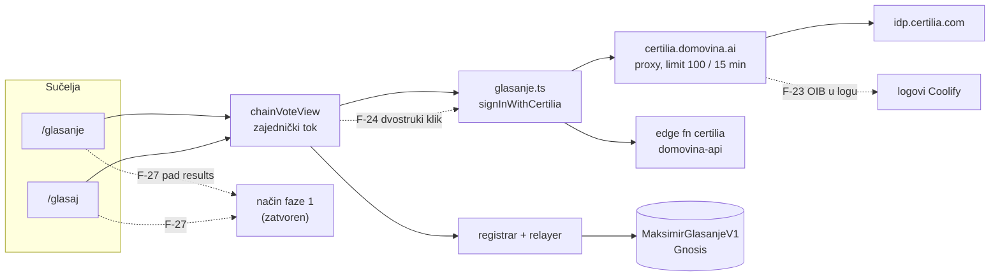

# Neovisni pregled tjedna 30. 9. – 8. 10. 2026.: `/glasaj`, Certilia popravak, testovi pariteta

**Datum:** 9. 10. 2026.
**Recenzent:** Claude Fable 5.1, kao neovisni reviewer koda i dokumenata koje je napisao Claude Opus 5.5
**Pregledano stanje:** `main` na `d02bf0b` (čisto radno stablo uz jednu necommitanu datoteku,
`docs/2026-09-30-provjerljiva-anketa-koraci.md`), raspon `827c576..d02bf0b` (30. 9. – 8. 10. 2026.).
Uz to Certilia proxy `~/git/stepanic/flutter_certilia/certilia-server` (popravak `9327e92`) i edge funkcija
`certilia` u `domovina-api`, jer su dio ovotjednog popravka prijave.
**Opseg:** samo čitanje i analiza. Ništa u implementaciji, testovima ni dokumentaciji na koju se nalazi odnose
nije mijenjano. Prijedlozi implementacije su prijedlozi, ne izmjene.
**Prethodni pregledi:** [F-01…F-12](2026-09-26-neovisni-review-glasanje.md), [F-13…F-22](2026-09-26-neovisni-review-wiring.md).
Numeracija nastavlja (F-23…). Pregled planova (opći model glasovanja, stadion V2, Složi svoj sabor) je u
zasebnom dokumentu: [2026-10-09-neovisni-review-opci-model-i-v2.md](2026-10-09-neovisni-review-opci-model-i-v2.md).

## Sažetak

Tjedan je bio dobar. `/glasaj` je napravljen točno onako kako pravila iz prototipa traže na mjestima gdje je
to najvažnije: sučelje ne dira ugovor, registrar, relayer ni bazu; listić koji ulazi u `startFlow` je onaj s
ekrana „Provjeri svoj listić”; prijedlog bodova je javna formula sa sto postotnom pokrivenošću u Nodeu; a
paritetni test je prvo napisan nad starim sučeljem pa tek onda nad novim, uz dokazanu osjetljivost (dvije
namjerne greške uhvaćene). Popravak prijave na iPhoneu ima točnu dijagnozu (limit po IP-u, polling od 2 s) i
dva razumna popravka (izuzeće pollinga na serveru, back-off i poruka u modalu na webu).

Ono što je preskočeno je u rubovima, ne u jezgri. Tri stvari bih popravio prije sljedećeg deploya: proxy
**loguje OIB, ime i e-mail** svake prijave u čisti tekst (F-23); gumb „Prijavi se eOsobnom” u modalu nema
stanje „radim”, pa drugi klik otvara drugu prijavu koju više nije moguće otkazati (F-24); i kad
`maksimir_results` padne, **oba sučelja tiho padnu u način faze 1** i nude predaju koja na produkciji više ne
postoji (F-27). Ostalo su rubovi UX-a, rupe u testovima i jedan neodlučen dokument.

| ID | Ozbiljnost | Dio | Nalaz |
|---|---|---|---|
| [F-23](#f-23) | **srednja** (privatnost) | Certilia proxy | svaka razmjena koda loguje `sub` (OIB), ime, prezime i e-mail na razini `info`; callback loguje sva zaglavlja i query |
| [F-24](#f-24) | **srednja** (limit, UX) | `chainVoteView` + oba sučelja | gumb prijave u modalu nema stanje „radim”: drugi klik pokreće drugu `initialize` + polling petlju, prvu više nitko ne može otkazati, `st.abort` je pregažen |
| [F-25](#f-25) | srednja | `glasanje.ts` | 429 na `/exchange` **nakon uspješne** Certilia prijave baca cijelu prijavu, iako proxy sesiju čuva 10 min; „Odustani” čeka i do 30 s; `Retry-After` kao datum se ne parsira |
| [F-26](#f-26) | niska | `glasanje.ts` | rok klijenta 5 min je kraći od roka proxyja 10 min (mobile.ID na sporom telefonu); 404 nakon restarta proxyja javlja „sesija je istekla” |
| [F-27](#f-27) | **srednja** (robusnost) | `glasajView`, `glasanjeView`, `chainVoteView.wantsChain` | pad `maksimir_results` isključuje lanac: `/glasaj` nudi „Predaj na klasičnom listiću”, klasični nudi predaju faze 1 koja je zatvorena; „Kreni” radi i kad backend ne radi |
| [F-28](#f-28) | niska (pravilo 3) | `glasajView.toPoints` | nakon promjene **redoslijeda** favorita bez dodavanja/micanja preset „Po redoslijedu” ostaje označen, a bodovi ga više ne prate |
| [F-29](#f-29) | niska (UX) | `glasajView` | listić s više od 10 radova (klasični nacrt, glas s lanca) u `/glasaj` prikazuje „12 / 10”, ne da dodati, poruka zbunjuje |
| [F-30](#f-30) | niska (UX, podaci) | `glasajView` + `ballotMath.clampPoints` | neispravan unos u polje bodova (prazno, „12,5” s zarezom) tiho postavlja 0 i rad „neće ući u glas” |
| [F-31](#f-31) | niska (UX) | `glasajView` tipkovnica | držanje strelice (auto-repeat) proswipea desetke radova; nema `e.repeat` zaštite |
| [F-32](#f-32) | info (pravilo 1) | `chainVoteView.flowHtml` | zajednički modal nikad ne prikazuje listić koji potpisuje; „što vidiš je ono što potpisuješ” počiva na ekranu svakog sučelja posebno, suprotno pravilu 1 iz prototipa |
| [F-33](#f-33) | info (pravilo 3) | oba sučelja | dva sučelja uživo sa samoodabirom, bez ikakvog mjerenja: „objaviti udio svake varijante i metodu” nije moguće |
| [F-34](#f-34) | niska (testovi) | CI, `glasanje-paritet.mjs`, mock | `test:glasanje` i `test:paritet` nisu u CI-ju; mock nema Certiliju, registrar ni relayer; nema scenarija za zatvoreno glasanje, pad backenda, 429, >10 radova, Esc za vrijeme prijave |
| [F-35](#f-35) | niska (ops) | `regression.mjs` | lažne BASELINE razlike od zamjene `#/` opisane su, popravak od jednog retka nije napravljen |
| [F-36](#f-36) | info | `docs/2026-09-30-provjerljiva-anketa-koraci.md` | 9 dana necommitano; pismo trećoj osobi s e-mailom; SQL u pismu bez `revoke`/RLS napomene |
| [F-37](#f-37) | niska (privatnost, O-1) | `/glasaj` | O-1 (odjava ne briše ključ) i dalje otvoren, a `/glasaj` nema ni gumb „Odjava” |

**Stanje starih nalaza (provjereno 9. 10.):** F-05 i dalje otvoren (zadnjih 48 h: 10 `schedule` runova
umjesto 48, tj. 4–5 dnevno); F-07 otvoren (`/glasaj` bez CSP-a i HSTS-a, provjereno `curl -sI`); O-1…O-6
otvoreni osim O-5 koji je riješen u `/glasaj` (nasumičan redoslijed po sesiji), ali **ne** u `/glasanje`.
Tablica stanja svih F-* u `09-v2-plan.md` §1.4 odgovara onome što sam vidio u kodu.

## Opseg i metoda

Pročitano u cijelosti:

- ovaj repo, `git diff 827c576~1..d02bf0b`: `web/src/glasajView.ts` (757 redaka), `web/src/ballotMath.ts`,
  `web/test/ballotMath.test.ts`, `web/scripts/glasanje-paritet.mjs`, `web/scripts/lib/glasanje-mock.mjs`,
  izmjene u `glasanje.ts`, `glasanjeView.ts`, `chainVoteView.ts`, `app.ts`, `meta.ts`, `docs.ts`, `style.css`;
  nepromijenjene datoteke o kojima nalazi ovise: cijeli `chainVoteView.ts`, `chainVote.ts`, `glasanjeView.ts`,
  `chain/client/ballot.ts` (`encodePoints`), `web/scripts/regression.mjs` (dio)
- dokumenti: `2026-10-02-glasaj-vise-sucelja.md`, `2026-09-29-glasanje-obilazak-kao-posjetitelj.md`,
  `2026-09-30-glasanje-ux-istrazivanje.md` (sažetak i §1–4), `2026-09-30-provjerljiva-anketa-koraci.md`
  (necommitan), `prototipi/glasanje-ux/README.md` (pravila), dopune `2026-09-25-regresijske-provjere.md`
- `certilia-server`: `src/index.js` (limiter), `controllers/authController.js` (initialize, callback, exchange),
  `services/pollingSessionService.js`, `services/sessionService.js`, `config/index.js`
- `domovina-api`: `supabase/functions/certilia/index.ts`

Uživo, samo čitanjem (9. 10. 2026.): `curl -sI https://maksimir.domovina.ai/glasaj` (200, bez CSP/HSTS),
`curl -sD- https://certilia.domovina.ai/api/health` (jedan zahtjev; `ratelimit-policy: 100;w=900`, bez
`Access-Control-Expose-Headers`), `gh run list --workflow maksimir-checkpoint.yml`. Ništa nije pokretano što
piše: nijedna prijava, nijedan RPC, nijedan `localStorage` na produkciji.



## Nalazi

### F-23

**Ozbiljnost:** srednja (privatnost). **Mjesto:** `certilia-server/src/controllers/authController.js:143-150`
(callback), `:296-306` (exchange).

**Scenarij.** Svaka uspješna razmjena koda zapisuje `logger.info('ID token decoded successfully', { sub, name,
given_name, family_name, email, … })`. `sub` je OIB (potvrđeno u edge funkciji: „OIB stiže kao `sub`”).
Callback dodatno loguje `req.query`, `req.headers` i `req.url` u cijelosti. Logovi žive u Coolifyju, s
nepoznatim rokom čuvanja, i čita ih svatko s pristupom aplikaciji. To je suprotno onome što sustav tvrdi
glasaču („u bazi se čuva samo šifrirani OIB i njegov hash”) i gore od onoga što opći model priznaje u A9
(„proxy vidi token”): proxy ga i **trajno zapisuje**.

**Dokaz.**

```js
// authController.js:296
logger.info('ID token decoded successfully', {
  sub: decoded.sub, name: decoded.name, given_name: decoded.given_name,
  family_name: decoded.family_name, email: decoded.email, …
  allFields: Object.keys(decoded)
});
```

**Preporuka.**
1. U `exchange` logirati samo prisutnost polja, ne vrijednosti: `{ hasSub: !!decoded.sub, fields: Object.keys(decoded) }`.
2. U callbacku ukloniti `req.headers` i `req.query` (sadrže `code` i `state`); zadržati samo `state` skraćen na 8 znakova.
3. Postaviti rok čuvanja logova u Coolifyju i jednokratno očistiti postojeće.
4. Isti princip za `logger.debug('All ID token claims')`: ako je `debug` ikad uključen u produkciji, u log ide cijeli token.

**Napomena za plan V2.** Ta ista linija (`allFields`) već danas daje odgovor na P0.1 iz `09-v2-plan.md`
(koja polja token sadrži) bez nove prijave: imena polja su u postojećim logovima. Vrijednosti u istom retku
ne treba čitati.

**Test koji bi danas pao.** Nakon probne prijave na Chiadu: `grep -E '"sub":"[0-9]{11}"' <log>` ne smije vratiti ništa.

### F-24

**Ozbiljnost:** srednja (limit, UX). **Mjesto:** `web/src/chainVoteView.ts:573-576` (gumb bez `disabled`),
`:729-738` (handler), `web/src/glasajView.ts:163-176` i `glasanjeView.ts:253-267` (`signIn`).

**Scenarij.** Glasač klikne „Prijavi se eOsobnom”. `signIn()` postavi `st.busy`, `run()` nacrta stranicu, a
crtanje uključuje i modal (`modalHtml()` → `flowHtml()`), u kojem gumb prijave ostaje aktivan i s
`data-autofocus`. Drugi klik (ili Enter, jer je gumb fokusiran) zove `signInWithCertilia` ponovno:
- otvara se isti imenovani prozor `certilia_auth`, ali s **novom** `initialize` + `polling/start` sesijom
  (2 zahtjeva od 100 po IP-u, v. [glasaj doc, „Zamke”](../2026-10-02-glasaj-vise-sucelja.md));
- `st.abort = new AbortController()` pregazi prvi kontroler, pa prvu petlju nitko ne može otkazati: vrti se do
  roka od 5 min;
- koja god petlja prva dobije `completed`, obje potom pokušaju `exchange` i `certilia` funkciju; druga dobije
  grešku „Invalid or expired session” koja završi u `st.msg` ili `S.flow.error`, nakon uspješne prijave.

Na iPhoneu, gdje je prijava spora i korisnik nestrpljiv, ovo je realan put do istih simptoma koji su
popravljani 2. 10.

**Dokaz.** `flowHtml()` grana `now === "signin"`: `<button class="btn btn-primary" data-cv="signin" data-autofocus>`,
bez ikakvog `disabled`. `Host` nema `busy()`.

**Preporuka (implementacija).**
1. `Host` dobiva `busy(): boolean` (oba sučelja vraćaju `!!st.busy`).
2. U `flowHtml()`: `<button … data-cv="signin" ${h.busy() ? "disabled" : ""}>`; dok je `busy`, umjesto gumba
   prikazati `<p class="cv-status"><span class="gl-spin"></span> Čekam prijavu u Certilia prozoru… <button data-cv="signin-cancel">Odustani</button></p>`.
3. U oba `signIn()`: `if (st.busy) return Promise.resolve(null);` kao zadnja obrana.
4. (Opcionalno) `signInWithCertilia` može držati modul-globalni `inFlight: AbortController | null` i, ako
   postoji, prekinuti stari prije novog, tako da nikad ne postoje dvije petlje.

**Test koji bi danas pao.** Paritetni scenarij: mock za `certilia.domovina.ai` broji `initialize`; klik na
`[data-cv="signin"]` dvaput zaredom → broj `initialize` mora biti 1 i gumb mora biti `disabled`.

### F-25

**Ozbiljnost:** srednja. **Mjesto:** `web/src/glasanje.ts:324-343` (`proxy`), `:384-404` (petlja i exchange).

**Scenarij A, izgubljena prijava.** Glasač prođe cijelu Certilia prijavu (MFA na mobitelu). Polling vrati
`completed` s kodom. `exchange` dobije 429 (netko drugi iza istog CGNAT IP-a potrošio limit, ili tri brza
pokušaja prije toga). `proxy()` baci `VoteError("Previše pokušaja prijave…")`, `finally` zatvori prozor, i
prijava je propala iako proxy sesiju (`sessionService`, TTL u memoriji) i polling sesiju (10 min) još drži,
a kod još vrijedi. Glasač mora cijelu MFA prijavu ponoviti, i to nakon što istekne limit.

**Scenarij B, spor „Odustani”.** Nakon 429 u pollingu `pause` je do 30 s. `signal.aborted` se gleda samo na
vrhu petlje, nakon `await sleep(pause)`. Klik na „Odustani” tada čeka do 30 s, a prozor Certilije ostaje otvoren.

**Scenarij C.** `Retry-After` smije biti HTTP datum (RFC 9110 §10.2.3). `Number("Thu, 09 Oct …")` je `NaN` →
`null` → „za nekoliko minuta”. Nije pogrešno, samo neinformativno; bitnije je da se zaglavlje ionako ne
vidi kroz CORS (dokumentirano), pa je cijeli `retryAfter` danas mrtav kod na produkciji dok se na proxyju ne
doda `Access-Control-Expose-Headers: Retry-After, RateLimit-Remaining`.

**Preporuka (implementacija).**
1. `exchange` i `sb.functions.invoke("certilia")` ponavljati na 429 i 5xx do 3 puta s pauzom
   `min(retryAfter ?? 20, 60)` s, uz poruku statusa „Poslužitelj je zauzet, pokušavam ponovno za N s…”. Kod od
   Certilije vrijedi kratko (tipično 60 s do nekoliko minuta), pa je ponavljanje unutar minute smisleno.
2. `sleep(ms, signal)` koji se prekida na `abort` (`signal.addEventListener("abort", …)` + `clearTimeout`),
   pa „Odustani” djeluje odmah i zatvara prozor.
3. Na proxyju: `app.use(cors({ exposedHeaders: ["Retry-After", "RateLimit-Remaining", "RateLimit-Reset"] }))`;
   tada `retryAfter` počinje raditi. Parsirati i datumski oblik: `const d = Date.parse(h); if (!isNaN(d)) return Math.max(0, (d - Date.now()) / 1000)`.

**Test koji bi danas pao.** Mock: polling → `completed`, zatim `exchange` → 429 jednom, pa 200. Očekivano:
prijava uspije. Danas: `VoteError`.

### F-26

**Ozbiljnost:** niska. **Mjesto:** `web/src/glasanje.ts:382` (`deadline = 5 min`), `:390` (404 → „Sesija prijave je istekla”);
`certilia-server/src/services/pollingSessionService.js:14` (`SESSION_TTL = 10 min`).

**Scenarij.** Starija osoba s mobile.ID-om na sporom telefonu: obavijest kasni, PIN se upisuje dvaput.
Nakon 5 min klijent baci „Prijava je istekla” i **zatvori prozor usred prijave**, iako bi proxy prijavu
prihvatio još 5 min. Obrnuto: redeploy proxyja briše sve sesije u memoriji (dokumentirano), klijent dobije
404 i kaže „Sesija prijave je istekla. Pokušaj ponovno”, što je za korisnika isto kao da je on kriv.

**Preporuka.** Rok klijenta 9 min (ispod roka servera). Na 404 nakon manje od 9 min poruka: „Poslužitelj za
prijavu je ponovno pokrenut ili je sesija istekla. Pokušaj ponovno; ako se ponavlja, javi nam.” Dugoročno:
sesije proxyja u Redisu (plan V2, P3.1).

### F-27

**Ozbiljnost:** srednja (robusnost, komunikacija). **Mjesto:** `web/src/chainVoteView.ts:94-103` (`wantsChain`),
`glasajView.ts:113-130` (`load`), `:308`, `:488-493` (`pregledHtml`), `glasanjeView.ts:154-179`, `:280-287` (`submit`).

**Scenarij.** `fetchResults()` padne (Supabase nedostupan, PostgREST 5xx, isteklo DNS, spor mobilni internet s
timeoutom). `results = null` → `wantsChain(null)` vraća `false` (nema `chain_from`, nema `?lanac=`) → lanac se
ne inicijalizira → `onChain()` je `false`. Posljedice:
- `/glasaj`: početni ekran prikaže grešku „Glasanje trenutno nije dostupno”, ali odmah ispod **„Kreni”**
  (jer `closed` računa `st.results ? … : false`). Glasač složi listić, a na pregledu umjesto „Predaj glas”
  piše **„Predaj na klasičnom listiću →”** s objašnjenjem „Ovo glasanje se predaje na klasičnom listiću”.
  To na produkciji od 26. 9. nije istina.
- `/glasanje`: `submit()` ide granom faze 1: traži prijavu, pa `castBallot()`, koji baza odbija
  (`voting_closed` ili `chain_registered`). Glasač prođe Certilia MFA uzalud.
- Glasač koji već ima glas na lancu vidi `counted()` prazan (jer `CVV.serverItems` nije ni pozvan), tj. „nemaš
  glas”, iako ga ima.

Isti efekt ima i `fetchChainConfig()` koji vrati `null` (greška se guta: `return error ? null : …`).

**Dokaz.** `wantsChain`: `if (results?.chain_from) return true; … return false` bez razlikovanja „nema
prijelaza” od „ne znam”. `pregledHtml`: `onChain() ? <predaj> : <a href="/glasanje">Predaj na klasičnom listiću</a>`.

**Preporuka (implementacija).**
1. Razlikovati tri stanja: `phase1`, `chain`, `unknown`. `load()` vraća `unknown` kad `results` ili `cfg` padnu.
2. Zapamtiti zadnje poznato stanje: nakon svakog uspješnog čitanja `localStorage.setItem("maksimir-chain-from", chain_from)`;
   `wantsChain(null)` tada gleda zapamćeno (`true` ako je prijelaz već nastupio). Na produkciji je prijelaz
   trajan (dan D), pa je to sigurna pretpostavka; povratak (`chain_from = null`) bi zapamćeno prepisao pri
   prvom uspješnom čitanju.
3. U stanju `unknown` oba sučelja onemogućuju predaju i prikazuju „Ne mogu dohvatiti stanje glasanja. Pokušaj
   ponovno” s gumbom koji ponavlja `load()`; `/glasaj` u tom stanju ne prikazuje „Kreni”, a `pregledHtml` ne
   nudi klasični listić.
4. `fetchChainConfig()` neka ne guta grešku tiho; `load()` razlikuje „nema RPC-a” (404, faza 1) od 5xx.

**Test koji bi danas pao.** Mock: `maksimir_results` → 503. Očekivano u `/glasaj`: nema `[data-act="begin"]`
ni `[data-act="classic"]`, vidljiv „Pokušaj ponovno”. U `/glasanje`: `[data-act="submit"]` je `disabled`.

### F-28

**Ozbiljnost:** niska (pravilo 3: „sučelje mijenja rezultat, i to se mora reći”). **Mjesto:** `web/src/glasajView.ts:209-219`.

**Scenarij.** Glasač: favoriti A, B, C → bodovi (Borda 50/33/17, preset `rank`) → „+ Dodaj ili makni
favorite” → strelicom premjesti C na prvo mjesto → „Dalje: bodovi”. `toPoints()` računa `same` samo po
**skupu** šifri (`every(c in st.items)`), pa zadržava stare bodove: redak 1 je sad C sa 17, redak 3 je A s 50.
Preset „Po redoslijedu” ostaje označen i tekst kaže „Predložili smo bodove prema tvom redoslijedu”. Nije
istina, i to je točno situacija u kojoj pravilo 3 traži da se kaže što sučelje radi.

**Preporuka.** Pamtiti za koji je redoslijed prijedlog napravljen: `proposedFor: string[]`. U `toPoints()`:
ako je `st.preset === "rank"` i `st.picks.join() !== proposedFor.join()`, ponovno izračunati prijedlog; ako je
`st.preset === null` (ručne izmjene), zadržati bodove, ali prikazati redak „Bodovi su tvoji ručni, redoslijed
više nije mjerodavan” ili preset postaviti na `null`. Test: tri favorita, zamjena 1↔3, `to-points` → `items[C] === 50`.

### F-29

**Ozbiljnost:** niska (UX). **Mjesto:** `web/src/glasajView.ts:34` (`MAX_PICKS`), `:202-207` (`editBallot`), `:255-261`, `:435`.

**Scenarij.** Klasični listić dopušta bilo koji broj radova (po 1 bod na 88 radova je valjan listić). Glasač
s 12 radova na lancu otvori `/glasaj` → „Promijeni bodove” → `editBallot` stavi 12 šifri u `st.picks` →
„+ Dodaj ili makni favorite” → ekran prikazuje „12 / 10”, svaki klik na novi rad daje poruku „Najviše 10
favorita”. Isto za nacrt prenesen s klasičnog (paritetni scenarij prijelaza to ne pokriva jer koristi 2 rada).

**Preporuka.** `MAX_PICKS` vrijedi samo za **novi izbor**: u `togglePick` dopustiti dodavanje ako je
`st.picks.length < Math.max(MAX_PICKS, picksAtEdit)`, ili jednostavnije ne ograničavati uopće nego savjet
„obično su dovoljna 3 do 5” ostaviti kao savjet. Brojač prikazati kao „12 radova” kad je iznad 10.

### F-30

**Ozbiljnost:** niska (UX, podaci). **Mjesto:** `web/src/glasajView.ts:651-657`, `web/src/ballotMath.ts:56`.

**Scenarij.** Polje je `type="number"`. Korisnik na hrvatskoj tipkovnici upiše „12,5” ili obriše sadržaj i
klikne drugdje. Chrome za neispravan broj vraća `input.value === ""` (`validity.badInput`), `clampPoints("")`
vrati 0, red postane `is-zero` s porukom „0 bodova: ovaj rad neće ući u glas”. Glasač koji to ne primijeti
preda listić bez tog rada (zbroj doduše mora biti 100, pa će obično primijetiti, ali ne nužno: ako je preostalo
„Svedi na 100” razmjerno popravi ostale).

**Preporuka.** U `change` handleru: `if (input.validity.badInput || input.value.trim() === "") { input.value = String(st.items[code] ?? 0); st.msg = {kind:"err", text:"Upiši cijeli broj od 0 do 100."}; return draw(); }`.
`clampPoints` ostaje kakav jest (testiran), samo se ne zove za neispravan unos. Test: `fill("12,5")` + Tab →
vrijednost ostaje prethodna.

### F-31

**Ozbiljnost:** niska (UX). **Mjesto:** `web/src/glasajView.ts:736-750`.

**Scenarij.** Držanje tipke → (auto-repeat ~30/s) u swipeu proswipea 20–30 radova u sekundi; ↩ vraća jedan
po jedan. Tipka Backspace kao „vrati” je neuobičajena i nije najavljena u tekstu („Povuci sliku … ili tipke ←
i →”).

**Preporuka.** `if (e.repeat) return;` na početku handlera; Backspace spomenuti u tekstu ili zamijeniti s
`z`/`Ctrl+Z`. Test: `page.keyboard.down("ArrowRight")`, 300 ms, `up` → `seen === 1`.

### F-32

**Ozbiljnost:** info (dizajn, pravilo 1 iz `prototipi/glasanje-ux/README.md`). **Mjesto:** `web/src/chainVoteView.ts:563-609`.

**Scenarij.** Pravilo 1 kaže: „Posljednji ekran prije dokaza uvijek je isti, zajednički pregled kanonskog
listića … taj ekran i gradnja poruke za ZK dokaz trebaju biti u jednom zajedničkom modulu.” Danas je
`buildCast` u zajedničkom modulu (dobro), ali pregled nije: `/glasaj` ima `pregledHtml`, `/glasanje` ima
`ballotHtml`, a zajednički modal (`flowHtml`) pokazuje korake, uvjete i ključ, **nikad listić**. Sučelje s
greškom (npr. F-28 u gorem obliku) ili zlonamjerna treća varijanta može u `startFlow` poslati nešto drugo
od onoga što je nacrtala, a glasač to u modalu ne može vidjeti. Paritetni test to danas čuva (uspoređuje
`flow.items` s pregledom), ali test nije isto što i ekran koji glasač vidi.

**Preporuka (implementacija).** U `flowHtml()` iznad koraka, za `purpose === "cast"`, blok
`<details class="cv-ballot" open><summary>Listić koji predaješ: N radova, 100 bodova</summary><ul>…</ul><code>${canon(f.items)}</code></details>`
crtan iz `S.flow.items`, tj. iz istog objekta koji ide u `buildCast`. Za `withdraw` red „Povlačiš glas: listić
će biti prazan”. Tako je zadnji ekran prije dokaza zajednički, kako pravilo traži. Paritetni test onda provjerava
da modal sadrži svaki `ŠIFRA:bodovi` iz sastavljenog listića.

### F-33

**Ozbiljnost:** info (pravilo 3). **Mjesto:** `docs/2026-10-02-glasaj-vise-sucelja.md`, „Otvoreno” 2.

**Scenarij.** Pravilo 3: „Ako rade usporedno, treba objaviti udio svake varijante i metodu.” Dva sučelja su
usporedno na produkciji od 2. 10. sa samoodabirom, a nijedan brojač ne postoji, pa se udio ne može ni objaviti.
Dokument to pošteno navodi kao otvoreno, ali ne kaže da je time pravilo 3 **danas prekršeno**, ni do kada.

**Preporuka.** Odluka, ne kôd: (a) prihvatiti i u dokument upisati „udio se ne mjeri; metoda prijedloga je
javna, a samoodabir priznat”; ili (b) najmanji mogući brojač koji ne dira lanac ni relayer: pri `startFlow("cast")`
`navigator.sendBeacon("/stat", "glasaj")` / `"glasanje"` na Worker koji u KV-u uvećava dva broja i ništa više
(bez IP-a, bez vremena finijeg od dana). Brojevi se objavljuju na `/glasanje-vise-sucelja`. Ako se ide na (b),
najprije napisati što se mjeri i zašto, pa tek onda kôd.

### F-34

**Ozbiljnost:** niska (testovi). **Mjesto:** `.github/workflows/chain.yml` (jedini workflow s testovima),
`web/scripts/glasanje-paritet.mjs`, `web/scripts/lib/glasanje-mock.mjs`.

**Što nedostaje.**
- CI pokreće `check-frozen` i `test:relayer`; `test:glasanje` (ballotMath) i `test:paritet` se pokreću samo
  ručno. Paritet je upravo ono što štiti od regresija u dva sučelja koja dijele nacrt.
- Mock ne presreće `certilia.domovina.ai`, `maksimir-register` ni relayer, pa nijedan test ne pokriva
  F-24/F-25/F-26 ni popravak od 2. 10. (back-off, poruka u modalu).
- Nema scenarija: zatvoreno glasanje (`open: false`), pad `maksimir_results` (F-27), `chainBallot` s više od
  10 radova (F-29), neispravan unos (F-30), promjena redoslijeda favorita (F-28), Esc dok prijava traje, 88
  swipeova bez ijednog „sviđa”, nacrt s nepoznatom šifrom (stari `localStorage`), `?lanac=chiado` na `/glasaj`.
- `ballotMath.test.ts` provjerava monotonost prijedloga samo za 7 favorita; svojstvo vrijedi za sve `n`
  (razlika susjednih težina je ≥ 1/W, a najveći ostatak ne može preskočiti veći udio), pa test može ići
  preko 1…88 jednako kao test valjanosti.

**Preporuka (implementacija).** Novi `web.yml`: `npm ci` → `npm run typecheck` → `npm run test:glasanje` →
`npx playwright install chromium` → `npx vite build && npx vite preview --port 5173 &` → `npm run test:paritet http://localhost:5173`.
U mock dodati `page.route(/certilia\.domovina\.ai/)` sa skriptiranim stanjima (`initialize` 200/429, polling
`pending`→`completed`/`error`/404, `exchange` 200/429) i `page.route` za `functions/v1/certilia`. Scenarije iz
popisa dodati u `glasajOnly` i `scenarios`.

### F-35

**Ozbiljnost:** niska (ops). **Mjesto:** `web/scripts/regression.mjs:113`; opis u `2026-09-25-regresijske-provjere.md`, „Normalizacija `#/`”.

**Scenarij.** `old.replace(/href="#\//g, 'href="/')` mijenja i doslovni tekst u `<code>`, pa stranice koje
opisuju migraciju ruta daju lažne BASELINE razlike (dokumentirano 8. 10.). Popravak je naveden („samo u
atributu `href` elemenata `<a>`”), ali nije napravljen.

**Preporuka.** Jedan redak: `old.replace(/(<a\b[^>]*?\bhref=")#\//g, "$1/")`. Test u istoj skripti:
`'<a href="#/x">' → '<a href="/x">'`, a `'<code>href="#/x"</code>'` ostaje nepromijenjen.

### F-36

**Ozbiljnost:** info. **Mjesto:** `docs/2026-09-30-provjerljiva-anketa-koraci.md` (necommitano od 30. 9.).

**Što sam vidio.** Pismo trećoj osobi (maksimirski-stadion.org) s konkretnim SQL-om i poveznicama na fiksni
commit `e20c5cb`. Sadržaj je dobar i pošten (navodi i vlastite otvorene nalaze). Tri stvari za odluku:
1. **Gdje živi.** Ako je poslano, pripada u `docs/` kao javni zapis (repo je MIT, sve javno); ako nije ili je
   nacrt, u `private/`. Devet dana u `??` stanju znači da odluka nije donesena.
2. **SQL u pismu.** `vote_log_append` je `security definer` s praznim `search_path` (dobro), ali pismo ne kaže
   da tablici treba `revoke all on public.vote_log from anon, authenticated` i `enable row level security`
   bez politika, inače je append-only trigger jedina zaštita, a čitanje je otvoreno kroz PostgREST. Jedan
   redak u koraku 1.1 to rješava.
3. **Tvrdnja u tablici.** „Da operater ne zna kako je tko glasao: Razina 3: **da** (uz uvjete)”. Uvjeti su F-01
   i F-13, koje pismo niže pošteno navodi; u tablici bi „djelomično” bilo točnije od „da”.

### F-37

**Ozbiljnost:** niska (privatnost; isti nalaz kao O-1). **Mjesto:** `web/src/glasanje.ts:290` (`signOut`),
`web/src/glasajView.ts` (nema `signout` akcije).

**Scenarij.** O-1 (29. 9.) je i dalje otvoren: odjava ne briše `maksimir-chain-*`, `maksimir-keystore-v1:*`,
`maksimir-zk-identity`. Novo sučelje nema gumb „Odjava” uopće (hero prikazuje „✓ Prijavljen/a eOsobnom” bez
radnje), pa na dijeljenom računalu glasač s `/glasaj` nema ni načina da se odjavi, osim prelaskom na klasično.

**Preporuka.** Isti prijedlog kao u obilasku: „Odjava” i „Odjava i ukloni ključ s ovog uređaja” u oba sučelja,
kroz zajednički `CVV`/`glasanje.ts` (`signOut({ forgetKey: true })` zove `chainVote.forgetKey()` i briše
keystore omot). Dodati u paritetni test: nakon odjave `localStorage` nema ključeva `maksimir-chain-*`.

## Što je provjereno i drži

| Tvrdnja | Gdje | Stanje |
|---|---|---|
| `/glasaj` ne mijenja ugovor, registrar, relayer, bazu ni `chainVote.ts` | diff `827c576~1..d02bf0b` | drži: `chain/`, `web/worker/`, `chainVote.ts` nisu dirani |
| Listić s pregleda je točno ono što ide u tok | `glasajView.submit`: `setDraft(items); CVV.startFlow("cast", { items })` nad `M.clean(st.items)` koje crta `pregledHtml` | drži (i test pariteta to provjerava) |
| Prijedlog bodova je javna, deterministička formula | `ballotMath.allocate` (najveći ostatak), `bordaWeights`; test za 1…88 favorita i sva tri preseta | drži; monotonost (prvi ≥ drugi ≥ …) vrijedi za sve n, ne samo testiranih 7 |
| `validate` = ista pravila kao ugovor i baza | `ballotMath.validate` vs `chain/client/ballot.ts:encodePoints` (cijeli 0…100, poznata šifra, zbroj 100, nule se ne broje) | drži |
| Nasumičan redoslijed po sesiji (O-5) | `sessionOrder()`, `crypto.getRandomValues`, `mulberry32`, Fisher–Yates | drži za `/glasaj`; `/glasanje` i dalje statičan |
| Nacrt je zajednički (`maksimir-draft`) | oba sučelja `getDraft/setDraft`; paritetni scenarij prijelaza | drži |
| Polling se više ne broji u limit | `certilia-server/src/index.js:75`: `skip: GET /auth/polling/:id/status`; uživo nema `RateLimit-*` na toj ruti (dokumentirano 2. 10.) | drži |
| `polling_id` se ne može pogoditi | `pollingSessionService.js:33`: `crypto.randomBytes(32).toString('hex')` | drži; `exchange` dodatno traži `state` i `session_id` |
| Proxy provjerava `nonce` | `authController.js:285-287`: `if (decoded.nonce && decoded.nonce !== session.nonce) throw` | drži **ako** je `nonce` u tokenu; „if present” znači da odsutan nonce prolazi (relevantno za V2, v. E-11) |
| Popravak od 2. 10. (`ab01bb5`) | `Host.signIn(): Promise<string|null>`, `S.flow.error` u modalu, `POLL_MS = 3000`, back-off ≤ 30 s | radi kako je opisano; rubovi u F-24/F-25/F-26 |
| Prerender i sitemap uključuju `/glasaj` | `meta.ts:allRoutes` | drži |
| Dokumenti objavljeni na webu | `docs.ts`: `glasanje-vise-sucelja`, `opci-model-glasovanja`, `lanac-v2-plan` | drži; `docs/review/*` nisu u manifestu (ni prethodni pregledi), što je bila odluka |

## Ispravci koje dokumentacija treba

| Dokument | Što | Zašto |
|---|---|---|
| `2026-10-02-glasaj-vise-sucelja.md`, „Što je promijenjeno” | dodati da je `ab01bb5` kasnije promijenio `glasanje.ts`, `glasanjeView.ts`, `chainVoteView.ts` (sučelje `Host.signIn`) | rečenica „nisu mijenjani” vrijedi za `6c4498f`, ne za cijeli tjedan |
| isti, „Otvoreno” 2 | napisati da je pravilo 3 iz prototipa danas neispunjeno (F-33) i do kada se odlučuje | poštenje prema vlastitim pravilima |
| isti, „Zamke” | dodati: `exchange` nakon 429 baca uspješnu prijavu (F-25), dvostruki klik (F-24) | isti simptomi kao 2. 10. |
| `glasanje-kako-radi.md`, korak 1 | napomena da proxy loguje podatke iz tokena dok se F-23 ne popravi, ili popraviti F-23 i ništa ne pisati | tvrdnja „u bazi se čuva samo šifrirani OIB” je istinita za bazu, ne za logove |
| `2026-09-29-glasanje-obilazak-kao-posjetitelj.md` | status: O-5 riješen samo u `/glasaj`; O-1…O-4, O-6 otvoreni; `/glasaj` bez odjave | da popis ostane živ |
| `2026-09-25-regresijske-provjere.md` | nakon F-35: zamijeniti „popravak skripte: …” s „popravljeno u <commit>” | |

## Predloženi redoslijed popravaka

1. **F-23** (proxy logovi): pola sata, jedan deploy preko Coolify API-ja, najveći dobitak u privatnosti.
2. **F-24 + F-25 + F-26** zajedno (isti modul `glasanje.ts` i `chainVoteView.flowHtml`): `busy` u `Host`,
   abortabilni `sleep`, ponavljanje `exchange`, rok 9 min, `exposedHeaders` na proxyju.
3. **F-27** (stanje `unknown` + zapamćen `chain_from`): sprječava uzaludnu MFA prijavu kad backend zakaže.
4. **F-34** (CI + mock Certilije + scenariji za 1–3): da popravci ostanu popravljeni.
5. F-32 (listić u modalu), pa F-28/F-29/F-30/F-31, F-35, F-37.
6. F-33 i F-36 su odluke, ne kôd.

Prije bilo kakve izmjene glasanja: `npm run test:paritet` (72/72) kao polazište, po pravilu iz
[`2026-10-02-glasaj-vise-sucelja.md`](../2026-10-02-glasaj-vise-sucelja.md).
