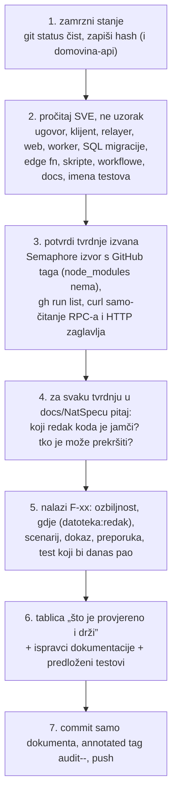

# Neovisni pregledi (`docs/review/`)

Ova mapa je za sigurnosne preglede koje radi **drugi model ili druga osoba od implementatora**, nad
zamrznutim commitom, bez ikakve izmjene koda. Audit koji implementator radi uz kôd živi u
[`docs/blockchain/audit/`](../blockchain/audit/README.md); ovo je drugi par očiju i namjerno je odvojeno.

| Datum | Dokument | Stanje koda | Tag | Reviewer |
|---|---|---|---|---|
| 26. 9. 2026. | [2026-09-26-neovisni-review-glasanje.md](2026-09-26-neovisni-review-glasanje.md) | `faaaa5f` (+ `domovina-api` `d5d88b7`) | `audit-fable-2026-09-26` | Claude Fable 5.1 (kôd: Claude Opus 5.5) |

## Zašto ovako

Implementator koji audita vlastiti kôd provjerava ono što je sam zamislio. Prvi neovisni pregled nije
našao nijednu grešku u dokazima ni hashevima (to je Opusov audit dobro pokrio), ali je našao pet stvari
**oko** njih koje implementator nije vidio jer su izvan njegova modela prijetnji: vezu registracija →
prvi listić po korijenu i vremenu (F-01), anonimnu točku pisanja bez kočnice (F-02), lanac opskrbe ZK
artefakata (F-04), preskočene cron runove (F-05) i metapodatke passkeyja (F-06). Sve to su tvrdnje u
dokumentaciji koje kôd ne ispunjava, a ne bugovi u kodu.

## Postupak

Pravila koja su se pokazala važnima:

- **Ništa se ne mijenja.** Ni implementacija, ni testovi, ni dokumentacija na koju se nalaz odnosi.
  Pregled navodi retke u zamrznutom commitu; popravci idu u zaseban commit implementatora.
- **Samo čitanje uživo.** Dopušteni su `maksimir_snapshot()`, `maksimir_public_ballots()`, HTTP
  zaglavlja, `gh run list`. Zabranjeno: bilo koji RPC koji piše, transakcije, testovi koji diraju
  `localStorage` na produkciji (vidi `docs/2026-09-25-glasanje-javnosti.md`, zamka 15).
- **Tvrdnje o vanjskim knjižnicama provjeri u izvoru te verzije**, ne po sjećanju: `Semaphore.sol` i
  `SemaphoreVerifier.sol` s GitHub taga `v4.14.3` (jsdelivr je vraćao praznu datoteku), `generate-proof.ts`
  za zadani host artefakata. `node_modules` u repou nije instaliran, pa lokalno nema izvora.
- **Vrijeme:** `maksimir_snapshot().at` je UTC. Kad je u Zagrebu „26. 9. u 00:53”, baza kaže
  `2026-09-25T22:53Z`; to nije zaostajanje sata.
- **Cron dokaz:** `gh run list --workflow maksimir-checkpoint.yml --json event,createdAt` razlikuje
  `schedule` od `workflow_dispatch`; samo prvi dokazuje da cron radi.
- **Tag umjesto releasea.** Annotated tag `audit-<model>-<datum>` na commit s dokumentom je dovoljan;
  GitHub release nije potreban.

## Format nalaza

Svaki nalaz ima ID `F-xx`, ozbiljnost (visoka / srednja / niska / info, s napomenom „uvjetno” kad
pretpostavka nije provjerena), mjesto kao `datoteka:redak` u zamrznutom commitu, scenarij, dokaz (izlaz
naredbe ili citat), preporuku i test koji bi danas pao. Tablica u sažetku je sortirana po ozbiljnosti, a
prije popisa nalaza stoji jedna rečenica presude o cjelini.

## Sljedeći pregled

Drugi pregled ide nakon što wiring offchain ↔ onchain bude commitan (radi ga Opus 5.5 u drugoj sesiji).
Osim novog koda, mora provjeriti je li wiring adresirao F-01, F-02, F-04 i F-06 iz prvog pregleda i
ažurirati tablicu na vrhu ove datoteke.
