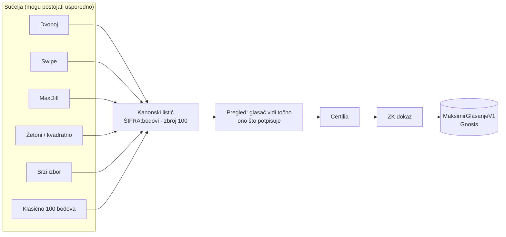

# Prototipi sučelja za glasanje (offline)

Pet načina da se složi **isti listić** (100 bodova po šiframa radova), za razgovor s ljudima o tome
koji im je najdraži. Ništa se ne šalje: nema prijave, mreže ni baze. Odgovori na upitnik ostaju u
`localStorage`u uređaja na kojem se testira.

Pokretanje: otvori `index.html` u pregledniku (radi i s `file://`) ili
`python3 -m http.server -d prototipi/glasanje-ux 8791` pa `http://127.0.0.1:8791/`.
Sve je u ovoj mapi. `radovi-data.js` (3,4 MB) sadrži 88 radova i smanjene službene slike, generirane
iz `sources/radovi.json` i `web/public/radovi/*-t.jpg` skriptom `build_data.py` (macOS, `sips`).

| Varijanta | Datoteka | Interakcija | Koliko za 88 radova | Kako nastaje listić |
|---|---|---|---|---|
| Dvoboj | `dvoboj.html` | dva rada, klik na draži; „ne mogu odlučiti” | od 20 naviše (Elo, adaptivni parovi) | Elo ljestvica → prvih 5, Borda 5:4:3:2:1 |
| Swipe | `swipe.html` | jedan rad, desno/lijevo; zatim dvoboji među favoritima | 88 swipeova + ≈ n·log₂n dvoboja (n ≤ 12) | binarno umetanje → prvih 5, Borda |
| Najbolji i najlošiji | `maxdiff.html` | 4 rada, označi ★ i ✕ | 22 ekrana + finale od 6 | best − worst (finale ×2) → prvih 5, Borda |
| Žetoni / kvadratno | `zetoni.html` | 10 žetona po 10 bodova; ili 100 kredita, n glasova = n² | 5–15 klikova | razmjerno žetonima / glasovima |
| Brzi izbor | `brzi.html` | klikni do 5 favorita redom | 5–10 klikova | Borda po redoslijedu |

Zajedničko (`core.js`, `core.css`):
- nasumičan redoslijed po stranici i sesiji (mulberry32, kao na maksimirski-stadion.org);
- **slijepi mod** (zadano uključen) skriva imena timova dok se bira, a otkriva ih na listiću;
- **uređivač listića**: svaka varijanta samo *predlaže* bodove, a glasač ih vidi i mijenja prije
  predaje. Predaja je moguća samo kad je zbroj točno 100;
- kanonski oblik `ŠIFRA:bodovi,…` sortiran po šifri, isti kao `items_canon` u lancu faze 1;
- upitnik (jasnoća, „odgovara mom mišljenju”, ugodnost; 1–5) + trajanje i broj odluka;
  `index.html#odgovori` pokazuje sve odgovore s uređaja i izvozi ih kao JSON.

## Više sučelja, jedan listić

Integritet ne ovisi o sučelju. Ugovor i ZK dokaz vide samo listić, pa se sučelja mogu dodavati i
mijenjati bez diranja ugovora, registrara ili relayera. Da to ostane istina, vrijede četiri pravila:

1. **Ono što vidiš je ono što potpisuješ.** Posljednji ekran prije dokaza uvijek je isti,
   zajednički pregled kanonskog listića (brojke po radu). Sučelje koje ima grešku ili je zlonamjerno
   ne smije moći potpisati nešto drugo od onoga što glasač vidi. Zato taj ekran i gradnja poruke za
   ZK dokaz trebaju biti u jednom zajedničkom modulu, a ne u svakoj varijanti posebno.
2. **Varijanta se ne zapisuje na lanac.** Oznaka sučelja u listiću postala bi otisak koji smanjuje
   anonimni skup (manje glasača po varijanti). Ako se za istraživanje mjeri koje sučelje daje kakve
   listiće, to ide samo u zbirnu, offchain statistiku.
3. **Sučelje mijenja rezultat, i to se mora reći.** Isti ljudi s različitim sučeljima daju različite
   listiće: Borda nad prvih 5 raspodjeljuje bodove drukčije nego ručni unos. Ako rade usporedno,
   treba objaviti udio svake varijante i metodu. Za istraživanje je pošteno nasumično dodjeljivanje
   varijante, a ne samoodabir.
4. **Ne sakrivati mogućnost izravnog unosa.** Svaka varijanta vodi u isti uređivač, pa glasač uvijek
   može sam postaviti bodove.

## Kako testirati s ljudima

1. Svakoj osobi daj dvije ili tri varijante nasumičnim redom (ne uvijek istim).
2. Nakon svake varijante neka ispuni upitnik na kraju.
3. Na kraju otvori `index.html#odgovori` i „Kopiraj kao JSON”.
4. Gledaj „Odgovara mišljenju” više nego „Zabavno”. Zabavno sučelje koje daje listić s kojim se
   osoba ne slaže gore je od dosadnog.

Istraživanje literature i primjera je u
[`docs/2026-09-30-glasanje-ux-istrazivanje.md`](../../docs/2026-09-30-glasanje-ux-istrazivanje.md).
