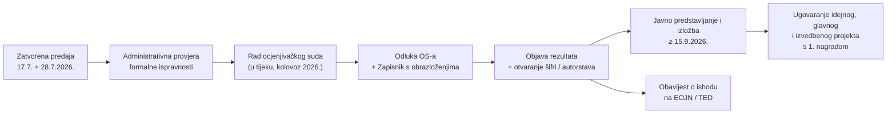

# 06 — Status natječaja nakon isteka rokova (praćenje)

> **Zadnja provjera: 2026-08-25.**
> Kronološki zapisnik pojedinačnih objava je u [`07-kronologija-objava.md`](07-kronologija-objava.md) — uključujući **HKIG-ov dopis gradonačelniku od 17.7.2026.**
> Ovaj dokument je *živi log stanja* natječaja nakon isteka rokova predaje. Za razliku od `01–05`, koji su dubinska istraživanja s fiksnim datumom, ovaj se dokument ažurira svaki put kad se pojavi nova službena informacija.

---

## 1. Zaključak u jednoj rečenici

**Natječaj je zatvoren, radovi su predani, ocjenjivački sud je u postupku ocjenjivanja — ali rezultati NISU objavljeni.** Na dan 2026-08-25 nigdje (službena stranica, DAZ, UHA, EOJN, mediji) nije objavljen ni **konačan broj pristiglih radova**, ni **nagrađeni radovi**, ni **imena autora / arhitektonskih ureda**.

To nije propust u komunikaciji nego **posljedica pravila natječaja**: natječaj je **anoniman i jednostupanjski**, pa se identiteti natjecatelja otvaraju tek nakon što ocjenjivački sud donese odluku i naručitelj objavi rezultate. Do tada je popis sudionika po definiciji nedostupan — i natjecateljima i javnosti.

---

## 2. Kronologija (potvrđeno iz izvora)

| Datum | Događaj | Status | Izvor |
|---|---|---|---|
| 2026-02-02 | DKOM odbio žalbu (Smagra) na projekt uklanjanja stadiona; posao potvrđen zajednici EURCO d.d. + RESPECT-ING d.o.o. za 22.222,22 € (procijenjeno 100.000 €) | ✅ | direktno.hr / Jutarnji |
| 2026-02-27 | Zaključak Grada Zagreba o imenovanju članova ocjenjivačkog suda | ✅ | tportal 14.4. |
| 2026-03-20 | Objava natječaja (zajedničko priopćenje Vlade RH i Grada Zagreba) | ✅ | zagreb.hr, vlada.gov.hr |
| 2026-04-21 | Rok za stručna pitanja | ✅ | Uvjeti natječaja |
| 2026-05-13 | Na EOJN-u objavljeni **odgovori na stručna pitanja**; **rok predaje pomaknut** s 24.6. na **17.7.2026. do 18:00**; rok predaje maketa na **28.7.2026. do 18:00** | ✅ | DAZ (vijest 6597), UHA |
| 2026-05-13 | Mediji: zaprimljeno **blizu 300 upita** u nešto više od mjesec dana | ✅ | tportal |
| 2026-07-06 | DAZ podsjetnik na rok predaje makete (28.7.) | ✅ | DAZ (vijest 6615) |
| **2026-07-17, 18:00** | **Zatvorena elektronička predaja radova kroz EOJN RH** | ✅ zatvoreno | DAZ, construction.hr |
| **2026-07-28, 18:00** | **Zatvorena predaja maketa** (Avenija Dubrovnik 15, soba 115) | ✅ zatvoreno | DAZ, construction.hr |
| kraj 7. / 8. 2026. | Ocjenjivački sud započinje pregled i ocjenjivanje pristiglih prijedloga | 🔄 u tijeku | construction.hr |
| **2026-08-25** | **Rezultati i dalje neobjavljeni**; službeni organizatori nisu objavili ni konačan broj zaprimljenih radova | ⏳ čeka se | provjera 2026-08-25 |
| ≥ 2026-09-15 | Planirano javno predstavljanje rezultata i izložba natječajnih radova | 📅 planirano | Uvjeti natječaja, tportal |

---

## 3. Što je konkretno provjereno 2026-08-25 (i s kojim ishodom)

| Izvor | Što je provjereno | Nalaz |
|---|---|---|
| `stadion-maksimir.zagreb.hr/hr/vijesti-34/34` | popis vijesti | Zadnja vijest je i dalje *"Obavijest natjecateljima – upute za predaju natječajnih rješenja kroz EOJN RH"*. **Nema objave rezultata.** |
| `stadion-maksimir.zagreb.hr/hr/tijek-dogadjanja/68` | tijek događanja | Jedini upisani događaj je i dalje **20.03.2026. Objava natječaja**. Stranica nije ažurirana nakon predaje. |
| `stadion-maksimir.zagreb.hr/hr/dokumentacija/66` | dokumentacija | Nepromijenjeno: EOJN link (tender 76778), Uvjeti, Program, fotodokumentacija (Google Drive). Nema zapisnika OS-a ni rezultata. |
| `d-a-z.hr` — vijesti | najnovije objave | Zadnja objava **27.07.2026.** (Staklena soba 2026./2027.). Zadnja o Maksimiru je podsjetnik na rok od 06.07.2026. **Nema rezultata.** |
| `d-a-z.hr/hr/natjecaji/rezultati/` | arhiva rezultata natječaja | **Maksimir se ne pojavljuje.** (Arhiva sadrži Vrbani, Sesvetska Sela, Prečko i sl.) |
| `index.hr` tag „stadion Maksimir" | najnovije vijesti | Zadnja vijest **18.08.2026.** i tiče se stanja postojećeg stadiona uoči utakmice s Vikingom — ne natječaja. |
| Pretrage (HR + EN, web i news) | „prvonagrađeni", „rezultati", „winner", „first prize" | **Nijedan pogodak s rezultatima.** Najsvježiji relevantan članak: construction.hr, *„Završen međunarodni natječaj za novi stadion Maksimir, slijedi ocjenjivanje pristiglih radova"*. |
| TED / EOJN | obavijest o ishodu natječaja | Postoji samo izvorna obavijest o natječaju (TED 4093-2026). **Nema „contest result notice".** |

---

## 4. Zašto se ne zna „koji su uredi predali"

1. **Anonimnost je konstitutivna.** Natječaj je proveden kao *međunarodni, otvoreni, anonimni, jednostupanjski*. Radovi se predaju pod šifrom; izjava o autorstvu je u zasebnoj, zatvorenoj datoteci u EOJN-u koja se otvara tek nakon rangiranja. Nijedna strana — pa ni DAZ — nema pravo ranije objaviti tko je sudjelovao.
2. **Broj radova se objavljuje tek nakon administrativne provjere.** Construction.hr izrijekom navodi da organizatori „u trenutku završetka natječaja još nisu objavili konačan broj zaprimljenih natječajnih radova" te da će taj podatak biti poznat nakon provjere svih prijava i početka rada OS-a.
3. **Kolovoz je institucionalni zastoj.** I DAZ i službena stranica nisu objavljivali ništa nakon 27.7., što je uobičajeno za hrvatski godišnji odmor. Realan prozor za objavu je **rujan 2026.**, uz javno predstavljanje i izložbu koje su Uvjeti vezali uz datum **ne prije 15.9.2026.**

---

## 5. Očekivani slijed (i što tada postaje javno)

Tek u koraku **E** postaju javni:
- ukupan broj pristiglih radova,
- rangiranje i pet nagrađenih radova (390.400 / 244.000 / 146.400 / 117.120 / 78.080 € bruto),
- **imena autora i arhitektonskih ureda** svih nagrađenih (i, u pravilu, otkupljenih) radova,
- **Zapisnik o radu ocjenjivačkog suda** s obrazloženjima po radu — najvrjedniji dokument za analizu.

---

## 6. Popis za praćenje (checklist)

Provjeravati tjedno, prioritetno u rujnu 2026.:

- [ ] `https://stadion-maksimir.zagreb.hr/hr/vijesti-34/34` — vijesti (prva instanca objave)
- [ ] `https://stadion-maksimir.zagreb.hr/hr/tijek-dogadjanja/68` — tijek događanja
- [ ] `https://www.d-a-z.hr/hr/natjecaji/rezultati/` — arhiva rezultata DAZ-a (ovdje ide **Zapisnik OS-a** + vizuali nagrađenih radova)
- [ ] `https://www.d-a-z.hr/hr/vijesti/` — DAZ vijesti
- [ ] `https://uha.hr/` — UHA (Plejić je predsjednik UHA-e; UHA redovito preuzima DAZ objave)
- [ ] `https://eojn.hr/tender-eo/76778` — EOJN: **obavijest o ishodu natječaja** (formalno-pravni trag; traži prijavu)
- [ ] TED — „design contest results" obavijest za isti predmet
- [ ] `https://www.zagreb.hr` — priopćenja Grada (rezultati idu i kroz gradsku komunikaciju, kao i 20.3.)
- [ ] Datum, mjesto i trajanje **izložbe natječajnih radova** (≥ 15.9.2026.) — jedina prilika da se vide *svi* radovi, ne samo nagrađeni

---

## 7. Kontekst koji se u međuvremenu pomaknuo (izvan samog natječaja)

- **Uklanjanje postojećeg stadiona:** projekt uklanjanja je nakon DKOM-ove odluke od 2.2.2026. deblokiran; izrađuje ga zajednica **EURCO d.d. + RESPECT-ING d.o.o.** Rušenje je i dalje najavljeno za **2027.**
- **Kranjčevićeva** (privremeni dom Dinama) — rekonstrukcija je krenula krajem travnja 2026., dovršetak najavljen za **kraj 2026.**, što je uvjet za početak rušenja Maksimira.
- **Rok dovršetka:** službeni plan i dalje govori o **2029.**, dok je predsjednik GNK Dinamo **Zvonimir Boban** javno procijenio **kraj 2030.**
- **EURO 2032.** (kandidatura HR + IT) ostaje vanjski rok-pritisak na cijeli raspored.

---

## 8. Otvorena pitanja (za idući update ovog dokumenta)

1. Koliko je radova ukupno zaprimljeno? (očekivano: objava uz rezultate)
2. Je li rok odluke OS-a probijen u odnosu na najavu „kraj srpnja", i je li se time pomaknuo datum izložbe s 15.9.?
3. Je li bilo žalbi / postupaka pred DKOM-om vezanih uz sam natječaj (a ne uz projekt uklanjanja)?
4. Hoće li Zapisnik OS-a biti objavljen u cijelosti (DAZ praksa: da) — ključno za razumijevanje kriterija A–D u primjeni.
5. Hoće li izložba obuhvatiti **sve** predane radove ili samo nagrađene i otkupljene?

---

## 9. Izvori

- construction.hr — *Završen međunarodni natječaj za novi stadion Maksimir, slijedi ocjenjivanje pristiglih radova* — https://www.construction.hr/novosti/zavrsen-medjunarodni-natjecaj-za-novi-stadion-maksimir-slijedi-ocjenjivanje-pristiglih-radova/a/11879
- DAZ — *Stadion Maksimir i SRC Svetice – objavljeni odgovori na stručna pitanja i novi rok predaje radova* (13.5.2026.) — https://www.d-a-z.hr/hr/vijesti/stadion-maksimir-i-src-svetice---objavljeni-odgovori-na-stru%C4%8Dna-pitanja-i-novi-rok-predaje-radova,6597.html
- DAZ — *Stadion Maksimir i SRC Svetice – rok predaje / deadline reminder* (6.7.2026.) — https://www.d-a-z.hr/hr/vijesti/stadion-maksimir-i-src-svetice---rok-predaje---deadline-reminder,6615.html
- Službena stranica natječaja — vijesti / tijek događanja / dokumentacija — https://stadion-maksimir.zagreb.hr
- tportal — *Rok za novi Maksimir produljen nakon gotovo 300 upita* (13.5.2026.) — https://www.tportal.hr/vijesti/clanak/rok-za-novi-maksimir-produljen-nakon-gotovo-300-upita-ni-to-mozda-nece-biti-dovoljno-20260513
- tportal — *Evo kada će biti objavljen izgled novog Maksimira* (14.4.2026.) — https://www.tportal.hr/sport/clanak/evo-kada-ce-biti-objavljen-izgled-novog-maksimira-20260414
- direktno.hr — *Projekt rušenja Maksimira dobio zeleno svjetlo* (16.2.2026.) — https://direktno.hr/zagreb/projekt-rusenja-maksimira-dobio-zeleno-svjetlo-zalitelj-tvrdio-da-cijena-neralno-niska-390515/
- Zajedničko priopćenje Vlade RH i Grada Zagreba (20.3.2026.) — https://zagreb.hr/zajednicko-priopcenje-vlade-rh-i-grada-zagreba-obj/218110
- TED obavijest o natječaju 4093-2026 — https://ted.europa.eu/en/notice/-/detail/4093-2026
