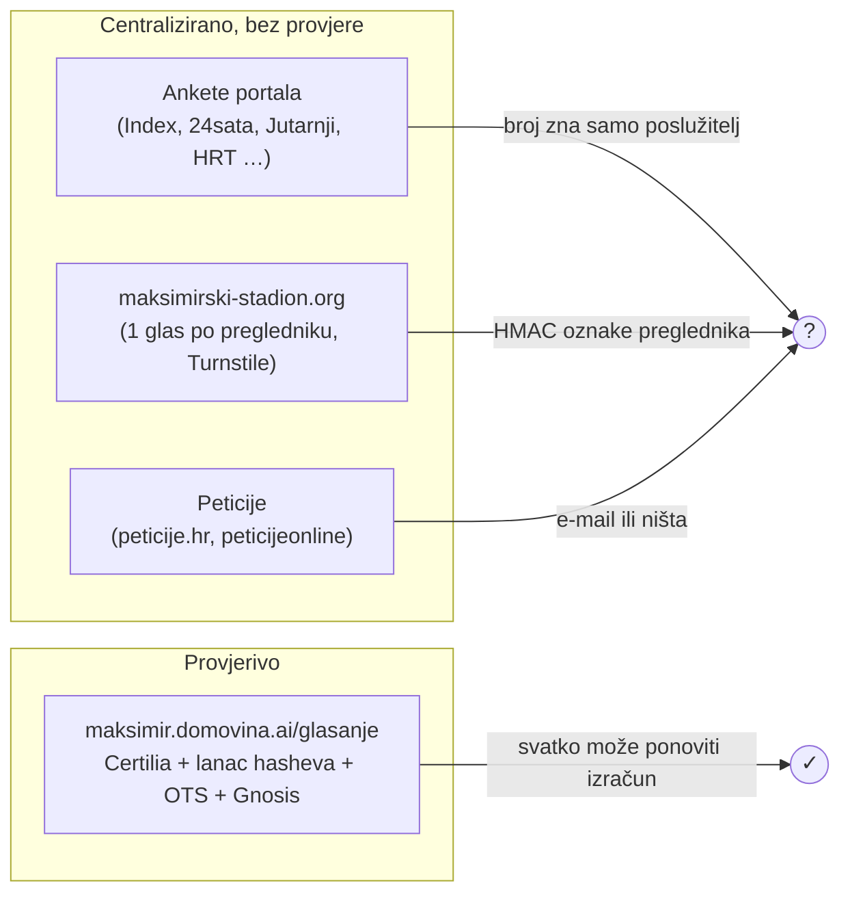

# 10 — Javnost: ankete portala, peticije i slični nezavisni projekti

*Stanje 28. 9. 2026., četiri dana nakon objave rezultata (24. 9.). Izvori su javne stranice koje su otvorene i pročitane,
a za ankete i izvorni kod widgeta. Ni u jednoj anketi nije glasano. Što nije provjereno, tako je i označeno.*

## Ukratko

- Portali su u prva dva dana pokrenuli **najmanje 15 anketa**. U svim anketama o izabranom rješenju negativnih je
  **74–89 %**. Najveća je Indexova, sa 145.008 glasova.
- **Nijedna anketa, peticija ni neslužbeno glasanje nema autorizaciju ni neporecivost.** Glasovi nisu vezani uz
  identitet, nisu potpisani i nema javnog zapisa koji bi netko treći mogao provjeriti. Ponovno glasanje u najboljem
  slučaju sprječava kolačić, localStorage ili ograničenje po IP-u. Brojeve zna samo poslužitelj portala ili vanjskog
  servisa.
- Nastala su **četiri nezavisna digitalna projekta**, svi u tri dana nakon objave. Samo jedan ima glasanje
  (maksimirski-stadion.org), ali bez provjere identiteta i bez objavljenog koda.
- Ovaj projekt ([`maksimir.domovina.ai/glasanje`](https://maksimir.domovina.ai/glasanje)) je, koliko je poznato,
  **jedino glasanje s provjerom identiteta (Certilia), lancem hasheva, OpenTimestampsom i glasovima na javnom lancu**.
  Ujedno je jedino kojemu je sav kod otvoren.

## 1. Ankete portala

Oznake: **V** = vidljivo u kodu stranice ili widgeta, **Z** = zaključak.

| # | Portal | Pitanje | Rezultat | Mehanizam |
|---|---|---|---|---|
| 1 | [Index.hr](https://www.index.hr/sport/clanak/anketa-svidja-li-vam-se-novi-maksimir/2838314.aspx) | Sviđa li vam se dizajn novog Maksimira? | Da 21 % · Ne 79 % · **145.008 glasova** | V: vlastiti widget (Blazor u iframeu), bez prijave. Z: kolačić. |
| 2 | [Index.hr](https://www.index.hr/sport/clanak/anketa-koji-vam-se-od-5-nagradjenih-radova-za-stadion-u-maksimiru-najvise-svidja/2838345.aspx) | Koje rješenje je najbolje? (strelica gore/dolje) | 2. nagrada 13.351↑/1.972↓ … **pobjednički 2.674↑/10.773↓, zadnji** | Isti widget |
| 3 | [Gol.hr (Nova TV)](https://gol.dnevnik.hr/clanak/rubrika/nogomet/anketa-kako-vam-se-svidja-novi-maksimir-glasajte-u-anketi---1003589.html) | Kako vam se sviđa projekt? | ne sviđa mi se 84,3 % · **19.424 glasa** | V: vlastita anketa, localStorage + provjera na poslužitelju, bez prijave |
| 4 | [24sata](https://www.24sata.hr/sport/anketa-svida-li-vam-se-dizajn-novog-stadiona-maksimir-1156587) | Sviđa li vam se dizajn? | NE 89,3 % · 15.801 glas | V: vlastiti API, token samo za prijavljene. Z: anonimni glas je dopušten. |
| 5 | [Večernji](https://www.vecernji.hr/sport/anketa-svida-li-vam-se-kako-ce-izgledati-novi-maksimir-1998197) | Sviđa li vam se? | uopće mi se ne sviđa 59,9 % (+18,6 % očekivao više) · 6.089 glasova | V: na odgovor 403 skripta šalje na login. Z: možda traži prijavu, nije provjereno. |
| 6 | [Večernji](https://www.vecernji.hr/sport/anketa-koji-je-za-vas-projekt-maksimirskog-stadiona-idealan-1998235) | Koje rješenje je najbolje? | br. 2: 35,1 % · 1.443 glasa | Kao #5. Nije jasno koji broj je koji rad. |
| 7 | [tportal](https://www.tportal.hr/vijesti/clanak/foto-kako-vam-se-svida-novi-maksimir-glasajte-u-anketi-foto-20260924) | Kako vam se sviđa pobjedničko rješenje? | ne sviđa mi se 78,6 % | V: obrazac s CSRF tokenom, bez prijave. CSRF nije autorizacija. |
| 8 | [tportal](https://www.tportal.hr/vijesti/clanak/foto-ovi-stadioni-nisu-prosli-pogledajte-kako-je-sve-mogao-izgledati-novi-maksimir-foto-20260924) | Koje rješenje vam se najviše sviđa? | **XDGA 26,4 %**, nijedno 25,3 %, njiric+ 22 %, VG13 11,8 % | Kao #7 |
| 9 | [Jutarnji](https://www.jutarnji.hr/vijesti/zagreb/anketa-83-posto-protiv-pobjednickog-projekta-novog-maksimira-15749634) | Kako vam se sviđa pobjednički projekt? | ne sviđa + moglo bolje 83 % · 12.163 glasa (prema samom Jutarnjem) | V: Riddle.com iframe, rezultati nisu javni |
| 10 | [HRT Sport](https://sport.hrt.hr/hrvatski-nogomet/predstavljanje-izgleda-novog-maksimira-12923504) | Vaše mišljenje? | katastrofa 66 % (prema HRT-u), broj glasova nije objavljen | V: Opinion Stage s `recaptcha:false` i `answers_expire_hour`: **isti preglednik može glasati ponovno svakih sat vremena** |
| 11 | [Sportklub](https://sportklub.hr/nogomet/anketa-kako-vam-se-svida-novi-stadion-maksimir/) | Kako vam se sviđa izgled? | ne sviđa mi se 74 % · 1.086 glasova ([rezultati](https://poll-maker.com/results5869202xCeD74848-169)) | V: besplatni poll-maker.com, obični POST, bez captche |
| 12 | [Direktno](https://direktno.hr/sport/ovako-ce-izgledati-novi-stadion-u-maksimiru-svida-li-vam-se-ovo-rjesenje-404979/) | Sviđa li vam se dizajn? | „Ne, što je njima?” 82 % | V: obrazac `?action=vote`, bez prijave i tokena |
| 13 | [Klikni.hr](https://www.klikni.hr/aktualno/2026/09/25/svida-li-vam-se-idejno-rjesenje-novog-dinamovog-stadiona-na-maksimiru/) | Sviđa li vam se? | Ne 80,7 % | V: WordPress YOP Poll, `access=guest`, bez captche |
| 14 | [Index.hr](https://www.index.hr/sport/clanak/anketa-vjerujete-li-da-ce-novi-maksimir-biti-gradjen-u-najavljenim-rokovima/2838340.aspx) | Vjerujete li u rokove? | Ne 81 % · 1.292 glasa | Kao #1 |
| 15 | Sportnet | ? | „gotovo 90 %” negativno, prema [kolumni](https://sportnet.hr/kolumne/originalno/90-posto-vas-mrzi-novi-maksimir-evo-zasto-mislim-da-cete-promijeniti-misljenje-kad-ga-izgrade/632477/) | Samu anketu nismo našli |

Ankete se međusobno ne mogu zbrajati: isti čovjek je mogao glasati na svima, a na nekima i više puta.

## 2. Peticije

| Peticija | Potpisa (28. 9.) | Provjera potpisa |
|---|---|---|
| [peticije.hr #143](https://peticije.hr/inicijativa/0/peticija/143/stadion-maksimir) — opoziv rješenja | ~29.600 (cilj 100.000) | Nije provjereno |
| [peticijeonline.com](https://www.peticijeonline.com/ne_gradnji_stadiona_u_maksimiru_po_postojeem_rjeenju) — „NE! gradnji …” | ~3.560 | Potvrda e-mailom |
| [change.org](https://www.change.org/p/peticija-za-novi-arhitektonski-natje%C4%8Daj-za-stadion-u-maksimiru) — novi natječaj | ~234 | Račun ili e-mail na change.org |

## 3. Nezavisni digitalni projekti

| Projekt | Tko (javno) | Kod | Glasanje | Što radi |
|---|---|---|---|---|
| [maksimirski-stadion.org](https://www.maksimirski-stadion.org/hr) | „Neovisna građanska inicijativa”. U izjavi o privatnosti kao voditelj obrade stoji **Nenad Bakić**. Promovira je [@nbakic](https://x.com/nbakic/status/2104196425986793769). | **Zatvoren**, bez repozitorija | Da. Glas za točno 3 rada, bez prijave, jedan glas po pregledniku (nasumična oznaka u localStorage, a poslužitelj čuva samo njen HMAC), Cloudflare Turnstile i ograničenje po mreži. **Sami je zovu „zabavnom anketom bez provjere identiteta”.** | Svih 88 radova i rubrika „Pitanja i dileme” s 21 pitanjem. Next.js na Vercelu, Supabase. Domena je registrirana 27. 9. 2026. Dana 28. 9. je imala 3.718 glasača: 3LHD vodi s 1.269 glasova, a VG13 je 15. s 211. |
| [Maksimir pod kišom](https://ivanrezic.github.io/maksimir-pod-kisom/) | **Ivan Rezić**, [github.com/ivanrezic](https://github.com/ivanrezic) | **[Otvoren, MIT](https://github.com/ivanrezic/maksimir-pod-kisom)** | Ne | Postojeći stadion i VG13 u 3D, s GPU simulacijom vjetra (Lattice-Boltzmann D3Q19) i kiše po gledateljima. Napravljeno uz AI, repo od 25. 9. |
| [Stadium Overlay](https://stadion.nezn.am) | **Marko Banušić / Ne Znam**, [github.com/ne-znam](https://github.com/ne-znam) | [Javan, bez licence](https://github.com/ne-znam/stadion) | Ne | Tlocrti svjetskih stadiona iz OSM-a u stvarnom mjerilu preko Maksimira. Repo od 27. 9. |
| [zagreb.lol — 3D model VG13](https://zagreb.lol/zgrade/modeli/?id=stadion-maksimir-novi) | **Strahimir Stribor** (zagreb.lol, GitHub [Poglavar](https://github.com/Poglavar)) | Djelomično (npr. [zagreb-buildings](https://github.com/Poglavar/zagreb-buildings)) | Ne | 3D rekonstrukcija pobjedničkog rada iz panela, i [u kontekstu grada](https://zagreb.lol/sloboda/@45.818441,16.017643/?lang=hr&heading=13.3&pitch=-0.0). **Ugrađeno na [`/radovi/6TVJ3MUHR`](https://maksimir.domovina.ai/radovi/6TVJ3MUHR) uz atribuciju.** |

Pretraga GitHuba 28. 9. (javni API; pojmovi `maksimir`, `stadion maksimir`, `maksimirski`, `maksimir stadium`,
`dinamo stadion`, `VG13`) osim ovih je vratila samo ovaj repozitorij. Pretraga po kodu traži prijavu, pa nije napravljena.

## 4. Društvene mreže i Dinamo

- **GNK Dinamo, [27. 9. u 18:05 UTC](https://x.com/gnkdinamo/status/2104271303708701182).** Klub ne brani izbor, nego
  objavljuje pismo predsjednika Zvonimira Bobana, koji je i član žirija. Boban ostaje pri svom glasu („Duboko ostajem pri
  tom uvjerenju”), ali priznaje da „velika većina vas, Dinamovih navijača, smatra da to nije dobra odluka”. Obećava da
  će se klub boriti da se ideje navijača „čuju i respektiraju”, a posao ostavlja investitorima, Gradu, Vladi i žiriju.
  Pismo je odgovor na priopćenje BBB-a „ovakav stadion ne možemo podržati”
  ([HRT](https://sport.hrt.hr/hrvatski-nogomet/bad-blue-boysi-ovakav-stadion-ne-mozemo-podrzati-12928245)).
  Post je 28. 9. imao oko 26.000 pregleda, 255 lajkova i 55 odgovora.
- **Žiri** ostaje pri odluci. Plejić je rješenje nazvao „genijalnim rješenjem, remek-djelom”
  ([Telegram](https://www.telegram.hr/vijesti/sef-zirija-za-novi-maksimir-odgovorio-kriticarima-duboko-smo-uvjereni-da-je-ovo-genijalno-rjesenje-remek-djelo/)),
  a Fabijanić kaže da promjena odluke pod pritiskom javnosti „ne dolazi u obzir”
  ([N1](https://n1info.hr/vijesti/clan-zirija-za-novi-maksimir-zamjena-rada-ne-dolazi-u-obzir-krafne-ili-palacinke-nisu-nam-potrebne/)).
- **VG13** kaže da „brojni aspekti ostali su nevidljivi” i najavljuje predstavljanje u Zagrebu
  ([N1](https://n1info.hr/vijesti/oglasili-se-arhitekti-koji-ce-graditi-novi-stadion-maksimir-kritike-ce-biti-kljucne-za-daljnji-razvoj/)).
- **Politika.** HDZ „osluškuje građane” ([N1](https://n1info.hr/vijesti/hdz-o-novom-maksimiru-osluskujemo-respektiramo-reakciju-gradjana/)),
  a zagrebački Most traži odgovornost ako se od rješenja odustane
  ([HRT](https://vijesti.hrt.hr/hrvatska/zagrebacki-most-trazi-odgovornost-ako-se-odustane-od-rjesenja-za-novi-maksimir-12928201)).
- **Reddit** (r/dinamo, r/croatia, r/zagreb_no1). Megathread i vlastite varijante VG13 sa zatvorenim kutovima.
  Korisnik je u [r/zagreb_no1](https://reddit.com/r/zagreb_no1/comments/1wqncef/) podijelio i ovo glasanje.
- LinkedIn, Threads, Bluesky, Facebook i Instagram javnom pretragom nisu vratili ništa relevantno.

### X, pregled s prijavom (28. 9.)

Pregled je napravljen u prijavljenom pregledniku, samo čitanjem. Učitano je oko 35 od 58 odgovora na Dinamov post
i 12 citata.

- **Na X-u nitko ne dijeli open-source ni 3D projekt vezan uz natječaj.** Pretrage `maksimir github`, `3D`,
  `open source` i `zagreb.lol` ne daju relevantne rezultate. Link `maksimir.domovina.ai` dijeli samo autor ovog repoa.
- **Doseg.** Najčitanija objava je [@CroatiaFooty](https://x.com/CroatiaFooty/status/2103088304090386879) s
  predstavljanjem rješenja (258 tisuća pregleda). Slijede Bobanovo pismo (26,6 tisuća) i dvije objave
  [@bozo_kras](https://x.com/bozo_kras/status/2103431572682670432), koji je pregledao svih 88 radova i kao favorita
  izdvojio zatvoreni oval Kaić Arhitekata (26,4 tisuće).
- **Odgovori na Bobanovo pismo** su pretežno negativni. Glavne linije:
  - pismo je „kontrola štete” i prebacivanje odgovornosti;
  - stadion je zastario, otvoren i na propuhu;
  - traži se referendum članova („jedan član jedan glas”).

  Citati pismo uglavnom čitaju kao povlačenje i najavu izmjena rada. Manjina odgovora rješenje brani.
- **Dinamova objava [„Dom svima nama”](https://x.com/gnkdinamo/status/2103099029357994466)** od 24. 9. ima 163
  odgovora, pretežno negativnih. Klub je najavio [člansku tribinu](https://x.com/gnkdinamo/status/2103157539277766930)
  s Bobanom i predsjednikom žirija.
- **Teme rasprave:**
  - estetika („ruglo”, razdvojene tribine);
  - kiša i vjetar;
  - legitimnost žirija, s threadovima o sukobu interesa, npr.
    [@jozo_jurica](https://x.com/jozo_jurica/status/2103149023280480506);
  - cijena od 175 do 205 milijuna eura;
  - DKOM i je li odluka konačna;
  - tko odlučuje: struka ili javnost.
- **Bakićevo glasanje:** [@nbakic](https://x.com/nbakic/status/2104196425986793769) (9,9 tisuća pregleda) i njegova
  [X anketa](https://x.com/nbakic/status/2104271048334274839) „Nagrađeno rješenje … će biti odbačeno” (269 glasova).
  Komentatori traže više slika po radu i predlažu javno glasanje između pet radova.
- **AI koncepti** umjesto projekata, npr. [@ProPatriaHR](https://x.com/ProPatriaHR/status/2103517285365256359) s
  ChatGPT-om i Geminijem. Dijeli se i rad [TVORZI „Zagrebački greben”](https://tvorzi.com/en/projects/maksimir-stadium-zagreb/).

## 5. Kandidati za povezivanje

1. **Ivan Rezić** ([GitHub](https://github.com/ivanrezic)). Projekt je otvoren (MIT) i izravno vezan uz natječaj. Moguća
   suradnja: podaci o 88 radova kao izvor za dodatne 3D varijante, međusobni linkovi.
2. **Strahimir Stribor / zagreb.lol**. 3D model je već ugrađen. Zajednička tema: otvoreni podaci, glasanje i blockchain
   ([urbangametheory.xyz](https://urbangametheory.xyz)).
3. **Marko Banušić / Ne Znam** ([nezn.am](https://nezn.am), [GitHub](https://github.com/mbanusic)). Overlay tlocrta,
   moguće ugraditi uz lokaciju.
4. **Nenad Bakić / maksimirski-stadion.org**. Ima najviše neslužbenih glasača, a glasanje mu nema provjeru identiteta.
   Prirodna tema je usporedba metodologija (Turnstile i jedan glas po pregledniku naspram Certilije i lanca). Kod nije
   javan.
5. **Božo Kraš** ([@bozo_kras](https://x.com/bozo_kras)). Pregledao je svih 88 radova i ima velik doseg na X-u. Nije
   developer, ali je prirodan korisnik stranice [`/radovi`](https://maksimir.domovina.ai/radovi).
